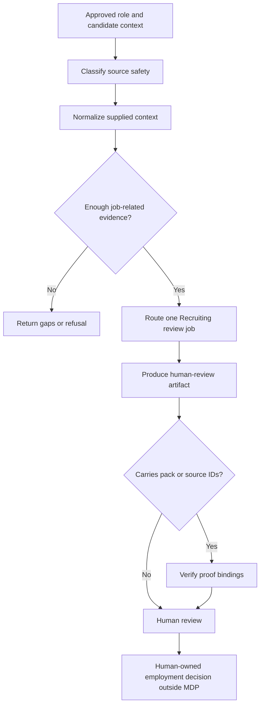

# MDP Recruiting Reference Profile - Plan

## Goal Capsule

| Field | Decision |
|---|---|
| Objective | Add a public-safe Recruiting reference profile for source-backed role and candidate review without creating hiring execution or automated employment decisions. |
| Product authority | This Product Contract and `docs/orchid/requirements/2026-07-10-recruiting-reference-profile.md` define the Recruiting boundary for MDP-99 and MDP-100. |
| Human authority | Human reviewers own real employment decisions; MDP may only prepare bounded review context, evidence matrices, questions, and gaps. |
| Open blockers | None before technical planning. Human merge approval remains mandatory because this is a high-impact employment-domain change. |

---

## Product Contract

### Summary

MDP will add a synthetic Recruiting profile for role requirements review, candidate evidence review, interview briefs, and scorecard/gap review.
The profile keeps Recruiting vocabulary in profile-owned cards, contracts, jobs, skills, examples, and evals while preserving the ten universal MDP primitives and fixed core card kinds.

### Problem Frame

The existing GTM and Proposal profiles prove the domain-profile architecture, but neither safely covers employment review.
A GTM reskin would invite prospect-style qualification, person ranking, and outbound behavior; a Proposal reskin would miss candidate-subject data, protected-class, proxy, accommodation, and evidence-handling risks.

Recruiting needs a review-centered profile that preserves source provenance and missing context without making candidate outcomes look deterministic or authorized.

### Key Decisions

- **Review support, not selection automation.** Recruiting outputs may organize supplied evidence and questions, but may not rank, hire, reject, advance, or make final employment decisions.
- **Candidate is a subject, not an operator persona.** Recruiter, Hiring Manager, and Interviewer are routing actors; candidate context remains source-ledgered subject evidence.
- **`fit` means context sufficiency only.** The first slice does not use `mdp fit` to qualify a candidate; shared status terminology means readiness for a bounded human-review artifact.
- **Job-related evidence only.** Role criteria and evidence mappings must be tied to supplied job requirements, with gaps visible and no protected characteristic or proxy used as evidence.
- **Existing core contracts remain fixed.** Recruiting uses profile-owned IDs over existing `CardKind` families and the current normalized prompt-output shape as an explicit compatibility bridge.
- **Proof-carrying outputs are verified.** Evidence matrices or scorecard text that cites pack/source IDs must use `mdp.proof-output.v0` and pass `verify-output`.

### Actors

- A1. **Recruiter:** prepares approved role and candidate context, checks source safety, and owns missing-information follow-up.
- A2. **Hiring Manager:** reviews job-related requirements, evidence gaps, and interview focus without delegating the employment decision to MDP.
- A3. **Interviewer:** uses an approved interview brief and records job-related evidence for later human review.
- A4. **Candidate subject:** the person described by supplied evidence; never an MDP operator, enrichment target, or inferred identity bundle.
- A5. **MDP agent:** normalizes supplied context, routes bounded cards, validates outputs, surfaces gaps, and refuses unsafe requests.

### Key Flow

### Requirements

**Profile and domain model**

- R1. The profile must cover all ten universal primitives with Recruiting-owned card IDs and existing core card kinds.
- R2. Recruiting operators and candidate subjects must remain distinct across the profile.
- R3. The profile must define bounded role and candidate review input contracts over supplied context.
- R4. The profile must expose jobs for pack building, role requirements review, candidate evidence review, interview brief, scorecard/gap review, and pack validation.
- R5. `mdp fit`, `proceed`, and related shared terms must never mean hire, reject, advance, rank, or final suitability.

**Evidence, data, and fairness**

- R6. Public artifacts must be synthetic or explicitly sanitized and must not contain real candidate personal data, resumes, interview recordings, non-public profiles, medical data, background-check data, or restricted sources.
- R7. The profile must prohibit inferring or using protected characteristics and protected-class proxies.
- R8. The profile must reject facial, voice, personality, culture-fit, social-media, commute, school-prestige, name, photo, and similar proxy judgments when they are not explicit job-related requirements.
- R9. Candidate credentials, work history, education, certifications, skills, achievements, and source verification status must never be invented.
- R10. Unverified or non-public sources must be labeled and must not silently become review-ready evidence.
- R11. Missing, conflicting, weak, or unsupported evidence must remain visible as a gap, refusal, or reviewer question.
- R12. The profile must not claim legal sufficiency, selection-procedure validation, absence of adverse impact, or approval for employment use.

**Outputs and review behavior**

- R13. Role requirements review must distinguish job-related criteria, evidence expectations, ambiguous criteria, proxy risk, and human decisions needed.
- R14. Candidate evidence review must map supplied evidence to criteria without aggregate scores, rankings, comparisons, or outcome recommendations.
- R15. Interview briefs must derive questions from job-related criteria and evidence gaps while excluding protected or non-job-related inquiries.
- R16. Scorecard/gap review must use bounded labels: Source-backed, Partial evidence, Gap, Not assessed, and Needs human review.
- R17. Claim-bearing review text that cites pack/source IDs must pass deterministic proof binding before reuse.
- R18. Every real employment decision requires a named human checkpoint outside MDP.

**Agent and validation surface**

- R19. Recruiting-specific skills must gate on `profile.id: recruiting` and reroute when the active pack blocks them.
- R20. Agent-surface metadata must recommend Recruiting skills and block conflicting GTM, proposal, sourcing, and execution-shaped skills.
- R21. Strict validation must prove primitive coverage, input contracts, jobs, prompt-output validation, routing, gaps, refusal, unsafe-output handling, and proof bindings where used.
- R22. Existing GTM and Proposal strict validation/evals must remain green.
- R23. Canonical assets, bundled assets, root skills, plugin skills, CLI help, docs, and init output must remain in parity.

### Acceptance Examples

- AE1. **Covers R9, R10, R11.** A candidate note without a degree source leaves the degree as a gap and invents nothing.
- AE2. **Covers R7, R8, R14.** A request to rank candidates using age, name, school, photo, or commute is refused without producing a ranking.
- AE3. **Covers R13, R15.** Vague “culture fit” language is surfaced as ambiguous/proxy-prone and converted only after a human supplies job-related behavior or skill evidence.
- AE4. **Covers R14, R16, R18.** Mixed evidence produces per-criterion evidence/gap labels and a human-review handoff without a recommendation.
- AE5. **Covers R17.** Generated evidence text with a fake source or card ID is blocked by `verify-output`.
- AE6. **Covers R6, R10.** Non-public candidate material is refused from public repo paths and requires a controlled workspace or sanitized artifact.

### Success Criteria

- `mdp init --template recruiting` creates only synthetic Recruiting artifacts and reports accurate next commands.
- Strict Recruiting validation reports activation ready with zero warnings or errors.
- All declared Recruiting eval fixtures pass, including safety-negative and proof-binding cases.
- Representative routes load intended Recruiting cards and exclude irrelevant routes.
- Skills and docs consistently require human review and preserve the product boundary.

### Scope Boundaries

**In scope**

- Local decision context for role requirements, supplied candidate evidence, interview preparation, scorecard/gap review, and pack QA.
- Synthetic starter content, profile routing, normalization contracts, strict evals, and proof bindings.

**Outside this product's identity**

- ATS, HRIS, job board, sourcing/enrichment provider, scraper, employee database, background-check service, scheduler, ranker, rejection engine, hiring decision maker, employment-law reviewer, or compliance certifier.
- Candidate discovery, restricted-profile access, outreach, scheduling, assessment delivery, monitoring, background checks, compensation decisions, or external-system writes.

### Dependencies and Assumptions

- Existing ten-primitive validation and fixed `CardKind` behavior remain authoritative.
- The current prompt-output schema is a documented compatibility bridge, not a new core candidate schema.
- Official employment guidance informs conservative guardrails but does not make the template legally sufficient for any jurisdiction or use case.

### Sources and Research

- `docs/plans/2026-07-01-001-docs-domain-profile-foundation-plan.md`
- `assets/templates/basic/.mdp/manifest.yaml`
- `assets/templates/proposal/.mdp/manifest.yaml`
- `assets/templates/proposal/.mdp/prompts/normalize-opportunity.yaml`
- `skills/mdp-proposal-pack-builder/SKILL.md`
- DOJ, [Algorithms, Artificial Intelligence, and Disability Discrimination in Hiring](https://www.ada.gov/resources/ai-guidance/)
- EEOC, [Employment Tests and Selection Procedures](https://www.eeoc.gov/laws/guidance/employment-tests-and-selection-procedures)
- NIST, [AI RMF Core](https://airc.nist.gov/airmf-resources/airmf/5-sec-core/)
