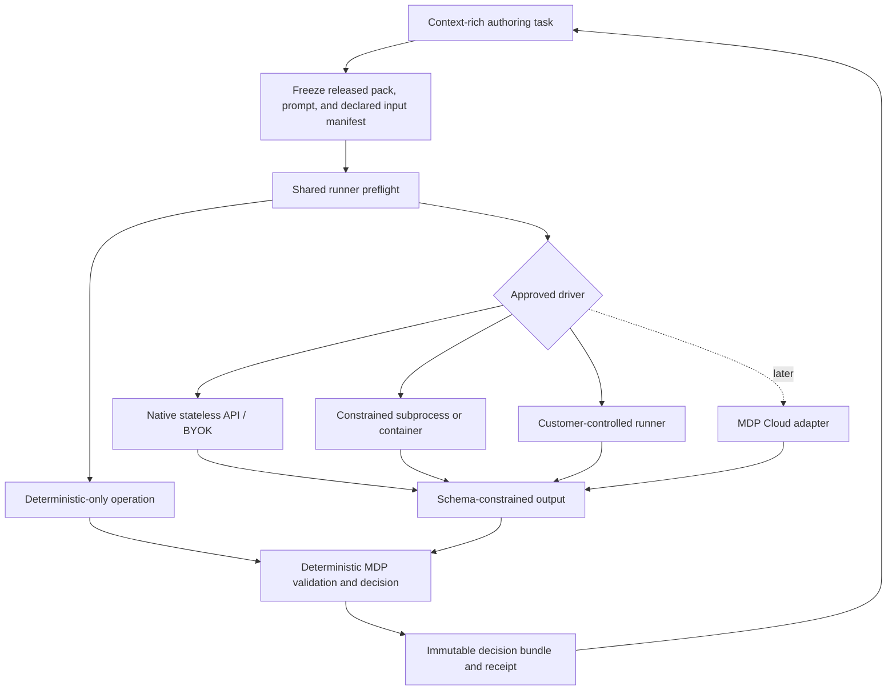

# Unified Clean-Context Runtime

Date: 2026-08-03
Issues: MDP-177, MDP-178
Status: accepted architecture authority
Supersedes: `docs/orchid/decisions/2026-07-21-runner-receipts-and-context-isolation.md` as the cross-profile architecture authority; that document remains the historical proposal/v0 implementation record
Product contract: `docs/orchid/plans/2026-08-03-001-feat-unified-clean-context-runtime-plan.md`

## Decision

MDP will ship one profile-neutral clean-run runtime consumed by proposal and GTM. The runtime will be exposed through one CLI command, working name `mdp run`, with thin local stdio MCP and plugin adapters. Proposal and GTM may own profile schemas and deterministic hooks, but they may not own separate staging, isolation, hashing, assurance, failure, or receipt implementations.

The authoring conversation is a control plane. It may compile requirements, launch a run, display status, and explain returned artifacts. It is never the authority for a clean-run decision because the host may have supplied ambient messages, summaries, files, tools, retrieval, environment state, or hidden instructions that are not declared by the pack or run envelope.

The initial execution boundary is local and customer-controlled:

1. The Rust authority owns the native stateless API/BYOK reference transport and performs one explicit schema-constrained request without conversation continuation or model tools. External headless or customer drivers remain attested unless an independent enforcing control observes their exact request.
2. A bounded adapter invokes existing customer-controlled headless subprocess or container surfaces with a read-only declared bundle and records their observable controls. The host retains container lifecycle and sandbox ownership; MDP does not become a portable container manager in the MVP.
3. A deterministic-only operation uses the shared runtime and receipt contract without invoking a model driver; it reports input-provenance and artifact-integrity assurance rather than fresh-inference properties.
4. A fresh coding-agent task may invoke the shared runner, but task creation itself is only a hygiene improvement and never isolation proof.
5. MDP Cloud may implement the same contract later. The current synthetic gateway remains bounded and non-generalized until the hosted adoption gate passes.

MDP owns pack authority, canonical run contracts, deterministic evaluation, validation, assurance derivation, and receipt verification. The customer or host owns source collection, lawful access, credentials, scheduling, retries, rate limits, production auth and tenancy, retention, downstream actions, and incident response.

## Definitions

- **Fresh context:** The inference request contains no prior conversation messages beyond the declared run envelope. It does not imply filesystem, environment, tool, network, or provider isolation.
- **Stateless inference:** The application does not intentionally continue a provider conversation or session. It does not imply deterministic generation, an immutable model snapshot, or absence of provider-side policy.
- **Declared-input isolation:** The runner enforces that only the hash-bound pack, prompt, declared inputs, allowed tools, allowed network, and explicit runtime metadata are accessible to the invoked boundary.
- **Deterministic replay:** Identical canonical artifacts, evaluator version, and policy reproduce the same deterministic MDP decision and validation result. Model prose may differ.
- **Audit evidence:** Content-addressed artifacts and observed events that allow a verifier to check a specific assurance claim. Logging a caller assertion is observability, not isolation.
- **Audit-grade:** An unqualified label that v1 must not emit or market. Existing v0 receipts retain compatibility semantics, but v1 reports the assurance dimensions, derived label, limitations, and trust domain that were actually verified.

## Why Same-Conversation Execution Cannot Prove Isolation

The model cannot independently demonstrate which parts of its supplied context influenced an output. Asking it to ignore earlier messages is an instruction inside the same context, not a control outside it. The host may also provide system/developer instructions, summaries, personalization, repository rules, files, MCP servers, tools, network, retrieval, browser state, environment variables, caches, or resumed provider sessions.

A deterministic CLI command over exact structured bytes is different. Its result can be replayed from those bytes and the CLI version. The contamination risk sits upstream when an agent selects or normalizes the bytes and downstream when a generative step sees broader context. The clean-run architecture therefore binds the full chain rather than treating every step as equally uncertain.

## Assurance Model

Assurance is a vector, not a single caller-selected boolean:

| Dimension | Required question |
| --- | --- |
| Context freshness | Did the invocation include prior conversation or resume a session? |
| Declared input | Which exact pack, prompt, inputs, and instruction/tool schemas were model-visible? |
| Filesystem and environment | What was accessible, denied, unknown, or redacted? |
| Tools and network | What was allowed, invoked, denied, or unobservable? |
| Provider state | Were conversation, previous-response, storage, caching, and resolved model identity observable? |
| Runtime identity | Which runner build, driver, CLI/evaluator version, and platform executed? |
| Artifact integrity | Do canonical hashes and compatibility rules bind every input, output, decision, validation result, and receipt? |
| Upstream authority provenance | What is known, attested, or unknown about how the pack, prompt, and declared inputs were authored, selected, sourced, and normalized before the frozen boundary? |
| Trust domain | Is evidence MDP-observed, provider-returned, customer-attested, host-asserted, or cryptographically signed? |

The receipt schema derives a label from these dimensions and preserves machine-readable limitations. Unknown is not false, absent, or redacted. A signature proves who signed bytes; it does not prove the execution claims inside those bytes.

Existing terms remain compatible but narrower than before:

- `advisory` means the artifacts may be useful but the requested boundary was ambient, incomplete, unknown, or unverifiable.
- `fresh-invocation` may describe a new task, process, or request when prior messages were excluded, but it does not claim declared-input isolation.
- `declared-input-isolated` requires enforced and observed containment of the declared bundle plus the allowed runtime policy.
- `stateless-api-verified` requires the direct request properties and artifact bindings accepted by the native API driver; provider-internal behavior remains outside the claim.
- `customer-attested` is a trust-domain modifier, not an automatic elevation above independently observed evidence.

The exact v1 labels and downgrade table are owned by MDP-179, but they must preserve these distinctions.

## Required Run Authority

Every attempted run binds request identity, applicable preflight and audit evidence, and terminal state:

1. **Released pack:** immutable release ID, full portable pack digest, manifest/profile/schema versions, and compatibility result.
2. **Declared run envelope:** run/profile/operation IDs, canonical input manifest, source and normalization audit references, canonical prompt/instruction hashes when applicable, allowed runtime policy, operation mode, and non-secret privacy/retention policy. Generative operations additionally bind a driver and provider target; deterministic-only operations record inference fields as not applicable.
3. **Observed runner audit:** runner/build/version, platform, sanitized staging identity, environment policy hash, file/tool/network events, timestamps, terminal state, requested/resolved provider/model metadata when available, and explicit unknown properties.
4. **Output authority on success:** raw-response hash when retention allows, normalized output and schema hash, deterministic decision and reason-code hash, compiled-context hash, claim/validation result and version, receipt hash, and optional signature metadata. Non-success runs do not fabricate this authority set and publish only the sanitized diagnostics and audit metadata allowed by their terminal state.

Preflight and invocation must read the same immutable content-addressed snapshot. Staging resolves only regular declared artifacts beneath a private run root, without path traversal, absolute paths, links, special files, or link following. Secrets use a driver-specific non-artifact channel and are excluded from inherited environments, logs, receipts, and model-visible content by default.

Declared pack and source content is untrusted data, not runtime authority. It cannot expand the instruction hierarchy, tools, network, schemas, validation policy, assurance, or receipt. Artifact publication is transactional: failed runs publish sanitized diagnostics and audit metadata, never a partial draft or stable reference to quarantined generated content.

Receipts bind execution time and identity plus any caller-supplied job or idempotency identity. Host-mode replay classification additionally requires an expected identity, explicit freshness policy, and durable consumption ledger; standalone verification without that state checks integrity only. Signing does not prove freshness.

Clean-run assurance starts at the frozen execution boundary. It does not cleanse or certify how the pack, prompt, or inputs were authored or selected. Upstream source, normalization, and pack-authoring provenance remains a separate assurance dimension and may legitimately be unknown or customer-attested.

No secret values, customer content, private paths, or provider credentials belong in ordinary logs, committed fixtures, or public receipts.

## Terminal States

The authoritative result channel has one success state and fail-closed no-draft states:

| State | Meaning |
| --- | --- |
| `success` | Every required artifact validates and the receipt is complete. |
| `no-draft:preflight-refused` | Pack, compatibility, input, or boundary preflight failed. |
| `no-draft:runner-failed` | Provider, process, container, timeout, cancellation, or host execution failed. |
| `no-draft:output-invalid` | Generated or normalized output failed its schema. |
| `no-draft:decision-invalid` | Deterministic evaluation or claim validation failed. |
| `no-draft:audit-incomplete` | Required observed evidence is missing or cannot be bound. |
| `no-draft:policy-blocked` | Privacy, retention, credential, tool, or network policy forbids the run. |

No non-success state may return a partial or best-effort draft through the success channel.

## Architecture

The original task receives immutable artifacts plus a bounded summary. If it changes evidence, prompt, output, decision, or compiled context, the change is a new run rather than a continuation of the original authority.

## Profile Boundaries

| Layer | Owns | Must not own |
| --- | --- | --- |
| Shared runner kernel | Staging, canonicalization, hashing, runtime policy, driver invocation, audit events, terminal states, assurance derivation, receipt creation | Proposal/GTM business rules or host orchestration |
| Proposal adapter | Proposal input/output schemas, prompt construction, source-intake bindings, proof/readiness hooks | Separate runner, receipt, hashing, or assurance policy |
| GTM adapter | Decision Input bindings, normalized prospect schema, fit/routing/check hooks, bounded compiled context | Collection, enrichment, batching, outbound, or separate runner policy |
| CLI verifier/evaluator | Portable pack digest, schema validation, deterministic decisions, receipt verification | Model invocation or semantic truth beyond supplied artifacts |
| MCP/plugin adapters | Argument/result transport, operator guidance, artifact return | Isolation claims, profile policy, hashing, validation, or receipt logic |
| Customer/host | Sources, credentials, orchestration, retention, production controls, downstream actions | Re-labeling an unverified run as MDP-verified |
| MDP Cloud later | Hosted implementation of the same released contract | Parallel decision/receipt semantics or premature generalized API scope |

## Threat Model

The runtime must assume accidental or adversarial contamination through:

- inherited conversations, summaries, system/developer prompts, personalization, or resumed sessions;
- undeclared files, parent paths, symlinks, sockets, stdin, clipboard, environment variables, caches, prior outputs, or cross-run state;
- unrestricted MCP tools, browser sessions, implicit retrieval, or network egress;
- prompt injection in legitimate source material attempting to expand authority or request other context;
- mutable pack paths, release tags, schemas, dependencies, containers, model aliases, or time-of-check/time-of-use substitution;
- normalization code that adds facts not grounded in attempted source evidence;
- output edits, copied artifacts, forged or incomplete receipts, and signatures from untrusted runners;
- partial failures presented as success; and
- the original authoring task silently improving the returned authority.

The local MVP does not claim provider-internal attestation, deterministic model prose, hardware-backed remote attestation, prevention of a fully malicious customer fabricating its own unsigned evidence, or authorization to host arbitrary customer production inference.

## Options Considered

| Option | Useful property | Why it is not the whole architecture |
| --- | --- | --- |
| Same-conversation prompt | Lowest friction | Cannot prove exclusion of already supplied or hidden context. |
| New coding-agent task/process | Excludes visible prior messages when configured correctly | May inherit host instructions, files, tools, config, network, and persistence; task creation is not enforcement. |
| Native structured-output API | Explicit request, no resume fields, tools disabled, provider metadata | Requires BYOK and provider trust; does not provide filesystem containment or deterministic prose. |
| Local subprocess/container | Can stage declared bytes and constrain host resources | Isolation varies by platform and configuration; the container is a driver boundary, not MDP policy. |
| MCP-mediated runner | Good local agent/plugin transport | MCP says nothing about the called process's model context or permissions. |
| Hosted MDP execution | Low-friction table/service integration and centralized receipts | Requires production auth, tenancy, privacy, reliability, cost, and product evidence not yet established. |
| Customer-controlled/BYOK runner | Strong customer control over credentials, data, retention, and infrastructure | Evidence remains customer/host-attested unless independently observed; MDP must provide conformance rather than operate every runtime. |

## Consequences

- Proposal runner code becomes migration input to a shared runtime rather than the template for a copied GTM runner.
- GTM retains its existing no-collection handoff and gains an execution bridge from declared Decision Input artifacts to deterministic decisions and bounded context.
- `mdp.run-receipt.v0` remains readable, but v0 binary `audit-grade` semantics cannot be silently promoted into v1 assurance.
- CLI, stdio MCP, and plugin skills must invoke one canonical runtime and keep profile logic thin.
- Hosted work stays blocked until local/customer proof and the host conformance contract exist.
- Some hosts will legitimately receive lower assurance because their hidden instructions, tools, model version, or runtime controls cannot be observed. The product must report that limitation instead of hiding it.

## Implementation Sequence

1. MDP-179 defines run-bundle v1, receipt v1, assurance derivation, canonicalization, verification, and v0 migration.
2. MDP-180 extracts the shared kernel by migrating proposal through it.
3. MDP-181 adds the GTM adapter over the same kernel.
4. MDP-182 exposes the unified CLI, local stdio MCP, and plugin experience.
5. MDP-183 attacks the boundary and receipt claims across both profiles.
6. MDP-184 produces human-approved synthetic native/BYOK and customer-controlled proof.
7. MDP-185 releases and installed-smoke-tests the local MVP.
8. MDP-186 publishes the host conformance kit.
9. MDP-187 decides whether MDP Cloud may proceed through the existing MDP-154 authority.

## Acceptance Boundary

This decision is complete when future planning can choose implementation details without re-deciding product ownership, assurance semantics, profile consolidation, failure behavior, or hosted sequencing. Any implementation that creates a second proposal/GTM runner policy, treats a new agent task or MCP transport as proof, returns a partial draft on failure, or promotes the synthetic gateway to a generalized API conflicts with this decision.
