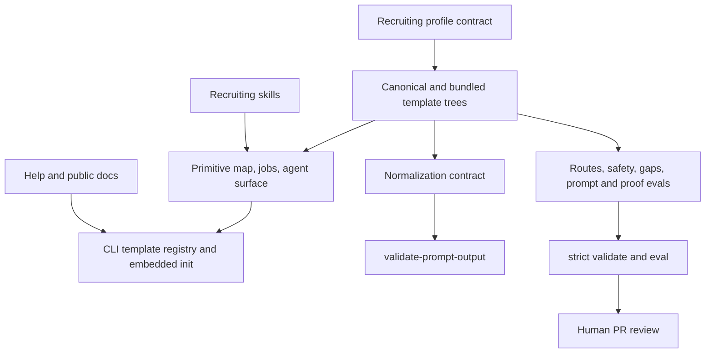

# MDP Recruiting Reference Profile - Plan

## Goal Capsule

| Field | Decision |
|---|---|
| Objective | Ship a synthetic Recruiting reference profile for source-backed role and candidate review with strict safety, routing, and proof validation. |
| Product authority | The brainstorm defines product behavior; the requirements artifact defines safety; this plan defines implementation. |
| Product Contract preservation | Product intent is unchanged; the canonical Product Contract remains the linked brainstorm. Implementation must satisfy R1-R23 and AE1-AE6. |
| Execution profile | One coherent MDP-99/MDP-100 branch and PR, with narrow checks before regression/full validation. |
| Stop conditions | Stop for a decision that enables candidate ranking, autonomous outcomes, protected/proxy use, restricted-source collection, or a new core primitive/card kind. |
| Tail ownership | Open a human-review PR without `ai:autofix-enabled`; MDP-101 remains blocked until merge. |

---

## Product Contract

### Summary

Recruiting becomes a third reference profile beside GTM and Proposal.
It prepares source-backed role and candidate review artifacts while keeping employment outcomes human-owned and outside MDP.

### Requirements

**Profile and domain model**

- R1. Cover the ten universal primitives with Recruiting-owned IDs and fixed core card kinds.
- R2. Keep operator personas separate from candidate subjects.
- R3. Normalize supplied role, candidate, evidence, and review-mode context through one bounded input contract.
- R4. Route pack building, role requirements review, candidate evidence review, interview brief, scorecard/gap review, and pack validation.
- R5. Treat shared `fit` or `proceed` language as review-context sufficiency only.

**Safety and evidence**

- R6. Commit only synthetic or explicitly sanitized Recruiting content.
- R7. Reject protected-characteristic inference and use.
- R8. Reject non-job-related proxy judgments.
- R9. Never invent credentials, work history, education, skills, achievements, identity, or source status.
- R10. Keep unverified or restricted sources from becoming review-ready evidence.
- R11. Preserve missing, conflicting, weak, and unsupported evidence as gaps or reviewer questions.
- R12. Do not claim legal sufficiency, validated selection procedures, bias-free behavior, or approval for employment use.

**Outputs and review**

- R13. Role review separates criteria, sources, job-related rationale, ambiguity/proxy risk, and decisions needed.
- R14. Candidate evidence review maps supplied evidence per criterion without scores, ranking, comparison, or recommendations.
- R15. Interview briefs use job-related questions and exclude protected or non-job-related inquiries.
- R16. Scorecard/gap review uses only bounded evidence labels and no aggregate outcome.
- R17. Evidence-carrying text with pack/source IDs must pass `verify-output`.
- R18. Employment decisions require a human checkpoint outside MDP.

**Agent and validation surface**

- R19. Recruiting skills gate on the active profile and obey `agent-surface` reroutes.
- R20. Recruiting agent routing recommends Recruiting skills and blocks conflicting GTM, Proposal, sourcing, and execution surfaces.
- R21. Strict validation covers primitive mapping, prompt output, safety refusal, routes, gaps, and proof bindings.
- R22. GTM and Proposal strict validation/evals remain green.
- R23. Canonical/bundled templates, root/plugin skills, CLI, docs, and help remain aligned.
- R24. Recruiting uses an additive profile-neutral context-normalization contract while GTM prospect normalization remains backward compatible.
- R25. Expected sources are classified exactly once as present, empty, or missing before review readiness can be true.
- R26. Real/local Recruiting context defaults to opaque subject identity and omits display labels unless explicitly authorized locally.
- R27. Every normalized review artifact includes a human-review handoff with stage, owner, source snapshot, readiness, unresolved gaps, and a safe next action.

### Scope Boundaries

In scope: local role/candidate review context, synthetic examples, profile routing, normalization, gaps, evidence matrices, interview briefs, strict evals, and proof binding.

Outside MDP: ATS/HRIS/job-board behavior, sourcing, enrichment, scraping, background checks, scheduling, outreach, external writes, ranking, rejection, hiring decisions, employment-law review, and compliance certification.

### Acceptance Examples

- AE1. An unsourced degree stays a gap.
- AE2. A protected/proxy ranking request is refused.
- AE3. Culture-fit language is surfaced for job-related rewrite and human review.
- AE4. Mixed evidence produces per-criterion evidence/gap labels without a recommendation.
- AE5. Fake source or card IDs fail proof verification.
- AE6. Restricted candidate material is refused from public repo artifacts.
- AE7. Recruiting emits `normalized_context` and `ready_for_review`; GTM keeps `normalized_prospect` and `ready_for_mdp_fit`.
- AE8. Incomplete expected-source classification fails prompt-output validation.
- AE9. Opaque identity without a label passes; opaque identity with a display label fails.
- AE10. Missing human owner or an autonomous candidate-outcome handoff fails prompt-output validation.

---

## Planning Contract

### Key Technical Decisions

- KTD1. **Follow the Proposal embedded-template pattern.** Add Recruiting as a complete asset tree embedded by `cli/src/commands/init.rs`, with golden parity, custom-name, and dry-run coverage.
- KTD2. **Do not change core ontology.** Reuse fixed core card kinds under Recruiting-owned IDs.
- KTD3. **Use an additive neutral normalization contract.** `normalize-recruiting-context` emits `context-normalization` with `normalized_context`, review readiness, expected-source coverage, and a human-review handoff. Existing GTM prospect normalization remains unchanged.
- KTD4. **Do not use `fit` as a candidate gate.** Review readiness is proven by prompt validation, routes, gaps, claim checks, and proof verification.
- KTD5. **Layer safety gates.** Prompt instructions preserve inputs/gaps, avoid-rule entries drive deterministic text checks, proof constraints bind material evidence, and skills require human review.
- KTD6. **Candidate evidence output is per criterion.** Proof examples use requirement, evidence, and gap segments with no aggregate candidate score.
- KTD7. **Mirror public assets and skills byte-for-byte.** Existing sync checks enforce both trees.
- KTD8. **Keep the PR human-only.** Omit `ai:autofix-enabled` because employment-domain boundary judgment requires human review.

### High-Level Technical Design

### Sequencing

U1 establishes template vocabulary and contracts.
U2 makes safety and proof behavior executable.
U3 adds matching agent behavior.
U4 registers the complete asset tree in the CLI.
U5 aligns docs and validation entry points.
U6 runs independent review and packages evidence.
U7-U9 implement the neutral normalization amendment and reviewer-workflow safeguards.
U10 re-runs independent review and PR handoff over the expanded diff.

### Risks and Mitigations

| Risk | Mitigation |
|---|---|
| Status language implies hiring authority | Avoid positive fit fixtures and use `human-review-ready` only for artifact readiness. |
| Protected or proxy data becomes evidence | Fail closed in prompt, boundary cards, claim checks, skill instructions, and negative evals. |
| Model invents credential/source IDs | Require gaps and proof fixtures for fake IDs, missing bindings, and unsupported full text. |
| GTM/Proposal nouns leak into Recruiting | Use profile-owned IDs and targeted domain-leakage checks plus strict regressions. |
| Canonical/bundled drift | Add both trees in one change and require sync checks. |
| Stale CLI/help surface | Update availability, init payload, docs, metadata, and golden tests together. |

### Sources and Patterns

- `docs/plans/2026-07-01-001-docs-domain-profile-foundation-plan.md`
- `assets/templates/proposal/.mdp/manifest.yaml`
- `assets/templates/proposal/.mdp/prompts/normalize-opportunity.yaml`
- `assets/templates/proposal/.mdp/evals/`
- `assets/templates/proposal/examples/proof-output/`
- `cli/src/commands/init.rs`
- `skills/mdp-proposal-pack-builder/SKILL.md`
- `Makefile`

---

## Implementation Units

### U1. Recruiting template vocabulary and contracts

- **Goal:** Create canonical and bundled Recruiting manifest, source ledger, cards, prompt, README, and synthetic context.
- **Requirements:** R1-R13, R15-R18, AE1, AE3, AE6.
- **Dependencies:** None.
- **Files:** `assets/templates/recruiting/`, `plugin/assets/templates/recruiting/`.
- **Approach:** Define three operator personas, map ten primitives to Recruiting-owned cards, define one input contract and six jobs, encode bounded source/review values, and block conflicting skills.
- **Patterns to follow:** Proposal manifest, prompt, source ledger, cards, and README.
- **Test scenarios:** All refs resolve; jobs reference valid primitives/contracts; candidate subject is absent from operator personas; source ledger is synthetic; mirrors match.
- **Verification:** Strict validation reaches activation ready after U2 lands.

### U2. Safety, routing, prompt, gap, and proof evals

- **Goal:** Make the safety contract executable through strict fixtures and proof examples.
- **Requirements:** R7-R12, R14, R16-R18, R21-R22, AE1-AE6.
- **Dependencies:** U1.
- **Files:** `assets/templates/recruiting/.mdp/evals/*.yaml`, `assets/templates/recruiting/examples/proof-output/*.json`, and mirrors under `plugin/assets/templates/recruiting/`.
- **Approach:** Cover generic activation categories and four review routes; fail proxy ranking, outcome automation, invented credentials, and restricted/unverified source use; validate ready/insufficient prompt outputs; verify valid and unsafe proof artifacts.
- **Execution note:** Add each negative fixture before relying on its safety rule.
- **Patterns to follow:** Proposal eval schema and proof-output corpus.
- **Test scenarios:** Routes include intended entries and exclude wrong outcomes; invalid enums/missing source/missing source-safety fail; safe gaps pass; fake IDs/missing bindings/smoothed gaps/unsupported claims fail.
- **Verification:** Recruiting `eval --strict` passes all declared fixtures.

### U3. Recruiting skills and agent-surface behavior

- **Goal:** Add five Recruiting-specific skills and align generic MDP guidance.
- **Requirements:** R2, R6-R20, R23, AE1-AE6.
- **Dependencies:** U1, U2.
- **Files:** `skills/mdp-recruiting-*`, `plugin/skills/mdp-recruiting-*`, `skills/mdp/SKILL.md`, `plugin/skills/mdp/SKILL.md`.
- **Approach:** Gate every skill through `agent-surface`; require approved/synthetic source classification; distinguish candidate subject from reviewer; define job-specific outputs/refusals; add builder trigger/output eval definitions.
- **Patterns to follow:** Proposal profile skills, metadata, references, and builder evals.
- **Test scenarios:** Builder trigger corpus separates Recruiting pack work from ATS execution, sourcing, ranking, GTM, and Proposal work; each skill stops on blocked surface; root/plugin trees match.
- **Verification:** Skill validator, skill eval harness, and skill sync checks pass.

### U4. CLI Recruiting template registration and init tests

- **Goal:** Make `mdp init --template recruiting` embed and write the complete template with accurate output.
- **Requirements:** R21-R23.
- **Dependencies:** U1, U2.
- **Files:** `cli/src/commands/init.rs`, `cli/src/app.rs`, `cli/src/cli.rs`.
- **Approach:** Add Recruiting availability/default name; embed every file; reuse the profile-template writer; return Recruiting next commands; add golden parity, custom-name, dry-run, and unsupported-template tests.
- **Patterns to follow:** Proposal init helpers, payload, and tests.
- **Test scenarios:** Default init matches bundle; custom name changes manifest ID/name; dry run writes nothing; unsupported-template error lists all templates; help names Recruiting.
- **Verification:** Focused init tests and full Rust tests pass.

### U5. Documentation, metadata, and validation entry points

- **Goal:** Make public docs and full validation accurately describe and exercise Recruiting.
- **Requirements:** R5-R6, R12, R17-R18, R21-R23.
- **Dependencies:** U1-U4.
- **Files:** `Makefile`, `README.md`, `docs/getting-started.md`, `docs/what-this-repo-is.md`, `cli/USAGE.md`, `llms.txt`, `llms-full.txt`, `plugin/.codex-plugin/plugin.json`.
- **Approach:** Add init/validate/eval/route/prompt/proof examples; explain review-readiness and human authority; update skill inventories and plugin positioning; add Recruiting validation/eval/init smoke.
- **Patterns to follow:** Proposal documentation and validation targets.
- **Test scenarios:** Advertised commands exist; template lists agree; docs preserve the non-execution boundary; plugin metadata covers all profiles.
- **Verification:** Docs searches, plugin validator, installer checks, llms checks, and full validation pass.

### U6. Independent review, evidence, and PR handoff

- **Goal:** Prove the branch is safe, coherent, regression-free, and ready for Brandon's merge review.
- **Requirements:** R1-R23, AE1-AE6.
- **Dependencies:** U1-U5.
- **Files:** `docs/orchid/reviews/2026-07-10-recruiting-reference-profile-review.md`.
- **Approach:** Run CE code/doc review for domain leakage, status semantics, proxy handling, invented evidence, restricted sources, autonomous outcomes, prompt/proof failure modes, stale fixtures, parity, and product boundary; fix in-scope P1/P2 findings.
- **Test scenarios:** Search forbidden claims/outcome language; inspect synthetic fixtures; compare mirrors; confirm unrelated/generated files are absent; confirm no autofix label.
- **Verification:** Review artifact records findings/fixes, validation receipts, residual risks, and human merge checkpoint; MDP-101 stays blocked.

### U7. Profile-neutral context-normalization core

- **Goal:** Add a non-GTM normalization family without breaking the existing prospect contract.
- **Requirements:** R2, R5, R21-R24, AE7.
- **Dependencies:** U1-U6.
- **Files:** `cli/src/constants.rs`, `cli/src/value_contracts.rs`, `cli/src/commands/{health,prompt_output,schemas,capabilities,evals}.rs`.
- **Approach:** Register `context-normalization`, `mdp.prompt-output.context-normalization.v0`, `normalized_context`, review readiness, and review handoff; preserve all prospect-normalization behavior and advertise Recruiting in capabilities.
- **Test scenarios:** Context schema/ref is discoverable; profile/persona/value contracts validate; GTM and Proposal normalization/evals stay green.
- **Verification:** Focused CLI checks, Rust tests, and strict GTM/Proposal regressions pass.

### U8. Privacy, coverage, and handoff hardening

- **Goal:** Apply safe workflow insights without importing ATS retrieval, delivery, ranking, or private-data behavior.
- **Requirements:** R6-R11, R14, R18, R25-R27, AE8-AE10.
- **Dependencies:** U7.
- **Files:** Recruiting prompt, manifest, evals, canonical/bundled templates, and CLI prompt-output validation.
- **Approach:** Add opaque/synthetic/sanitized/explicit-local identity modes, present/empty/missing source coverage, readiness consistency, and a human-review handoff; fail candidate-outcome handoffs.
- **Test scenarios:** Valid opaque context passes; identity leak, inconsistent coverage, missing owner, and autonomous handoff fail with stable issue codes.
- **Verification:** Recruiting strict eval passes 27 fixtures and generated init preserves exact parity.

### U9. Agent and documentation contract alignment

- **Goal:** Ensure every agent-facing and public surface teaches the neutral contract and reviewer-workflow safeguards.
- **Requirements:** R19-R27, AE7-AE10.
- **Dependencies:** U7-U8.
- **Files:** Recruiting skills, generic MDP skill, template README, CLI usage, root README, llms text, decisions, requirements, brainstorm, plan, and review artifact.
- **Approach:** Remove Recruiting compatibility-bridge language, explain backward compatibility, and require identity, coverage, and handoff checks in matching skills.
- **Test scenarios:** Recruiting surfaces contain no prospect/fit bridge terms; root/plugin mirrors match; capability/help text names both normalization families accurately.
- **Verification:** Search, skill/plugin validation, mirror checks, and docs checks pass.

### U10. Final regression review and PR update

- **Goal:** Re-prove the expanded PR and return it to Brandon for human merge approval.
- **Requirements:** R1-R27, AE1-AE10.
- **Dependencies:** U7-U9.
- **Files:** Review artifact, PR body, and Linear MDP-98/99/100 execution records.
- **Approach:** Run narrow checks, full regressions, simplify/code/doc self-review, `make validate`, then commit/push and update durable coordination surfaces without the autofix label.
- **Test scenarios:** No unresolved P1/P2, no domain leakage, no stale fixtures, no private data, and MDP-101 remains blocked.
- **Verification:** Clean committed branch, green PR checks, updated review/PR/Linear evidence, and explicit human merge checkpoint.

---

## Verification Contract

| Gate | Command or check | Done signal |
|---|---|---|
| Recruiting strict structure | `cargo run --manifest-path cli/Cargo.toml -- --json validate --strict --dir plugin/assets/templates/recruiting` | Valid, activation ready, zero warnings/errors. |
| Recruiting strict behavior | `cargo run --manifest-path cli/Cargo.toml -- --json eval --strict --dir plugin/assets/templates/recruiting` | Every declared fixture passes. |
| Agent surface | `cargo run --manifest-path cli/Cargo.toml -- --json agent-surface --dir plugin/assets/templates/recruiting` | Recruiting skills recommended/allowed and conflicts blocked. |
| Init smoke | Initialize a fresh Recruiting pack in temporary storage, then strict validate/eval it. | Generated tree matches bundle and passes. |
| Routes | Run four Recruiting review routes with entries. | Expected cards/entries present; irrelevant outcomes absent. |
| Prompt output | Validate ready, insufficient, invalid enum, missing source/safety, opaque identity, source coverage, reviewer owner, and autonomous handoff fixtures. | Expected valid/readiness/issue codes match. |
| Proof output | Verify valid, fake-ID, missing-binding, missing-gap, and unsupported-claim examples. | Safe artifact proof-safe; unsafe artifacts blocked or need revision. |
| GTM regression | Strict validate/eval `plugin/assets/templates/basic`. | Pass with zero warning/error. |
| Proposal regression | Strict validate/eval `plugin/assets/templates/proposal`. | Pass with zero warning/error. |
| Rust | `cargo test --manifest-path cli/Cargo.toml` and formatting check. | All tests and formatting pass. |
| Mirrors | Existing asset and skill sync checks. | No diff. |
| Skills/plugin | Existing skill validator, skill eval harness, and plugin validator. | Pass or unavailable optional validator is reported. |
| Full suite | `make validate` | Entire repo validation passes. |

---

## Definition of Done

- U1-U10 surfaces exist, agree, and satisfy their scenarios.
- Recruiting strict validation is activation ready with zero warnings/errors.
- Recruiting strict eval passes every safety, route, prompt, gap, and proof fixture.
- GTM and Proposal strict regressions pass.
- Rust, skill, plugin, mirror, installer, llms, and full validation pass or any unavailable optional validator is documented.
- Public artifacts contain only synthetic or explicitly sanitized Recruiting context.
- No core primitive or `CardKind` was added.
- No ranking, rejection, recommendation, protected/proxy inference, invented credential, or restricted-source collection path exists.
- CE code/doc self-review has no unresolved P1/P2 finding.
- Dead-end or experimental files are removed from the diff.
- Branch is committed and pushed; PR references MDP-99 and MDP-100, omits `ai:autofix-enabled`, and requests human review.
- Linear records artifacts, validation, PR, residual risk, and next action while MDP-101 remains blocked until merge.
