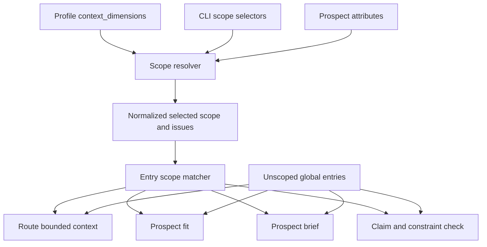

# MDP-103 Portfolio-Aware Scope Routing - Implementation Plan

## Goal Capsule

| Field | Decision |
|---|---|
| Objective | Let one GTM Message Decision Pack safely represent a portfolio of products, capabilities, and solutions without duplicating packs or changing MDP's agnostic primitives. |
| Product model | Product, capability, and solution are optional profile-owned context dimensions. They qualify the applicability of primitive entries; they are not new primitives and do not replace personas, segments, jobs, or channels. |
| Routing model | Entries may declare structured scope. Runtime scope comes from repeatable CLI selectors or prospect attributes. Matching is OR within a dimension and AND across dimensions. Unscoped entries remain global. |
| Safety posture | A scoped entry is ineligible when a required dimension or value is missing or incompatible. The CLI reports deterministic gaps and never uses fuzzy cross-product fallback. |
| Compatibility | The manifest and card fields are optional additions to `mdp.v0`. Packs without context dimensions or entry scope preserve current behavior. Existing `applies_to` continues to model actor/persona applicability. |
| Product boundary | MDP remains a local/offline decision-context and routing-contract layer. This change does not add execution, CRM, enrichment, scraping, sequencing, orchestration, or a product catalog service. |
| Tail ownership | The implementation must update the CLI contract, starter/template, docs, agent-facing skills, schemas, and eval coverage together so installed behavior cannot drift. |
| Stop condition | The branch is complete when scoped route, fit, brief, and claim-check paths isolate incompatible entries; old packs still validate and route; template evals prove cross-product isolation; and the PR is open from the MDP-103 branch. |

---

## Product Contract

### Summary

An MDP should be able to contain shared company-level decisions and narrower product-level decisions in the same pack.
Large organizations often market one platform through several capabilities, packaged solutions, and buying roles.
Creating one pack per product would duplicate global boundaries and proof, obscure cross-portfolio consistency, and make downstream agents choose a pack before they have enough context to route safely.

The durable distinction is therefore between the agnostic decision primitive and the context in which an instance of that primitive applies.
A persona remains an actor; a pain remains a need; a proof point remains evidence; a CTA remains an output contract.
Product, capability, and solution narrow those entries without changing what kind of decision each entry represents.

### Problem Frame

Today MDP can route by persona and free-text job, and card entries can use the flat `applies_to` actor list.
That is insufficient for a portfolio-shaped GTM pack:

- the same persona may need different pains, hooks, claims, and CTAs for different products;
- a capability such as an MCP or developer surface can matter to a GTM engineer while the broader platform matters to a VP of Sales;
- a solution packages capabilities for a use case and may span more than one product;
- a whole-card load can leak an incompatible product claim even when another entry in the same card matched correctly;
- putting these fields in `metadata` would preserve them but would not make them enforceable;
- treating product as a primitive would couple the universal MDP ontology to one GTM organizational shape.

The concrete research examples reinforce the distinction.
Attio presents one CRM platform through multiple capabilities such as sequences, call intelligence, workflows, reporting, developer tooling, and Ask Attio.
Sendoso presents a platform with capabilities such as AI gifting, campaign creation, merchandise, fulfillment, and an MCP surface, while also organizing solutions by buyer and use case.
In both cases, “product” alone is too coarse, and “one pack per product” would lose useful shared policy.

### Actors

- A1. Pack author: declares canonical dimension values and scopes entries with stable identifiers.
- A2. GTM operator: supplies product/capability/solution context directly or through prospect attributes.
- A3. Drafting or research agent: consumes only compatible bounded entries and honors reported routing gaps.
- A4. Reviewer: validates that no incompatible product claim, pain, hook, CTA, or guardrail entered the selected context.
- A5. Existing pack owner: receives unchanged behavior until optional context dimensions or entry scopes are added.

### Requirements

**Profile and card contract**

- R1. A profile may declare optional canonical `context_dimensions` as a map from dimension identifier to allowed value identifiers.
- R2. The contract is generic: `product`, `capability`, and `solution` are recommended GTM dimensions, not hard-coded model fields or new primitives.
- R3. A card entry may declare optional `scope` as a map from dimension identifier to one or more allowed values.
- R4. Declared dimension and value identifiers must match `^[a-z0-9]+(?:-[a-z0-9]+)*$`; declarations are rejected rather than silently rewritten. Runtime selector keys and values are trimmed and normalized to lowercase kebab-case before canonical lookup.
- R5. `applies_to` continues to mean actor/persona applicability. Existing persona, job, channel, primitive-map, and metadata behavior remains distinct. When a profile declares `context_dimensions.segment`, the existing top-level prospect `segment` field supplies that dimension.

**Runtime resolution and matching**

- R6. `route`, `emit-brief`, and route-scoped `check-claims` accept repeatable `--scope dimension=value` selectors and expose normalized selected scope in their JSON output.
- R7. Prospect-driven `fit` and `brief` derive scalar scope values from prospect `attributes` whose keys match declared context dimensions. If `segment` is declared, top-level `Prospect.segment` is authoritative and a conflicting `attributes.segment` is invalid. Multi-value OR selection is available through repeatable direct CLI selectors, not prospect arrays in V1.
- R8. Matching uses OR within one dimension and AND across dimensions: an entry scoped to two products matches either selected product, but an entry scoped to both a product and capability requires compatible selections in both dimensions.
- R9. An unscoped entry is global. A broadly product-scoped entry remains eligible when runtime context also selects a narrower capability or solution.
- R10. A scoped entry is ineligible when any required dimension is absent or when its selected values do not intersect the entry's values.
- R11. Unknown runtime dimensions, unknown runtime values, and missing dimensions required by potentially relevant entries appear as deterministic issues or gaps. They never trigger fuzzy or default cross-product selection.
- R12. A route is portfolio-sensitive when a scoped entry survives existing card, persona/job, channel/lifecycle, or guardrail candidacy before scope matching. Portfolio-sensitive routes always produce bounded entry context. Their draft-safe load order is bounded-entry-only for valid, missing, and invalid scope; original card paths may remain audit-only route metadata. Missing or invalid scope blocks drafting and retains only compatible global guardrails in bounded context.

**Consumer parity and safety**

- R13. Entry routing filters matches and scoped guardrails before serializing entry bodies, evidence, avoid terms, or constraints.
- R14. Prospect fit filters scoped fit entries before positive and negative term evaluation, preventing one product's fit or disqualifier rules from affecting another.
- R15. Prospect briefs carry resolved scope and use it for entry context. Scoped routes must not silently degrade to whole-card drafting guidance.
- R16. Claim checking filters approved claims, avoid terms, output rules, and route-scoped constraints by scope while preserving truly global guardrails.
- R17. Eval fixtures can declare scope and assert both inclusion and exclusion, including a two-product isolation regression.

**Compatibility, schema, and guidance**

- R18. Existing packs with no `context_dimensions` and no entry `scope` parse, validate, route, fit, brief, and claim-check exactly as before.
- R19. Manifest, card, context, brief, eval, capability, starter, and checked-in template contracts document the new fields and CLI selectors.
- R20. Agent-facing MDP skills instruct agents to treat scope as an applicability filter over primitives, prefer bounded context, and stop on unresolved product ambiguity.
- R21. The checked-in GTM template uses generic, synthetic portfolio identifiers and includes validation/eval coverage without embedding customer names or private customer strategy.
- R22. A pack with scoped entries is activation-ready only when eval fixtures cover selected-scope inclusion/exclusion and missing-scope behavior. Validation warns when scoped entries exist without portfolio-scope eval coverage so pack authors can coordinate scoped-entry and consumer updates.
- R23. `verify-output` fails closed with `proof_output_scope_unsupported` when a pack contains scoped entries, until proof-output artifacts can carry and validate scope without ambiguity.
- R24. A profile may declare generic `context_dimension_dependencies`; an entry using a dependent dimension must also scope every required dimension, and runtime selection of a dependent dimension must include its required dimensions.

### Key Flows

- F1. Direct scoped route
  - **Trigger:** An operator requests a message job for one persona and supplies one or more `--scope` selectors.
  - **Actors:** A2, A3
  - **Steps:** CLI validates the selected dimensions and values, performs existing card routing, filters entries by actor/job and scope, and emits bounded matches plus scope gaps.
  - **Outcome:** The agent receives shared global entries and compatible portfolio entries, but no incompatible scoped entry.
  - **Covered by:** R6, R8-R13
- F2. Prospect-derived brief
  - **Trigger:** A prospect JSON document contains `attributes.product`, optionally plus capability or solution.
  - **Actors:** A2, A3
  - **Steps:** Prospect validation runs, scope is normalized from declared attributes plus the existing top-level segment when declared, fit is evaluated against compatible rules, and brief context is filtered using the same scope.
  - **Outcome:** Product-specific pains, proof, hooks, and CTAs can coexist in one pack without cross-product leakage.
  - **Covered by:** R7-R10, R14-R15
- F3. Scoped claim check
  - **Trigger:** Draft copy is checked with persona, job, and scope.
  - **Actors:** A2, A4
  - **Steps:** Approved claims and guardrails are collected only from global or compatible entries; selected route constraints are then applied.
  - **Outcome:** A claim approved for product A is not accepted merely because it exists somewhere in the shared pack when checking product B copy.
  - **Covered by:** R6, R13, R16
- F4. Ambiguous or invalid scope
  - **Trigger:** Scope is omitted where scoped entries require it, or a selector names an undeclared dimension/value.
  - **Actors:** A2, A3, A4
  - **Steps:** CLI resolves no incompatible entry, reports the exact missing or invalid selector, and preserves global guardrails.
  - **Outcome:** The system fails closed at the entry boundary and gives the operator a repairable gap.
  - **Covered by:** R10-R12
- F5. Legacy pack
  - **Trigger:** Any current pack without the new optional fields runs under the upgraded CLI.
  - **Actors:** A5
  - **Steps:** Scope resolution is empty and existing persona/job behavior executes unchanged.
  - **Outcome:** No migration is required to retain current behavior.
  - **Covered by:** R18

### Acceptance Examples

- AE1. Shared plus product match
  - **Given:** A global CTA entry, a `product: [platform-a]` CTA, and a `product: [platform-b]` CTA.
  - **When:** Runtime scope is `product=platform-a`.
  - **Then:** The global and platform A entries are eligible; platform B is excluded.
- AE2. OR within a dimension
  - **Given:** An entry scoped to `product: [platform-a, platform-b]`.
  - **When:** Runtime scope selects platform B.
  - **Then:** The entry matches.
- AE3. AND across dimensions
  - **Given:** An entry scoped to `product: [platform-a]` and `capability: [developer-surface]`.
  - **When:** Only product A is selected.
  - **Then:** The entry is excluded and a missing capability gap is available.
- AE4. Broader entry with narrower context
  - **Given:** One entry scoped only to product A and runtime scope selecting product A plus developer surface.
  - **When:** The route runs.
  - **Then:** The broader product-level entry remains eligible because all of its declared dimensions match.
- AE5. Unknown value
  - **Given:** The profile declares products A and B.
  - **When:** Runtime scope selects product C.
  - **Then:** No product-scoped entry is returned and the output identifies `product=platform-c` as unknown.
- AE6. Claim isolation
  - **Given:** Product A approves a Salesforce integration claim and product B does not.
  - **When:** Copy containing that protected integration claim is checked under product B scope.
  - **Then:** The integration claim is unsupported unless it is also present in a global or product B-compatible claim entry. Arbitrary phrases remain subject to the existing category-trigger-based checker rather than a universal claim allowlist.
- AE7. Backward compatibility
  - **Given:** A current `mdp.v0` pack with no scope fields.
  - **When:** Existing route, fit, brief, and check-claims commands run with their current arguments.
  - **Then:** Their selected entries and pass/fail decisions remain unchanged.
- AE8. Product, persona, and segment composition
  - **Given:** Two entries share the same persona and product but are scoped to different declared segments.
  - **When:** A prospect selects that product and supplies one top-level segment.
  - **Then:** Only the matching segment entry is eligible, and a conflicting `attributes.segment` is reported as invalid.
- AE9. Proof-output fail-closed boundary
  - **Given:** A pack contains at least one scoped entry.
  - **When:** `verify-output` validates a proof-carrying artifact that cannot declare scope.
  - **Then:** Verification fails with `proof_output_scope_unsupported` instead of resolving an ambiguous cross-product card-entry binding.

### Success Criteria

- A single GTM template can express shared company policy plus at least two isolated product contexts.
- Route and eval output visibly prove compatible inclusion and incompatible exclusion.
- Invalid scope produces stable, actionable diagnostics rather than empty unexplained output.
- Claim checking cannot approve a scope-incompatible product claim.
- Existing unit tests and both checked-in templates validate and evaluate successfully.
- Documentation explains why scope is orthogonal to primitives and when separate packs are still appropriate.

### Scope Boundaries

In scope:

- generic manifest-declared context dimensions;
- entry-level scope and deterministic runtime matching;
- direct route/check-claims selectors;
- prospect-derived fit/brief scope;
- schemas, validation, capabilities, starter/template, evals, docs, and skills;
- structured gaps and decision traces that make fail-closed behavior explainable.

Deferred for later:

- explicit parent-child ontology such as capability-to-product compatibility graphs;
- aliases, default scope, inferred scope, weights, priorities, negative scope, or wildcard syntax;
- card-level scope optimization or separate card files per product;
- carrying scope inside proof-output artifacts; V1 instead rejects scoped-pack proof verification with a stable unsupported-scope issue;
- automatic migration of free-form `metadata` or `applies_to` values into scope.

Outside MDP's identity:

- product information management or a full product catalog;
- campaign execution, sequencing, sending, CRM writeback, enrichment, scraping, or orchestration;
- automatic selection based on private behavioral data;
- one-pack-per-product enforcement;
- hard-coded knowledge of Attio, Sendoso, or any other company in public runtime behavior.

### Sources

- Attio pricing and packaging: https://attio.com/pricing
- Attio Sequences: https://attio.com/blog/introducing-attio-sequences
- Attio Call Intelligence: https://attio.com/blog/introducing-call-intelligence
- Sendoso platform: https://www.sendoso.com/platform
- Sendoso solutions: https://www.sendoso.com/solutions
- Sendoso MCP: https://www.sendoso.com/platform/features/mcp
- Existing routing implementation: `cli/src/routing.rs`, `cli/src/commands/routing.rs`
- Existing prospect and brief implementation: `cli/src/models.rs`, `cli/src/commands/briefs.rs`
- Existing validation and schema surfaces: `cli/src/commands/health.rs`, `cli/src/commands/schemas.rs`

---

## Planning Contract

### Key Technical Decisions

- KTD1. Keep the primitive ontology unchanged. `product`, `capability`, and `solution` qualify entries that already map to actors, needs, proof, boundaries, outputs, routing jobs, gaps, or evals. This preserves profile agnosticism and prevents every vertical taxonomy from becoming a primitive.
- KTD2. Use generic `profile.context_dimensions: BTreeMap<String, Vec<String>>`. The manifest stores only canonical identifiers. Rich product descriptions and positioning stay in primitive cards, avoiding a second product-content system.
- KTD3. Add `Entry.scope: BTreeMap<String, Vec<String>>` as a first-class enforced field. Do not overload `metadata`, because metadata is explicitly advisory, and do not overload `applies_to`, because it already represents people/roles.
- KTD4. Centralize normalization and matching in a new `cli/src/scope.rs` module. Every consumer must use the same validator and matcher so route, fit, brief, and claim-check cannot diverge.
- KTD5. Entry matching treats an entry's scope as requirements on runtime context. Each entry dimension must be present and intersect; runtime may contain additional narrower dimensions. This implements OR within an entry dimension and AND across dimensions. Generic dependency declarations require capability/solution-like entries to carry their product-like parent dimensions without hard-coding those names.
- KTD6. Keep card selection backward-compatible and apply scope at the entry boundary. Current cards group primitives, and whole-card product separation would force duplication. Every portfolio-sensitive output uses bounded entry context; full shared cards remain audit-only metadata and are never the draft-safe load order, including on a valid scoped route.
- KTD7. Parse repeatable selectors as `--scope dimension=value`, with one selected value per dimension in V1. Repeating the same selector de-duplicates; selecting two different values for one dimension is an argument error that prevents blended multi-product drafting. Malformed selectors are invalid arguments; unknown declared dimensions/values are represented in structured scope resolution and prevent scoped entry matches.
- KTD8. Derive prospect scope only from scalar attributes whose keys are declared context dimensions, plus top-level `Prospect.segment` when `segment` is declared. Reject a conflicting `attributes.segment`. Do not infer a product from company text, persona, job, signals, or free-form keywords.
- KTD9. Global entries remain eligible with or without runtime scope. Scoped guardrails are filtered exactly like scoped claims; global output/boundary guardrails remain universal.
- KTD10. Claim approval collection must be scope-aware before text comparison. Filtering only route-specific constraints would still allow product A claims to approve product B copy.
- KTD11. Keep the additions optional under `mdp.v0`. A new format version would imply a mandatory migration that the additive serde defaults do not require.
- KTD12. Use generic synthetic portfolio identifiers in the starter and template. External company research explains the need but must not become public customer strategy or fixture data.

### High-Level Technical Design



Suggested internal types:

```rust
pub(crate) type ContextDimensions = BTreeMap<String, Vec<String>>;
pub(crate) type ContextScope = BTreeMap<String, Vec<String>>;

pub(crate) struct ScopeResolution {
    pub(crate) selected: ContextScope,
    pub(crate) issues: Vec<ScopeIssue>,
}
```

Suggested helpers in `cli/src/scope.rs`:

- `parse_scope_selectors(&[String]) -> Result<ContextScope>` validates `dimension=value` syntax;
- `resolve_runtime_scope(&Manifest, ContextScope) -> ScopeResolution` normalizes keys/values and reports undeclared selections;
- `scope_from_prospect(&Manifest, &Prospect) -> ScopeResolution` extracts declared dimension attributes without inference;
- `entry_scope_match(&ContextScope, &ContextScope) -> ScopeMatch` returns compatible, missing-dimension, or value-mismatch details;
- `scope_is_active(&ScopeResolution) -> bool` distinguishes legacy behavior from explicitly invalid/selected scope.

Candidate ordering is explicit: existing card selection, persona/job eligibility, channel/lifecycle policy, and guardrail candidacy run before scope matching. Scope gaps are emitted only for that potentially relevant entry set, preventing irrelevant entries in a selected card from flooding the operator with missing-dimension diagnostics.

### Diagnostic and Command Outcome Contract

| Condition | Stable code/reason | Location | Command outcome |
|---|---|---|---|
| Selector lacks `=` or an identifier is empty | `invalid_argument` | CLI error envelope | Exit nonzero; no route runs |
| Runtime dimension is undeclared | `scope_dimension_unknown` | `scope.issues` | Global guardrails may be returned, but portfolio-sensitive draft/check readiness is blocked |
| Runtime value is undeclared | `scope_value_unknown` | `scope.issues` | Global guardrails may be returned, but portfolio-sensitive draft/check readiness is blocked |
| Potentially relevant entry requires an omitted dimension | `scope_dimension_missing` | `entry_route.gaps` or bounded-context gaps | Entry is excluded; portfolio-sensitive draft readiness is blocked when no compatible scoped decision entry remains |
| Selected and entry values are disjoint | `scope_value_mismatch` | `entry_route.gaps` | Entry is excluded; compatible global/other scoped entries may continue |
| Prospect scope attribute is non-scalar | `scope_attribute_type_invalid` | `scope.issues` | Fit/brief is insufficient-context and no draft is allowed |
| Top-level segment conflicts with `attributes.segment` | `scope_segment_conflict` | `scope.issues` | Fit/brief is insufficient-context and no draft is allowed |

`route` and `emit-brief` are read-only routing commands, so a valid but missing selection returns structured blocked output rather than a process error. `check-claims` returns `valid: false` for invalid/missing portfolio scope. `fit` returns `insufficient-context`; `brief` returns `draft_status: no-draft`. Malformed selector syntax remains an argument error.

Output contracts should add, without removing current keys:

```json
{
  "scope": {
    "selected": {"product": ["primary-platform"]},
    "issues": []
  }
}
```

Entry context should serialize each entry's `scope` so reviewers can trace why it was eligible.
Entry-route gaps should include stable reasons such as `scope_dimension_missing`, `scope_value_mismatch`, and `scope_value_unknown` while preserving existing gaps for persona/job mismatches.

### System-Wide Impact

| Surface | Impact | Required safeguard |
|---|---|---|
| Serialization | New optional profile and entry maps | Serde defaults and legacy parsing tests |
| Pack validation | New identifier/reference rules | Paths and stable issue codes for every invalid key/value |
| Route JSON | New scope resolution and automatic bounded entries | Additive fields only; preserve existing route/load order keys |
| Prospect input | Declared attributes gain routing meaning | No inference; string/string-array normalization; existing value contracts still run first |
| Fit | Scoped positives and disqualifiers can change decisions | Filter before term matching; add cross-product negative tests |
| Brief | Context can become automatically included when scoped | Explicit policy and scope fields; preserve unscoped `--context` behavior |
| Claim checking | Approved phrases and avoid terms become scope-sensitive | Filter all entry-derived rules, not only constraints |
| Evals | Fixtures need scope input and exclusion assertions | Schema and validation updates plus synthetic isolation fixture |
| Agent skills | Agents must stop reading whole shared cards as scoped truth | Update router/create-pack/copy/prospect/eval guidance together |

### Risks and Mitigations

- Whole-card leakage: `select_cards` returns card paths that may contain multiple product entries. Mitigation: every portfolio-sensitive route includes bounded entry context; draft-safe load order is empty or bounded-only when scope is missing/invalid; and policy text explicitly says full cards are not scope-filtered drafting context.
- Silent ambiguity: an operator may omit product on a portfolio pack. Mitigation: scoped entries fail closed and gaps identify missing dimensions; global rules remain available.
- False global guardrails: an avoid term intended for one product could block another. Mitigation: apply the same scope matcher to all entry-derived guardrails and claims.
- Fit behavior drift: existing keyword fit logic is broad and order-sensitive. Mitigation: scope filtering happens before the existing logic, with legacy empty-scope behavior unchanged.
- Taxonomy creep: profiles may invent many context dimensions. Mitigation: generic support is intentional, but docs recommend the smallest stable set and keep semantic content in cards.
- Dependency expectations: V1 models required companion dimensions, not a full value-level hierarchy graph. Capability/solution-like entries must declare required product-like dimensions, and runtime must select them together; incompatible value combinations yield no dependent match plus explicit mismatch gaps. Rich parent graphs remain deferred.
- CLI parity: adding selectors only to route could leave check-claims inconsistent. Mitigation: central helper and parity tests across direct and prospect-driven consumers.
- Template confusion: synthetic products could look like MDP's official product packaging. Mitigation: label examples as illustrative portfolio identifiers and explain how to remove them for a single-product pack.

### Sequencing

1. Land the shared model and scope module with unit tests, including every mechanical `Profile`/`Entry` struct-literal update required for the crate to compile.
2. Add validation and schemas before wiring consumers so invalid packs fail predictably during development.
3. Wire direct route and claim-check selectors through CLI/app/capabilities.
4. Wire prospect fit and brief derivation through the same scope resolution.
5. Add eval fixture scope support and cross-consumer regression coverage.
6. Synchronize starter/template, docs, and skills.
7. Run focused tests, template validation/evals, and full `make validate` before PR creation.

---

## Implementation Units

### U1. Scope Model and Matching Kernel

- **Goal:** Establish the additive serialized fields and one reusable deterministic scope implementation.
- **Requirements:** R1-R5, R8-R11, R18
- **Files:** `cli/src/models.rs`, `cli/src/scope.rs`, `cli/src/main.rs` or module root, mechanical constructor updates in `cli/src/starter.rs` and `cli/src/routing.rs`
- **Approach:** Add `Profile.context_dimensions` and `Entry.scope` with empty-map defaults; implement selector parsing, prospect extraction, normalization, validation, and subset/intersection matching; expose structured reasons without embedding command-specific JSON.
- **Test scenarios:** Empty profile preserves global matching; OR within a dimension; AND across dimensions; broader entry with narrower runtime; missing dimension; value mismatch; unknown dimension/value; duplicate selector normalization; malformed selector rejection; scalar prospect attributes; top-level segment selection/conflict.
- **Verification:** `cargo test --manifest-path cli/Cargo.toml scope`
- **Dependencies:** None

### U2. Validation and Machine-Readable Schemas

- **Goal:** Make the new contract authorable and fail safely when pack scope is malformed.
- **Requirements:** R1-R5, R11, R18-R19
- **Files:** `cli/src/commands/health.rs`, `cli/src/commands/schemas.rs`, `cli/src/runtime_context.rs` if shared context schema composition requires it
- **Approach:** Allow `context_dimensions` in profile and `scope` in entries; validate identifier shape, duplicate case-normalized identifiers, empty value sets, undeclared dimensions, and undeclared values; add scope shapes to manifest, card, context, brief, and eval schemas; keep metadata advisory.
- **Test scenarios:** Valid declared scope; unknown profile field still fails; empty dimension/value; entry references unknown dimension/value; legacy card without scope; context schema exposes entry scope and scope resolution.
- **Verification:** `cargo test --manifest-path cli/Cargo.toml health` and `cargo test --manifest-path cli/Cargo.toml schemas`
- **Dependencies:** U1

### U3. Direct Route and CLI Contract

- **Goal:** Let operators select portfolio context explicitly and receive scope-safe bounded routing output.
- **Requirements:** R6, R8-R13, R18-R19
- **Files:** `cli/src/cli.rs`, `cli/src/app.rs`, `cli/src/commands/routing.rs`, `cli/src/routing.rs`, `cli/src/commands/capabilities.rs`, `cli/src/output.rs` if summaries need scope counts
- **Approach:** Add repeatable route and emit-brief `--scope`; resolve it before entry matching; pass selected scope to `entry_route` and `entry_context`; serialize scope on entries; detect portfolio-sensitive selected cards; always attach bounded entry context for those routes; block omitted/invalid portfolio scope and remove whole-card paths from draft-safe load order. Update every Rust caller, including eval dispatch, in the same unit or preserve compatibility wrappers until U6.
- **Test scenarios:** Product A includes global/A and excludes B; missing capability produces a gap; unknown selector produces no scoped matches; unscoped route output remains stable; `--eval-fixture` includes scope.
- **Verification:** `cargo test --manifest-path cli/Cargo.toml routing`
- **Dependencies:** U1-U2

### U4. Scope-Aware Fit and Prospect Brief

- **Goal:** Route prospect-driven workflows from declared attributes without inference.
- **Requirements:** R7-R11, R14-R15, R18-R19
- **Files:** `cli/src/commands/routing.rs`, `cli/src/commands/briefs.rs`, `cli/src/models.rs`, `cli/src/commands/schemas.rs`, `cli/src/value_contracts.rs` only if scalar segment conflict checks need shared contract reporting
- **Approach:** Derive normalized scope from matching prospect attributes after current prospect validation; filter fit entries before positive/avoid term evaluation; include scope in fit and brief output; automatically include bounded context for scoped briefs while retaining current opt-in behavior for legacy briefs.
- **Test scenarios:** Scalar product attribute; declared top-level segment; segment conflict; array attribute rejected; product A disqualifier does not affect B; unknown attribute value reports scope issue and blocks scoped fit; scoped brief contains no B entry; legacy prospect behavior remains unchanged.
- **Verification:** `cargo test --manifest-path cli/Cargo.toml commands::routing` and `cargo test --manifest-path cli/Cargo.toml commands::briefs`
- **Dependencies:** U1-U3

### U5. Scope-Aware Claim and Constraint Checking

- **Goal:** Prevent incompatible product claims or guardrails from crossing scope boundaries.
- **Requirements:** R6, R10-R13, R16, R18-R19
- **Files:** `cli/src/cli.rs`, `cli/src/app.rs`, `cli/src/commands/routing.rs`, `cli/src/commands/capabilities.rs`
- **Approach:** Add repeatable `--scope` to `check-claims`; scope-filter approved claims, avoid terms, output rules, exact-paragraph rules, and route constraints before evaluating text; return invalid when a portfolio-sensitive check omits or supplies invalid scope; preserve current behavior only for legacy/unscoped packs. Update eval callers with the API change in the same unit.
- **Test scenarios:** A-only claim accepted under A and rejected under B; A-only avoid term ignored under B; global guardrail enforced under both; unknown scope fails closed; current unscoped claim tests remain green.
- **Verification:** `cargo test --manifest-path cli/Cargo.toml check_claims`
- **Dependencies:** U1-U3

### U6. Eval Contract and Isolation Fixtures

- **Goal:** Make portfolio behavior executable and regression-safe.
- **Requirements:** R17-R19, R21
- **Files:** `cli/src/commands/evals.rs`, `cli/src/commands/schemas.rs`, `plugin/assets/templates/basic/.mdp/evals/*.yaml`, relevant template cards and prospects
- **Approach:** Add optional fixture scope selectors; pass them to route/check-claims; use prospect attributes/top-level segment for fit/brief fixtures; add `expect_scope_issue_codes_contains` and `expect_entry_gap_reasons_contains`; assert inclusion and exclusion across at least two synthetic products; warn during pack validation when scoped entries lack selected/missing-scope eval coverage.
- **Test scenarios:** Route A excludes B; route B excludes A; missing dimension gap; claim cross-product rejection; prospect brief isolation; legacy fixtures unchanged.
- **Verification:** `cargo run --manifest-path cli/Cargo.toml -- --json eval --dir plugin/assets/templates/basic`
- **Dependencies:** U3-U5

### U7. Starter, Template, Docs, and Agent Skills

- **Goal:** Ship one coherent public contract that a future agent can author and consume correctly without this chat.
- **Requirements:** R19-R21
- **Files:** `cli/src/starter.rs`, `plugin/assets/templates/basic/.mdp/manifest.yaml`, relevant basic template cards/prospects/evals, `README.md`, `cli/USAGE.md`, `docs/`, `plugin/skills/mdp/SKILL.md`, `plugin/skills/mdp-create-pack/SKILL.md`, `plugin/skills/mdp-prospect-brief/SKILL.md`, `plugin/skills/mdp-copy-brief/SKILL.md`, `plugin/skills/mdp-copy-eval/SKILL.md`, `plugin/skills/mdp-pack-eval/SKILL.md` as applicable
- **Approach:** Keep generated starter and checked-in template byte/behavior aligned; explain the primitive-versus-scope distinction, matching rules, failure behavior, single-product omission, and separate-pack boundary; instruct agents to use bounded entry context; add generic synthetic examples only.
- **Test scenarios:** Fresh `mdp init --template gtm` validates and evals; checked-in template validates and evals; docs command examples match CLI help/capabilities; relevant skill validators pass when available.
- **Verification:** `cargo run --manifest-path cli/Cargo.toml -- init --template gtm --dir <temporary-dir>` followed by validate/eval, plus repo skill validation commands discovered in `make validate`
- **Dependencies:** U1-U6

---

## Verification Contract

| Gate | Command | Proves | Required |
|---|---|---|---|
| Scope unit tests | `cargo test --manifest-path cli/Cargo.toml scope` | Normalization and matching semantics | Yes |
| CLI unit/integration tests | `cargo test --manifest-path cli/Cargo.toml` | Legacy and new command behavior | Yes |
| Basic template validation | `cargo run --manifest-path cli/Cargo.toml -- --json validate --dir plugin/assets/templates/basic` | Checked-in GTM pack/schema validity | Yes |
| Basic template eval | `cargo run --manifest-path cli/Cargo.toml -- --json eval --dir plugin/assets/templates/basic` | Cross-product routing and claim isolation | Yes |
| Proposal compatibility | `cargo run --manifest-path cli/Cargo.toml -- --json validate --dir plugin/assets/templates/proposal` and matching eval command | New optional fields do not regress the second template | Yes |
| Fresh starter smoke test | Initialize a temporary GTM pack, then run `validate` and `eval` against it | `cli/src/starter.rs` matches shipped template behavior | Yes |
| Full repository gate | `make validate` | CLI, templates, docs, and plugin contracts stay synchronized | Yes |
| Diff hygiene | `git diff --check` and secret/private-data review | No malformed patch, private examples, or abandoned experiments | Yes |

If local Codex plugin validators are unavailable, the PR must state which plugin validation was skipped while still passing CLI/template checks.
No PR should be opened with an unexplained cross-product isolation failure or a known claim-leak path.

---

## Definition of Done

- D1. R1-R24 are either implemented or explicitly marked as a documented, non-blocking deviation in the PR with rationale.
- D2. The agnostic `KNOWN_PRIMITIVES` list and existing `primitive_map` semantics are unchanged.
- D3. Product, capability, and solution are demonstrated as optional values of one generic context-dimension contract, not privileged runtime fields.
- D4. Route, fit, brief, and claim-check use the shared scope matcher and expose enough structured context to explain inclusion, exclusion, and ambiguity.
- D5. A synthetic two-product regression proves that pains/claims/hooks/CTAs or guardrails cannot leak across selected products.
- D6. Existing packs without scope retain current behavior and pass the full test suite.
- D7. Starter output, checked-in template, schemas, capabilities, docs, and agent skills agree on field names and matching semantics.
- D8. Public artifacts contain no customer-private strategy, raw transcript, authentication material, or implied Attio/Sendoso endorsement.
- D9. All required verification gates pass, or any environment-only skipped validator is named in the PR.
- D10. Dead-end or experimental code is removed from the diff.
- D11. The MDP-103 branch is committed and pushed; the PR references MDP-103, carries `ai:autofix-enabled`, and includes test evidence and the plan path.
- D12. A portfolio-sensitive pack has executable selected-scope isolation coverage and missing-scope coverage before activation; docs state that scoped entries and consumer selector updates ship together.
- D13. `verify-output` has an executable fail-closed regression for scoped packs, and dependency validation prevents dependent-dimension entries from omitting required companion dimensions.
