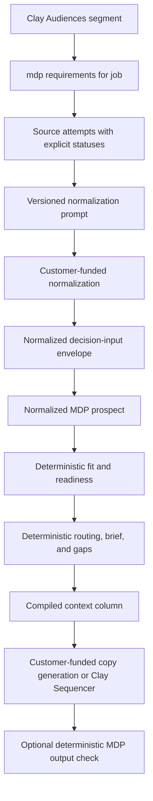
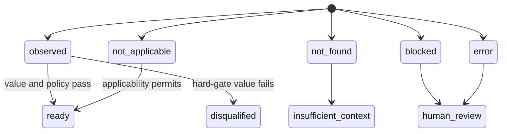
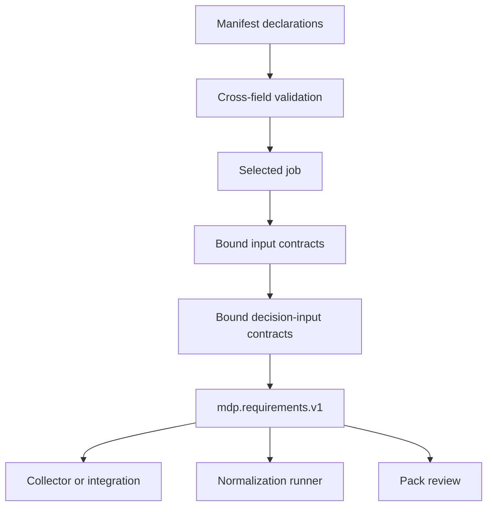

# MDP-166 Decision Input Contract - Plan

## Goal Capsule

| Field | Decision |
|---|---|
| Objective | Make the data needed for an MDP decision explicit, versioned, machine-readable, and reusable by collectors and normalization runners before `fit`, routing, brief, or gap evaluation. |
| Authority | The pack owns decision-input requirements. The CLI validates and compiles them. Agent skills author or review them. External collectors and model runners consume them without moving research or model execution into MDP. |
| Compatibility | Keep `lead_input_requirements` as the deterministic runtime readiness policy for normalized prospect input. Add a richer contract that must compile consistently with that policy. |
| Public example | Ship a synthetic Clay Audiences self-serve enterprise expansion example that demonstrates the complete contract without containing customer, employee, credential, or private-conversation data. |
| Product boundary | Do not add research, enrichment, scraping, provider calls, hosted endpoints, Cloudflare, WorkOS, Autumn, CRM writes, sequencing, or copy generation. |
| Skill boundary | Preserve the five accepted public skills. Extend `mdp-pack-builder` and `mdp-pack-review`; do not publish the internal people-finder. |
| Stop condition | The feature is ready when the schema, compiler, CLI output, validation, synthetic example, docs, skill guidance, and regression suite agree and the full repository validation passes. |

---

## Product Contract

### Summary

Add a profile-agnostic Decision Input Contract to `.mdp` packs and expose its resolved, job-specific form through `mdp --json requirements`.
The contract tells an upstream collector or normalizer what to attempt, why each attribute matters, which sources may support it, how absence and provider failures behave, and how the normalized result maps into deterministic MDP decisions.

### Problem Frame

`lead_input_requirements` currently tells `mdp fit` whether a normalized prospect has enough fields, signals, and attributes.
It does not tell a collector what questions to answer, which source classes are permitted, how conditional and hard-gate requirements differ, or what provenance, confidence, freshness, sensitivity, and attempt-state evidence must be preserved.

Without that layer, each integration must reconstruct the pack's data needs from prompts, fields, and downstream failures.
That makes the last mile provider-specific and forces implementers to guess which evidence is necessary before invoking MDP.

### Requirements

#### Contract declaration and job binding

- R1. A pack may declare one or more versioned, profile-agnostic Decision Input Contracts with stable IDs.
- R2. Each contract declares attributes with a stable ID, plain-language question, normalized output path, bounded value contract, requirement level, applicability, decision effects, permitted source classes, provenance policy, confidence policy, freshness policy, sensitivity class, and attempt-status behavior.
- R3. Requirement levels are `required`, `optional`, `conditional`, and `hard-gate`.
- R4. Attempt statuses are `observed`, `not_found`, `not_applicable`, `blocked`, and `error`.
- R5. Input contracts and jobs bind to Decision Input Contract IDs, and validation rejects missing or ambiguous references.
- R6. A job-specific compilation includes only its bound Decision Input Contracts and reports the selected job and input contracts.

#### Deterministic compiler and consistency

- R7. `mdp --json requirements --dir PACK_ROOT --job JOB_ID` emits the stable `mdp.requirements.v1` contract without network or model calls.
- R8. Compiled output includes the normalization prompt reference and version, normalized envelope schema, normalized prospect schema, attribute requirements, source-attempt request shape, and status-to-decision behavior.
- R9. Pack validation rejects duplicate attributes, invalid output paths, invalid applicability dependencies, undeclared source classes, invalid requirement/status combinations, and hard gates without explicit non-observed behavior.
- R10. Pack validation rejects a Decision Input Contract whose normalized output paths disagree with `lead_input_requirements`.
- R11. Existing packs without Decision Input Contracts remain valid, and existing fit/readiness behavior does not change.
- R12. `mdp gaps` reports missing contract coverage and inconsistent contract-to-readiness declarations as deterministic contract gaps.

#### Authoring and public example

- R13. `mdp-pack-builder` teaches authors to derive the contract from the actual decision and to state what data must be found before writing a normalization prompt.
- R14. `mdp-pack-review` audits contract completeness, cross-field consistency, status behavior, source policy, synthetic expected outcomes, and installed-template behavior.
- R15. No additional public skill or capability registry is introduced.
- R16. A synthetic Clay Audiences example defines the full first-job contract for `clay.audiences.self_serve_enterprise_expansion`.
- R17. The example covers ready, insufficient-context, disqualified, human-review, malformed, and provider-error outcomes without real customer or person data.
- R18. Documentation shows the complete data flow from segment and source attempts through customer-funded normalization to deterministic MDP output and optional output checking.

### Acceptance Examples

- AE1. Ready
  - **Covers:** R2-R10, R16-R18
  - **Given:** Every required and hard-gate attempt is observed with acceptable provenance, confidence, and freshness.
  - **When:** A collector retrieves the job requirements and a customer-funded normalizer returns the declared envelope.
  - **Then:** The normalized prospect is ready for deterministic fit, routing, brief, and gap evaluation.
- AE2. Insufficient context
  - **Covers:** R3-R4, R8-R10, R17
  - **Given:** A required attribute is `not_found` or `blocked`.
  - **When:** The normalized envelope is evaluated.
  - **Then:** No draft path is allowed and the missing context is surfaced as a gap.
- AE3. Disqualified
  - **Covers:** R3-R4, R8-R10, R17
  - **Given:** A hard-gate attribute is observed with a disqualifying value.
  - **When:** Deterministic MDP fit runs.
  - **Then:** The outcome is disqualified without model judgment.
- AE4. Human review
  - **Covers:** R2-R4, R8-R10, R17
  - **Given:** A hard-gate attempt is `blocked` or conflicts with another supported attempt.
  - **When:** The status policy is compiled.
  - **Then:** The contract routes to human review and prevents drafting.
- AE5. Malformed
  - **Covers:** R7-R10, R17
  - **Given:** A pack declares an unknown dependency, output path, source class, or incomplete hard-gate status policy.
  - **When:** Strict validation runs.
  - **Then:** Validation fails with a stable issue code and precise pack path.
- AE6. Provider error
  - **Covers:** R4, R8-R10, R17
  - **Given:** A source attempt returns `error`.
  - **When:** The status policy is compiled.
  - **Then:** The result remains explicit, does not become `not_found`, and follows the declared block or human-review behavior.

### Scope Boundaries

#### Deferred to Follow-Up Work

- A hosted API may later expose the same compiled contract and accept normalized evaluation/check requests.
- MDP Cloud may later provide Cloudflare, WorkOS, Autumn, tenant isolation, metering, and customer-funded model execution.
- A future CLI command may validate a completed normalized envelope directly if the hosted implementation demonstrates that this is needed beyond existing prompt-output and prospect validation.

#### Outside this product's identity

- Live research, enrichment, scraping, provider orchestration, contact discovery, CRM mutation, sequencing, and message sending.
- A public GTM people-finder skill.
- Model calls inside deterministic `fit`, route, brief, gaps, or output checking.

---

## Planning Contract

### Key Technical Decisions

- KTD1. **Additive manifest contract.** Keep `lead_input_requirements` as the normalized prospect readiness gate and add `decision_input_contracts` as its upstream articulation layer. This avoids changing fit behavior for existing packs.
- KTD2. **Job-specific compiler.** Resolve contracts through the existing `jobs[]` and `input_contracts[]` graph instead of adding a second routing registry.
- KTD3. **Inline authored contract with compiled schema.** Author the contract in `manifest.yaml` for v1 and have the CLI compile complete request/response schemas. This keeps ownership adjacent to existing readiness and job declarations while allowing a future external file reference without changing the consumer output.
- KTD4. **Explicit hard-gate status policy.** Every hard gate must state behavior for all non-observed statuses. Defaults are allowed only for non-hard-gate attributes.
- KTD5. **Closed vocabulary first.** Requirement levels, attempt statuses, dispositions, decision effects, source classes, and sensitivity classes are closed enums in v1 so strict validation remains deterministic.
- KTD6. **Five-skill surface remains fixed.** (session-settled: user-directed — chosen over publishing the internal people-finder or a sixth contract skill: the people-finder was a one-off internal workflow and the accepted public skills already own authoring and review.) Covers R13-R15.

### Assumptions

- The first release compiles a normalized decision-input envelope schema but does not add a second runtime evaluator for that envelope.
- The synthetic Clay example can live as a complete public example pack rather than changing the generic starter's decision semantics.
- Public source classes describe allowed evidence channels; they do not authorize access to private systems or bypass source approval.

### High-Level Technical Design

The diagram is directional rather than prescriptive. Existing manifest parsing, validation, and command-output conventions remain the implementation anchors.

### System-Wide Impact

- Manifest parsing and JSON Schema gain an additive contract.
- Strict validation gains cross-reference and cross-field checks.
- Capabilities and CLI help gain one read-only command and one stable output contract.
- Generic templates keep their current fit semantics; the new synthetic example proves full adoption.
- Pack-builder and pack-review gain contract-specific instructions without changing trigger inventory.

---

## Implementation Units

### U1. Model and schema the Decision Input Contract

- **Goal:** Add the v1 authored data model and JSON Schema with closed vocabularies and backward-compatible defaults.
- **Requirements:** R1-R5, R11
- **Files:** `cli/src/models.rs`, `cli/src/commands/schemas.rs`, `cli/src/constants.rs`
- **Approach:** Follow existing manifest/input-contract/job serde patterns and expose the new schema through `mdp schema`.
- **Test scenarios:** Empty legacy packs deserialize; valid contracts round-trip; malformed enum and nested shapes fail schema or pack validation.
- **Verification:** Focused schema and model tests.

### U2. Add deterministic validation and gaps

- **Goal:** Prove every contract is internally valid and consistent with the existing normalized prospect readiness policy.
- **Requirements:** R5, R9-R12
- **Files:** `cli/src/commands/health.rs`, `cli/src/value_contracts.rs`
- **Approach:** Reuse existing issue-path conventions and prospect field/attribute allowlists. Validate dependencies, mappings, hard-gate policies, and job bindings.
- **Test scenarios:** Unknown references, duplicate attributes, invalid dependencies, undeclared sources, missing hard-gate behavior, and readiness drift each return stable issue codes.
- **Verification:** Focused health tests plus strict validation on legacy templates.

### U3. Compile job requirements

- **Goal:** Add the read-only `requirements` command and `mdp.requirements.v1` output.
- **Requirements:** R6-R8
- **Files:** `cli/src/cli.rs`, `cli/src/app.rs`, `cli/src/commands/requirements.rs`, `cli/src/commands/mod.rs`, `cli/src/commands/capabilities.rs`, `cli/src/output.rs`
- **Approach:** Resolve one existing closed job route, gather its bound input and decision-input contracts, and compile explicit schemas and defaults without calling external services.
- **Test scenarios:** Valid job output, missing job, unbound contract, multiple input contracts, and non-JSON summary behavior.
- **Verification:** Command parser, compiler unit tests, and CLI smoke tests.

### U4. Ship the synthetic Clay example MDP

- **Goal:** Provide a complete, reviewable MDP for `clay.audiences.self_serve_enterprise_expansion`.
- **Requirements:** R16-R18, AE1-AE6
- **Files:** `examples/clay-audiences-self-serve-enterprise-expansion/.mdp/**`, `examples/clay-audiences-self-serve-enterprise-expansion/README.md`
- **Approach:** Start from the current GTM template, replace target and decision context with synthetic neutral content, declare the full attribute contract, and add expected-outcome fixtures.
- **Test scenarios:** Ready, insufficient-context, disqualified, human-review, malformed contract fixture, and provider-error fixture.
- **Verification:** Strict validate/eval, `requirements`, `fit`, route/brief/gaps, and privacy lint.

### U5. Update authoring, review, and operator documentation

- **Goal:** Teach pack authors and reviewers to derive data requirements from the decision before writing normalization prompts.
- **Requirements:** R13-R15, R18
- **Files:** `plugin/skills/mdp-pack-builder/SKILL.md`, `plugin/skills/mdp-pack-builder/references/source-intake.md`, `plugin/skills/mdp-pack-review/SKILL.md`, `plugin/skills/mdp-pack-review/references/structural-audit.md`, `docs/conceptual-decision-flow.md`, `cli/USAGE.md`, `README.md`, `CONCEPTS.md`
- **Approach:** Define ownership boundaries, authoring questions, review gates, example request/response shapes, and the no-draft behavior. Keep the skill tree at five canonical entries.
- **Test scenarios:** Skill contract/eval coverage recognizes build/review requests without introducing a people-finder trigger.
- **Verification:** Skill validators, skill eval harness, docs/public-artifact lint, and installed template QA.

### U6. Validate compatibility and package parity

- **Goal:** Prove the change is safe across CLI, templates, plugin assets, and packaged installs.
- **Requirements:** R7-R18
- **Files:** `cli/src/**` tests, template fixtures, skill eval fixtures, package assets as required by existing parity checks
- **Approach:** Run focused tests before full validation, inspect generated output, and remove abandoned implementation paths before commit.
- **Test scenarios:** Existing GTM and proposal templates remain valid; new example compiles deterministic requirements; public artifacts contain only synthetic data.
- **Verification:** Full repository validation and a smoke test using the built CLI artifact.

---

## Verification Contract

| Gate | Command | Done signal |
|---|---|---|
| Rust formatting and unit tests | `cargo fmt --check --manifest-path cli/Cargo.toml && cargo test --manifest-path cli/Cargo.toml` | All CLI tests pass. |
| Existing templates | `make validate-template` | GTM and proposal templates validate and eval successfully. |
| Synthetic Clay example | `cargo run --manifest-path cli/Cargo.toml -- --json validate --strict --dir examples/clay-audiences-self-serve-enterprise-expansion` | Valid with no strict failures. |
| Requirements compilation | `cargo run --manifest-path cli/Cargo.toml -- --json requirements --dir examples/clay-audiences-self-serve-enterprise-expansion --job prospect-fit-or-brief` | Emits `mdp.requirements.v1` with the expected contract, prompt version, schemas, and attributes. |
| Skills and packaging | `make validate-skills validate-skill-contracts validate-skill-evals validate-skill-packaging validate-asset-sync validate-plugin` | Canonical skills and packaged assets remain aligned. |
| Public safety | `make validate-public-artifacts` | No private or unsafe public artifact is detected. |
| Full gate | `make validate` | Entire repository validation passes. |

Manual review must confirm:

- Every question explains what data is being sought and why the decision needs it.
- The compiled status behavior cannot turn provider failure into absence or permission.
- Hard gates fail closed and no-draft outcomes remain explicit.
- The example contains no real people, companies, customers, credentials, or private conversations.
- The CLI and docs never claim that MDP performs research, model execution, sequencing, or deployment.

---

## Definition of Done

- The authored and compiled Decision Input Contract is stable, versioned, and job-specific.
- Strict validation rejects every malformed and cross-field drift scenario in AE5.
- The synthetic Clay example is a complete `.mdp` pack and exercises AE1-AE6.
- `mdp-pack-builder` authors the contract and `mdp-pack-review` audits it without adding a public skill.
- Existing packs and fit behavior remain compatible.
- Focused tests and `make validate` pass.
- No abandoned experimental code, private data, credentials, or hosted infrastructure remains in the diff.
- The branch is committed, pushed, and opened as a PR linked to MDP-166.
