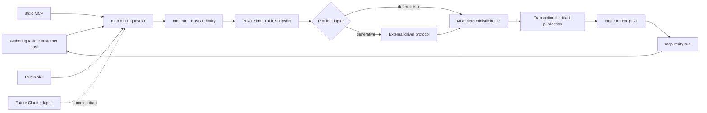
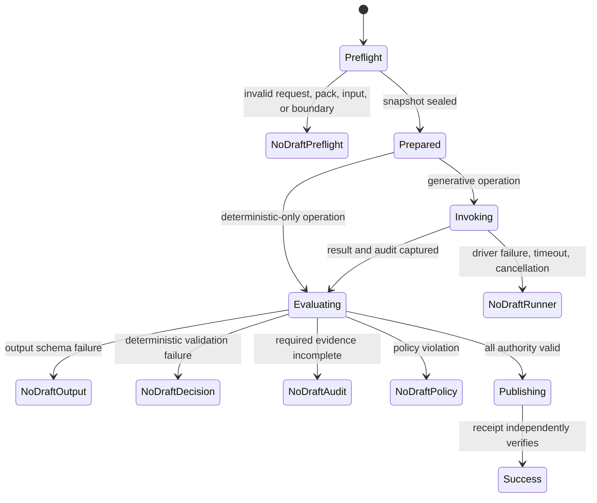
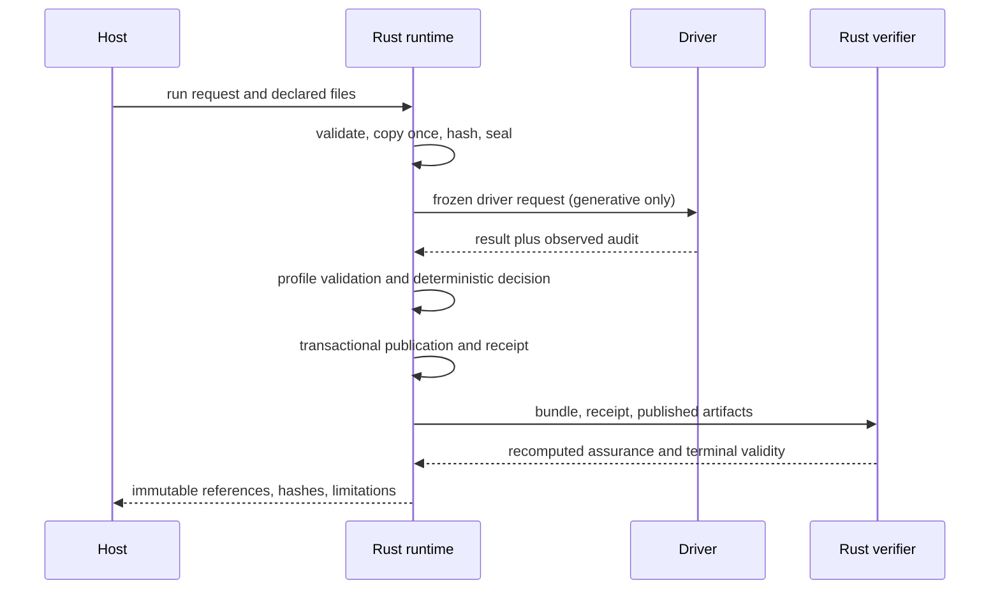

# Unified Clean-Context Runtime - Plan

## Goal Capsule

- **Objective:** Let an operator build an MDP pack in a context-rich agent conversation, then run proposal or GTM decisions through one separate, declared-input execution boundary whose artifacts and limitations are independently reviewable.
- **Product authority:** MDP owns pack authority, deterministic evaluation, run contracts, validation, and receipt verification. The host or customer owns source collection, credentials, production execution, retention, and downstream actions.
- **Implementation authority:** The Rust CLI is the only canonical snapshot, hashing, assurance, terminal-state, and verification implementation. JavaScript and hosted surfaces consume its contracts through thin adapters.
- **Stop conditions:** Stop before any real provider call without action-time approval. Stop rather than elevating assurance when an enforcement property, artifact identity, or verifier input is missing. Stop before generalized Cloud execution until MDP-187 passes its separate gate.
- **Execution profile:** Deliver in dependency order from MDP-179 through MDP-187. Each unit must remain independently reviewable and preserve current proposal entry points until its compatibility replacement passes.
- **Tail ownership:** This program owns local verification, PR/release/install closeout, host conformance documentation, and the hosted adoption decision. Customer production deployment remains customer-owned.

---

## Product Contract

### Summary

MDP will provide one profile-neutral clean-run contract and local runner surface for proposal and GTM. The authoring conversation remains the control plane; immutable run artifacts remain the decision authority.

### Problem Frame

MDP users often aggregate sources, discuss positioning, and build packs inside Codex, Claude Code, Clay, DeepLine, Freckle, or another context-rich host. That is useful authoring context, but it cannot prove that a later qualification, brief, or draft used only the released pack and declared run inputs.

A prompt to ignore earlier messages is still part of the polluted conversation. A new agent task improves hygiene, but the host may still inject system instructions, user configuration, repository files, tools, retrieval, environment state, or prior-session behavior. MCP transports a call but does not itself constrain what the called process or model can access.

The repository already has complementary foundations. Proposal has a local runner, native API path, stdio MCP wrapper, source/runner audits, and `mdp.run-receipt.v0`. GTM has Decision Input contracts, source-attempt ledgers, normalization validation, and deterministic `fit`, `brief --context`, and `check-claims` stages. Without one shared runtime, the two profiles will drift into duplicate isolation, hashing, receipt, and failure semantics.

### Key Decisions

- **One runner kernel, not proposal and GTM implementations.** (session-settled: user-approved — chosen over separate profile runners: duplication would let evidence and failure semantics drift.) Governs R6, R14, R19, R20, R33-R36.
- **Local and customer-controlled execution ships before a generalized hosted API.** (session-settled: user-approved — chosen over making the current synthetic Cloud gateway the production authority: the hosted surface has not earned that boundary.) Governs R21, R30, R31.
- **Same-conversation output is advisory.** (session-settled: user-approved — chosen over prompt-only context exclusion: the conversation cannot prove what the host supplied.) Governs R1, R2, R17, R39.
- **MDP returns immutable authority to the authoring task without returning decision control.** (session-settled: user-approved — chosen over allowing the original task to improve the result: ambient additions would invalidate the receipt.) Governs R15, R16, R18.
- **Customer and host systems retain operational ownership.** (session-settled: user-approved — chosen over expanding MDP into collection and orchestration infrastructure: MDP is a decision-context standard.) Governs R22, R23, R32, R37, R38.
- **Unqualified `audit-grade` language is not a v1 assurance claim.** (session-settled: user-approved — chosen over preserving a binary label: assurance must expose what was declared, observed, enforced, verified, and unknown.) Governs R3, R4, R12, R35.

### Actors

- A1. **Operator** — selects the released pack, approved inputs, runner, provider boundary, and any externally billable call.
- A2. **Authoring agent** — helps build and validate the pack, compiles requirements, launches the clean run, and explains returned artifacts without becoming decision authority.
- A3. **Shared runner** — stages declared artifacts, enforces the selected boundary, invokes a driver, records observed audit events, validates outputs, and emits terminal artifacts.
- A4. **MDP CLI evaluator** — computes portable pack identity, validates contracts, performs deterministic fit/routing/checks, and verifies receipts.
- A5. **Runner driver** — performs a native model API request, constrained subprocess/container invocation, customer-hosted call, or future hosted call.
- A6. **Customer or integration host** — owns source collection, batching, retries, credentials, network policy, retention, and downstream operational actions.
- A7. **MDP Cloud** — may later implement the same contract as a hosted adapter after the local/customer contract passes its adoption gate.

### Requirements

**Assurance semantics**

- R1. A fresh context means the inference request contains no prior conversation messages beyond the declared run envelope; it does not claim filesystem, tool, network, or provider isolation.
- R2. Stateless inference means the application does not intentionally continue a provider conversation or session; it does not promise deterministic prose, immutable provider internals, or absence of provider policy.
- R3. Declared-input isolation requires an enforced boundary that limits the runner to the hash-bound pack, prompt, inputs, allowed tools, allowed network, and explicit runtime metadata.
- R4. Audit evidence must distinguish caller declarations, runner observations, enforced controls, verifier results, unknown properties, and redacted properties.
- R5. Deterministic replay applies to canonical MDP evaluation and validation over identical artifacts and versions, not to byte-identical model generation.

**Immutable authority and receipts**

- R6. One canonical runtime implementation must own staging, canonicalization, hashing, assurance calculation, failure mapping, validation orchestration, and receipt creation for every profile and driver.
- R7. Each run must bind an immutable release identifier and full portable pack digest rather than only selected manifest files.
- R33. Preflight and invocation must consume one immutable content-addressed snapshot: the runner verifies it immediately before invocation, invokes only bytes from that snapshot, and binds the observed invocation snapshot identity into the audit and receipt. Mutation or substitution stops no-draft; provider-to-model transformation remains outside this claim.
- R8. Each run must bind a canonical declared-input manifest containing logical names, schema versions, media types, byte counts, hashes, and upstream source/normalization audit references where required.
- R34. Safe staging must reject traversal, absolute paths, links, special files, path collisions, unsupported media, and configured byte or file-count excesses; every artifact must resolve beneath a private run root without following links, and enforced limits and rejections must be audited.
- R9. Each generative run must bind the canonical declared prompt and every visible instruction or tool-schema component while representing hidden or unobservable instructions as unknown. Deterministic-only operations must record prompt, instruction, and tool-schema inference fields as not applicable.
- R10. Each run must bind runner implementation/version/build and sanitized execution policy. Generative operations must additionally bind the exact driver executable or container-image digest when observable, driver configuration hash, dependency lock or build identity, authorized provider endpoint, provider, requested model, resolved model when available, inference parameters, and observable cache/session behavior; unverifiable execution identities must remain host-attested or unknown. Deterministic-only operations must record inference fields as not applicable and must not claim fresh inference.
- R11. Each successful run must bind normalized output, deterministic decision and reason codes, compiled context, validation results, and their hashes and schema versions.
- R12. Assurance must be computed from verifiable evidence and include machine-readable limitations; a caller cannot elevate assurance by assertion alone.
- R13. Receipt verification must fail after mutation, substitution, incompatible versioning, missing audit, false assurance elevation, or cross-profile artifact reuse.
- R35. Each receipt must bind a unique execution ID, creation time, profile, operation, and caller-supplied job or idempotency identity when present. Host-mode replay verification must additionally receive the expected job or idempotency identity, explicit freshness policy, and durable consumption ledger to distinguish exact deterministic replay, duplicate delivery, stale reuse, and cross-job substitution. Without that external state, standalone verification is integrity-only; a signature is not freshness proof.

**Operator and integration behavior**

- R14. The local operator entry point must be one command, working name `mdp run`, with thin CLI, stdio MCP, and plugin adapters over the same runtime.
- R15. A clean run must return terminal status, assurance and limitations, validation, and immutable output, decision, compiled-context, and receipt references with hashes.
- R16. Any mutation of a hash-bound authoritative pack, prompt, input, output, decision, compiled context, or validation artifact creates a new run identity and receipt. Explanation or presentation-only formatting by the authoring task remains outside the receipt and does not mutate the original run.
- R17. A spawned Codex, Claude Code, Cursor, or other agent task receives only the assurance supported by enforceable and observed controls; task creation alone cannot produce a verified isolation claim.
- R18. The original authoring task may explain or format returned artifacts but cannot add evidence, recompute qualification, alter the authoritative decision, or treat its commentary as covered by the receipt.

**Profiles and ownership**

- R19. Proposal must migrate onto the shared runtime while preserving current public commands through thin compatibility adapters and an explicit v0 receipt migration path.
- R20. GTM must consume compiled Decision Input and source-attempt artifacts through the same runtime, run deterministic fit/routing/checks, and return bounded decision context without collecting or inventing missing evidence.
- R36. Deterministic-only operations must use the shared runtime and receipt contract without invoking a generative driver; their assurance reports input-provenance limitations and deterministic artifact integrity rather than fresh-inference properties.
- R21. The MVP must implement the shared kernel, a native stateless API/BYOK reference driver, and a bounded adapter to existing headless-runner surfaces. Customer-controlled subprocess or container execution is a host-invoked conformance boundary: container lifecycle, sandbox policy, scheduling, retries, and credentials remain host-owned, and portable container management requires a separate scoped decision.
- R22. Table and job hosts must call the contract per row or job while retaining batching, scheduling, retry, idempotent orchestration, and rate-limit ownership.
- R23. Customer and host systems retain credential custody, source access, privacy and retention policy, production auth and tenancy, downstream CRM/outbound/submission, and incident response.
- R37. Secrets must enter only through a driver-specific non-artifact channel, remain excluded from inherited environments by default, and never appear in model-visible content, logs, receipts, or retained artifacts unless an explicit declared-input policy permits the model-visible value. Private run artifacts must follow explicit access, provider-endpoint authorization, retention, redaction, deletion, and cleanup-reporting policy.
- R38. Packs and declared source artifacts are untrusted data and cannot structurally modify runner policy, instruction hierarchy, allowed tools or network, output schemas, validation rules, assurance, or receipts. Detected injection patterns and observable policy violations must be audited and fail closed; semantic model compliance with the data-versus-instruction boundary remains an explicit limitation rather than a proved isolation claim.
- R39. Clean-run assurance begins at the frozen execution boundary. It does not certify how a pack, prompt, or declared input was authored or selected, and must report upstream pack, source, and normalization provenance as a separate assurance dimension without claiming to cleanse polluted upstream authority.

**Failure and security behavior**

- R24. A run may return success only when every required artifact validates and the receipt is complete.
- R25. Pack, compatibility, declared-input, or isolation preflight failures must return `no-draft:preflight-refused`.
- R26. Provider, subprocess, container, timeout, cancellation, or host failures must return `no-draft:runner-failed`.
- R27. Schema-invalid output, invalid deterministic decisions, and incomplete audit must return `no-draft:output-invalid`, `no-draft:decision-invalid`, or `no-draft:audit-incomplete` respectively.
- R28. Privacy, retention, tool, network, or credential policy failures must return `no-draft:policy-blocked`.
- R29. Artifact publication must be transactional. A non-success run may expose only sanitized diagnostics and audit metadata; model-generated or partially normalized content remains quarantined or is deleted according to declared retention policy and is never returned through CLI, MCP, plugin, stdout, or stable artifact references.

**Phased adoption**

- R30. The existing synthetic MDP Cloud gateway may demonstrate the contract but must remain allowlisted and explicitly non-generalized until the hosted adoption gate passes.
- R31. Generalized hosted execution requires the released local contract, cross-profile proof, host conformance kit, and a separate human-approved security, reliability, tenancy, and product gate.
- R32. Public adapters and fixtures must remain generic, synthetic, or sanitized and must not turn MDP into enrichment, orchestration, outbound, proposal submission, or generic automation infrastructure.

### Key Flows

- F1. Clean run from an authoring conversation
  - **Trigger:** A1 and A2 finish building or selecting a pack and want an authoritative proposal or GTM decision.
  - **Actors:** A1, A2, A3, A4, A5.
  - **Steps:** Freeze the pack, prompt, and declared inputs; show preflight; launch A3 outside the conversation; invoke A5 only when the selected operation is generative; validate through A4; return immutable artifacts to A2.
  - **Outcome:** A2 presents the decision and limitations without adding authority.
  - **Covers:** R7-R18, R24-R29.
- F2. GTM row or job
  - **Trigger:** A6 has a released pack and collected Decision Input artifacts for one prospect or account.
  - **Actors:** A3, A4, A6.
  - **Steps:** A6 supplies one canonical run envelope; A3 validates source attempts and normalization; A4 computes fit and bounded context; A6 stores the decision bundle and receipt together.
  - **Outcome:** Missing required run artifacts, unattempted required inputs, invalid normalization, or a pack-declared blocking outcome stops no-draft. Valid attempted-complete statuses preserve the pack's optional, conditional, hard-gate, and no-draft semantics; batching and downstream actions remain host-owned.
  - **Covers:** R20, R22-R29, R36.
- F3. Proposal review migration
  - **Trigger:** A1 supplies approved proposal source artifacts.
  - **Actors:** A1, A2, A3, A4, A5.
  - **Steps:** The existing proposal flow calls the shared kernel; compatibility adapters preserve current entry points; source, prompt, runner, output, validation, and decision artifacts share one receipt.
  - **Outcome:** Proposal no longer owns a parallel isolation or receipt implementation.
  - **Covers:** R6-R13, R19, R21.
- F4. Host cannot prove the requested boundary
  - **Trigger:** A driver cannot observe or enforce a required context, file, environment, tool, network, model, or audit property.
  - **Actors:** A1, A2, A3, A6.
  - **Steps:** A3 records the property as unknown or failed. If the selected execution policy requires that property, the run returns the applicable no-draft state; only optional or observational properties may remain unknown and downgrade assurance. A2 reports the limitation without substituting ambient work.
  - **Outcome:** The operator receives a reviewable limitation or no-draft state, never a falsely elevated receipt.
  - **Covers:** R1-R5, R12, R17, R24-R29.

### Acceptance Examples

- AE1. **Covers R1, R17.** Given a newly spawned coding-agent task that inherits repository rules and tools, when it runs without the shared constrained boundary, then its result is fresh-task/advisory evidence and not declared-input-isolated.
- AE2. **Covers R3, R8-R10.** Given a clean runner with one hidden environment sentinel and one undeclared file sentinel, when the run executes, then the private exact serialized provider-request body plus filesystem and environment denial events prove the sentinels were excluded from MDP's request. The receipt publishes only the body hash and schema identity, treats provider-to-model transformation or hidden instructions as provider-returned or unknown, and never infers isolation merely because sentinel text is absent from model output.
- AE3. **Covers R5, R11.** Given identical canonical artifacts and evaluator versions but different valid model prose, when deterministic MDP evaluation replays, then the decision and reason codes match while the model-output hashes may differ.
- AE4. **Covers R12, R13.** Given a correctly signed receipt whose runner only asserted isolation, when the verifier evaluates it, then the signature verifies but assurance does not elevate beyond the observed evidence.
- AE5. **Covers R20, R24-R29.** Given a GTM record missing a required source attempt, when the host calls the clean runner, then the result is no-draft and contains no qualification or campaign draft.
- AE6. **Covers R16, R18.** Given an authoritative returned decision, when the authoring task adds evidence or rewrites the decision, then that modification is outside the original receipt and requires a new run.
- AE7. **Covers R30, R31.** Given the current synthetic Cloud gateway passes contract fixtures, when no bounded real pilot and hosted security gate exist, then it remains a synthetic evaluation surface rather than a generalized production API.
- AE8. **Covers R5, R20, R36.** Given frozen GTM Decision Input and source-attempt artifacts, when the operator requests deterministic fit and routing only, then the shared runtime invokes no model driver, emits the same deterministic decision on replay, and records inference properties as not applicable rather than fresh or unknown.
- AE9. **Covers R29, R33, R34, R37, R38.** Given a declared bundle containing a symlink escape, inherited secret sentinel, prompt-injection instruction, and provider output that later fails validation, when the runner executes, then staging or policy fails closed, no secret or partial output is returned, and only sanitized audit evidence is published.
- AE10. **Covers R22, R35.** Given a valid receipt and host replay policy, when verification sees the matching job and receipt in an explicitly permitted deterministic-replay state, then it reports exact replay; when the same receipt is already recorded as consumed, then it reports duplicate delivery; when the receipt is supplied for a different expected job, then it rejects cross-job substitution.
- AE11. **Covers R4, R39.** Given a released pack whose content may have been influenced by ambient authoring context, when a clean run succeeds, then the receipt may verify execution-time declared-input isolation while separately reporting upstream authoring provenance as unknown or attested and never claims the pack itself was cleansed.

### Success Criteria

- Proposal and GTM pass through one released runner, assurance, and receipt implementation.
- The existing CLI and plugin can launch a clean run without treating the authoring conversation as decision authority.
- The verifier rejects hidden-input, stale-artifact, mutation, replay, model-identity, and incomplete-audit false positives.
- One synthetic proposal and one synthetic GTM proof pass through native/BYOK and customer-controlled driver classes with honest limitations.
- Installed release assets expose the same behavior validated in the source tree.
- Future host and Cloud adapters can conform without copying MDP policy.

### Scope Boundaries

**Included**

- Shared local runner and driver/profile boundaries, including a native/BYOK reference driver and a bounded adapter to existing headless-runner surfaces.
- Run-bundle and receipt v1 contracts and v0 migration.
- Proposal and GTM adapters.
- CLI, local stdio MCP, plugin skills, schemas, verifier, fixtures, tests, and operator documentation.
- Customer/BYOK proof, host conformance guidance, and the hosted adoption gate.

**Outside this product's identity**

- AI SDR, CRM, sequencer, enrichment provider, scraper, BI tool, proposal submission system, or generic automation platform.
- Source collection, table orchestration, outbound, CRM mutation, proposal submission, or customer credential custody.
- Portable container lifecycle or sandbox management for customer workloads.
- Deterministic model prose, provider-internal attestation, or semantic truth beyond supplied artifacts.

**Deferred until the hosted adoption gate**

- Generalized production MDP Cloud execution.
- Production auth, tenancy, billing, retention, residency, SLOs, and hosted signing infrastructure.

### Dependencies and Assumptions

- The CLI's portable pack digest remains the release identity primitive.
- Existing proposal source-intake, runner-audit, workdir, and receipt behavior remains migration input rather than discarded work.
- GTM Decision Input and source-binding contracts remain the upstream evidence boundary; MDP does not absorb collection.
- A host can truthfully report only controls it observes or enforces. Unknown host/provider properties remain unknown.
- MDP-maintained real-provider proof and evaluation calls require separate action-time approval, synthetic inputs, secure local credentials, and sanitized evidence. Customer-controlled production hosts own authorization and may execute under an explicit pre-approved run policy bound into the run envelope.

### Planning Resolutions and Implementation-Time Unknowns

**Resolved by the Planning Contract**

- KTD1 makes the Rust CLI the canonical runtime authority.
- KTD2 and KTD7 define the v1 contract family and the v0 compatibility boundary.
- KTD8 defines the public run and independent-verifier surfaces.

**Deferred to implementation units**

- U2 must freeze exact derived assurance labels and keep every dimension visible independently.
- U3 and U6 must map macOS and Linux containment controls to verified, attested, unknown, or unsupported evidence.
- U2 and U10 must evaluate receipt signing without treating a signature as trusted execution.

### Sources and Research

- `docs/run-receipts.md`
- `docs/headless-normalization-runners.md`
- `docs/native-api-normalization-runner.md`
- `docs/proposal-runner.md`
- `docs/orchid/decisions/2026-07-21-runner-receipts-and-context-isolation.md`
- `docs/orchid/decisions/2026-07-24-proposal-evidence-plane-and-local-mcp-threat-model.md`
- `docs/orchid/plans/2026-07-24-mdp-127-runner-support-matrix.md`
- `plugin/skills/mdp-gtm-brief/SKILL.md`
- `scripts/mdp-proposal-runner.mjs`
- `scripts/mdp-proposal-mcp-server.mjs`
- `scripts/lib/proposal-runner-contracts.mjs`
- `scripts/lib/proposal-runner-runtime.mjs`
- `cli/src/commands/requirements.rs`
- `cli/src/commands/run_receipt.rs`

---

## Planning Contract

### Key Technical Decisions

- KTD1. **The Rust CLI is the canonical runtime authority.** (session-settled: user-approved — chosen over a JavaScript or split authority: one implementation must own frozen snapshots, canonical hashes, assurance, failure semantics, and verification.) Add typed contract/runtime modules to the existing binary crate. JavaScript compatibility and external-driver adapters may invoke the CLI, but may not calculate authoritative hashes or assurance. Governs R6, R7-R16, R19, R20, R24-R39.
- KTD2. **Use typed, closed and bounded v1 contracts.** Define `mdp.run-request.v1`, `mdp.run-bundle.v1`, `mdp.runner-audit.v1`, `mdp.run-receipt.v1`, and `mdp.run-verification.v1` as Rust serde types plus JSON Schemas with `additionalProperties: false` at authority boundaries. Reject duplicate JSON members before deserialization and enforce byte, nesting, object-member, array-length, and string-length limits. Preserve semantic distinctions among unknown, absent, redacted, unsupported, and not-applicable. Governs R4, R8-R13, R24-R29, R35-R39.
- KTD3. **Preserve exact-byte and canonical hashes as different fields.** Exact input/output artifacts use raw-byte SHA-256. Structured authority objects use compact UTF-8 JSON with recursively sorted object keys, preserved array order, safe-range integers from -9007199254740991 through 9007199254740991, no negative zero, no Unicode normalization, and domain-separated SHA-256. Larger numeric values use schema-constrained decimal strings. Portable logical paths are relative ASCII slash paths with case-collision rejection. The existing portable pack digest remains compatible and gains a file inventory. Governs R5, R7-R13, R33-R35.
- KTD4. **The runtime uses a prepare, invoke, finalize state machine.** Rust validates a request, copies allowed regular files once into a private snapshot, verifies the snapshot before invocation and again after driver exit, invokes either no driver or one external driver protocol, validates profile outputs, publishes from a same-filesystem private staging directory, derives assurance, and verifies the receipt before success. A path-based snapshot provides mutation detection, not stronger immutability, unless the selected OS boundary proves it. Governs R3, R6, R15, R21, R24-R29, R33, R34, R37, R38.
- KTD5. **Rust owns the native/BYOK reference transport; external drivers generate but never authorize.** Rust serializes and hashes the exact provider-request body, attaches authentication outside that body, enforces the provider endpoint, and performs the native request. Provider-to-model transformation and hidden provider instructions remain provider-returned or unknown. External headless or customer drivers receive a bounded canonical `mdp.driver-request.v1` on stdin, return one size-bounded result on stdout, and keep diagnostics on a separately bounded stderr channel. Their request evidence remains driver-attested unless a verifier-configured authenticated observer or enforcing proxy supplies it through a registered evidence channel. Provenance derives from that channel and trust root, never a field self-authored by the driver. Rust validates every result and audit. Governs R2, R3, R10-R12, R17, R21, R23, R37, R38.
- KTD6. **Proposal and GTM are profile adapters inside the same state machine.** Proposal maps existing source-intake, prompt, normalization, proof, and readiness hooks. GTM maps Decision Input, source-attempt, normalization, fit, route, bounded context, and claims hooks. Deterministic-only GTM operations skip driver invocation. Governs R19, R20, R36.
- KTD7. **v0 remains legacy-readable and never silently upgrades.** Keep `mdp run-receipt` and current proposal fixtures working during migration. Add a compatibility mapping that reports v0 evidence and limitations but cannot derive a v1 verified isolation label from assertion-only flags or the v0 `audit-grade` string. Governs R12, R13, R19.
- KTD8. **The public UX is one run command plus independent integrity and host-consumption decisions.** `mdp run --request <file> --out-dir <dir>` is the operator entry point. `mdp verify-run --bundle <file> --receipt <file>` is pure integrity verification. Replay protection adds a host-supplied atomic compare-and-consume result bound to expected job identity, receipt hash, prior ledger version, freshness policy, and resulting state. MDP ships a locked append-only local reference ledger for conformance, with fail-closed corruption handling and explicit crash, replacement, cloning, and rollback limitations; it does not claim production durability. Production hosts own their durable transaction. Stdio MCP and plugin skills transport the same file-based request and result. Governs R14-R18, R22, R35.
- KTD9. **MDP Cloud remains a mapped adapter candidate.** Reuse its synthetic release manifests, relational verification, process-lifecycle tests, no-draft families, and content-addressed decision patterns. Treat its HMAC receipt, in-memory replay cache, and Clay-specific contracts as legacy adapter evidence, not shared v1 authority. Governs R30-R32.

### High-Level Technical Design

The diagrams are directional. They define ownership and sequencing, not exact function signatures.

### Assumptions and Constraints

- The first implementation extends the current Rust binary crate. It does not publish a new Rust library until a second Rust consumer proves that need.
- The native/BYOK reference transport is implemented in Rust. Existing native JavaScript entry points remain compatibility wrappers. Customer/headless adapters remain local scripts or host commands invoked through one versioned protocol and a filtered environment.
- The runtime may report strong artifact integrity without strong provider or sandbox assurance. Labels derive per dimension.
- Raw provider responses may be deleted by policy. Their hash can preserve integrity evidence, but deletion limits independent normalization replay and must appear as a limitation.
- Exact request evidence means the serialized provider-request body before authentication headers are attached. It proves what MDP sent, not the provider's hidden transformation or final model-visible context. Raw body retention follows private policy; public receipts contain only its hash and schema identity. Sanitized transport audit excludes headers, query credentials, response bodies, and local paths.
- Platform controls differ. macOS and Linux conformance fixtures map unsupported controls to explicit downgrade or no-draft states.
- Generative CLI runs require a host- or plugin-supplied driver path whose executable and configuration identities are hash-bound. The standalone binary does not discover plugin scripts implicitly.
- External unsandboxed drivers cannot claim MDP-observed filesystem or exact-request isolation. Those dimensions remain driver-attested, host-attested, or unknown.
- The current MDP Cloud checkout contains provisional branch work. No Cloud-specific contract becomes public MDP authority during MDP-179 through MDP-186.

### Sequencing

1. Freeze contracts, canonicalization, assurance, verification, and v0 migration in MDP-179.
2. Build the state machine and move proposal through it in MDP-180.
3. Add the driverless and generative GTM adapter in MDP-181.
4. Expose the unified CLI, stdio MCP, and plugin UX in MDP-182.
5. Prove adversarial conformance in MDP-183 before any real provider proof.
6. Release and installed-smoke-test the conformance-passing local MVP in MDP-185 without making availability depend on a billable provider call.
7. Run human-approved synthetic real-provider and customer-controlled proof against installed release assets in MDP-184. Fix any discovered defect in a follow-up patch before publishing the proof as successful.
8. Publish extended customer-host tutorials in MDP-186; normative schemas, fixtures, driver protocol, replay semantics, and assurance mapping ship with the MVP.
9. Evaluate Cloud readiness without allowing it to delay or redefine the local runtime in MDP-187.

---

## Implementation Units

| Unit | Outcome | Primary files | Depends on |
| --- | --- | --- | --- |
| U1 | Define v1 types and canonical hashes | `cli/src/run_contracts.rs`, `cli/src/artifact_hash.rs` | — |
| U2 | Add schemas, verifier, and v0 compatibility | `cli/src/commands/verify_run.rs`, `cli/src/commands/run_receipt.rs` | U1 |
| U3 | Build shared runtime and proposal adapter | `cli/src/run_runtime.rs`, `scripts/mdp-proposal-runner.mjs` | U1, U2 |
| U4 | Add GTM adapter and deterministic mode | `cli/src/run_profiles.rs`, `plugin/skills/mdp-gtm-brief/SKILL.md` | U3 |
| U5 | Ship CLI, MCP, and plugin UX | `cli/src/cli.rs`, `scripts/mdp-run-mcp-server.mjs`, `plugin/skills/mdp/SKILL.md` | U3, U4 |
| U6 | Add adversarial conformance suite | `cli/tests/fixtures/run-v1/`, `scripts/test-run-runtime.sh` | U2-U5 |
| U7 | Produce bounded real-run proof | `.agent-artifacts/`, `docs/orchid/qa/` | U8 |
| U8 | Release and installed smoke test | `scripts/release-install-smoke.sh`, release docs | U6 |
| U9 | Publish host conformance kit | `docs/`, `examples/` | U6, U8 |
| U10 | Decide Cloud adoption gate | `docs/orchid/decisions/` | U8, U9 |

### U1. Define v1 authority types and canonicalization

**Goal:** Add the typed run-request, run-bundle, driver-request/result, runner-audit, receipt, verification, terminal-state, and assurance models plus one canonical hash implementation.

**Requirements:** R2, R4-R13, R24-R29, R33-R39; KTD1-KTD3.

**Dependencies:** None.

**Files:**

- `cli/src/run_contracts.rs`
- `cli/src/artifact_hash.rs`
- `cli/src/main.rs`
- `cli/src/constants.rs`
- `cli/tests/fixtures/run-v1/`

**Approach:**

1. Define closed serde types and enums for every semantic state, provenance class, assurance dimension, artifact record, and terminal result.
2. Add a bounded authority parser that rejects duplicate members before typed deserialization.
3. Extend portable pack hashing to emit a sorted logical file inventory and reject unsafe or colliding paths.
4. Add domain-separated canonical JSON bytes and hashes while preserving raw-byte SHA-256 for exact artifacts.
5. Check in language-neutral golden vectors for Unicode strings, safe-integer boundaries, rejected out-of-range integers and negative zero, array order, key order, empty structures, raw bytes, and portable pack trees.
6. Define a closed versioned GTM decision and reason-code table that maps existing structured fit, scope, requirement, disqualifier, and Decision Input outcomes with explicit ordering, deduplication, precedence, and legacy mapping.
7. Build a reviewed legacy GTM characterization corpus before freezing that mapping. Cover precedence collisions, optional and conditional evidence, hard gates, missing attempts, disqualifiers, and current reason ordering; record intentional semantic changes explicitly.

**Execution note:** Start with golden-vector and unsafe-path failures before implementing the new canonicalizer and snapshot inventory.

**Test scenarios:**

- Two semantically identical authority objects with different key order produce the same canonical bytes and domain-separated hash.
- Array reorder, integer change, schema change, or domain change produces a different hash.
- Floating-point authority values, negative zero, out-of-safe-range integers, duplicate logical paths, case collisions, traversal, absolute paths, symlinks, and special files fail.
- Duplicate JSON members, excess nesting, oversized strings, arrays, objects, and documents fail identically in Rust and Node rejection fixtures.
- The same portable pack tree at two roots produces the same file inventory and digest; one byte mutation changes both the file record and pack digest.
- Unknown, absent, redacted, unsupported, and not-applicable serialize distinctly.

**Verification:** Golden fixtures are stable across Rust and Node readers; no receipt authority depends on machine-local paths.

### U2. Add schemas, independent verification, and v0 migration

**Goal:** Publish v1 schemas, derive assurance from evidence, independently verify run artifacts, and preserve v0 as legacy without false elevation.

**Requirements:** R2, R7-R13, R24-R29, R35, R39; KTD2, KTD3, KTD7, KTD8.

**Dependencies:** U1.

**Files:**

- `cli/src/commands/schemas.rs`
- `cli/src/commands/verify_run.rs`
- `cli/src/commands/run_receipt.rs`
- `cli/src/commands/capabilities.rs`
- `cli/src/commands/mod.rs`
- `cli/src/cli.rs`
- `cli/src/app.rs`
- `cli/src/output.rs`
- `docs/run-receipts.md`
- `docs/orchid/decisions/2026-08-03-unified-clean-context-runtime.md`

**Approach:**

1. Add schema targets for every v1 public contract without changing the existing `schema run-receipt` v0 output.
2. Implement `verify-run` to recompute bundle, artifact, decision, validation, receipt, compatibility, and assurance results.
3. Keep `verify-run` pure. Add a host consumption-result contract plus a locked append-only local reference ledger that atomically compares and consumes expected job identity, receipt hash, prior version, and freshness policy.
4. Keep v0 generation and tests. Add a legacy mapping whose limitations prevent assertion-only `audit-grade` from becoming v1 verified isolation.

**Execution note:** Characterize all current v0 outputs before changing shared helpers; preserve them byte-for-meaning unless the migration document names the difference.

**Test scenarios:**

- A complete deterministic and a complete generative receipt verify with their distinct not-applicable and observed dimensions.
- Mutation of any bundle, artifact, output, decision, validation, audit, or receipt hash fails verification.
- Caller-selected assurance, signature-only elevation, missing runner evidence, and v0 assertion-only evidence cannot elevate.
- Integrity verification refuses freshness claims; atomic host consumption distinguishes permitted exact replay, duplicate delivery, stale reuse, and cross-job substitution even under concurrent first delivery.
- Corrupt or interrupted appends, ledger replacement, restored older ledgers, and cloned ledgers fail closed or expose the local reference ledger's limited rollback trust instead of claiming production durability.
- Every no-draft terminal state rejects success artifacts and every success state requires complete published authority.
- Existing v0 fixtures and proposal commands remain readable and retain legacy decisions.

**Verification:** Public schemas, CLI JSON, docs, and golden fixtures agree; an independent hash recomputation matches at least one fixture.

### U3. Build the shared state machine and migrate proposal

**Goal:** Implement one Rust prepare/invoke/finalize runtime and make the existing proposal command and stdio surfaces thin compatibility adapters.

**Requirements:** R2, R3, R6-R21, R24-R29, R33, R34, R37, R38; KTD1, KTD4-KTD7.

**Dependencies:** U1, U2.

**Files:**

- `cli/src/run_runtime.rs`
- `cli/src/run_profiles.rs`
- `cli/src/commands/run.rs`
- `cli/Cargo.toml`
- `scripts/mdp-proposal-runner.mjs`
- `scripts/mdp-proposal-mcp-server.mjs`
- `scripts/lib/proposal-runner-runtime.mjs`
- `scripts/lib/proposal-runner-contracts.mjs`
- `scripts/mdp-native-normalize-openai.mjs`
- `scripts/test-proposal-runner.sh`
- `scripts/test-proposal-mcp-server.sh`
- `scripts/test-native-runner.sh`
- `docs/proposal-runner.md`

**Approach:**

1. Stage from a trusted root with descriptor-relative, no-follow reads. Reject hard links and non-regular descriptors; compare device, inode, type, and size before and after bounded copy; verify copied bytes against the preflight manifest; invoke only a sealed driver copy or image digest.
2. Remove inherited environment by default, verify the complete snapshot immediately before invocation, and rehash it after driver exit before accepting output.
3. Implement the native HTTPS transport in Rust. Permit only configured scheme, host, and port tuples; reject userinfo; clear undeclared proxy variables; disable redirects; validate resolved connection targets against policy; and attach credentials only after hashing the exact provider-request body.
4. Define the external driver protocol with a complete bounded request on stdin, bounded stdout result, bounded stderr diagnostics, deadline/cancellation, process-group cleanup, credential allowlist, registered observer channels, and sanitized audit events. Do not require external drivers to read mutable staged paths.
5. Keep the existing proposal runner as the compatibility input compiler and readiness presenter. Move frozen staging, invocation policy, authoritative validation and decisions, assurance, terminal states, and receipts behind the Rust state machine.
6. Retain proposal scripts, native script name, and MCP names as adapters that translate existing arguments and consume the authoritative CLI result. Move additional JavaScript logic only when conformance proves it still makes an authoritative decision or identity.
7. Publish results from a same-filesystem sibling staging directory only after internal `verify-run` success; quarantine or delete failed partials.

**Execution note:** Begin with a failing end-to-end proposal compatibility test and snapshot mutation test. Reuse current runner fixtures before deleting any JS-owned gate.

**Test scenarios:**

- Existing mock proposal flow returns the same blocked/no-draft intent through the new runtime and never gains assurance.
- A pack, prompt, source, driver, or staged-file mutation before or during invocation fails and quarantines driver output.
- A transient mutate-and-restore attack cannot change the bytes supplied to the native transport or external-driver stdin; any broader ambient access by an unsandboxed driver remains attested or unknown.
- The verifier recomputes the exact provider request body hash, method, and authorized endpoint from the frozen driver request.
- Redirects, undeclared proxies, userinfo URLs, disallowed ports, and policy-invalid resolved targets fail before credentials or declared inputs are sent.
- Timeout, cancellation, descendant process, spawn failure, cleanup failure, oversized output, and malformed driver result return the exact no-draft states.
- Hidden environment and undeclared file sentinels are excluded according to Rust-owned native request evidence and enforcement-layer denial evidence; external unsandboxed drivers remain capped as attested or unknown.
- A resumed provider conversation or missing session-continuation evidence prevents a stateless-inference claim.
- A failed proposal output remains unavailable through CLI, MCP, stdout, and stable artifact paths.
- Existing proposal CLI/script/MCP callers receive compatible fields plus explicit v1 authority references.

**Verification:** Proposal uses no separate authoritative hash, assurance, failure, or receipt implementation; current proposal suites pass against the Rust verifier.

### U4. Add the GTM profile adapter and deterministic-only execution

**Goal:** Run GTM qualification and bounded campaign context from frozen Decision Input artifacts through the same state machine, with no model required for deterministic operations.

**Requirements:** R5, R6, R20, R22-R29, R36, R39; KTD1, KTD4, KTD6.

**Dependencies:** U3.

**Files:**

- `cli/src/run_profiles.rs`
- `cli/src/commands/requirements.rs`
- `cli/src/commands/routing.rs`
- `cli/src/commands/briefs.rs`
- `cli/src/commands/prompt_output.rs`
- `cli/src/runtime_context.rs`
- `plugin/skills/mdp-gtm-brief/SKILL.md`
- `plugin/skills/mdp-gtm-brief/references/`
- `plugin/assets/templates/basic/.mdp/evals/`
- `scripts/test-run-runtime.sh`

**Approach:**

1. Bind exact source-attempt request, collected-results, normalized Decision Input, runtime context, and requirements digests.
2. Add context-accepting evaluation and brief functions that consume the validated hash-bound runtime context; retain live-clock legacy wrappers only for existing commands.
3. Reuse existing deterministic fit, route, brief-context, and claim checks inside the profile adapter and map their structured outcomes through the closed v1 reason-code table.
4. Skip the driver for deterministic-only requests and mark inference dimensions not-applicable.
5. Return the verified bounded context through the shared receipt. Downstream drafting remains host-owned and may cross the generic driver boundary in a separate declared run without becoming a GTM profile operation.
6. Preserve optional, conditional, hard-gate, attempted-complete, and no-draft semantics from the pack.

**Execution note:** Prove deterministic replay and missing-required-attempt no-draft behavior before adding a separate generic bounded-context driver conformance fixture.

**Test scenarios:**

- Identical frozen GTM artifacts reproduce decision and reason-code hashes without invoking a driver.
- Replays at different wall-clock times produce the same compiled context when the frozen runtime context is unchanged.
- Missing required source attempts, stale normalization, incompatible runtime context, or hard-gate failure returns no-draft.
- Valid attempted-complete optional or conditional evidence does not become an unconditional runtime failure.
- Cross-profile proposal artifacts cannot satisfy a GTM request.
- A generic synthetic driver conformance run receives only the bounded compiled context and cannot alter the deterministic qualification; U4 itself does not own campaign-generation behavior.
- The returned campaign context cites immutable source, decision, validation, and receipt references.

**Verification:** GTM and proposal receipts pass the same verifier; GTM owns no duplicate runtime policy.

### U5. Ship the unified CLI, stdio MCP, and plugin operator experience

**Goal:** Let an operator launch and inspect a clean run from current coding-agent workflows without confusing transport with authority.

**Requirements:** R14-R18, R21-R23, R32, R35; KTD8.

**Dependencies:** U3, U4.

**Files:**

- `cli/src/cli.rs`
- `cli/src/app.rs`
- `cli/src/output.rs`
- `cli/src/commands/capabilities.rs`
- `scripts/mdp-run-mcp-server.mjs`
- `scripts/test-run-mcp-server.mjs`
- `plugin/skills/mdp/SKILL.md`
- `plugin/skills/mdp/references/cli-operator.md`
- `plugin/skills/mdp-proposal-review/SKILL.md`
- `plugin/skills/mdp-gtm-brief/SKILL.md`
- `docs/getting-started.md`
- `docs/run-receipts.md`

**Approach:**

1. Expose one file-oriented `mdp run` command with deterministic preflight, terminal status, assurance vector, limitations, validation, and immutable artifact references.
2. Expose `mdp_run_tools`, `mdp_run`, and read-only `mdp_verify_run` over local stdio MCP as thin argument/result transport.
3. Teach plugin skills to freeze inputs, show preflight, invoke the command, and return immutable authority without allowing ambient edits to inherit the receipt.
4. Render a canonical authority block directly from verified CLI output. It contains terminal state, decision and reason codes, assurance dimensions, limitations, artifact hashes, and the verification command; ambient commentary cannot be inserted into or presented as that block.
5. Label fresh-task-only and same-conversation paths as advisory; label deterministic-only runs without inference language.

**Test scenarios:**

- CLI, MCP, proposal skill, and GTM skill produce the same run request and terminal result for equivalent inputs.
- MCP accepts file references, rejects raw ambient evidence and unsafe paths, and never elevates assurance itself.
- Preflight output identifies pack, operation, driver mode, provider cost boundary, retention, and limitations before invocation.
- Original-task formatting leaves the original receipt valid but is visibly outside its authority; evidence or decision edits require a new run.
- Contradictory ambient commentary remains structurally outside the canonical authority block and cannot change its machine-readable fields.
- JSON errors remain stable and contain no secrets, private paths, raw source bodies, or partial drafts.

**Verification:** A new agent can follow the docs and identify exactly what is authoritative, advisory, host-owned, or unknown.

### U6. Build adversarial cross-profile conformance

**Goal:** Prove that both profiles and every adapter fail the same false-isolation, mutation, replay, leakage, and no-draft attacks.

**Requirements:** R2-R13, R17, R24-R29, R33-R39; AE1-AE11.

**Dependencies:** U2-U5.

**Files:**

- `cli/tests/fixtures/run-v1/`
- `scripts/test-run-runtime.sh`
- `scripts/test-run-mcp-server.mjs`
- `scripts/test-proposal-runner.sh`
- `docs/host-conformance.md`
- `examples/run-conformance/`
- `docs/orchid/qa/2026-08-03-unified-runner-conformance.md`

**Approach:** Build one matrix that runs the same attacks across deterministic GTM, a generic synthetic bounded-context driver run, proposal native, proposal headless adapter, stdio MCP, and customer-attested fixtures. Record which control is MDP-enforced, host-attested, provider-returned, unknown, or not-applicable. Ship the normative public schemas, golden success/no-draft fixtures, driver protocol, replay semantics, and assurance mapping as conformance artifacts in this unit.

**Execution note:** Implement each adversarial case as a failing proof before accepting its assurance or terminal-state behavior.

**Test scenarios:**

- Ambient messages, hidden prompts, inherited environment, undeclared files, symlinks, sockets, stdin, tools, and network cannot be mislabeled as excluded.
- Mutable tags, driver binaries, provider endpoints, packs, prompts, input files, outputs, decisions, and receipts are detected or explicitly downgraded.
- Sentinel silence alone never passes; exact outbound request and enforcement audit are required.
- Prompt-injection-shaped source content cannot structurally change policy or schemas, and semantic resistance remains a limitation.
- Permitted exact replay, duplicate delivery, stale reuse, cross-job substitution, cross-profile reuse, signature forgery, and assurance assertion produce distinct verified outcomes.
- Every failure publishes diagnostics only and leaves no consumable partial draft.

**Verification:** The matrix has no unexplained profile-specific exception and no unqualified audit-grade result.

### U7. Produce bounded native/BYOK and customer-controlled proof

**Goal:** Demonstrate the installed released contract with synthetic proposal inputs and verified bounded GTM context through the native/BYOK transport and a customer-controlled adapter, using action-time human approval.

**Requirements:** R15, R21-R23, R31, R32; AE2-AE4, AE7-AE11.

**Dependencies:** U8.

**Files:**

- `.agent-artifacts/mdp-184/` (sanitized evidence only)
- `docs/orchid/qa/2026-08-03-mdp-184-clean-run-proof.md`
- `docs/headless-normalization-runners.md`
- `docs/native-api-normalization-runner.md`

**Approach:** Use public-safe synthetic fixtures, secure local credentials, exact provider and driver evidence, sanitized receipts, and an independent verifier transcript. Create raw proof state in a mode-0700 temporary directory outside the repository, bind a retention deadline, delete it after sanitized proof generation, and record cleanup. Keep only sanitized hashes, limitations, and reproducible commands under `.agent-artifacts/mdp-184/`.

**Execution note:** Stop and obtain action-time approval immediately before each billable or external provider call.

**Test scenarios:**

- Native and customer-controlled runs produce v1 receipts whose assurance differs only where their observed controls differ.
- Provider model alias, cache, storage, hidden policy, or sandbox uncertainty remains machine-readable.
- A deterministic GTM proof runs without provider credentials or model inference.
- Sanitized proof contains no raw source, contact data, credential, local private path, or provider response body.
- Cleanup evidence confirms the external private proof directory was deleted by its retention deadline.

**Verification:** A third party can recompute published hashes and understand every unverified property without access to private artifacts.

### U8. Release and installed-smoke-test the local MVP

**Goal:** Merge, release, install, and prove the conformance-passing local CLI/plugin behavior from release assets without waiting for a billable provider proof.

**Requirements:** R14, R19, R20, R31, R32.

**Dependencies:** U6.

**Files:**

- `scripts/release-install-smoke.sh`
- `scripts/validate-version-sync.sh`
- `scripts/test-version-sync.sh`
- `README.md`
- `docs/getting-started.md`

**Approach:** Fix validation blockers introduced by this program or required to validate its release assets; record unrelated pre-existing blockers separately. Run full validation, open and merge the reviewed PR, cut the next patch release from current main, install through the documented installer, and run proposal, deterministic GTM, generic-driver preview, MCP, verification, legacy compatibility, and normative host-conformance smoke tests against the installed artifacts.

**Execution note:** Prefer install/runtime proof over new unit coverage for packaging-only changes.

**Test scenarios:**

- Installed `mdp run`, `verify-run`, schemas, scripts, MCP, and skills match the source commit and release tag.
- The installer preserves v0 command compatibility and installs every new runtime asset.
- A clean machine-path smoke proves no source-tree-only dependency.
- Version reporting identifies the released commit or records the remaining provenance limitation.

**Verification:** Closeout names merged commit, released tag, installed binary path/version, and smoke result.

### U9. Publish the customer-host conformance kit

**Goal:** Add extended Clay-style job, ephemeral-agent, local-plugin, and customer-worker tutorials on top of the normative conformance kit released by U6 and U8.

**Requirements:** R17, R21-R23, R31, R32, R35, R39.

**Dependencies:** U6, U8.

**Files:**

- `docs/host-conformance.md`
- `docs/run-receipts.md`
- `examples/run-conformance/`
- `plugin/skills/mdp/SKILL.md`

**Approach:** Extend the released normative schemas, fixtures, driver protocol, replay contract, and assurance mapping with a platform matrix, credential and retention guidance, certification checklist, one local coding-agent flow, and one table/job reference flow using synthetic inputs.

**Test scenarios:**

- A reference host passes golden success and every no-draft fixture without implementing assurance logic itself.
- A host that lacks filesystem, network, model, or durable replay controls receives the expected downgrade.
- Row retries with the same idempotency identity distinguish exact replay from cross-row substitution.
- Customer-attested evidence cannot be presented as MDP-observed or provider-verified.

**Verification:** A brand-new agent or integration engineer can implement an adapter from the kit and pass the conformance suite without private context.

### U10. Decide the MDP Cloud adoption gate

**Goal:** Determine whether the bounded synthetic gateway may begin a separately scoped hosted adapter without changing local authority or claiming production readiness.

**Requirements:** R30-R32; AE7; KTD9.

**Dependencies:** U8, U9.

**Files:**

- `docs/orchid/decisions/2026-08-03-mdp-cloud-runner-adoption-gate.md`
- `docs/orchid/plans/`

**Approach:** Compare the released contract and conformance results with current Cloud auth, tenancy, durable idempotency, signing, retention, telemetry, reliability, cost, privacy, and product evidence. Record pass, conditional pass, or no-go. Any implementation plan must remain under MDP-154 authority and treat Cloud as a thin adapter.

**Test scenarios:**

- Synthetic gateway process isolation, HMAC receipt, and replay cache are not mislabeled as generalized execution proof.
- Clay-specific schemas remain profile payloads rather than shared core contracts.
- A no-go or conditional result leaves the released local/customer runtime fully usable.
- A pass requires separate human approval before production auth, tenancy, signing, or real-data execution work.

**Verification:** The decision names evidence, gaps, owner, next issue, and explicit claims the product still may not make.

---

## Verification Contract

### Required Automated Checks

- Focused Rust tests for each active module and command.
- `cargo test --manifest-path cli/Cargo.toml`.
- `cargo run --manifest-path cli/Cargo.toml -- --json validate --dir plugin/assets/templates/basic`.
- Proposal runner, native runner, unified runtime, MCP, skill contract, skill evaluation, packaging, version-sync, and release-install smoke suites affected by the unit.
- `make validate` before PR and again from the release commit. A platform-specific failure must be fixed or explicitly isolated with an equivalent portable test; it cannot be ignored for release.

### Review Gates

- Re-run `ce-doc-review` after the plan becomes implementation-ready.
- Run `ce-simplify-code` once the implementation diff exceeds its substantive-code threshold.
- Run `ce-code-review` with full depth. Require correctness, API-contract, security, reliability, maintainability, testing, and project-standards coverage.
- Resolve or durably track every actionable residual before release.

### Manual and Operational Proof

- Independently recompute one pack, bundle, artifact, decision, and receipt hash from a golden fixture.
- Inspect CLI/MCP failures for secret, path, source-body, and partial-output leakage.
- Verify proposal and GTM use the same assurance and terminal-state implementation.
- Verify installed release artifacts, not only the source worktree.
- Require action-time approval before real-provider proof.

---

## Definition of Done

- Every R-ID and AE-ID is implemented, verified, explicitly deferred behind MDP-187, or rejected with a recorded authority decision.
- `mdp run` and `mdp verify-run` operate from installed release assets for proposal and GTM.
- Proposal and GTM have no separate authoritative snapshot, hashing, assurance, terminal-state, or receipt implementation.
- v0 receipts remain readable and cannot be silently promoted to v1 verified assurance.
- Deterministic GTM execution requires no provider call and reproduces decision and reason-code hashes.
- Generative runs publish only after schema, deterministic decision, audit, and receipt verification pass.
- Adversarial fixtures cover hidden context/files/env/tools/network, TOCTOU, mutation, replay, injection, leakage, forgery, cross-profile reuse, and partial failure.
- The original authoring task returns immutable authority and cannot silently extend it.
- The host conformance kit identifies customer-owned credentials, orchestration, replay state, retention, and incident response.
- MDP Cloud remains bounded unless its separate adoption decision passes.
- Full review and validation pass, abandoned experimental code is removed, the PR is merged, the patch release is published, and the documented installer smoke test succeeds.
