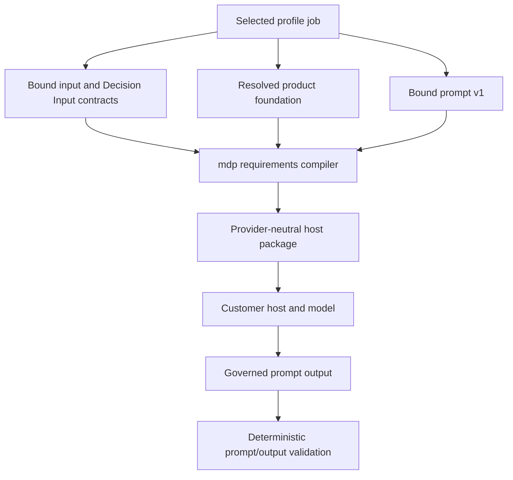
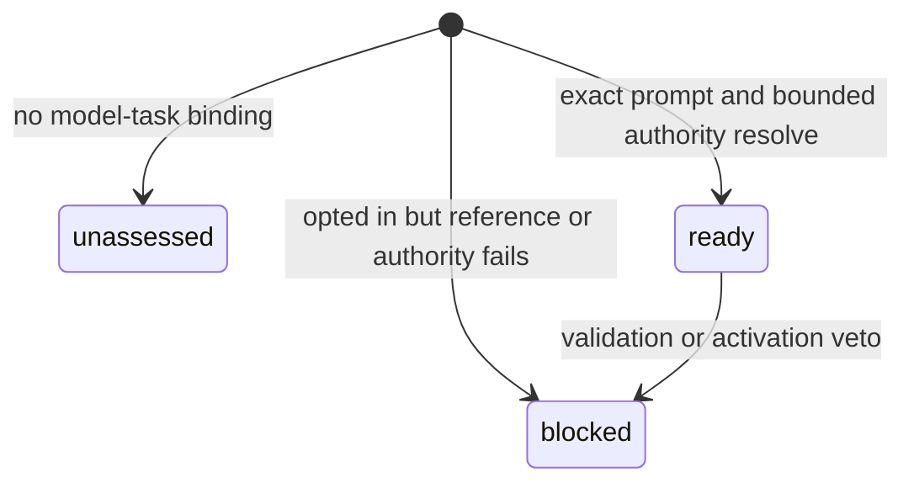
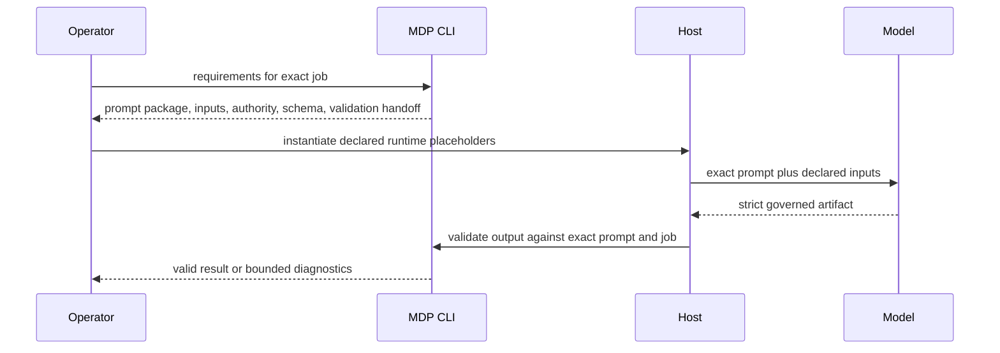

# Add Job-Owned Prompt Contracts

## Goal Capsule

| Field | Decision |
|---|---|
| Objective | Make every model-assisted declared job resolve an explicit, versioned pack-owned prompt, bounded inputs, pack-owned value authority, and strict output contract. |
| Authority | The pack owns prompt instructions and output requirements. The CLI validates and compiles them. The external host owns model invocation, credentials, and declared runtime values. |
| Compatibility | Existing prompt v0 files and jobs without model-task bindings remain valid and report prompt sufficiency as `unassessed`; they do not silently qualify as self-standing. |
| Primary surface | Extend `mdp --json requirements --job JOB_ID` so a new operator can discover and instantiate normalization and generation requests without implementation archaeology. |
| Product boundary | No model call, provider integration, fit decision, browsing, card mutation, sending, sequencing, or CRM action enters the deterministic CLI. |
| Stop condition | The feature is complete when GTM and proposal model-assisted jobs resolve exact prompt packages, invalid or undeclared authority fails closed, legacy packs remain compatible, docs/skills agree, and full validation passes. |

---

## Product Contract

### Summary

MDP already has strong pack-owned normalization prompts, prompt-output validation, compiled Decision Input requirements, job-bound product foundations, and host-conformance vocabulary. MDP-197 closes the remaining generation seam: model-assisted jobs must bind one exact prompt and output contract, while the CLI compiles the prompt, bounded authority, declared input responsibilities, and validation handoff into one inspectable host package.

The approved product decision is that every self-standing generation job declares one explicit versioned pack-owned prompt and structured output contract. Legacy jobs remain compatible but unassessed until they opt in.

### Problem Frame

Today an input contract can bind a normalization prompt, but a profile job has no equivalent generation/review prompt binding. Skills and operators can therefore infer how to write or review output even when the released pack cannot name the exact prompt, version, input boundary, value authority, or structured response contract. That prevents deterministic prompt-integrity and discoverability claims under MDP-195.

The existing normalization prompts also describe pack context as a broad host-supplied input. MDP-197 must compile the exact pack-owned values and routed references required by the selected job so hosts do not hand-copy enums or dump the whole pack.

### Requirements

**Job and prompt authority**

- R1. A model-assisted profile job must bind one exact pack-owned generation or review prompt by path; the resolved prompt ID, version, kind, path, and portable integrity reference are deterministic.
- R2. The binding is additive. A legacy job without it remains structurally valid and reports prompt sufficiency as `unassessed`, never `ready` or silently migrated.
- R3. A bound prompt that is missing, unreadable, wrong-kind, wrong-version, duplicate, or outside the pack fails the selected job closed with a stable diagnostic.
- R4. Prompt v1 contracts declare role, objective, ordered procedure, inputs, field/value selection rules, ambiguity and missing-data behavior, date/provenance rules, evidence/claim rules, negative examples, strict output schema, and a final checklist.
- R5. Existing prompt v0 files remain valid. New model-task bindings require prompt v1 so the stronger promise is opt-in and testable.

**Compiled host package**

- R6. `mdp --json requirements --job JOB_ID` exposes normalization and model-task prompt resolution without model or network calls.
- R7. Each compiled prompt includes its owning job/profile, exact path/ID/version/kind/hash, declared inputs, plain-language meanings, authoritative producer, required/default/missing behavior, resolved output schema, and validation command.
- R8. The compiled package derives personas, segments, value contracts, attribute definitions, schemas, product-foundation references, and bounded routed authority from structured pack data rather than copied prompt prose.
- R9. A copyable provider-neutral host envelope shows where prompt instructions and at least the declared runtime inputs go while keeping runtime values as placeholders owned by the host.
- R10. Date, observation time, confidence, freshness, source hashes, and evidence are attributed to their true pack, source, host, or runtime producer; the model is never told to invent them.
- R11. Generation receives only declared runtime inputs plus the selected job's bounded product foundation, route/brief authority, requirements, and guardrails. Whole-pack fallback is prohibited.

**Structured outputs and validation**

- R12. Model-task outputs use the existing prompt-output envelope with a governed-artifact output kind and a prompt-owned exact inline JSON Schema carrying artifact kind/fields, selected angle and CTA when applicable, claim IDs, evidence references, gaps, rejected claims, and prompt/job identity.
- R13. The existing prompt-output validation surface validates model-task structure against the exact bound prompt, inline output schema, prompt/job identity, no-draft state, and selected-job reference inventory. Existing `verify-output` remains the authority for checking generated text against claim/proof rules; compiled requirements expose that downstream handoff instead of creating a second text validator.
- R14. Unsupported claims, unrelated pack IDs, invalid enums, missing required fields, ambiguity, and prompt-injection-like source instructions fail closed or remain explicit gaps; source content cannot alter the prompt contract or enable tools.
- R15. Prompts cannot decide final fit/readiness, grant draft eligibility, mutate cards, browse, invoke tools, invent sources/dates, or authorize external actions.

**Profiles, operator parity, and proof**

- R16. GTM and proposal starter jobs that invoke a model bind production-quality synthetic-safe prompt v1 contracts; deterministic-only work is not mislabeled as model execution.
- R17. CLI docs, conceptual flow, host-conformance guidance, pack-builder/review/operator skills, generated README prompt inventory, templates, mirrors, and fixtures describe the same contract.
- R18. Fixtures cover valid, missing, invalid-enum, ambiguous, unsupported-claim, unrelated-authority, injection-like, legacy-unassessed, and prompt-hash/version mismatch behavior.
- R19. The MDP-186 host responsibility and assurance vocabulary is reused; MDP-197 does not create a second host or runner contract.

### Acceptance Examples

- AE1. **Ready generation job**
  - **Given:** A GTM job binds a valid prompt v1 and its selected foundation, route authority, declared inputs, and output schema resolve.
  - **When:** An operator requests compiled requirements for that job.
  - **Then:** Prompt sufficiency is `ready`, the exact model-task host package is visible, and no unrelated pack entry is included.
- AE2. **Legacy compatibility**
  - **Given:** A valid `mdp.v0` pack has no model-task binding.
  - **When:** Requirements are inspected.
  - **Then:** Existing behavior remains valid and prompt sufficiency is `unassessed` rather than failed or passed.
- AE3. **Broken binding**
  - **Given:** A job opts in but references a missing prompt or a prompt whose kind/version does not match.
  - **When:** Validation and requirements run.
  - **Then:** The selected job is blocked with an exact path and stable diagnostic.
- AE4. **Bounded authority**
  - **Given:** Two jobs in one pack bind different prompts and product-foundation subsets.
  - **When:** Each host package is compiled.
  - **Then:** Each package contains only its own selected prompt and authority; unrelated entries never leak.
- AE5. **Governed output**
  - **Given:** A model output names an allowed angle, CTA, claims, and evidence references from the selected job.
  - **When:** Prompt-output validation runs.
  - **Then:** The output validates and retains resolvable authority IDs.
- AE6. **Injection and unsupported claim**
  - **Given:** A runtime source says to ignore the pack, browse for proof, or use an undeclared claim.
  - **When:** The prompt package is instantiated and its response validated.
  - **Then:** The instruction cannot change the contract; the response is rejected or records a gap/rejected claim.

### Scope Boundaries

#### Deferred to Follow-Up Work

- MDP-200 will prove minimal-context routing and governed generation behavior across a controlled model execution.
- MDP-201 will run the full cold-model conformance suite and Harvey reference proof.
- Additional profile-specific artifact schemas may be added after the shared governed-artifact contract proves insufficient.

#### Outside this product's identity

- Model/provider execution inside deterministic `mdp fit`, `brief`, `requirements`, validation, or routing commands.
- Browsing, scraping, enrichment, CRM mutation, sequencing, sending, scheduling, or generic orchestration.
- A second decision engine hidden in prompt prose.
- Credentials, private customer data, or unsanitized model fixtures in the released pack.

---

## Planning Contract

### Key Technical Decisions

- KTD1. **Add a job-owned model-task binding.** Extend `ProfileJob` with one optional generation/review prompt reference and resolve it through the existing pack prompt index. Absence is `unassessed`; an opted-in invalid binding blocks only the selected job.
- KTD2. **Use prompt format v1 for the stronger contract.** Preserve prompt v0 parsing and validation, while requiring the complete production sections and input producers for newly bound model tasks.
- KTD3. **Compile through `requirements`.** Reuse the job, Decision Input, product-foundation, schema, hashing, and validation paths already consumed by `mdp.requirements.v1`; do not add a parallel discovery command.
- KTD4. **Reuse the prompt-output envelope and require exact inline model-task schemas.** Add a governed-artifact output kind to the existing prompt-output validation surface, require each bound model-task prompt to carry its exact inline JSON Schema, and leave generated-text claim/proof authority in `verify-output`.
- KTD5. **Derive authority, never copy it.** Value domains and selected pack references are read-only projections from manifest/cards/resolvers. Prompt text cannot redefine them, and README remains orientation only.
- KTD6. **Preserve the host boundary.** Compile a provider-neutral request template using MDP-186 terminology; the host supplies runtime values and performs the model call.
- KTD7. **Require explicit versioned job-owned prompts for self-standing generation.** (session-settled: user-approved — chosen over leaving writing behavior implicit in skills or downstream conventions: Brandon approved explicit pack ownership after reviewing compatibility and host-boundary tradeoffs.) Governs R1-R5, R12-R16.

### High-Level Technical Design

### System-Wide Impact

- Manifest/model/schema validation gains an additive job-to-prompt binding and prompt v1 fields.
- Requirements output gains exact prompt packages and a job-scoped prompt-sufficiency status.
- Prompt-output schemas and validation gain a governed-artifact output kind.
- GTM/proposal starters, Rust-generated assets, checked-in mirrors, README inventories, skills, docs, and eval fixtures must move together.
- Existing v0 prompts and packs remain readable and do not gain false readiness.

---

## Implementation Units

### U1. Model and validate prompt v1 and job binding

- **Goal:** Add the backward-compatible authored contract and fail-closed selected-job reference validation.
- **Requirements:** R1-R5, R10, R15; KTD1-KTD2, KTD7
- **Dependencies:** None
- **Files:** `cli/src/models.rs`, `cli/src/commands/schemas.rs`, `cli/src/commands/health.rs`, focused tests in those modules
- **Approach:** Add optional model-task binding data to `ProfileJob`, add prompt kind and production sections to `PromptFile`, keep v0 defaults readable, and require complete v1 fields only for opted-in jobs. Reuse pack-safe path resolution and job-aware validation relevance.
- **Execution note:** Start with failing schema/health tests for legacy-unassessed, valid opt-in, missing reference, wrong kind/version, duplicate binding, and unrelated-job isolation.
- **Patterns to follow:** Product-foundation job binding and selected-job validation in `cli/src/models.rs`, `cli/src/product_foundation.rs`, and `cli/src/commands/health.rs`; prompt shape allowlists in `cli/src/commands/schemas.rs`.
- **Test scenarios:**
  - A legacy manifest and prompt v0 validate without new fields.
  - A job bound to a complete prompt v1 validates.
  - Missing, escaping, duplicate, wrong-kind, and blank-version references produce stable exact-path errors.
  - An invalid binding on job B does not block job A, while global prompt corruption still blocks.
  - A v1 prompt missing any production section or input producer fails closed.
- **Verification:** Focused model/schema/health tests demonstrate additive compatibility and exact job scoping.

### U2. Compile exact normalization and model-task host packages

- **Goal:** Make `requirements` the complete operator discovery and host-instantiation surface.
- **Requirements:** R6-R11, R19; KTD3, KTD5-KTD6
- **Dependencies:** U1
- **Files:** `cli/src/commands/requirements.rs`, `cli/src/commands/schemas.rs`, `cli/src/artifact_hash.rs`, focused tests in requirements/schema modules
- **Approach:** Resolve normalization prompts through existing input/DIC bindings and model-task prompts through the new job binding. Compile prompt packages before the current no-Decision-Input early return so prompt discovery remains available for jobs without DICs. Emit stable metadata/hash, input producer/missing policy, derived value authority, selected foundation/load order, output schema, provider-neutral placeholders, and next validation/extraction commands.
- **Execution note:** Capture the current requirements output as characterization, then add red contract tests for prompt discovery, exact-reference isolation, and malformed-binding diagnostics.
- **Patterns to follow:** Decision Input compilation in `cli/src/commands/requirements.rs`, product-foundation resolver projections, and MDP-186 request/receipt vocabulary.
- **Test scenarios:**
  - A ready GTM job exposes exact normalization and generation packages with four or more declared inputs and no runtime values invented.
  - Two jobs compile different prompts and authority subsets without leakage.
  - Value contracts and attribute definitions change the compiled package without editing prompt prose.
  - Date, confidence, freshness, and hashes name their true producers.
  - Legacy jobs expose `unassessed`; opted-in invalid jobs expose `blocked` while readable diagnostics remain available.
- **Verification:** Requirements JSON validates against its schema and gives a new operator every discovery field named by MDP-197.

### U3. Add governed-artifact output validation

- **Goal:** Validate structured model-assisted generation/review artifacts against the exact job, prompt, and selected authority.
- **Requirements:** R12-R15; KTD4, KTD7
- **Dependencies:** U1-U2
- **Files:** `cli/src/constants.rs`, `cli/src/commands/schemas.rs`, `cli/src/commands/prompt_output.rs`, `cli/src/commands/health.rs`, focused tests in prompt-output/health modules
- **Approach:** Add a governed-artifact output kind under the existing prompt-output contract, require exact inline schemas plus job/prompt identity and structured authority fields, and validate reference IDs against the selected job's inventory. Preserve normalization and card-patch behavior, and hand generated text to existing `verify-output` for claim/proof checks.
- **Execution note:** Begin with failing validator tests for valid output, missing IDs, unrelated IDs, unsupported claims, no-draft state, and injection-like source instructions.
- **Patterns to follow:** Existing output-kind schema dispatch, prompt-ID const validation, claim/output verification, and job-aware foundation issue filtering.
- **Test scenarios:**
  - A valid message artifact with allowed angle, CTA, claims, and evidence passes structural/reference validation and exposes the `verify-output` handoff for generated text.
  - Missing required identity or artifact fields fail schema validation.
  - A claim/evidence/CTA from another job or unselected entry is rejected.
  - A blocked/no-draft job cannot validate a usable artifact.
  - Injection-like source text cannot alter declared inputs, prompt identity, tools, or output schema.
- **Verification:** Existing prompt-output fixtures remain green and governed-artifact fixtures prove authority closure.

### U4. Upgrade GTM and proposal starter prompt contracts

- **Goal:** Make shipped model-assisted starter jobs production-ready and synthetic-safe.
- **Requirements:** R4, R8, R10-R12, R14-R18
- **Dependencies:** U1-U3
- **Files:** `cli/src/starter.rs`, `cli/src/target_starter.rs`, `cli/src/commands/init.rs`, `plugin/assets/templates/basic/.mdp/**`, `plugin/assets/templates/proposal/.mdp/**`, mirrored `assets/templates/**`, focused init/template/eval fixtures
- **Approach:** Upgrade normalization prompts to v1, add job-bound generation/review prompts for GTM and proposal jobs, derive bounded authority from current job bindings, and keep targeted starters gap-honest. Update generated README prompt inventories without making README authoritative.
- **Execution note:** Use generated-starter golden tests and strict template validation as the red/green boundary; never invent target or proposal claims to make a prompt ready.
- **Patterns to follow:** Rust starter/template byte-parity, proposal public-safety guardrails, MDP-196 job-specific foundation subsets, and orientation-only README rendering.
- **Test scenarios:**
  - Fresh GTM and proposal init produce prompt v1 files and ready model-task packages for each applicable job.
  - A targeted starter remains blocked when selected authority is represented by gaps.
  - Every job excludes other jobs' prompts and unrelated product-foundation entries.
  - Generated and checked-in assets remain byte-identical.
  - All fixtures are synthetic and injection/unsupported-claim cases refuse or surface gaps.
- **Verification:** Init, strict validate/eval, README inventory, asset sync, and public-artifact lint all pass.

### U5. Align docs, skills, host guidance, and compatibility proof

- **Goal:** Make the shipped contract understandable and agent-native across CLI, plugin, and public documentation.
- **Requirements:** R6-R11, R15-R19
- **Dependencies:** U2-U4
- **Files:** `README.md`, `CONCEPTS.md`, `cli/USAGE.md`, `docs/conceptual-decision-flow.md`, `docs/prompt-extraction-contract.md`, `docs/host-conformance.md`, `docs/getting-started.md`, `plugin/skills/mdp/SKILL.md`, `plugin/skills/mdp/references/cli-operator.md`, `plugin/skills/mdp-pack-builder/SKILL.md`, `plugin/skills/mdp-pack-review/SKILL.md`, relevant skill references and eval tests
- **Approach:** Document the complete requirements to model to validate to fit/route to model to validate flow. Teach agents to inspect compiled prompt authority before README or YAML prose, instantiate only declared placeholders, and refuse missing/unsupported authority.
- **Patterns to follow:** MDP-196 structured-authority-first guidance, MDP-186 assurance vocabulary, and canonical skill packaging rules.
- **Test scenarios:**
  - Skill behavioral fixtures select the exact job requirements before generation.
  - An operator can locate prompt path/ID/version/hash, input producers, value sources, host envelope, and validation commands without reading Rust.
  - Docs preserve the external-host boundary and do not claim provider execution or outreach automation.
  - Legacy compatibility is explicitly `unassessed`, not ready or failed.
- **Verification:** Skill contract/eval/packaging checks and public docs lint agree with emitted CLI behavior.

### U6. Review and prove release compatibility

- **Goal:** Prove the cross-surface change is coherent, backward-compatible, and ready for one public PR.
- **Requirements:** R1-R19, AE1-AE6
- **Dependencies:** U1-U5
- **Files:** Existing Rust/template/skill fixtures plus any release-smoke fixture required by changed installed behavior
- **Approach:** Run focused gates throughout implementation, simplify shared resolver/compiler logic, perform data-correctness/security/API-contract review, resolve findings, and run the complete repository gate before PR creation.
- **Test scenarios:**
  - Existing v0 prompt, GTM, proposal, and legacy example paths retain documented behavior.
  - New prompt v1 and governed-artifact paths pass every acceptance example.
  - Installed-style template/skill smoke discovers and validates the same job-owned prompt package.
  - No private data, credentials, provider calls, or whole-pack context enter fixtures or output.
- **Verification:** Full `make validate` passes from a clean feature branch and the PR records exact compatibility and residual-risk evidence.

---

## Verification Contract

| Gate | Command | Done signal |
|---|---|---|
| Focused Rust behavior | `cargo test --manifest-path cli/Cargo.toml prompt` and focused module filters | New red/green scenarios pass without weakening legacy coverage. |
| Rust suite | `cargo test --manifest-path cli/Cargo.toml` | All CLI tests pass. |
| Templates | Built CLI strict validation/eval against basic and proposal assets | Every applicable job resolves its exact prompt; no unrelated context leaks. |
| Skills and assets | `make validate-skills validate-skill-contracts validate-skill-evals validate-skill-packaging validate-asset-sync` | Canonical skills and mirrored assets agree. |
| Public safety | `make validate-public-artifacts` | No private or unsafe fixture content is present. |
| Full gate | `make validate` | Complete repository validation passes. |
| Manual operator proof | Inspect compiled requirements and validate one synthetic governed artifact per profile | The full host boundary is copyable, discoverable, bounded, and accurately described. |

---

## Definition of Done

- Every shipped model-assisted GTM/proposal job resolves one exact prompt v1, version, path, hash, bounded authority package, and strict output schema.
- Legacy prompt v0 files and unbound jobs remain valid and explicitly `unassessed`.
- Invalid opted-in references, unrelated authority, unsupported claims, ambiguous inputs, and injection-like instructions fail closed with stable diagnostics.
- `requirements` exposes prompt ownership, input meanings/producers/missing behavior, derived value authority, host placeholders, and validation/extraction handoffs without implementation archaeology.
- Prompt-output validation accepts one valid governed artifact, rejects the required structural/reference failure fixtures, and sends generated text through the existing `verify-output` claim/proof boundary.
- CLI, templates, docs, skills, generated README inventories, and packaged assets agree.
- Focused tests, full Rust tests, public-safety checks, and `make validate` pass.
- The implementation is reviewed, findings are resolved or explicitly gated, and one MDP-197 PR is opened from `codex/mdp-197-prompt-contracts` without the obsolete Blocks autofix label.
