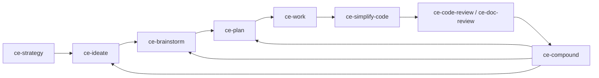

# Compound Engineering Plugin v3.20.0 Study

## Review scope

This document reviews the public `EveryInc/compound-engineering-plugin` repository at the latest release available when checked: [`compound-engineering: v3.20.0`](https://github.com/EveryInc/compound-engineering-plugin/releases/tag/compound-engineering-v3.20.0), published on **2026-07-22 at 14:13 UTC**. The tag points at commit [`5c7cb347d0686663743b87cd7227246ba24f7fa7`](https://github.com/EveryInc/compound-engineering-plugin/commit/5c7cb347d0686663743b87cd7227246ba24f7fa7).

Sources inspected:

- Release notes and compare metadata for [`compound-engineering-v3.20.0`](https://github.com/EveryInc/compound-engineering-plugin/releases/tag/compound-engineering-v3.20.0).
- The tagged source tree at [`compound-engineering-v3.20.0`](https://github.com/EveryInc/compound-engineering-plugin/tree/compound-engineering-v3.20.0).
- Top-level product docs: [`README.md`](https://github.com/EveryInc/compound-engineering-plugin/blob/compound-engineering-v3.20.0/README.md), [`CONCEPTS.md`](https://github.com/EveryInc/compound-engineering-plugin/blob/compound-engineering-v3.20.0/CONCEPTS.md), [`AGENTS.md`](https://github.com/EveryInc/compound-engineering-plugin/blob/compound-engineering-v3.20.0/AGENTS.md), and [`docs/skills/README.md`](https://github.com/EveryInc/compound-engineering-plugin/blob/compound-engineering-v3.20.0/docs/skills/README.md).
- Platform manifests and install docs for Claude, Codex, Cursor, Kimi, Grok, Devin, OpenCode, Pi, Cline, and Antigravity.
- Runtime skill sources under [`skills/`](https://github.com/EveryInc/compound-engineering-plugin/tree/compound-engineering-v3.20.0/skills), contributor-facing docs under [`docs/`](https://github.com/EveryInc/compound-engineering-plugin/tree/compound-engineering-v3.20.0/docs), release scripts under [`scripts/release/`](https://github.com/EveryInc/compound-engineering-plugin/tree/compound-engineering-v3.20.0/scripts/release), TypeScript source under [`src/`](https://github.com/EveryInc/compound-engineering-plugin/tree/compound-engineering-v3.20.0/src), and tests under [`tests/`](https://github.com/EveryInc/compound-engineering-plugin/tree/compound-engineering-v3.20.0/tests).

Limitations: this is based on the public repository and release artifacts only. It cannot verify any private Every internal workflow, production usage, telemetry, or unpublished plugin marketplace behavior.

## Executive read

The Compound Engineering plugin is best understood as a **portable agent-work operating system for software teams**, not merely a collection of prompts. Its core thesis is that agentic engineering only compounds when every cycle leaves behind a better artifact: clearer requirements, stronger plans, reusable learnings, richer review evidence, and safer automation contracts.

What makes the project advanced:

1. **Skill-first product design.** The main product surface is a catalog of 31 skills, each with a narrow job, frontmatter activation contract, runtime protocol, supporting references, and in several cases bundled scripts.
2. **Artifact-mediated workflow.** They avoid asking agents to remember everything in chat. Requirements, plans, solution docs, pulse reports, PR descriptions, session handoffs, model receipts, and run state are durable handoff surfaces.
3. **Cross-harness portability.** The repo targets many coding-agent environments from one canonical skill tree, using native manifests where available and converter/writer code where required.
4. **Protocol over vibes.** Their newer skill work is full of explicit gates, state transitions, authority boundaries, receipts, failure branches, and deterministic tests. This is much closer to workflow engineering than prompt writing.
5. **Model plurality as a feature.** v3.20.0 pushes cross-model review, judgment, planning, and implementation. But they do not trust the model request alone; they distinguish requested route, serving route, model identity, and receipt status.
6. **Autonomous workflows with crash safety.** `ce-babysit-pr` and `ce-work` show how they think about long-running agents: durable state, idempotent ticks, locks, claim-act-confirm loops, recovery paths, and host-owned integration.
7. **Learning as infrastructure.** `ce-compound` and `docs/solutions/` make every solved problem part of future context. Their methodology is not “agents do more”; it is “agents make the next agent less blind.”

## What they are building

The repository packages a **Compound Engineering** plugin for coding agents. In v3.20.0 it ships:

- **31 skills**.
- **0 standalone agents** in the plugin surface; specialist behavior is stored as skill-local prompt assets and invoked by the owning skill.
- **0 MCP servers** in the release manifest.
- Native or documented install paths for Claude Code, Cursor, Codex, Kimi, Cline, Grok Build, Devin CLI, GitHub Copilot, Factory Droid, Qwen Code, OpenCode, Pi, and Antigravity CLI.
- A TypeScript/Bun CLI for converting Claude-style plugin content into target-specific layouts where native plugin support is incomplete.
- A large docs corpus of brainstorms, plans, skill docs, solution docs, target specs, and release infrastructure.

Approximate tagged-source scale from the release tree:

| Area | Files | Lines | Role |
|---|---:|---:|---|
| `skills/` | 277 | ~57.9k | Runtime skill contracts, references, scripts, schemas, and persona prompts |
| `docs/` | 222 | ~50.9k | Skill docs, target specs, solution learnings, brainstorms, implementation plans |
| `src/` | 49 | ~11.0k | CLI, parsers, converters, target writers, release helpers |
| `tests/` | 138 | ~44.6k | Converter, writer, release, path-safety, skill-contract, and script tests |

That shape matters. The implementation is not primarily a model prompt hidden in one file. It is a **workflow product** with docs, contracts, scripts, schemas, manifests, test fixtures, and release automation around the skills.

## The core methodology

### 1. The compounding loop

Their top-level workflow is a loop:

The loop has two important beliefs:

- **Planning and review create leverage.** Execution is intentionally downstream of requirements, planning, and review artifacts.
- **The closeout is not optional.** Learnings go into `docs/solutions/`, vocabulary goes into `CONCEPTS.md`, and later skills read those artifacts as grounding.

The practical effect is that every run tries to improve the repo’s future agent context. A good feature does not just land code; it leaves a pattern, a plan, a test, a review finding class, or a convention that prevents future rediscovery.

### 2. Artifacts are APIs between agents

The project treats documents as typed workflow interfaces. A plan is not just prose; it has fields that future skills consume. A review finding is not just a comment; it has severity, confidence, owner, evidence, and actionability. A handoff is not a transcript; it is a scoped continuity artifact.

Common artifact roles:

| Artifact | Purpose |
|---|---|
| `STRATEGY.md` | Product direction that grounds ideation, brainstorming, and planning |
| Ideation artifacts | Ranked idea sets with evidence, rejection reasons, and next-step routing |
| Requirements-only unified plans | Product contract before implementation planning |
| Implementation plans | Unit IDs, requirements, acceptance examples, verification contracts, risks, and handoff paths |
| `docs/solutions/` | Reusable learnings from solved problems, often with frontmatter for retrieval |
| `CONCEPTS.md` | Shared vocabulary for the plugin’s domain model |
| Session handoffs | Continuity records for fresh sessions without copying raw transcript history |
| PR descriptions | Reviewer-facing summaries, concept teaching, provenance, and validation evidence |
| Run state / receipts | Durable records for long-running or cross-model workflows |

This gives each stage something more stable than chat context.

### 3. Skills are orchestration contracts, not loose prompts

Their mature skills share a repeated architecture:

1. **Activation contract** in frontmatter: when this skill should and should not run.
2. **Outcome spine**: what result is produced, who consumes it, and what “done” means.
3. **Mode detection**: interactive vs headless, direct vs pipeline, standalone vs return-to-caller.
4. **Scope and authority gates**: what the invocation authorizes and what remains out of bounds.
5. **Conditional reference loading**: late or large instructions live under `references/` and load only at the point they matter.
6. **Bundled scripts** for deterministic work: state machines, schema checks, Git mechanics, API fetching, or runner control.
7. **Explicit fallback behavior**: block, ask, continue in reduced mode, or report unavailable.
8. **Tests pinning contracts**: especially stable strings, parity files, schema fields, and path-safety rules.

This is why the plugin feels “ahead”: it is not betting on a single model being smart enough. It encodes a floor beneath the model.

### 4. Progressive disclosure keeps skills portable

The source tree shows a strong separation between always-loaded instructions and conditional details. The main `SKILL.md` files keep the load-bearing route inline; large schemas, personas, review templates, and route-specific mechanics move into `references/`. Scripts live beside the skills that own them.

That gives them three benefits:

- **Token discipline.** Big material is not loaded until needed.
- **Portability.** The top-level skill can describe the required capability; harness-specific or model-specific detail sits in an adapter/reference.
- **Reviewability.** A reviewer can ask whether a behavior belongs in activation, protocol, reference material, deterministic script, or test.

### 5. Protocol and judgment are separated

Their [`portable-agent-skill-authoring`](https://github.com/EveryInc/compound-engineering-plugin/blob/compound-engineering-v3.20.0/docs/solutions/skill-design/portable-agent-skill-authoring.md) guide is one of the clearest windows into the methodology. It argues for starting with the result and adding only the protocol needed to protect that result across runtimes.

In practice they separate:

- **Protocol:** fields, enums, thresholds, order of operations, authority, completion branches, evidence requirements, and state transitions.
- **Judgment:** model reasoning, synthesis, tradeoff evaluation, critique, and writing.

The notable discipline is that they do not try to write a giant “be smart” prompt. They identify where an agent can produce a wrong path and pin that with a falsifiable rule.

### 6. Cross-model work is treated as a trust boundary

v3.20.0 invests heavily in cross-model execution and review, but with a cautious architecture:

- A route is resolved before work leaves the host.
- Requested model and actual served model are distinct facts.
- Cross-model agreement only counts when model identity is attested, not merely requested.
- External workers get bounded authority and bounded input packets.
- The host remains responsible for canonical integration, verification, commits, and shipping.
- Failed or unavailable external routes degrade through explicit `prefer` / `require` behavior.

This lets them use model diversity without pretending an external model is automatically trustworthy.

### 7. Autonomy is state-machine work

The most advanced autonomous workflows are not simple loops. `ce-babysit-pr` and `ce-work` both use durable state, ownership checks, stop conditions, and recovery semantics.

For example, the PR babysitting architecture uses:

- Separate streams for review feedback, CI, and branch currency.
- Comments-before-CI ordering to avoid fixing a stale SHA.
- A deterministic `pr-snapshot` helper for fetch/state/dedup.
- A claim-act-confirm protocol so crashes do not silently drop work.
- A settle window before saying the PR looks ready.
- Sticky `needs-human` residuals for non-mechanical decisions.
- Checkpoint mode when the harness cannot sustain a background watch.

The methodology is: if the workflow mutates the world over time, model reasoning is not enough. You need an explicit operational protocol.

## v3.20.0 release themes

The v3.20.0 release is large: the compare spans **118 commits** and **300 changed files** between `compound-engineering-v3.19.0` and `compound-engineering-v3.20.0`. The release notes list 15 feature entries, a large bug-fix section, and two refactors.

### Theme 1: Cross-model everything

v3.20.0 moves cross-model orchestration from review experiments into core workflows.

| Release item | What changed | Why it matters |
|---|---|---|
| `ce-work` cross-model implementation | Implementation units can be routed to another model/harness while the host verifies and commits | This is the biggest architectural expansion: external model as bounded author, host as integrator |
| `ce-code-review` adversarial mechanics | Code review gets a multi-provider adversarial peer path | Model diversity becomes review evidence, not just a novelty |
| `ce-doc-review` judgment pass | Planning/spec review can include cross-model judgment | Requirements and plans get the same adversarial treatment as code |
| `ce-pov` model panels | Adoption/document/approach judgments can be checked by repository-grounded panels | Helps users get a decisive answer while preserving grounded reconciliation |
| Planning/brainstorm reasoning elevation | Reasoning-heavy parts can move to a chosen model or Fable route | They separate orchestration from high-effort reasoning when available |

Methodology shift: they are not merely “calling another model.” They are building route sanctioning, identity receipts, structured output schemas, failure degradation, and synthesis rules around cross-model work.

### Theme 2: Autonomous PR lifecycle management

`ce-babysit-pr` is new and then heavily hardened in the same release. The release notes include the feature plus many fixes around budgets, timestamps, review signals, base movement, dependent PR chains, watcher wakes, and branch update authority.

The underlying product bet is that opening a PR is no longer the finish line for an agent. A serious autonomous workflow must keep watching:

- Did CI fail?
- Did review feedback arrive?
- Did the base branch move?
- Is the PR actually quiet, or is a reviewer/bot still active?
- Is a conflict mechanical, or does it require a human decision?

The sophisticated part is not the polling. It is dedup, authority, idempotence, and knowing when not to act.

### Theme 3: Native platform expansion

The release adds or hardens native support across more harnesses:

| Platform | v3.20.0 direction |
|---|---|
| Devin CLI | New native `.devin-plugin/plugin.json` support |
| Cline | Native skills install support through symlinking skill directories |
| Grok Build | Native Grok plugin and marketplace metadata |
| OpenCode | Registers CE skills as `/commands` in the OpenCode plugin |
| Codex | Continued cleanup of legacy Codex tool-map behavior and native invocation rendering |
| Antigravity, Kimi, Pi, Copilot, Droid, Qwen | Existing support documented or converted through manifests/adapters |

The architectural pattern is “author once, adapt explicitly.” They do not assume every platform supports the same fields. Each platform gets a manifest, spec, converter, writer, install doc, or validation rule depending on the platform’s maturity.

### Theme 4: Pipeline memory and session continuity

Two additions matter here:

- `pipeline`: carry session-settled decisions across the pipeline.
- `ce-handoff`: create/resume session continuity artifacts.

The session-settled decision mechanism solves a subtle agentic workflow problem: an agent and user may decide something in conversation, then a later skill runs in a fresh context and re-litigates or contradicts that decision. Their fix is to record visible decision provenance in artifacts and teach downstream consumers how to treat it.

This is a powerful methodology point: **the artifact, not the transcript, becomes the continuity layer**.

### Theme 5: Review and planning hardening

Many fixes are aimed at making findings self-contained, line-provenanced, strict-schema compatible, recoverable from oversized output, and survivable under tool-call ceilings.

Examples:

- Code-review findings surface line provenance.
- Doc-review findings become decidable without close document knowledge.
- Cross-model schemas are kept strict-compatible.
- Reviewer dispatch is right-sized for trivial diffs.
- Oversized adversarial reviews and dispatch crashes recover into degraded-but-explicit paths.

This shows a mature understanding of review automation: a finding that cannot be acted on by a fresh reader is not useful, even if it sounds smart.

### Theme 6: Skill portability fixes

A large set of fixes address harness portability:

- Remove Claude-only `$ARGUMENTS` assumptions.
- Avoid load-time pre-resolution of context that can fail.
- Make shell/pre-resolution instructions portable across Unix shells and PowerShell.
- Render invocations for the active harness.
- Guard bash blocks from newline-flattening issues.
- Preserve user-managed symlinks and unmanaged paths on install.
- Scope scratch state by user.

This is unglamorous but important. Advanced plugin development is mostly edge-case management after the first prompt works.

## Skill inventory and feature map

### Core loop

| Skill | Role | Notable methodology |
|---|---|---|
| `ce-strategy` | Create or maintain upstream product strategy | Strategy is a grounding source, not a random brainstorm input |
| `ce-ideate` | Generate and critique grounded ideas | Evidence-first ideation, six conceptual frames, adversarial filtering, rejection reasons |
| `ce-brainstorm` | Turn a vague idea into requirements | Collaborative dialogue, gap lenses, requirements-only plan, workflow-spine visibility |
| `ce-plan` | Convert requirements into implementation guardrails | Requirements IDs, implementation units, verification contracts, confidence/deepening checks |
| `ce-work` | Execute plans or concrete prompts | Engine selection, plan-as-guardrails, host-owned verification, optional cross-model authoring |
| `ce-simplify-code` | Simplify recent changes before review | Focused code quality/reuse/efficiency pass with behavior preservation |
| `ce-code-review` | Review changed code | Persona panel, severity/confidence/action routing, cross-model adversarial pass |
| `ce-doc-review` | Review requirements/plans/specs | Persona panel for coherence, feasibility, product, design, security, scope, adversarial lenses |
| `ce-compound` | Capture learnings | Turns solved work into reusable solution docs and vocabulary |

### Around the loop

| Skill | Role | Notable methodology |
|---|---|---|
| `ce-compound-refresh` | Audit stale solution docs | Keep/update/consolidate/replace/delete outcomes; validates docs against current code |
| `ce-product-pulse` | Generate product pulse reports | Outer feedback loop from usage/performance/errors into follow-up work |
| `ce-sweep` | Sweep configured feedback sources | Source cursors, leases, acknowledgments, stateful item lifecycle, plan reconciliation |
| `ce-debug` | Diagnose and fix bugs | Reproduce first, trace causal chain, post-fix polish/review tail |
| `ce-pov` | Give a decisive view | Repository-grounded verdicts, optional cross-model panels, bounded reconciliation |
| `ce-explain` | Teach the human | Durable learning artifact and optional active-recall check-in |
| `ce-handoff` | Session continuity | Immutable handoff/resume/orientation artifact rather than raw transcript dependency |

### Shipping, QA, and collaboration

| Skill | Role | Notable methodology |
|---|---|---|
| `lfg` | Hands-off autonomous pipeline | Plan, implement, simplify, review/fix, browser-test, commit, PR, babysit CI/review |
| `ce-commit` | Commit changes | Value-communicating message and safe file handling |
| `ce-commit-push-pr` | Push and open/update PR | Adaptive PR body, repository template support, concept-teaching when warranted |
| `ce-babysit-pr` | Watch PR until ready/blocked | Stateful watcher, claim-act-confirm, comments-before-CI, settle window, branch-currency safety |
| `ce-resolve-pr-feedback` | Resolve review feedback | Parallel evaluation/fixing/replies; supports nits and real review threads |
| `ce-test-browser` | Browser tests | Host-native browser driver first, fallback when needed |
| `ce-test-xcode` | iOS simulator testing | Xcode build/test/screenshot/log flow |
| `ce-dogfood` | Hands-off browser QA | Diff-scoped flow mapping, small autonomous fixes, durable report |
| `ce-polish` | UX polish | Human-in-the-loop browser/dev-server iteration |
| `ce-proof` | Proof document publishing/editing | Hosted collaboration surface with owner credential lifecycle |
| `ce-promote` | Launch copy | Drafts only; voice-matching when optional tools exist |
| `ce-setup` | Health/config bootstrap | Safe, gitignored local defaults and optional capability checks |
| `ce-worktree` | Isolated worktrees | Starts or attaches isolated Git work without assuming one exists |
| `ce-optimize` | Metric-driven optimization | Iterative experiments, scored evaluation, persistence discipline |
| `ce-riffrec-feedback-analysis` | Recording/feedback analysis | Converts recordings into structured feedback or bug reports |

## Platform and distribution architecture

The repository uses two distribution strategies simultaneously:

1. **Native plugin manifests where platforms can consume the root skill tree directly.** Examples: `.codex-plugin/plugin.json`, `.kimi-plugin/plugin.json`, `.grok-plugin/plugin.json`, `.devin-plugin/plugin.json`, root `plugin.json` for Antigravity, `.claude-plugin/plugin.json`, and `.cursor-plugin/plugin.json`.
2. **Converter/writer CLI where a platform requires generated files or merge semantics.** The TypeScript CLI parses Claude-style plugin content and writes target-specific bundles for OpenCode, Codex legacy layouts, Pi, and Antigravity-style output.

Important patterns:

- **Canonical authored source:** `skills/` is the source of truth.
- **Platform-specific metadata:** each harness gets exactly the manifest shape it understands.
- **Specs for empirical targets:** `docs/specs/*.md` records verified plugin behavior for platforms such as Cline, Devin, Kimi, Kiro, OpenCode, and Antigravity.
- **Install docs by harness:** every supported environment has user-facing instructions, caveats, and update/reload guidance.
- **User-content preservation:** writers track managed artifacts and preserve symlinks, unmanaged paths, and user-authored files.

This is a strong model for plugin portability: do not hide platform differences behind one vague abstraction. Document each target, map it explicitly, test what is mechanical, and degrade what is unsupported.

## Release and validation methodology

The release system is disciplined and multi-component:

- Conventional PR titles feed release automation.
- Release Please owns version bumps and GitHub Releases.
- The root component is `compound-engineering`; marketplace catalogs are separate components.
- `release:validate` checks metadata parity across manifests and marketplace files.
- `plugin:validate` validates Claude marketplace and plugin schema under strict mode.
- CI runs PR-title lint, release metadata validation, plugin schema validation, and the test suite.
- The repo intentionally avoids hand-authoring `CHANGELOG.md` entries for current releases; GitHub Releases are the release-notes surface.

The more interesting part is how they test skill behavior mechanically when possible:

| Test target | Examples in the source tree |
|---|---|
| Converter/writer behavior | OpenCode, Codex, Pi, Antigravity, Kiro, Copilot, Droid |
| Release parity | Manifest versions, marketplace plugin lists, declared skill paths |
| Path and shell safety | Slash-command path guards, symlink traversal, shell block portability |
| Skill contract strings | Settled-decision parity, reasoning-elevation parity, review contracts |
| Stateful scripts | PR snapshot, sweep state, peer job runner, session-history extraction |
| Cross-model mechanics | Receipt parity, route tests, strict schema compatibility |

They do not pretend every LLM behavior belongs in CI. Their docs explicitly distinguish deterministic checks from targeted behavioral evals, which are evidence rather than exhaustive guarantees.

## What is especially advanced

### 1. Session-settled decisions

This is a subtle but high-leverage idea. If a user and agent already examined a tradeoff and chose a path, future pipeline stages should not reopen it by default. v3.20.0 adds a visible annotation and downstream semantics for those decisions.

Why it matters:

- It prevents fresh-context agents from undoing prior conversation decisions.
- It keeps planning honest: unexamined assertions are not magically “settled.”
- It still allows invalidating evidence to halt or flag the decision.
- It uses the plan artifact as the ledger, not a hidden sidecar.

### 2. Host-owned cross-model implementation

`ce-work` now treats cross-model implementation as a separate execution engine. The worker can author in an isolated workspace, but the host validates, integrates, and commits.

Why it matters:

- The model with the best implementation idea does not need write authority over the canonical checkout.
- Long-running external jobs can be supervised and recovered without holding the main session open.
- The system can distinguish process completion from semantic integration.
- Fallback is explicit rather than silent.

### 3. PR babysitting as an autonomous state machine

`ce-babysit-pr` is a serious attempt at the missing “after PR open” agent. It handles review, CI, and branch drift without claiming it can guarantee merge safety.

Why it matters:

- It respects that code review is asynchronous.
- It minimizes wasted CI cycles by prioritizing comments before CI fixes.
- It avoids dropping work after crashes.
- It knows when a human decision is needed.
- It reports readiness as a judgment, not as a guarantee.

### 4. Cross-model review with identity receipts

The plugin does not just say “ask another model.” It asks: which target, through which harness, which requested model, which actual model, with what receipt? That level of disclosure makes cross-model results auditable.

Why it matters:

- A requested model name is not proof of the serving model.
- Agreement is only meaningful if independence is real.
- Peer failures should degrade review quality explicitly, not disappear.

### 5. Portable skill authoring as a first-class discipline

The repository has a meta-methodology for writing skills across models and harnesses. It teaches contributors to:

- Define outcome before process.
- Add protocol only where it protects correctness.
- Keep scope local to the action it governs.
- Describe capabilities before tool names.
- Treat missing tools as degradation points, not proof the workflow is impossible.
- Test mechanical contracts deterministically and behavioral risk with targeted evals.

This is probably the most transferable lesson for any plugin project.

## How their docs are structured

The docs are not just user manuals. They form a layered product memory:

| Doc class | Example location | Function |
|---|---|---|
| User docs | `README.md`, `docs/skills/*.md` | Explain capabilities, examples, when to use/skip, workflow position |
| Runtime specs | `skills/*/SKILL.md`, `skills/*/references/*` | Authoritative agent behavior |
| Implementation plans | `docs/plans/*.md` | Product contract, KTDs, units, verification, Definition of Done |
| Brainstorms | `docs/brainstorms/*.md` | Requirements exploration and rationale before planning |
| Solution docs | `docs/solutions/**/*.md` | Durable learnings that future skills read |
| Target specs | `docs/specs/*.md` | Empirical platform behavior and conversion constraints |
| Glossary | `CONCEPTS.md` | Shared domain vocabulary |
| Repo instructions | `AGENTS.md` | Contributor and agent rules for developing the plugin |

The implementation plans are especially worth emulating. Mature plans include:

- Goal capsule.
- Product contract.
- Problem frame.
- Requirements.
- Key decisions.
- Actors and flows.
- Acceptance examples.
- Scope boundaries.
- Implementation units.
- Verification contract.
- Definition of Done.

That makes each feature PR easier to review and each later agent run easier to ground.

## Practical lessons for our plugin work

These are the practices worth borrowing without copying their product identity.

### Adopt

1. **Treat skills as contracts.** Frontmatter is routing; body is protocol; references are conditional payload; scripts are deterministic enforcement.
2. **Keep one canonical skill source.** Avoid host-specific forks unless generated or intentionally transformed.
3. **Document every material feature with a plan artifact.** Product contract, KTDs, units, and validation should be reviewable before implementation.
4. **Add skill docs beside runtime skills.** User-facing pages help clarify when to use a skill, how it chains, and what it does not do.
5. **Build a concepts glossary.** Shared vocabulary reduces drift across prompts, docs, and code.
6. **Pin mechanical invariants in tests.** Stable headings, enum values, schema fields, path guards, and packaging parity should not rely on reviewer memory.
7. **Use model/harness portability as a design constraint.** Do not write a skill that only works because one current model fills gaps silently.
8. **Represent long-running workflows as state machines.** If a workflow watches, mutates, or resumes, it needs durable state and recovery semantics.
9. **Separate deterministic scripts from model judgment.** Let scripts fetch, normalize, validate, diff, and guard; let the model synthesize and decide.
10. **Make release metadata a validation target.** Manifests, marketplace files, docs, and skill counts should not drift.

### Avoid blindly copying

1. **Do not make MDP an execution orchestrator.** MDP’s product truth is messaging decision context and routing contracts; do not expand it into runtime execution or operational systems outside that scope.
2. **Do not import their full workflow surface.** CE is a software-engineering loop; MDP should borrow artifact discipline and skill packaging patterns, not the entire plan-work-review-PR pipeline.
3. **Do not over-protocol small skills.** Their own guide argues against adding ceremony unless it protects an outcome.
4. **Do not claim cross-model quality without receipts.** If we ever use peer models, distinguish requested vs served model and degrade visibly.
5. **Do not treat docs as enough.** Their docs are paired with tests, scripts, and release validation.

## MDP-specific application map

| CE pattern | MDP-safe translation |
|---|---|
| `docs/solutions/` compounding | Keep reusable MDP pack-design learnings under repo docs or canonical skill docs, sanitized for public source |
| `CONCEPTS.md` glossary | Strengthen MDP vocabulary around packs, cards, profiles, evidence, routing contracts, and validation states |
| Skill docs catalog | Add/maintain user-facing docs for MDP skills: when to use, what artifact they produce, what they do not do |
| Runtime skill references | Keep large proposal/GTM/profile-specific rules in skill-local references, loaded conditionally |
| Release validation | Ensure CLI, templates, plugin bundle, docs, and skill instructions remain synchronized |
| Deterministic skill tests | Add tests for pack schema, instruction parity, generated host bundle fidelity, and public-artifact guardrails |
| Session-settled decisions | Consider visible provenance for user-approved messaging decisions inside packs, so later copy/review skills do not re-litigate |
| Handoff artifacts | Use pack files as the continuity layer rather than relying on transcripts |
| Cross-harness install docs | Keep install/update docs explicit per host, especially where native plugin behavior differs |
| Portable authoring guide | Create or adapt a short MDP skill-authoring guide focused on context-pack contracts and non-execution boundaries |

## Open questions to track

These are not criticisms; they are areas that would require deeper investigation before imitating the approach.

1. **How much of the cross-model machinery is used in normal daily workflows?** The public source shows contracts and scripts; real adoption patterns are not visible.
2. **Which platform surfaces are truly stable?** The repo supports many fast-moving harnesses. Some support paths may be empirically verified but still young.
3. **How much protocol is worth the maintenance cost?** CE accepts large skill files and many tests because software-agent workflow is the product. MDP should right-size this for context-pack behavior.
4. **How do users discover the right skill?** The inventory is powerful but broad. Routing docs and examples help, but skill sprawl is a real UX cost.
5. **How are behavioral evals reviewed over time?** The repo distinguishes them from CI, but the public source cannot show all operator judgment behind those evals.

## Bottom line

EveryInc’s Compound Engineering plugin is at the frontier because it treats plugin development as **agent workflow engineering**:

- Skills are product surfaces.
- Artifacts are APIs.
- Plans and reviews are leverage, not bureaucracy.
- Autonomy requires state, receipts, recovery, and conservative authority.
- Cross-model work requires identity and trust boundaries.
- Portability is designed and tested, not assumed.
- Learning is captured so future work starts with more context.

For MDP, the main lesson is not to copy their workflow. The lesson is to apply the same rigor to our own narrower domain: local-first GTM messaging context, pack contracts, validation, routing, and agent-facing instructions that do not drift.
