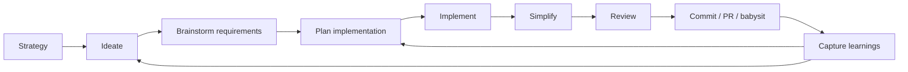

# Compound Engineering Plugin Whole-Plugin Evaluation

## What changed after clarification

The first draft over-focused on the **v3.20.0 release delta**. This version evaluates the **actual Compound Engineering plugin as a whole**: product model, runtime skills, source architecture, distribution strategy, tests, release discipline, operational safety, documentation, strengths, weaknesses, and what MDP should borrow.

The release is still the pinned source because the original request was to inspect the latest released plugin, but the analysis below treats that release as a full product snapshot rather than a changelog summary.

Companion artifact: [`2026-07-23-compound-engineering-plugin-special-moves-index.md`](./2026-07-23-compound-engineering-plugin-special-moves-index.md) breaks out the plugin's unique patterns skill-by-skill and layer-by-layer.

## Scope and sources

Evaluated public snapshot:

- Repository: [`EveryInc/compound-engineering-plugin`](https://github.com/EveryInc/compound-engineering-plugin)
- Release: [`compound-engineering: v3.20.0`](https://github.com/EveryInc/compound-engineering-plugin/releases/tag/compound-engineering-v3.20.0), published **2026-07-22 14:13 UTC**
- Tag: [`compound-engineering-v3.20.0`](https://github.com/EveryInc/compound-engineering-plugin/tree/compound-engineering-v3.20.0)
- Commit: [`5c7cb347d0686663743b87cd7227246ba24f7fa7`](https://github.com/EveryInc/compound-engineering-plugin/commit/5c7cb347d0686663743b87cd7227246ba24f7fa7)

Source areas reviewed:

| Area | Examples inspected | Evaluation purpose |
|---|---|---|
| Product docs | [`README.md`](https://github.com/EveryInc/compound-engineering-plugin/blob/compound-engineering-v3.20.0/README.md), [`docs/skills/README.md`](https://github.com/EveryInc/compound-engineering-plugin/blob/compound-engineering-v3.20.0/docs/skills/README.md) | Product promise, user workflows, skill catalog |
| Runtime skills | [`skills/`](https://github.com/EveryInc/compound-engineering-plugin/tree/compound-engineering-v3.20.0/skills) | Actual agent behavior and feature surface |
| Skill references and scripts | `skills/*/references`, `skills/*/scripts` | Progressive disclosure, deterministic enforcement, state machines |
| Plugin metadata | `.claude-plugin`, `.codex-plugin`, `.cursor-plugin`, `.kimi-plugin`, `.grok-plugin`, `.devin-plugin`, root `plugin.json` | Distribution strategy and target support |
| CLI/code | [`src/`](https://github.com/EveryInc/compound-engineering-plugin/tree/compound-engineering-v3.20.0/src), [`scripts/`](https://github.com/EveryInc/compound-engineering-plugin/tree/compound-engineering-v3.20.0/scripts) | Conversion, install, cleanup, release mechanics |
| Tests | [`tests/`](https://github.com/EveryInc/compound-engineering-plugin/tree/compound-engineering-v3.20.0/tests) | Mechanical confidence and maintainability |
| Contributor memory | [`AGENTS.md`](https://github.com/EveryInc/compound-engineering-plugin/blob/compound-engineering-v3.20.0/AGENTS.md), [`CONCEPTS.md`](https://github.com/EveryInc/compound-engineering-plugin/blob/compound-engineering-v3.20.0/CONCEPTS.md), [`docs/solutions/`](https://github.com/EveryInc/compound-engineering-plugin/tree/compound-engineering-v3.20.0/docs/solutions) | How they compound workflow knowledge |

Limitations: this is a public-source evaluation. It does not verify private Every usage, private eval runs, unpublished marketplace review status, or production telemetry.

## Bottom-line verdict

**Verdict: this is one of the most advanced public examples of an agent plugin because it treats plugin development as workflow systems engineering, not prompt packaging.**

The strongest thing they are doing is not any single skill. It is the **operating model**:

- author one canonical skill tree;
- package it across many fast-moving agent harnesses;
- make every high-value workflow produce durable artifacts;
- use deterministic scripts for state, fetch, validation, path safety, and receipts;
- preserve model judgment for synthesis, planning, critique, and decisions;
- close work by capturing reusable learnings;
- test every mechanical contract they can test;
- accept that behavioral LLM evaluation is separate from deterministic CI.

That said, the plugin is also heavy. Its power comes with real complexity: a large skill surface, long runtime contracts, many platform-specific assumptions, duplicated helper patterns, and a high maintenance burden as agent harnesses change. The right lesson is **not** “copy Compound Engineering.” The right lesson is: copy their rigor, artifact discipline, portability mindset, and mechanical guards, then apply those patterns only where MDP’s own domain needs them.

## Scorecard

| Dimension | Rating | Rationale |
|---|---:|---|
| Product coherence | A- | Clear thesis: each engineering unit should make future units easier. The workflow loop is consistent across docs, skills, and release design. |
| Skill architecture | A | Skills are treated as runtime contracts with activation, mode gates, references, scripts, and fallback paths. |
| Artifact discipline | A | Plans, requirements, solution docs, handoffs, PR bodies, receipts, and reports form the workflow API. |
| Cross-harness portability | A- | Excellent explicit target handling; still inherently exposed to platform churn. |
| Testing and release discipline | A- | Large deterministic suite and release validation; behavioral skill quality remains best-effort, as expected. |
| Autonomy safety | B+ | Strong state/receipt/authority patterns; autonomous PR and cross-model write paths are still complex/high-risk areas. |
| UX/discoverability | B | Skill catalog is powerful but broad. Users need to understand when to invoke which skill. |
| Maintainability | B | Mature conventions and docs help, but 57k+ lines under `skills/` is a large prompt-runtime maintenance surface. |
| Security/privacy posture | B+ | Good local-first/default-scratch discipline and authority language; external model routing and browser/PR automation still demand careful operator trust. |
| Relevance to MDP | A for patterns, C for direct workflow copying | Artifact/skill/release lessons are very relevant; software execution workflows should not be imported wholesale into MDP. |

## What the plugin actually is

Compound Engineering is a **software-agent workflow plugin**. Its product promise is not “a better model prompt,” but a modular engineering lifecycle:



At v3.20.0, the released plugin contains:

- **31 runtime skills**.
- **0 standalone exposed agents**; specialist personas are skill-local prompt assets.
- **0 MCP servers** in the shipped plugin surface.
- Native or documented install support for Claude Code, Cursor, Codex, Kimi, Cline, Grok Build, Devin CLI, GitHub Copilot, Factory Droid, Qwen Code, OpenCode, Pi, and Antigravity CLI.
- A TypeScript/Bun CLI for conversion, installation, cleanup, release validation, and platform-specific writers.
- Extensive internal docs: skill docs, target specs, product brainstorms, implementation plans, solution learnings, and contributor rules.

Approximate scale of the tagged source tree:

| Area | Files | Lines | What it means |
|---|---:|---:|---|
| `skills/` | 277 | ~57.9k | The main runtime product: skill instructions, references, scripts, schemas, personas |
| `docs/` | 222 | ~50.9k | User docs, implementation plans, target specs, solution learnings |
| `src/` | 49 | ~11.0k | CLI, parsers, converters, target writers, release helpers |
| `tests/` | 138 | ~44.6k | Mechanical contract tests and fixture suites |

The key architectural decision is that the **plugin’s behavior lives mostly in authored skill contracts**, not in a service. The TypeScript code supports packaging and mechanical guarantees; the product behavior is mostly the `skills/` tree.

## Product model

### Core thesis

Their thesis is explicit: **each unit of engineering work should make subsequent units easier**. That shows up in three product moves:

1. **Plan before executing.** The core workflow spends a lot of effort on ideation, brainstorming, requirements, and planning before code changes.
2. **Review before shipping.** Code and docs have review skills with specialized personas and confidence/action routing.
3. **Capture after solving.** `ce-compound` writes solution docs and vocabulary so the next run starts with institutional memory.

This is an important framing: they are not optimizing for shortest path to a diff. They are optimizing for cumulative leverage across repeated agent runs.

### User promise

A user can reach for the plugin at multiple points:

| User situation | Intended CE surface |
|---|---|
| “I don’t know what to build” | `ce-ideate` |
| “I have a rough idea” | `ce-brainstorm` |
| “I know what I want; plan it” | `ce-plan` |
| “Build from this plan” | `ce-work` |
| “Fix this bug” | `ce-debug` |
| “Review this code/doc” | `ce-code-review`, `ce-doc-review` |
| “Open a PR” | `ce-commit-push-pr` |
| “Keep the PR moving” | `ce-babysit-pr` |
| “Capture what we learned” | `ce-compound` |
| “Teach me what happened” | `ce-explain` |

The broad inventory is both strength and risk. It covers a lot of developer life, but users need good routing instincts or examples to know what to invoke.

## Runtime skill architecture

### Skill count and shape

The release ships 31 skill directories. The largest top-level `SKILL.md` files are substantial:

| Skill | `SKILL.md` lines | Implication |
|---|---:|---|
| `ce-plan` | 816 | Planning is a full protocol, not a prompt |
| `ce-compound` | 759 | Learning capture has deep workflow logic |
| `ce-compound-refresh` | 679 | Knowledge maintenance is treated as its own lifecycle |
| `ce-optimize` | 667 | Experiment loops are heavily specified |
| `ce-code-review` | 542 | Review has mode, scope, persona, and action-routing machinery |
| `ce-work` | 406 | Execution orchestration is complex but more reference/script-backed |
| `ce-ideate` | 407 | Ideation has grounding, axes, frames, and critique stages |
| `ce-brainstorm` | 340 | Requirements capture is interactive and artifact-driven |

This scale confirms the plugin is not a lightweight convenience pack. It is a complete agent operating model.

### Progressive disclosure pattern

A mature CE skill tends to split into:

```text
skills/<skill>/
  SKILL.md                  # activation + core route + load-bearing gates
  references/               # late-loaded mechanics, personas, templates, schemas
  scripts/                  # deterministic helpers owned by this skill
```

Examples:

- `ce-code-review` has references for persona catalog, findings schema, cross-model review, review output template, validators, diff scope, and dispatch.
- `ce-work` has references for execution engines, cross-model execution, implementation loops, result schemas, shipping workflow, and tracker defer behavior.
- `ce-babysit-pr` has a `pr-snapshot` script and a watch-loop reference that define state and dedup mechanics.
- `ce-plan` and `ce-brainstorm` share parity-tested references for reasoning elevation and session-settled decisions.

This is a best practice worth copying: keep always-loaded runtime instructions small enough to route correctly, and move bulky conditional contracts to references that are loaded exactly when needed.

### Manual-only skills

Seven skills are marked manual-only via `disable-model-invocation: true`:

- `ce-dogfood`
- `ce-polish`
- `ce-product-pulse`
- `ce-promote`
- `ce-setup`
- `ce-sweep`
- `ce-test-xcode`

That is a strong signal of safety awareness. They distinguish between skills an agent may route into and workflows that should not auto-trigger because they may run servers, browse, publish, sweep feedback, send promotion copy, or touch external state.

### Specialist agents are internal assets

The plugin deliberately ships **0 standalone agents**. Instead, skills own specialist prompt files under their own `references/agents` or `references/personas` directories. That matters:

- The user-facing plugin surface stays skill-oriented rather than agent-menu-oriented.
- Specialist behavior is encapsulated by the skill that knows when to use it.
- A prompt asset can be treated as implementation detail, not a stable public command.
- The orchestrating skill can decide model tier, scope, budget, and synthesis rules.

This is a strong design for multi-stage workflows. The tradeoff is that specialist prompts can become harder to discover globally, and repeated patterns need shared authoring rules/tests to prevent drift.

## Feature evaluation by skill family

### 1. Strategy, ideation, and discovery

| Skill | Evaluation |
|---|---|
| `ce-strategy` | Good upstream anchor. It prevents ideation/planning from floating without product direction. |
| `ce-ideate` | Very strong conceptually: grounding before generation, six ideation frames, basis requirements, adversarial filtering, rejection summaries, cross-domain mode. This is one of the most productized “AI ideation” skills I have seen. |
| `ce-product-pulse` | Smart outer loop: product usage/errors/feedback feed back into planning. Risk is connector/config complexity. |
| `ce-sweep` | Ambitious stateful feedback ingestion with cursors, acknowledgments, leases, media analysis, and plan reconciliation. Powerful, but operationally closer to a mini workflow engine. |

The discovery layer is differentiated because it refuses to generate ideas from a blank prompt. Evidence, axes, basis tags, and rejected candidates make the output auditable.

### 2. Requirements and planning

| Skill | Evaluation |
|---|---|
| `ce-brainstorm` | Strong requirements discipline. It separates “what should this be?” from “how do we build it?” and can surface workflow-spine tasks. |
| `ce-plan` | The flagship planning surface. It produces implementation units, verification contracts, acceptance examples, confidence/deepening passes, and routing handoffs. It is high leverage, but also one of the heaviest maintenance surfaces. |
| `ce-doc-review` | Good companion to planning. It treats documents as artifacts worth reviewing through multiple lenses, including cross-model judgment. |
| `ce-pov` | Useful decision skill: verdicts/positions grounded in project facts and external evidence, with reversibility-tiered effort. Strong anti-generic-answer stance. |

The key strength is **phase separation**. Brainstorming decides scope. Planning creates guardrails. Work implements. Review checks. This prevents one agent turn from mixing product decision, architecture, code generation, and QA into one fuzzy blob.

### 3. Execution and implementation

| Skill | Evaluation |
|---|---|
| `ce-work` | Ambitious and central. It executes plans, supports direct prompts for small work, owns quality gates, and in v3.20.0 can route bounded implementation units cross-model while the host verifies and commits. This is the highest-upside and highest-complexity runtime area. |
| `ce-debug` | Strong bug workflow: reproduce first, trace code path, causal chain, fix, then quality tail. Good alternative to forcing every bug through brainstorm/plan. |
| `ce-simplify-code` | Nice pre-review simplification pass. The best detail is behavior preservation: refactor is not considered done until behavior is verified. |
| `ce-optimize` | A serious optimization-loop skill with metrics, experiments, and persistence. Useful where objective scoring exists; overkill for fuzzy work. |

`ce-work` is the most advanced feature technically. Its cross-model implementation design has the right trust model: external worker authors bounded units in isolated workspaces; the host owns canonical integration, verification, commits, and shipping. That architecture is much safer than simply telling another CLI to modify the active checkout.

### 4. Review and quality

| Skill | Evaluation |
|---|---|
| `ce-code-review` | Very mature: diff scope, intent discovery, plan discovery, persona roster, confidence/severity/action routing, cross-model adversarial pass, strict schemas, and report-only default. |
| `ce-doc-review` | Applies review discipline to specs and plans. Good because bad docs are upstream bugs in agent workflows. |
| `ce-resolve-pr-feedback` | Separates feedback resolution from PR watching. Good composability. |
| `ce-dogfood` | Hands-off browser QA with autonomous small fixes. Useful but risky enough that manual-only marking is correct. |
| `ce-test-browser` | Practical E2E surface with host-native driver preference. Good example of capability-first adapter design. |
| `ce-test-xcode` | Specific iOS simulator workflow. Useful for teams with iOS surfaces; manual-only marking is prudent. |

The review design is one of the clearest examples of “protocol over vibes.” Findings need severity, confidence, evidence, actionability, and ownership. Cross-model review is additive and degraded explicitly when unavailable.

### 5. Shipping and PR lifecycle

| Skill | Evaluation |
|---|---|
| `ce-commit` | Small but useful: commits should communicate value and preserve sensitive-file safety. |
| `ce-commit-push-pr` | Strong PR packaging: branch state, repo templates, adaptive PR descriptions, concept-teaching sections, no vague one-size-fits-all PR body. |
| `ce-babysit-pr` | Frontier-level autonomous PR workflow. Watches review, CI, and branch currency with persistent state, dedup, settle windows, and human escalation. Complex but impressive. |
| `ce-worktree` | Good hygiene for isolated work. Small utility skill that prevents messy branch/context mistakes. |
| `lfg` | Full autonomous pipeline. Valuable for hands-off shipping, but it inherits all complexity from the chain and needs high trust in repo instructions and delegates. |

`ce-babysit-pr` is the standout here. The design shows deep practical experience with real PRs: comments can land while CI runs, CI can become stale after comment fixes, bots can signal review in progress, base branches move, and conflicts can require human judgment. The claim-act-confirm protocol is exactly the kind of deterministic state discipline autonomous agents need.

### 6. Collaboration, teaching, and memory

| Skill | Evaluation |
|---|---|
| `ce-compound` | One of the most important skills philosophically. It captures solved problems into `docs/solutions/` and vocabulary into `CONCEPTS.md`. |
| `ce-compound-refresh` | Necessary maintenance counterpart. Without refresh, solution docs become stale liabilities. |
| `ce-explain` | Good human-learning surface. It recognizes that agents can make humans learn less unless the workflow intentionally teaches back. |
| `ce-handoff` | Useful continuity primitive. It keeps handoff scoped and immutable rather than relying on raw transcript continuity. |
| `ce-proof` | Collaboration bridge to Proof. Specialized but coherent. |
| `ce-promote` | Good example of non-code workflow around shipped features; draft-only boundary is appropriate. |
| `ce-riffrec-feedback-analysis` | Niche but practical: converts recordings into structured feedback/bug reports. |
| `ce-setup` | Health/config bootstrap. Important because the plugin spans many optional capabilities. |

The memory layer is a core differentiator. Many agent workflows ship a change and leave no trace of the decision pattern. CE tries to make learning capture part of the product loop.

## Methodology evaluation

### 1. Artifact-first workflow

The plugin’s strongest methodology is that **artifacts become APIs** between skills and sessions.

| Artifact | Downstream value |
|---|---|
| Requirements-only plans | Prevent implementation planning from inventing product scope |
| Implementation plans | Give `ce-work`, review, and PR packaging a stable contract |
| Solution docs | Feed future planning and review with solved patterns |
| `CONCEPTS.md` | Stabilizes project vocabulary across skills |
| Handoff docs | Let fresh sessions resume without raw transcript dependence |
| Review reports | Separate findings, evidence, and action routing |
| PR bodies | Teach reviewers what changed and why |
| Receipts/run state | Make long-running/cross-model work inspectable and recoverable |

This is directly relevant to MDP: context packs should also be treated as APIs, not prose blobs.

### 2. Workflow phase separation

CE avoids collapsing everything into “agent, do the thing.” It has separate skills for:

- discovering opportunities;
- scoping a chosen idea;
- planning implementation;
- doing the work;
- debugging broken behavior;
- reviewing code;
- reviewing docs;
- packaging a PR;
- watching the PR;
- capturing learning.

This phase separation is why the plugin can be both broad and composable. Each skill owns a specific decision boundary.

### 3. Protocol/judgment split

The best internal design rule in the repo is the distinction between:

- **protocol**: stable fields, gates, state transitions, authority boundaries, schemas, exact stop conditions;
- **judgment**: synthesis, critique, tradeoffs, writing, and deciding among options.

They put protocol in skill text, reference files, scripts, schemas, and tests. They let the model handle judgment inside those rails.

### 4. Skeptical grounding

Several skills explicitly resist generic answers:

- `ce-ideate` requires evidence or a reasoned basis for ideas.
- `ce-pov` requires project grounding and external evidence when load-bearing.
- `ce-plan` distinguishes product contracts from implementation choices.
- Review skills ask for line provenance and self-contained findings.

This is the right posture for plugins. A plugin’s value should be the project-specific context and workflow, not generic web-search prose.

### 5. Autonomy with conservative authority

The advanced autonomous skills do not assume invocation means unlimited authority. They narrow authority by:

- current branch/PR state;
- specific unit packets;
- safe working directories;
- checkpointed plans;
- route sanctions;
- push capability proofs;
- user/human escalation for non-mechanical decisions;
- host-owned canonical commits.

This is a major lesson: autonomous agent workflows should make authority explicit and scoped, not implied.

## Codebase and CLI architecture

The TypeScript source is not the main product surface, but it is important support infrastructure.

### Source layout

| `src/` area | Role | Evaluation |
|---|---|---|
| `commands/` | CLI commands: convert, install, cleanup, list, plugin-path | Straightforward command surface around plugin conversion/install flows |
| `parsers/` | Claude plugin parser | Claude format is the canonical source format for conversion |
| `converters/` | Claude-to-target conversion | Explicit platform mapping; good separation of target semantics |
| `targets/` | Writers for target output trees | Good place for merge/preserve semantics and path safety |
| `types/` | Platform type definitions | Helps keep conversions explicit instead of stringly scattered |
| `utils/` | File/path/home/tool-detection helpers | Large shared base for installer correctness |
| `release/` | Release component and metadata helpers | Strong parity checks across manifests and marketplaces |
| `dev/` | Codex local development workflow | Practical contributor tooling for testing plugin source in Codex |

### Supported conversion/install posture

The plugin uses native surfaces when possible and keeps converters where necessary. Implemented converter targets include:

- OpenCode
- Codex legacy/standalone output paths
- Pi
- Antigravity

Other platforms are supported through native manifests, platform marketplaces, or direct plugin installs.

This hybrid strategy is the correct one for the agent ecosystem today. A single universal manifest is not realistic. The repo succeeds by treating each platform as a real target with its own schema and behavior.

### User-content preservation

A recurring theme in the code/tests/docs is preserving user-managed content:

- managed install manifests track what the tool wrote;
- unmanaged directories and user symlinks are preserved;
- cleanup registries handle stale legacy artifacts;
- path-safety guards prevent dangerous traversal or self-referential marketplace layouts.

This is exactly the right instinct for plugin installers. Tools that write into users’ global agent config directories must be conservative.

## Platform/distribution evaluation

### Strong points

- Broad platform coverage is real, not just marketing copy.
- Native plugin manifests exist for several modern harnesses.
- Install docs explain reload/update behavior per platform.
- The repo includes empirical target specs for platforms with sparse docs.
- Release validation checks manifest parity and skill path declarations.
- The root-native layout reduces generated-copy drift where platforms can read `skills/` directly.

### Risk points

- The platform matrix is large and fast-moving.
- Some platform support depends on empirically observed behavior rather than stable public specifications.
- Every new harness adds manifest/release/test/docs overhead.
- Invocation syntax differs by host (`/skill`, `$skill`, plugin namespacing), which forces runtime rendering rules.
- Native installs and legacy generated installs can shadow each other; the README needs special cleanup/update instructions.

Overall: their distribution work is excellent, but it is operationally expensive. For smaller plugins, broad platform support should be added only when there is a clear user need and a validation path.

## Testing and validation evaluation

The test suite is unusually strong for a prompt-heavy plugin. It covers many categories that most agent plugins leave to manual testing.

| Test category | Examples visible in repo |
|---|---|
| Converter/writer outputs | Codex, OpenCode, Pi, Antigravity, Kiro, Copilot, Droid |
| Release metadata | Manifest version parity, marketplace plugin lists, declared skill paths |
| Skill contract parity | Settled decisions, reasoning elevation, cross-model receipt strings |
| Stateful workflow scripts | PR snapshot, sweep state, peer job runner, session history extraction |
| Safety | Path sanitization, symlink preservation, shell block constraints, scratch root ownership |
| Review mechanics | Findings schema, cross-model recovery, stable numbering, route contracts |
| Platform command generation | OpenCode commands, Cline skill symlink install, Codex local dev |

The mature philosophy is visible in `AGENTS.md`: deterministic checks belong in CI; behavioral LLM evaluation is targeted evidence, not an exhaustive gate. That is the right split. You cannot unit-test an LLM’s taste, but you can test its schemas, paths, stable contract strings, and helper scripts.

## Security, privacy, and authority evaluation

### What they do well

- Default scratch guidance prefers OS temp with user-scoped ownership checks.
- The repo repeatedly warns against leaking secrets, auth, tokens, or private files.
- External model routing distinguishes exposed material and sanctions egress before dispatch.
- Cross-model implementation says linked worktrees are not OS security sandboxes.
- PR babysitting escalates semantic conflicts and human decisions instead of forcing resolutions.
- Manual-only flags prevent some powerful skills from being auto-invoked.
- Installers aim to preserve user-managed paths and avoid symlink traversal.

### Remaining risk areas

- Cross-model implementation necessarily exposes repository material to other tools/models when enabled.
- Browser, PR, feedback-sweep, and promotion skills can touch external systems and need careful permission posture.
- Large skill contracts can hide risky behavior if users invoke skills without understanding the authority envelope.
- Platform-specific permission semantics differ; `allowed-tools` and auto-approval may degrade across hosts.
- Long-running background/watch workflows are hard to reason about in every harness.

My read: the project is security-aware and conservative for its ambition level, but its most advanced features should be treated as power-user workflows, not casual default automation.

## Documentation evaluation

The docs are a major asset. They serve different audiences:

| Doc type | Role |
|---|---|
| README | Install, philosophy, workflow, examples, full inventory |
| `docs/skills/*.md` | End-user explanation of each skill’s purpose, mechanics, examples, and workflow position |
| `skills/*/SKILL.md` | Runtime source of truth |
| `docs/plans/*.md` | Implementation plans and product contracts for feature work |
| `docs/brainstorms/*.md` | Requirements exploration and early decisions |
| `docs/solutions/**/*.md` | Compound learnings and reusable patterns |
| `docs/specs/*.md` | Platform behavior and target integration notes |
| `CONCEPTS.md` | Shared vocabulary and domain model |
| `AGENTS.md` | Contributor/agent operating rules |

The docs do not feel like afterthoughts. They are part of the runtime methodology. The most valuable pattern is that `docs/solutions/` captures actual solved problems, not abstract “best practices” alone.

Risk: documentation volume is high. Without strong curation, solution docs and plans can become a second codebase. `ce-compound-refresh` exists because they recognize this risk.

## What is most impressive

### 1. `ce-ideate`: evidence-based ideation

Most AI ideation tools produce plausible lists. CE’s ideation skill forces grounding, axes, conceptual frames, basis tags, adversarial rejection, and rejection summaries. That is much closer to a real creative workflow.

### 2. `ce-plan`: plan as execution contract

Plans are not just “steps.” They become scope boundaries, decision records, implementation units, verification contracts, and downstream handoffs. This is one of the clearest examples of artifacts-as-APIs.

### 3. `ce-code-review`: review as structured evidence

Findings must be action-routed, confidence-aware, and self-contained. Cross-model adversarial review adds diversity without replacing local synthesis.

### 4. `ce-work`: host-owned cross-model implementation

The external worker is a bounded author; the host is the integrator. This is the right architecture for cross-model write workflows.

### 5. `ce-babysit-pr`: autonomous PR state machine

This is one of the most sophisticated public agent workflows in the repo. It acknowledges real PR lifecycle messiness: async feedback, stale CI, branch drift, reviewer signals, stack/dependency chains, and crash recovery.

### 6. `ce-compound`: knowledge as a first-class output

Many teams say “we should write down learnings.” CE makes that a skill and a loop. This is the philosophical heart of the plugin.

## Main weaknesses and risks

### 1. The plugin is big enough to become intimidating

Thirty-one skills is a lot. Even with docs, a new user may not know whether to use `ce-pov`, `ce-ideate`, `ce-brainstorm`, `ce-plan`, `ce-work`, or `lfg`. The README helps, but discoverability remains a UX challenge.

### 2. Some skills are large protocols that may be hard to audit

An 800-line planning skill or a 700-line compound skill can be justified by complexity, but it creates a review problem: contributors must understand not just text but runtime consequences across hosts.

### 3. Platform churn is a permanent tax

The repo is at the frontier partly because it supports so many harnesses. That also means it is constantly exposed to changing plugin formats, invocation semantics, permission systems, and validator behavior.

### 4. Advanced autonomy creates high operational risk

`lfg`, `ce-work` cross-model execution, `ce-dogfood`, and `ce-babysit-pr` are powerful. They are also workflows that can mutate code, push branches, touch PRs, run browsers, and delegate. The repo has thoughtful safeguards, but the blast radius is still materially larger than a read-only skill.

### 5. Behavioral quality is hard to prove

They have good mechanical tests and targeted eval philosophy, but no public repo can fully prove that every skill behaves well across every supported model/harness. Users still need trust and observation.

### 6. Maintenance load may require a very disciplined team

This project’s quality depends on conventions: skill authoring rules, release validation, solution refreshes, target specs, parity tests, and PR discipline. A less disciplined team could copy the structure and quickly produce drift.

## MDP-specific implications

MDP should not copy CE’s software-execution workflow. MDP is a local/offline standard, CLI, and plugin for modular GTM messaging context. Its product boundary is context, decision records, pack contracts, and routing — not software PR automation.

The right MDP lesson is to borrow the **operating principles**:

| CE pattern | MDP-safe translation |
|---|---|
| Canonical skill tree | Keep `plugin/skills/` as the only authored skill source and validate packaged copies |
| Artifacts as APIs | Treat MDP packs/cards/profiles as typed contracts, not loose prompt context |
| `CONCEPTS.md` | Strengthen shared vocabulary around packs, cards, evidence, profiles, routing, validation, and proposal guardrails |
| Skill-local references | Put GTM/proposal/profile-specific runtime rules in skill-owned references, loaded conditionally |
| Deterministic helpers | Use CLI/scripts for pack validation, schema checks, normalization, and public-artifact guards |
| Release validation | Keep CLI, templates, docs, runtime assets, plugin manifest, and skill docs in sync |
| Solution docs | Capture reusable pack-design and skill-design learnings in sanitized docs |
| Session-settled decisions | Consider visible provenance for user-approved messaging decisions so later copy/review skills do not re-litigate |
| Target specs | Document host-specific plugin behavior when packaging changes or install surfaces diverge |
| Manual-only powerful skills | Mark risky or human-owned workflows as manual-only rather than relying on descriptions |

## What I would emulate first

1. **A canonical skill authoring guide for MDP.** Shorter than CE’s, but with the same ideas: outcome spine, artifact contract, protocol vs judgment, capability before tools, public-artifact safety.
2. **A docs/skills catalog.** Every MDP skill should have a human-facing page: what it does, when to use it, what it produces, and what it refuses to do.
3. **A concepts glossary.** MDP needs a stable vocabulary for pack structure, profiles, evidence cards, routing, proposal privacy states, and validation outcomes.
4. **Contract tests for skill/package drift.** Pin stable headings, schema fields, examples, generated bundle fidelity, and public-safe proposal guardrails.
5. **A lightweight solution-doc loop.** Capture solved MDP-specific problems after changes, then refresh or prune stale guidance.
6. **Explicit host distribution notes.** Where Codex, Claude, or other hosts differ, document exact install/update behavior and validation commands.

## What I would not emulate directly

1. **Do not build an MDP `lfg`.** MDP should not become a generic autonomous executor.
2. **Do not copy PR babysitting.** It is excellent for CE’s software workflow, not MDP’s identity.
3. **Do not import cross-model implementation.** MDP does not need external model write delegation as a product surface.
4. **Do not add 30 skills because CE has 31.** Add skills only when there is a distinct artifact contract and user job.
5. **Do not over-protocol simple pack actions.** Use CE’s rigor selectively. A small validation or copy skill should not become an 800-line state machine.

## Strategic read

Compound Engineering’s real moat is not its prompts. It is the combination of:

- **workflow decomposition**;
- **artifact contracts**;
- **cross-platform packaging**;
- **deterministic guards**;
- **stateful automation where needed**;
- **conservative authority boundaries**;
- **learning capture**;
- **release/test discipline**.

That is why they are at the forefront of plugin development. They are building a repeatable operating layer around agentic software work.

For MDP, the takeaway is to build an equally rigorous operating layer around **messaging context and decision packs**: clear artifact contracts, stable skills, validation, sanitized docs, and no drift between CLI, templates, docs, and agent-facing instructions.

## Appendix: full released skill inventory

| Skill | Role in the plugin |
|---|---|
| `ce-strategy` | Create or maintain upstream product strategy |
| `ce-ideate` | Generate and critically rank grounded ideas |
| `ce-brainstorm` | Explore vague ideas into requirements-only unified plans |
| `ce-plan` | Build implementation-ready or knowledge-work plans |
| `ce-work` | Execute plans or concrete work prompts with quality/shipping tail |
| `ce-debug` | Reproduce, diagnose, and fix bugs |
| `ce-simplify-code` | Simplify recent code while preserving behavior |
| `ce-code-review` | Structured code review with personas and cross-model adversarial option |
| `ce-doc-review` | Requirements/plan/spec review with specialist lenses |
| `ce-compound` | Capture solved problems and vocabulary into durable docs |
| `ce-compound-refresh` | Refresh stale or overlapping solution docs |
| `ce-pov` | Project-grounded verdicts, document takes, and approach positions |
| `ce-explain` | Durable teaching artifact and optional active-recall check-in |
| `ce-optimize` | Metric-driven iterative optimization loops |
| `ce-product-pulse` | Product pulse reports from configured signals |
| `ce-sweep` | Feedback-source sweep and plan reconciliation |
| `ce-riffrec-feedback-analysis` | Convert recordings/captures into structured feedback |
| `ce-commit` | Create clear, value-communicating commits |
| `ce-commit-push-pr` | Commit, push, and open/update PRs |
| `ce-babysit-pr` | Watch PR review/CI/branch state until ready or blocked |
| `ce-resolve-pr-feedback` | Resolve PR review comments/threads |
| `ce-worktree` | Create or attach isolated git worktrees |
| `ce-test-browser` | Browser testing for affected pages |
| `ce-test-xcode` | Build/test iOS apps on simulator |
| `ce-dogfood` | Hands-off browser QA of active branch |
| `ce-polish` | Human-in-the-loop UX polish via dev server/browser |
| `ce-proof` | Publish/read/comment/edit markdown in Proof |
| `ce-promote` | Draft user-facing announcement copy |
| `ce-setup` | Diagnose health and safe project-local config |
| `ce-handoff` | Create/resume session continuity artifacts |
| `lfg` | Full autonomous engineering pipeline to PR and PR babysitting |
