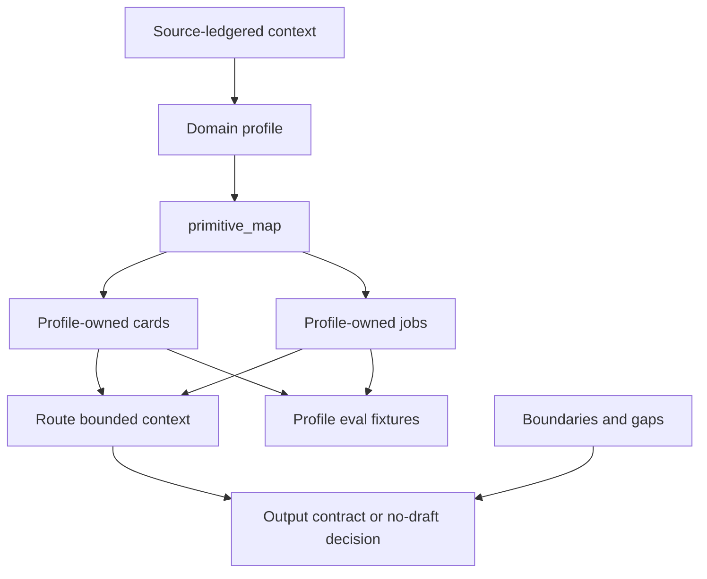

# MDP Domain Profile Foundation - Plan

## Goal Capsule

| Field | Decision |
|---|---|
| Objective | Harden the shared planning foundation for MDP-37 and MDP-38 before implementation work starts. |
| Product authority | The Linear document `Domain Profile Foundation: Product Architecture and Brainstorm` is the source of truth. |
| Current repo baseline | `plugin/assets/templates/basic/.mdp/manifest.yaml` is a GTM-shaped `mdp.v0` pack with fixed `cards.kind` values, prompt contracts for supplied account/company context, and no profile metadata. |
| Account-context input | The 2026-07-01 account-context coordination decision is planning input only: account/company context is a concrete GTM card or source candidate for MDP-39, not implementation scope for this artifact. |
| Planning posture | Start conservative: optional profile metadata, existing packs valid, `primitive_map` as the profile abstraction, and profile validation warning-first. |
| Stop condition | Do not implement CLI, template, or skill behavior from this artifact without a follow-up issue or PR scope. |

---

## Product Contract

### Summary

MDP should keep a small universal decision primitive taxonomy while letting each domain profile express those primitives in its own vocabulary, cards, jobs, prompts, evals, and examples.
The first planning slice should pair MDP-37 and MDP-38 because the taxonomy and manifest contract define each other.
Proposal is the first reference profile, not the core product identity.
The GTM account-context discussion adds one concrete MDP-39 stress test: canonical GTM ICP is account/company context plus persona/actor context plus relationship context, normalized by prompt contracts and gated by fit/readiness rules.

### Problem Frame

The current starter pack is useful for GTM messaging, but its card nouns should not become the universal ontology.
Future domains such as proposal, hiring, support, partnerships, legal intake, and customer success need different nouns and job gates while preserving the same MDP boundary: local decision context in, bounded agent work after.

Without a profile foundation, future profiles will either copy GTM cards 1:1 or push every vertical into the core CLI.
Both paths make MDP harder to validate and easier to misdescribe as execution infrastructure.

### Product Boundary

MDP remains a local/offline decision and context layer.
It stores source-ledgered context, decision rules, actors, evidence, boundaries, routing logic, output contracts, gaps, evals, and validation.

MDP does not gather sources, own records, submit proposals, send messages, scrape, enrich, sequence, update CRMs, host workflows, or manage approval infrastructure.
Account context is pack-owned decision context, not a company database or live account record.

### Universal Decision Primitives

Every serious profile should declare how it covers these primitives.
The primitive ID is stable core vocabulary; card names are profile vocabulary.

| Primitive ID | Core question | Required stance | Profile expression examples |
|---|---|---|---|
| `actors` | Who or what organization is involved, served, reviewed, or responsible? | Required for profile review. | GTM personas, account/company actors, proposal roles, hiring reviewers, support owners. |
| `decision-criteria` | What rules decide proceed, pause, refuse, escalate, or ask for more context? | Required for bounded agent work. | Fit rules, bid/no-bid rules, advance/reject criteria, severity rules. |
| `source-signals` | What supplied facts matter, with what provenance and confidence? | Required for source-ledgered decisions. | Buying signals, RFP facts, resume evidence, logs, screenshots. |
| `needs-requirements` | What requirement, problem, evaluation factor, or expectation must the output satisfy? | Required when the domain has external criteria or user needs. | Pains, compliance rules, role requirements, acceptance criteria. |
| `evidence-proof` | What approved proof, citations, examples, or references may support the output? | Required for claim-bearing outputs. | Approved claims, past performance, certifications, rubric notes, release notes. |
| `boundaries` | What must the agent not say, infer, promise, or do? | Required for safe use. | Avoid rules, compliance boundaries, protected-class limits, SLA limits. |
| `output-contracts` | What shape should generated work or review output take? | Required before a job can produce output. | Email rules, executive summaries, scorecard summaries, bug reports. |
| `routing-jobs` | Which named work modes select cards and outputs? | Required for activation; optional while drafting a passive profile. | Initial email, bid-no-bid, resume screen, support triage. |
| `gaps` | What missing or weak information must stay visible? | Required for review and no-draft behavior. | Missing trigger, missing proof, unclear level, missing logs. |
| `evals` | Which fixtures prove the profile behaves correctly? | Required before strict activation. | Proceed case, insufficient-context case, refusal/escalation case, unsafe-output case, job-routing case. |

### Primitive Relationship



### GTM / Basic Mapping

The current `basic` template remains valid and should be treated as the first profile expression.
The table below maps the current card vocabulary to universal primitives without requiring file renames.

| Current GTM card or fixture | Primary primitive | Notes |
|---|---|---|
| `personas` | `actors` | Current actor vocabulary is persona-shaped. Future docs may describe this concept as actors while preserving persona compatibility. |
| `fit-rules` | `decision-criteria` | Owns fit, disqualification, and no-message decisions. |
| `signals` | `source-signals` | Owns source interpretation, triggers, freshness, and confidence. |
| `pains` | `needs-requirements` | GTM-specific expression of needs and urgency. Future profiles do not need a `pains` card unless it fits their domain. |
| `claims` | `evidence-proof` | Approved claims and proof requirements. |
| `positioning` | `evidence-proof` | Also carries boundaries and category framing; use `primitive_map` to avoid forcing one card into one semantic role too early. |
| `avoid-rules` | `boundaries` | Existing guardrail card. |
| `output-rules` | `output-contracts` | Global style, formatting, and deterministic output constraints. |
| `copy-patterns` | `output-contracts` | GTM-specific output structures. |
| `ctas` | `output-contracts` | GTM ask and reply-path policy. Future profiles may omit this card. |
| `channel-policies` | `routing-jobs` | Channel and lifecycle routing policy. |
| `motions` | `routing-jobs` | GTM workflow and motion boundaries. |
| `hooks` | `output-contracts` | Optional GTM output technique; not a universal primitive. |
| `objections` | `boundaries` | Category confusion and approved response logic. |
| `gaps` | `gaps` | Durable unknowns and missing evidence. |
| `.mdp/evals/*.yaml` | `evals` | Current eval commands cover route, fit, brief, and claim behavior. |

### GTM ICP And Account Context

Canonical GTM ICP should not collapse into `fit-rules`.
It should be the combined, normalized context that tells an agent what kind of account, person, and relationship the pack is for before deterministic gates decide whether work can proceed.

| ICP component | Current or candidate home | Planning implication |
|---|---|---|
| Account/company context | Current prompt inputs, `company_domain`, `segment`, bounded attributes, `signals`, `gaps`; candidate card/source name `account-context`, `company-context`, or `accounts`. | MDP-39 should use account context as the concrete card-kind and `primitive_map` test case. |
| Persona/actor context | `personas`, `persona_mappings`, prompt-normalized `persona`, and title routing. | `actors` must cover people and organizations; GTM can keep persona compatibility vocabulary. |
| Relationship context | `trigger`, `background`, source signals, and routing context. | Relationship context explains why this person at this account matters now. |
| Prompt contracts | `plugin/assets/templates/basic/.mdp/prompts/normalize-prospect.yaml` and extraction prompts. | Prompt contracts are part of the canonical ICP system because they normalize messy source rows into structured CLI inputs. |
| Fit/readiness rules | `fit-rules`, `lead_input_requirements`, and readiness outputs. | These gates decide proceed, pause, disqualify, or ask for more context; they are not the primary source for "what type of company is this pack for?" |

Agents should answer company-profile questions in this order: account/company context first, source signals second, persona/actor routes third, prompt contracts fourth, fit/readiness rules fifth.
Sourcing strategy belongs outside MDP unless a pack explicitly includes a supplied, reviewed source strategy artifact.
MDP-50 owns the account-context card/source and ICP normalization contract after MDP-39 decides the card-kind and primitive-map approach.

### Proposal Reference Mapping

Proposal should express the same primitives in proposal-native cards.
This mapping is a reference profile, not a proposal-specific rewrite of the core.

| Primitive | Proposal cards or fixtures |
|---|---|
| `actors` | `proposal-roles` |
| `decision-criteria` | `bid-no-bid-rules` |
| `source-signals` | `opportunity-context`, `requirement-signals` |
| `needs-requirements` | `compliance-rules`, `evaluation-criteria` |
| `evidence-proof` | `proof-library`, `past-performance`, `approved-boilerplate` |
| `boundaries` | `avoid-rules`, `compliance-boundaries` |
| `output-contracts` | `review-outputs`, `executive-brief-rules` |
| `routing-jobs` | `review-gates` |
| `gaps` | `gaps` |
| `evals` | Bid/no-bid, compliance, proof-check, unsupported-claim, and job-routing fixtures. |

### Profile Contract Sketch

MDP-38 should design optional manifest metadata around this shape.
The first abstraction should be manifest-level `primitive_map`, not a card-file rewrite.

```yaml
profile:
  id: gtm
  label: GTM Messaging
  profile_version: mdp.profile.v0
  boundary: decision-pack-not-execution

required_primitives:
  - actors
  - decision-criteria
  - source-signals
  - needs-requirements
  - evidence-proof
  - boundaries
  - output-contracts
  - routing-jobs
  - gaps
  - evals

primitive_map:
  actors:
    cards:
      - personas
  decision-criteria:
    cards:
      - fit-rules
  source-signals:
    cards:
      - signals
  needs-requirements:
    cards:
      - pains
  evidence-proof:
    cards:
      - claims
      - positioning
  boundaries:
    cards:
      - avoid-rules
      - objections
  output-contracts:
    cards:
      - output-rules
      - copy-patterns
      - ctas
      - hooks
  routing-jobs:
    cards:
      - channel-policies
      - motions
  gaps:
    cards:
      - gaps
  evals:
    fixtures:
      - evals/*.yaml

input_contracts:
  - id: prospect
    schema_ref: mdp.input.prospect.v0
    prompt: prompts/normalize-prospect.yaml
    normalizes:
      - account
      - person
      - relationship

jobs:
  - id: initial-email
    label: Initial email
    required_primitives:
      - actors
      - decision-criteria
      - source-signals
      - evidence-proof
      - boundaries
      - output-contracts
      - routing-jobs
      - gaps
```

The GTM sketch intentionally does not add an `account-context`, `company-context`, or `accounts` card yet.
MDP-39 should decide whether account context becomes a first-class card kind, a profile-owned alias, a distributed `primitive_map` over existing cards, or an input-contract-backed source lane.

The proposal profile can use the same shape with `profile.id: proposal`, proposal-native card IDs, and an `input_contracts` entry for `opportunity`.
That `opportunity` entry should stay a profile contract until MDP-26 or later pilot evidence justifies a first-class core schema.

### Backward Compatibility Behavior

- Existing packs without `profile`, `required_primitives`, `primitive_map`, `jobs`, or `input_contracts` remain valid and keep current route, fit, brief, check-claims, gaps, and eval behavior.
- Packs without profile metadata should not receive new missing-profile warnings in the first implementation slice.
- Current `cards.kind` values remain valid.
- Current card filenames remain valid.
- Current GTM skill language can keep using personas and prospects as compatibility vocabulary, but new profile docs should explain that these are profile expressions of `actors` and `input_contracts`.
- `fit-rules` remains the deterministic proceed, pause, disqualify, and ask-for-more-context layer; it should not become the primary source for ordinary company-profile answers.
- Existing packs without a first-class account-context source remain valid; profile-aware agents should surface an account-context gap when asked for company profile information they cannot source from cards or prompt contracts.
- New profile-aware packs should require a new-enough CLI to avoid older validators treating profile fields as unsupported.
- If profile metadata changes the pack contract enough to require a new `format`, MDP-43 should own the `mdp.v0` to later-format migration path.

### Warning-First Validation Stance

Profile validation should start warning-first and become strict only when a caller opts into strict mode or a profile is being activated for bounded agent work.

| Condition | Non-strict stance | Strict or activation stance |
|---|---|---|
| Malformed profile field types | Error | Error |
| Unknown primitive ID | Error | Error |
| Declared required primitive has no mapped card | Warning | Error |
| Job requires a primitive that has no mapped card | Warning | Error for that job |
| Profile eval minimums are missing | Warning | Error before activation |
| Existing pack has no profile metadata | No issue in the first slice | No issue unless the user explicitly asks for profile compliance |
| GTM profile or job claims account/company context but no account source or prompt mapping exists | Warning | Error for jobs that require account context |
| Domain-specific card kind appears before MDP-39 lands | Error or unsupported warning, depending on chosen MDP-39 path | Error |

Implementation caveat: current validation represents warnings inside `data.issues`, and `data.valid` is derived from an empty issues list.
If profile warnings should be advisory in non-strict mode, MDP-40 should harden validation semantics so warnings can be surfaced without making ordinary validation fail.

### Scope Boundaries

#### In Scope

- The universal primitive taxonomy.
- GTM/basic mapping to the taxonomy.
- Proposal reference mapping as a non-GTM stress test.
- Account/company context as a concrete GTM primitive-map and card-kind test case for MDP-39.
- Prompt contracts as part of the canonical ICP system for normalized GTM inputs.
- MDP-50 as the downstream owner for account-context card/source, normalized account-plus-persona ICP input shape, extraction order, account-only no-draft behavior, and required implementation deltas.
- Optional manifest/profile contract shape.
- Backward compatibility rules for existing packs.
- Warning-first profile validation policy.
- Sequencing for MDP-39, MDP-50, MDP-40, MDP-43, MDP-41, and MDP-42.

#### Out Of Scope

- Hosted registry, SaaS app, team UI, cloud approval workflow, or managed service packaging.
- Proposal management platform behavior.
- SharePoint, CRM, RFP portal, scraper, enrichment, sequencer, sender, BI, or external system updates.
- Raw private transcripts, customer-specific proposal artifacts, tokens, cookies, browser session data, or local auth material.
- Proposal-specific `opportunity` or `pursuit` core schema before repeated pilot evidence justifies it.
- Implementing an `account-context`, `company-context`, or `accounts` card in this planning branch.
- Resolving MDP-50 before MDP-39 settles the card-kind and primitive-map approach.
- Treating account context as a CRM, enrichment record, source ownership layer, or sourcing strategy.
- Adding a Rust enum variant for every future domain card.

---

## Planning Contract

### Key Decisions

- KTD1. Profiles own vocabulary; MDP owns invariants. MDP should define primitive IDs and validation expectations, while each profile owns domain card names, job names, prompts, evals, and examples.
- KTD2. `primitive_map` is the first abstraction layer. Manifest-level mapping lets current cards remain stable while the CLI learns profile coverage rules.
- KTD3. Profile metadata is optional at first. Existing packs should not need migration before the profile model proves itself.
- KTD4. Proposal is a reference profile. Proposal should stress the model, but it should not force proposal nouns into the core.
- KTD5. Validation starts warning-first. Strict profile enforcement should be opt-in or activation-bound until templates, evals, and migration UX are stable.
- KTD6. Card-kind extensibility is a follow-up decision. MDP-39 should choose between fixed `CardKind` plus `primitive_map`, extensible custom kinds, profile-owned aliases, or a `primitive` field after this foundation is accepted.
- KTD7. GTM ICP is composite context, not a fit-rule bucket. Account/company context, persona/actor context, relationship context, and normalization prompts define the ICP shape; `fit-rules` gates readiness and qualification after that context exists.
- KTD8. MDP-50 should specify account context after MDP-39. The foundation should name the dependency and expected contract, but not choose the account card name or implement account-only behavior here.

### Repo Baseline Verified

| Surface | Current fact | Planning implication |
|---|---|---|
| `plugin/assets/templates/basic/.mdp/manifest.yaml` | Uses `format: mdp.v0`, 15 GTM-shaped card refs, `lead_input_requirements`, policy, and provenance. | Do not require current packs to add profile metadata. |
| `plugin/assets/templates/basic/.mdp/prompts/normalize-prospect.yaml` | Normalizes supplied person, company, and account rows into the prospect schema and refuses to invent contacts for account-only input. | Treat prompt contracts as part of the profile contract, not incidental prompt text. |
| `plugin/assets/templates/basic/.mdp/cards/signals.yaml` and `cards/gaps.yaml` | Include company-context signals and missing-company-proof gaps, but no dedicated account-context card. | MDP-39 should decide whether to add a card kind/source or map existing cards through `primitive_map`. |
| `cli/src/models.rs` | `Manifest.cards.kind` and `Card.kind` deserialize to fixed `CardKind`. | Domain-specific card kinds need MDP-39 planning before implementation. |
| `cli/src/commands/schemas.rs` | Manifest and card schemas enumerate the same 15 card kinds. | Schema output must be updated when optional profile fields are accepted. |
| `cli/src/commands/health.rs` | Validation warns for unknown manifest/card fields and checks fixed format, card paths, card IDs, card kinds, and empty entries. | Profile fields need explicit validation support; unsupported-field warnings are not enough. |
| `cli/src/routing.rs` | Routing includes base guardrails and prioritizes card kinds differently for message jobs. | Profile-aware jobs must define how required primitives influence routing without breaking current GTM route behavior. |
| `README.md` and `cli/USAGE.md` | Public docs describe MDP as a local decision/context layer and list the current GTM card layout. | Domain profile docs should update public language only after the contract is accepted. |

### Execution Order

1. MDP-37 and MDP-38 together: finish and accept this shared Domain Profile Foundation plan covering primitives, `primitive_map`, manifest/profile contract, and backward compatibility.
2. MDP-39: decide card extensibility before any new card is implemented, including whether account context is a new card kind, profile-owned alias, or primitive-map-backed source.
3. MDP-50: specify the account-context card/source and ICP normalization contract after MDP-39, including account/company profile source, account-plus-persona input shape, extraction order, account-only no-draft behavior, and required implementation deltas.
4. MDP-40: define profile-aware validation and eval gates using MDP-50 cases for company-profile extraction, account-only no-draft, prompt-output validation, and primitive coverage.
5. MDP-43: design migration only if the accepted card/profile approach requires pack-format migration.
6. Implementation slices: schema/manifest/primitive-map support, template account-context source/card, normalization prompt updates, route/brief context updates, fit/readiness separation, skill/docs updates, eval fixtures, and `make validate`.
7. MDP-41: update the profile-builder workflow so generated or blessed ICP prompts normalize account and persona data together.
8. MDP-42: reconcile Proposal AI Lab as the first non-GTM reference profile after the generic foundation is stable.

### Downstream Issue Split

| Issue | Should wait for | Expected output |
|---|---|---|
| MDP-39 | This artifact plus MDP-38 acceptance. | A plan choosing the card-kind extensibility path, primitive-map migration mechanics, and account-context naming or distribution path. |
| MDP-50 | MDP-39 card-kind and primitive-map decision. | A plan/spec for account/company profile source, normalized account-plus-persona ICP input shape, extraction order, account-only no-draft behavior, and required CLI/template/prompt/skill/eval changes. |
| MDP-40 | MDP-38 contract shape, MDP-39 card-kind decision, and MDP-50 for account-specific cases. | A plan for warning-first and strict profile validation, JSON findings, minimum eval fixtures, and account-context gap behavior. |
| MDP-43 | MDP-38 and MDP-39 migration implications. | A plan for deterministic pack-format migration UX and JSON output. |
| Implementation slices | MDP-39, MDP-50, MDP-40, and MDP-43 decisions as applicable. | Code and docs changes for the accepted profile/card path, with template, prompt, route/brief, fit/readiness, skill, eval, and validation coverage. |
| MDP-41 | Foundation plus accepted account/prompt contract and validation policy. | A profile-builder workflow spec that normalizes account and persona data together, reuses existing MDP skills, and requires human review. |
| MDP-42 | Stable generic foundation after GTM account-context work no longer changes the core model. | Proposal AI Lab reconciliation that references proposal as the first non-GTM profile, not core identity. |

### Open Decisions For Follow-Up Planning

- Whether profile metadata can remain under `format: mdp.v0` or requires a later pack format.
- Whether `primitive_map` alone is enough, or whether card refs or card files also need a `primitive` field.
- Whether GTM account context should be named `account-context`, `company-context`, `accounts`, or remain distributed across prompt contracts, signals, proof, boundaries, and gaps.
- Whether normalized inputs need an optional structured `account` object before account-only workflows are common enough to justify it.
- Whether MDP-50 should define account-only behavior through `mdp fit`, a future account input contract, or route/brief no-draft context without a new command.
- Whether profile templates stay under `plugin/assets/templates/<profile>` or move to a separate profile directory.
- Which CLI command owns profile validation output: `validate`, `doctor`, `schema`, `eval`, or a later explicit profile-check surface.
- Whether second reference profile should be hiring, support, partnerships, customer success, or internal approvals.

---

## Sources

- Linear project: `MDP: Domain Profile Foundation`.
- Linear source document: `Domain Profile Foundation: Product Architecture and Brainstorm`.
- Coordination input: account-context decision note proposed at `docs/orchid/decisions/2026-07-01-company-account-context.md` on branch `codex/mdp-company-account-context-decision`.
- Linear issues: MDP-36, MDP-37, MDP-38, MDP-39, MDP-40, MDP-41, MDP-42, MDP-43, MDP-50.
- Repo instructions: `AGENTS.md`.
- Repo baseline: `plugin/assets/templates/basic/.mdp/manifest.yaml`, `plugin/assets/templates/basic/.mdp/cards/*.yaml`, `plugin/assets/templates/basic/.mdp/evals/*.yaml`.
- CLI model and validation baseline: `cli/src/models.rs`, `cli/src/commands/schemas.rs`, `cli/src/commands/health.rs`, `cli/src/routing.rs`.
- Public product boundary docs: `README.md`, `docs/what-this-repo-is.md`, `cli/USAGE.md`.
