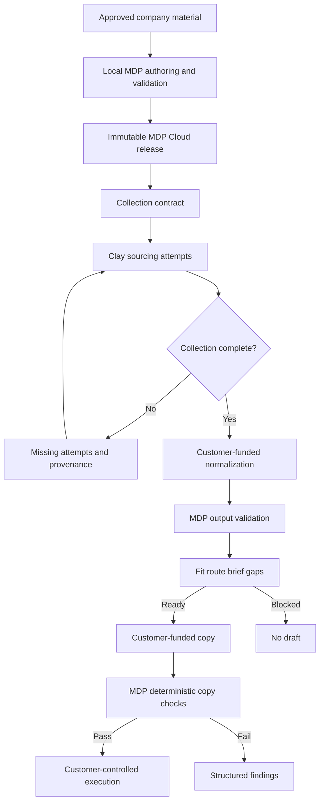

# MDP Cloud GTM Decision Runtime

## Goal Capsule

| Field | Decision |
|---|---|
| Objective | Provide a turnkey hosted MDP runtime that lets GTM teams deploy reviewed packs, require Clay to complete pack-declared sourcing attempts, and receive deterministic fit, route, brief, gap, and copy-check results. |
| Primary buyers | Series B/C software companies and GTM engineering agencies operating Clay-based workflows. |
| Product authority | MDP remains the decision-contract layer. Clay owns sourcing and enrichment, customer-funded models own normalization and drafting, and downstream GTM systems own execution. |
| Commercial model | Launch with a $12,500 paid design-partner engagement, then $18,000/year Company and $30,000/year Agency subscriptions. |
| Economic constraint | AI, enrichment, and customer model costs remain customer-owned. Recurring platform COGS targets no more than 3% of recurring cloud revenue. |
| V1 focus | Deeply Clay-native activation over a platform-neutral intake, prompt-package, and decision API contract. |
| Open blockers | None before planning. Planning must benchmark the existing Rust engine in a scale-to-zero container and assess the work required to extract a Wasm-compatible engine library. |

---

## Product Contract

### Summary

MDP Cloud is a hosted compiler and deterministic decision runtime for Message Decision Packs.
Pack maintainers author and validate packs locally with the existing CLI and agent plugin, then publish immutable releases to MDP Cloud.
Clay satisfies the release's collection contract and runs customer-funded model prompts.
MDP Cloud validates the resulting artifacts and returns bounded decisions without purchasing enrichment data or making model calls.

### Problem Frame

MDP already externalizes reviewed GTM judgment into local, versioned packs, but a customer must currently operate the CLI and compose the surrounding runtime.
That is too much infrastructure work for a team that wants to apply one approved decision system across Clay workflows.

The runtime also needs to distinguish a field nobody attempted to source from a field that remained unavailable after the declared sourcing attempts.
If those states collapse into the same blank value, a normalizer can mistake absence for completeness and produce polished but unsupported fit decisions.

The commercial opportunity is therefore not hosted AI generation.
It is a turnkey control plane that tells Clay what evidence to collect, verifies that the collection attempt is complete, compiles only the approved context for downstream models, and deterministically checks what those models return.

### Key Decisions

- K1. **Hosted deterministic runtime.** Orchid hosts MDP Cloud so customers do not deploy infrastructure, while model and enrichment execution remain in customer-controlled systems.
- K2. **Clay-native launch.** The first activation experience is optimized for Clay, but every runtime artifact uses platform-neutral contracts so later adapters do not redefine MDP semantics.
- K3. **Collection completeness precedes normalization.** A row cannot proceed to a normalization prompt until every pack-required sourcing input has a terminal attempt status.
- K4. **Collection completeness differs from decision completeness.** A row may be collection-complete while MDP still returns `insufficient-context`.
- K5. **Immutable release authority.** Intake contracts, prompt packages, model outputs, and decisions are bound to an immutable pack release and its hashes.
- K6. **No bundled AI.** Core subscriptions include no model tokens, provider credentials, or enrichment credits.
- K7. **Privacy-first processing.** Raw prospect payloads are ephemeral by default; durable records contain the source digest, normalized fields, decision result, gaps, trace, and release identity.
- K8. **Value-based subscription pricing.** Customer pricing is based on workspaces, production packs, environments, client workspaces, and generous evaluated-row capacity rather than internal API calls.
- K9. **Cloudflare-first economics.** Immutable release artifacts are cacheable, metadata is separated from artifact storage, and the existing Rust engine initially runs in a scale-to-zero container behind the API edge.

### Actors

- A1. **Pack maintainer:** Converts approved company material into an MDP, reviews decisions and evidence, runs local validation/evals, and publishes a release.
- A2. **GTM engineer:** Maps a published collection contract into Clay, monitors incomplete rows, and controls downstream activation.
- A3. **Clay:** Sources and enriches pack-declared inputs, records attempt and provenance state, runs customer-funded model prompts, and calls MDP Cloud.
- A4. **Customer model:** Normalizes collection-complete source data or drafts from an MDP decision bundle using the customer's Clay allocation or provider key.
- A5. **MDP Cloud:** Authenticates callers, serves release-bound contracts, validates artifacts, runs deterministic MDP decisions, and returns gaps and traces.
- A6. **Downstream execution system:** Receives only customer-approved rows or drafts after MDP checks; it remains outside MDP's execution boundary.
- A7. **Agency operator:** Manages isolated client workspaces and reusable agency-owned starting templates without mixing client packs or data.

### Requirements

**Pack publication and release authority**

- R1. A pack maintainer can publish a locally validated GTM pack to MDP Cloud without hosting the runtime.
- R2. MDP Cloud must validate a submitted pack and reject invalid or profile-ineligible packs rather than repairing them during deployment.
- R3. Every successful publication creates an immutable release identity bound to the compiled pack, cards, prompts, schemas, and their hashes.
- R4. A later pack release must not mutate decisions or artifacts attributed to an earlier release.

**Collection contract and Clay sourcing**

- R5. Each production release must expose a machine-readable collection contract for each eligible GTM job.
- R6. The collection contract must declare account and person identity, scope selectors, qualification gates, disqualifiers, fit signals, why-now evidence, provenance, source recency, conditional inputs, and required sourcing attempts when those concerns apply to the pack.
- R7. Every required collection input must distinguish `present`, `not_found_after_attempt`, `ambiguous`, `not_applicable`, and `not_attempted`.
- R8. MDP Cloud must return `ready_for_normalization: false` while any required sourcing attempt remains `not_attempted` or required provenance is missing.
- R9. Clay must remain the owner of sourcing and enrichment; MDP Cloud must not silently source, scrape, or enrich missing inputs.
- R10. A Clay mapping must be bound to the collection-contract version, and MDP Cloud must reject stale mappings when a later release changes blocking requirements.

**Customer-funded normalization**

- R11. A collection-complete row can retrieve a release-bound prompt package containing the prompt identity, instructions, input schema, output schema, provenance rules, and model-output requirements.
- R12. The customer can execute a prompt package in Clay or another customer-controlled model environment without giving MDP Cloud model credentials.
- R13. Submitted normalized output must identify the pack release, job, prompt version, source digest, and declared provenance.
- R14. MDP Cloud must validate normalized output before it can influence fit, routing, or brief compilation.
- R15. Normalization must preserve missing or unavailable evidence as explicit gaps and must not upgrade collection-attempt status.

**Decision runtime**

- R16. A valid normalized output must produce a deterministic decision bundle containing fit status, draft readiness, selected persona/job/scope, routed entry IDs, bounded brief context, gaps, trace, release identity, and receipt identity.
- R17. `disqualified` and `insufficient-context` decisions must not produce draft-ready context.
- R18. A collection-complete row may still return `insufficient-context` when the attempted sources did not produce enough pack-required evidence.
- R19. Downstream models must receive the bounded decision bundle rather than unrestricted access to every pack entry.

**Customer-funded drafting and deterministic review**

- R20. A pack release may expose a copy prompt package, but MDP Cloud must not execute that prompt as part of the core subscription.
- R21. Customer-generated copy can be submitted with its decision receipt for deterministic claim, boundary, channel, scope, and output-contract checks.
- R22. Copy checks must fail closed when the decision receipt is missing, references another release, or lacks required ready-for-draft status.
- R23. MDP Cloud must return structured findings that Clay can use to prevent a row from continuing to an execution system.

**Privacy, tenancy, and operations**

- R24. Raw prospect payloads must be processed without durable retention by default.
- R25. The durable evaluation record must retain only the minimum configured normalized fields, source digest, decision, gaps, trace, timestamps, and contract identities.
- R26. Client workspaces, releases, tokens, caches, decisions, and usage must remain tenant-isolated.
- R27. Agency users must be able to manage multiple isolated client workspaces without sharing client-specific packs or evaluation records.
- R28. API credentials must support workspace/release scopes, rotation, revocation, rate limits, and audit attribution.
- R29. Repeated requests with the same idempotency key must return or reference the same evaluation instead of duplicating billable work.

**Commercial packaging and economics**

- R30. The launch offer is a $12,500 90-day design-partner engagement that includes one production GTM pack, one Clay activation, MDP Cloud deployment, and bounded implementation support.
- R31. The initial Company subscription is $18,000/year and the initial Agency subscription is $30,000/year for five client workspaces, with final capacity allowances validated during design-partner usage.
- R32. AI tokens, Clay actions, enrichment data, and third-party provider charges must never be represented as included MDP Cloud usage.
- R33. The recurring platform must target COGS at or below 3% of recurring cloud revenue, excluding separately priced implementation work.
- R34. Usage packaging must count evaluated rows or completed decision workflows rather than exposing internal API-call metering to customers.

**Serving and cost controls**

- R35. Immutable collection contracts, prompt packages, schemas, and compiled releases must use content-addressed identities that permit long-lived caching without mutating cached content.
- R36. Raw payloads and per-prospect decisions must not enter a globally reusable cache.
- R37. Artifact storage, hot release lookup, relational metadata, and deterministic engine execution must remain separable so each can scale and be costed independently.
- R38. The initial runtime must preserve the existing CLI's deterministic contract rather than reimplementing fit, routing, brief, or copy-check behavior in an unverified parallel engine.
- R39. The service must enforce per-workspace spend and CPU limits so malformed or hostile requests cannot create unbounded infrastructure cost.
- R40. Every production release and runtime change must preserve installed CLI/template compatibility or explicitly version the cloud contract.

### Key Flows

- F1. Publish a production pack
  - **Trigger:** A1 has a locally validated GTM pack.
  - **Actors:** A1, A5
  - **Steps:** A1 submits the compiled pack; A5 validates the pack and eligible jobs; A5 stores content-addressed artifacts; A5 creates an immutable release and its collection contracts.
  - **Outcome:** Clay can bind to a production release without the customer deploying MDP infrastructure.
  - **Covers:** R1-R6, R35, R40

- F2. Complete Clay collection
  - **Trigger:** A2 activates a Clay workflow for a production release.
  - **Actors:** A2, A3, A5
  - **Steps:** A3 reads the release contract; A2 maps required inputs; A3 attempts declared sourcing steps and records statuses/provenance; A5 runs collection preflight; incomplete rows return exact missing attempts.
  - **Outcome:** No normalization model runs until collection is attempt-complete.
  - **Covers:** R5-R10

- F3. Normalize and decide
  - **Trigger:** A row passes collection preflight.
  - **Actors:** A3, A4, A5
  - **Steps:** A3 retrieves the prompt package; A4 runs with customer-funded compute; A3 submits normalized output and source binding; A5 validates the output and runs fit, route, brief, and gaps.
  - **Outcome:** A5 returns a release-bound decision bundle or a fail-closed error.
  - **Covers:** R11-R19, R24-R25

- F4. Draft and check copy
  - **Trigger:** A decision bundle returns `ready_for_draft: true`.
  - **Actors:** A3, A4, A5, A6
  - **Steps:** A4 drafts from the bounded bundle; A3 submits the draft and receipt; A5 runs deterministic checks; A3 permits downstream activation only when the configured checks pass.
  - **Outcome:** MDP governs allowed context and supplied output without generating or sending the message.
  - **Covers:** R19-R23

- F5. Update a pack safely
  - **Trigger:** A1 publishes changed requirements or messaging decisions.
  - **Actors:** A1, A2, A3, A5
  - **Steps:** A5 creates a new immutable release; A5 compares collection contracts; stale Clay mappings are marked incompatible; A2 updates the mapping before new-release evaluations proceed; prior receipts retain their original release.
  - **Outcome:** Pack evolution cannot silently change collection requirements or historical decisions.
  - **Covers:** R3-R4, R10, R35, R40

### Acceptance Examples

- AE1. Unattempted required source
  - **Covers:** R7-R9
  - **Given:** A collection contract requires public-person resolution from a public profile and company team page.
  - **When:** Clay supplies a profile result but leaves the company-page attempt as `not_attempted`.
  - **Then:** Preflight returns `ready_for_normalization: false` and names the missing attempt without invoking a model.

- AE2. Attempt-complete but insufficient evidence
  - **Covers:** R15, R18
  - **Given:** Clay attempted every required source and recorded `not_found_after_attempt` for the required why-now signal.
  - **When:** The normalized row is evaluated.
  - **Then:** MDP preserves the gap and returns `insufficient-context` rather than treating collection completeness as fit.

- AE3. Customer-funded successful decision
  - **Covers:** R11-R19
  - **Given:** Clay completed the collection contract and ran the release-bound normalization package using the customer's model allocation.
  - **When:** The valid normalized output and source binding are submitted.
  - **Then:** MDP Cloud returns a deterministic decision bundle without making a provider model call.

- AE4. Stale Clay mapping
  - **Covers:** R10, R40
  - **Given:** A new release adds a blocking qualification input.
  - **When:** A Clay workflow bound to the prior collection-contract version submits a new-release evaluation.
  - **Then:** MDP Cloud rejects it as stale and identifies the new unmapped requirement.

- AE5. Cross-release copy submission
  - **Covers:** R21-R23
  - **Given:** Copy was drafted from a decision receipt for release A.
  - **When:** The caller submits it for checks against release B.
  - **Then:** MDP Cloud rejects the mismatch and does not return a passing copy decision.

- AE6. Raw-payload privacy
  - **Covers:** R24-R25
  - **Given:** A workspace uses default retention.
  - **When:** An evaluation finishes.
  - **Then:** Durable storage contains the source digest and bounded decision record but not the original raw payload.

- AE7. Agency tenant isolation
  - **Covers:** R26-R28
  - **Given:** An agency operator has access to two client workspaces.
  - **When:** A token scoped to client A requests client B's release or decision.
  - **Then:** MDP Cloud denies the request without exposing whether the target artifact exists.

- AE8. Repeated Clay delivery
  - **Covers:** R29
  - **Given:** Clay retries an evaluation after a network timeout with the same idempotency key.
  - **When:** MDP Cloud already completed the first request.
  - **Then:** The retry returns the original evaluation reference and does not duplicate usage.

### Success Criteria

- A new design partner can move from an approved local pack to a working Clay preflight and decision workflow without deploying MDP infrastructure.
- No MDP Cloud production path needs an Orchid-funded model or enrichment call.
- Every evaluated row can be traced to one pack release, collection contract, prompt version, source digest, and decision receipt.
- No row with unattempted blocking inputs reaches normalization.
- Collection-complete rows with inadequate evidence reliably remain `insufficient-context`.
- The initial Company account can remain within a $45/month recurring COGS budget at contracted capacity.
- The initial Agency account can remain within a $75/month recurring COGS budget at contracted capacity.
- Cacheable release artifacts are served by immutable identity, while prospect-specific payloads and decisions bypass shared caching.
- Existing GTM pack validation, eval, route, fit, brief, and copy-check behavior remains the runtime source of truth.

### Scope Boundaries

#### Deferred for later

- Outreach, Marketo, Salesforce, HubSpot, and other Nango-backed connectors.
- Customer-configurable encrypted raw-payload retention.
- Self-serve pack-building web UI.
- Private-cloud or customer-hosted enterprise deployment.
- A Wasm-native MDP engine after the scale-to-zero container is benchmarked.
- Additional MDP profiles beyond GTM and proposal.
- Usage-priced AI credits.

#### Outside this product's identity

- Sourcing or enrichment supplied by MDP itself.
- An AI SDR, autonomous copywriter, sequencer, CRM, scraper, or BI product.
- Orchid-funded model calls included in the core subscription.
- Automatic approval of pack sources, claims, campaign copy, or downstream execution.
- Claims that a structurally valid normalization proves the semantic truth of external evidence.

### Dependencies and Assumptions

- Clay remains capable of HTTP API actions, customer-funded AI execution, structured outputs, conditional workflow logic, and secure workspace-level credentials.
- Current MDP GTM contracts can express the necessary qualification gates, source-backed signals, scope, gaps, prompt validation, fit, route, brief, and copy checks.
- The existing Rust runtime can execute within an on-demand Linux container before a pure engine library exists.
- Published packs and prompt packages are small enough for content-addressed object storage and hot compiled caching.
- Design-partner customers accept MDP as a subprocesser for normalized GTM decision data under privacy-first default retention.
- The 3% recurring COGS target is an operating constraint to validate with benchmarks and customer-support accounting, not a claim that current production margins have been measured.

### Outstanding Questions

#### Deferred to planning

- Whether Cloudflare Containers or Google Cloud Run provides the best initial reliability/cost tradeoff for the unchanged Rust binary.
- Which MDP modules must be extracted into a filesystem-independent engine crate before a Rust/Wasm Worker is viable.
- The exact evaluated-row allowances and overage policy after design-partner traffic is measured.
- The minimum control-plane authentication, billing, and observability providers needed for the first paid pilot.
- Whether the first Clay activation is distributed as a public template, a guided workbook build, or both.
