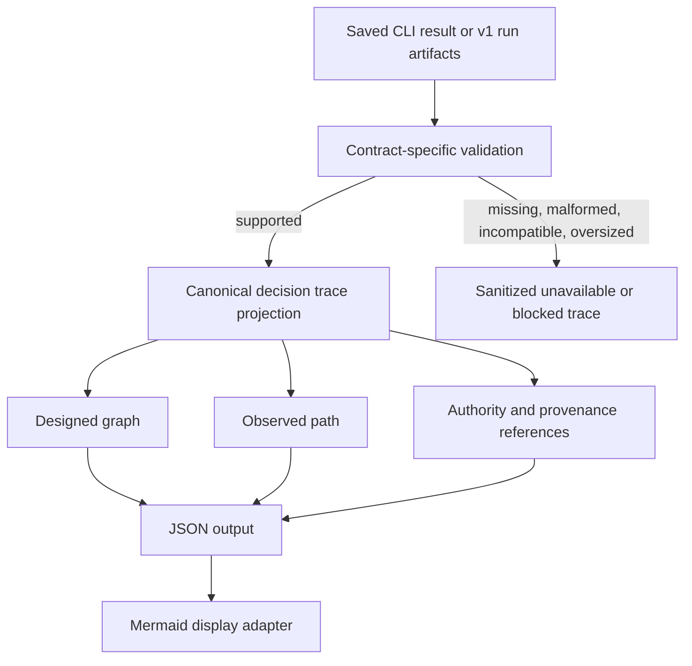
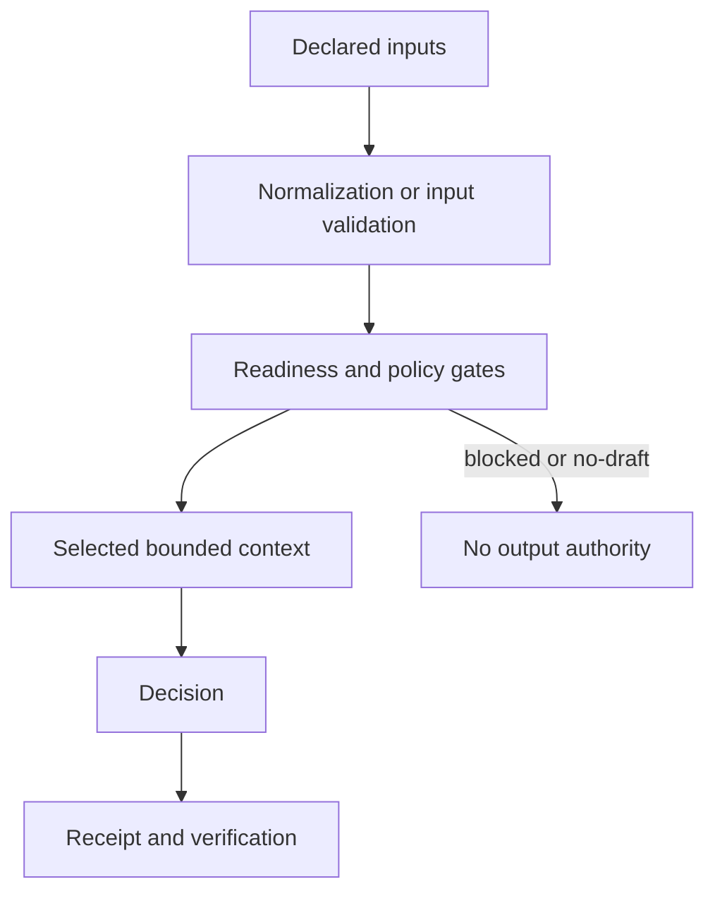

# Decision Trace Projection - Plan

## Goal Capsule

- **Objective:** Give operators one bounded, read-only explanation of how an MDP decision was reached, with JSON and Mermaid views derived from existing fit, route, brief, normalization, and v1 run artifacts.
- **Product authority:** Existing pack policy, deterministic command outputs, decision hashes, receipts, and verification remain authoritative. The trace is a projection with no independent decision or output authority.
- **Implementation authority:** The Rust CLI owns projection parsing, compatibility, bounds, schema validation, and Mermaid escaping. Agent-facing skills and docs describe the same contract without reimplementing it.
- **Stop conditions:** Stop with a sanitized unavailable result when a source is missing, malformed, incompatible, oversized, or insufficient to support the requested projection. Never reconstruct a plausible path from absent authority.
- **Execution profile:** Extend current contracts additively, preserve legacy trace fields, prove fail-closed behavior first, then expose the read-only CLI and documentation surfaces.
- **Tail ownership:** This change owns CLI, schema, capability, docs, skills, template/eval, release, installer, and installed-artifact proof. It does not own orchestration, hosted storage, or cross-run learning.

---

## Product Contract

### Summary

MDP will expose a canonical **decision trace** that projects existing decision evidence into a designed graph and an observed path. The projection is local, bounded, machine-readable, and visualization-friendly, while its source artifacts retain all authority.

### Problem Frame

MDP already records the ingredients of a decision, but no single surface explains them together. Prompt outputs contain `normalization_trace`; route and brief outputs contain coarse `decision_trace` arrays; fit outputs expose readiness, matches, disqualifiers, and gaps; v1 clean runs bind the pack, declared inputs, compiled context, decision, output, validation, audit, receipt, and verification.

The missing capability is inspection, not execution. A new trace engine would duplicate policy, drift from authority, and risk upgrading weak observations into stronger claims. A canonical projection must instead preserve the distinctions between designed policy, one observed path, deterministic MDP observations, external attestations, and later verification.

### Key Decisions

- **Project existing authority instead of creating a trace engine.** (session-settled: user-approved — chosen over a new tracing subsystem: MDP already records the relevant decision and run evidence.) Governs R1-R4, R9, R13.
- **Use decision trace as the stable product term.** `Decision path` names the observed-path portion, while `decision graph` describes a visualization of designed policy plus observed relationships. Governs R1, R5, R15.
- **Keep public proof synthetic and local-first.** The feature must not require raw transcripts, customer payloads, hosted storage, or a graph database. Governs R6-R8, R14.

### Actors

- A1. **Operator** — asks why a fit, route, brief, or clean-run result occurred and chooses JSON or Mermaid output.
- A2. **Reviewing agent** — consumes a bounded trace instead of loading the full pack or private source payloads.
- A3. **Verifier** — checks hashes, receipt relationships, and assurance evidence without treating the projection as authority.

### Requirements

**Contract and authority**

- R1. Define `mdp.decision-trace.v1` as a read-only projection whose source artifacts retain decision, output, and assurance authority.
- R2. Distinguish the designed graph from the observed path whenever both are available.
- R3. Preserve source contract IDs, artifact hashes, reason codes, assurance provenance, limitations, and verification state by reference or bounded copy.
- R4. Label each projected fact by evidence class so MDP-observed, host/provider/customer/driver-attested, verifier-recomputed, and unknown claims cannot blur together.
- R5. Represent relationships with stable node and edge kinds suitable for JSON inspection and Mermaid rendering, without implying execution or orchestration.

**Privacy and failure behavior**

- R6. Exclude raw source bodies, prompt text, customer prose, card bodies, output bodies, secrets, and local absolute paths from projected labels.
- R7. Enforce input-byte, node, edge, label, and Mermaid-output bounds with explicit truncation metadata rather than silent omission.
- R8. Return a sanitized unavailable or blocked projection for missing, malformed, incompatible, or oversized inputs.
- R9. Never project usable decision or output authority for no-draft, blocked, invalid, or preflight-refused states.

**Compatibility and CLI**

- R10. Preserve existing `normalization_trace` and `decision_trace` fields unchanged in v0 outputs.
- R11. Add one read-only `trace` CLI command that accepts a saved CLI JSON result or a v1 bundle/receipt pair and emits JSON or Mermaid.
- R12. Accept the normal CLI wrapper shape and validated raw contracted artifacts; reject ambiguous uncontracted JSON rather than guessing.
- R13. Reuse current v1 run verification before projecting receipt-backed authority, and expose integrity-only limitations when artifact bytes cannot be re-read.
- R14. Keep `.mdp/traces` as an optional generated-output convention used only when the operator passes `--out`; it is not a store or source of truth.
- R15. Publish the new contract through `schema`, `capabilities`, CLI help, docs, skills, and synthetic examples.

### Key Flows

- F1. **Inspect a saved row-level result**
  - **Trigger:** A1 provides a saved `fit`, `route`, `brief`, or validated prompt-output CLI result.
  - **Actors:** A1, A2.
  - **Steps:** The CLI validates and unwraps the source, maps bounded policy and outcome facts, then emits the designed graph and observed path.
  - **Outcome:** The trace explains the decision without reading or duplicating private source bodies.
  - **Covered by:** R1-R8, R10-R12, R15.
- F2. **Inspect v1 run authority**
  - **Trigger:** A1 provides a v1 run bundle and receipt, with an optional artifact root.
  - **Actors:** A1, A3.
  - **Steps:** The CLI runs existing verification, projects bound artifacts and decision authority, then marks limitations that could not be recomputed.
  - **Outcome:** The trace links the observed path to hashes and verification without replacing the receipt.
  - **Covered by:** R1-R9, R11-R13, R15.
- F3. **Export an explanatory graph**
  - **Trigger:** A1 selects Mermaid output for an available projection.
  - **Actors:** A1, A2.
  - **Steps:** The CLI renders only sanitized node labels and typed edges from the canonical JSON projection.
  - **Outcome:** A reader can follow the path without mistaking it for an executing workflow.
  - **Covered by:** R2, R5-R9, R11, R15.

### Acceptance Examples

- AE1. **Ready GTM decision**
  - **Covers:** F1, R1-R8, R10-R12.
  - **Given:** A saved synthetic fit or brief result whose deterministic status permits the next step.
  - **When:** The operator runs `trace` in JSON mode.
  - **Then:** The trace shows the applied readiness and routing facts, selected bounded references, final decision, and projection-only authority notice.
- AE2. **Insufficient-context or disqualified decision**
  - **Covers:** F1, R6-R10.
  - **Given:** A fit or brief result with missing requirements, disqualifiers, or `no-draft` state.
  - **When:** The operator projects it.
  - **Then:** The observed path terminates at the blocking decision, exposes bounded reason codes or field names, and grants no output authority.
- AE3. **Verified v1 run**
  - **Covers:** F2, R1-R9, R11-R13.
  - **Given:** A valid bundle and receipt with an artifact root.
  - **When:** The operator projects them.
  - **Then:** The trace includes the decision hash, receipt hash, artifact references, recomputed assurance, and a notice that the receipt remains authoritative.
- AE4. **Preflight refusal**
  - **Covers:** F2, R8-R9, R13.
  - **Given:** Only a sanitized `mdp.run-execution.v1` preflight-refusal result exists.
  - **When:** The operator projects it.
  - **Then:** The trace ends at refusal with sanitized reason codes and no fabricated bundle, receipt, verification, decision, or output nodes.
- AE5. **Safe Mermaid export**
  - **Covers:** F3, R5-R8, R11.
  - **Given:** A synthetic source whose identifiers contain Mermaid punctuation or exceed label bounds.
  - **When:** The operator requests Mermaid.
  - **Then:** Output remains valid, labels are escaped and capped, and truncation is visible.

### Scope Boundaries

#### Deferred to Follow-Up Work

- Cross-run querying, precedent comparison, and batch aggregation remain future consumers of the per-decision contract.
- A richer browser visualization remains a future display layer after the CLI proof establishes demand.
- Public positioning work remains owned by MDP-192 after the implementation proof exists.

#### Outside This Product's Identity

- Agent orchestration, scheduling, retries, tool execution, approvals, enrichment, CRM mutation, sequencing, sending, and proposal submission.
- A graph database, hosted trace warehouse, BI dashboard, or universal organizational context graph.
- Automatic pack mutation or learning from trace history.
- Claims that a trace, receipt, or visualization proves source truth, semantic correctness, compliance, or provider behavior beyond its evidence provenance.

---

## Planning Contract

### Assumptions

- The `trace` command name is the smallest discoverable surface; no user confirmation of that exact name was collected before planning proceeded.
- Saved CLI wrappers are the compatibility bridge for route outputs that do not currently embed their own contract ID.
- The first release projects supported source facts only; it does not attempt to reverse-engineer a complete pack dependency graph from card prose.

### Trace-Like Surface Inventory

| Existing surface | Current authority | Treatment |
|---|---|---|
| Prompt `normalization_trace` | Prompt/host-produced normalization detail validated against pack contracts | Keep unchanged; project only bounded readiness, missing-field, and provenance markers from a validated prompt-output artifact. |
| Route `decision_trace` | Coarse explanatory strings emitted by deterministic routing | Keep unchanged; map known steps into the observed path and derive designed-policy nodes from the route result. |
| Brief `decision_trace` | Coarse explanatory step/reason objects emitted with brief output | Keep unchanged; map known steps and final draft gate into the observed path. |
| Fit result | Deterministic status, context readiness, matches, disqualifiers, and decision | Treat as row-level decision authority for the saved command result; do not add stronger assurance. |
| Compiled run context | Hash-bound summary of exact run inputs and deterministic decision context | Reference through its receipt artifact authority; read only when a verified artifact root is supplied. |
| `DecisionAuthority` | Hash-bound decision and reason codes in a v1 receipt | Preserve directly as the run decision authority source. |
| Run bundle and receipt | Immutable request snapshot and terminal authority | Verify with existing code, then project hashes and relationships. |
| Run verification | Recomputed integrity and assurance evidence | Preserve verification state and issues; never convert integrity-only into stronger proof. |
| `.mdp/traces` | Ignored generated pack directory | Keep as an optional output destination convention only. |

### Key Technical Decisions

- KTD1. **Use a closed projection contract with typed nodes and edges.** Nodes carry stable IDs, kind, label, state, evidence provenance, and bounded artifact references. Edges carry a stable relationship kind and connect existing node IDs. Nodes and edges use a deterministic semantic order so JSON, hashes, tests, and Mermaid remain stable. This supports both output formats from one semantic object. Covers R1-R5, R7-R9.
- KTD2. **Parse explicit source families instead of using a generic JSON walker.** Recognize supported contract IDs and normal CLI wrappers, then use a dedicated adapter per source family. This keeps source semantics auditable and rejects ambiguous inputs. Covers R3-R4, R8, R10-R13.
- KTD3. **Render Mermaid only from the validated projection.** Mermaid output is a deterministic display adapter over `mdp.decision-trace.v1`, with no source parsing or decision logic of its own. Covers R1, R5-R8, R11.
- KTD4. **Use bounded references, not payload copies.** Project schema IDs, portable logical names, hashes, reason codes, field names, counts, states, and controlled labels. Bind each standalone source file by SHA-256. Omit source bodies, snippets, full card content, and output content. Covers R3-R9.
- KTD5. **Apply fixed conservative limits in v1.** Reuse the existing 1 MiB authority-JSON input limit. Cap a projection at 256 nodes, 512 edges, 120 UTF-8 bytes per label, and 256 KiB of Mermaid. Reject an oversized source before parsing. After deterministic ordering, truncate optional graph fan-out with omitted counts; fail closed if a mandatory decision or authority node would be omitted. Covers R6-R8.
- KTD6. **Keep legacy fields additive and untouched.** The new command consumes current outputs and introduces a separate v1 schema target. It does not rename or upgrade v0 trace fields. Covers R10-R15.

### High-Level Technical Design

### Sequencing

1. Define the closed contract, bounds, adapters, and failure semantics before adding CLI presentation.
2. Add CLI/schema/capability exposure only after the projection tests cover authority and no-draft paths.
3. Update docs, skills, and synthetic fixtures against the shipped command shape.
4. Run focused and full validation, then complete PR and release/install closeout under repository policy.

### System-Wide Impact

- **CLI/API contract:** A new command and schema target expand the public surface. Existing route, fit, brief, prompt-output, receipt, and run schemas stay unchanged.
- **Authority lifecycle:** Row-level projections bind the exact source-file SHA-256 but do not gain receipt assurance. Run projections preserve the stronger bundle, decision, receipt, and verification relationships from v1 authority.
- **Agent context:** The MDP skill can load the bounded trace first, then open source artifacts only when a trace reference requires deeper review. The skill must retain the same no-draft and human-override boundaries as the CLI.
- **Pack identity:** Writing under `.mdp/traces` remains excluded from portable pack hashes. The projector never reads that directory as an implicit authority source.
- **Failure propagation:** Unsupported or unsafe sources produce a structured unavailable projection. Tampered run authority produces a blocked projection and cannot fall back to row-level inference.

### Risks and Dependencies

| Risk | Mitigation |
|---|---|
| A projection bug misstates authoritative artifacts. | Use contract-specific adapters, retain source hashes, reuse v1 verification, and label the projection as non-authoritative. |
| Raw or private values leak through node labels or Mermaid. | Allowlist projected fields, cap labels by bytes, escape Mermaid syntax, reject control characters, and scan synthetic proof for local/private values. |
| Large packs or malicious JSON cause resource exhaustion. | Apply bounded file reads and parser limits before allocation, then cap graph size and rendered output per KTD5. |
| Mermaid wording implies orchestration. | Use relationship labels such as `governs`, `selected`, `blocked-by`, `bound-to`, and `verified-by`; avoid workflow-execution verbs. |
| Legacy consumers break if trace fields change. | Keep v0 fields byte-shape compatible and ship the projection as a separate v1 command/schema per KTD6. |
| Row-level and receipt-backed sources appear equally assured. | Expose source class and authority level, bind standalone source SHA-256, and reserve receipt/verification claims for v1 run inputs. |
| Documentation or skills drift from the CLI. | Update canonical authored skills, capabilities, schemas, fixtures, and docs in the same change, then run packaging and full validation. |

---

## Implementation Units

### U1. Canonical projection model and source adapters

- **Goal:** Implement the versioned trace model plus explicit adapters for saved row-level outputs and v1 run authority.
- **Requirements:** R1-R10, R12-R13; A1-A3; F1-F2; AE1-AE4; KTD1-KTD2, KTD4-KTD6.
- **Dependencies:** None.
- **Files:** `cli/src/commands/decision_trace.rs`, `cli/src/commands/mod.rs`, `cli/src/run_contracts.rs`, `cli/src/commands/run_verification.rs`.
- **Approach:**
  1. Define serializable projection, node, edge, authority-reference, bounds, and truncation types in one module.
  2. Accept normal CLI wrappers and supported raw contracted artifacts through explicit adapters.
  3. Reuse existing run parsing and verification for bundle/receipt inputs.
  4. Return schema-shaped unavailable projections for expected source failures; reserve command errors for invalid invocation or unsafe I/O.
- **Execution note:** Start with failing tests for no-draft authority leakage, malformed sources, and receipt verification before implementing happy-path adapters.
- **Patterns to follow:** Closed serde contracts in `cli/src/run_contracts.rs`; bounded authority JSON parsing in `cli/src/artifact_hash.rs`; verification rules in `cli/src/commands/run_verification.rs`.
- **Test scenarios:**
  - Covers AE1. A wrapped synthetic fit result projects readiness, matches, selected context references, and the final decision without prospect text.
  - Covers AE2. Insufficient-context and disqualified results end at no-draft with missing field names or disqualifier IDs and no output-authority node.
  - Covers AE3. A valid bundle/receipt pair projects exact decision, bundle, receipt, and artifact hashes after existing verification succeeds.
  - Covers AE4. A preflight-refusal execution projects only sanitized reason codes and null authority references.
  - A malformed, unsupported, or ambiguous JSON source returns a bounded unavailable projection with no local path or payload echo.
  - An oversized source is rejected before unbounded deserialization or graph allocation.
  - A receipt with mismatched execution ID, decision hash, or terminal-state authority fails closed.
- **Verification:** Projection values serialize deterministically, contain no duplicated source bodies, and preserve all authority limitations required by the source family.

### U2. JSON Schema, CLI command, and Mermaid adapter

- **Goal:** Expose one read-only `trace` command with schema-valid JSON and safe Mermaid output.
- **Requirements:** R1-R9, R11-R15; A1-A3; F1-F3; AE1-AE5; KTD1-KTD3, KTD5-KTD6.
- **Dependencies:** U1.
- **Files:** `cli/src/cli.rs`, `cli/src/app.rs`, `cli/src/output.rs`, `cli/src/commands/decision_trace.rs`, `cli/src/commands/schemas.rs`, `cli/src/commands/capabilities.rs`.
- **Approach:**
  1. Add mutually valid source arguments for a saved result or bundle/receipt pair, optional artifact-root verification, output format, and optional output file.
  2. Add the `decision-trace-v1` schema target and advertise command side effects as read-only except for explicit `--out` writes.
  3. Render Mermaid from the canonical projection using controlled node classes and relationship labels that distinguish design, observation, and authority.
  4. Use current output and write-conflict conventions so JSON wrappers, summary behavior, and `--out` handling remain consistent.
- **Execution note:** Add CLI parse and schema tests before wiring the command through `app.rs`.
- **Patterns to follow:** Command parsing tests in `cli/src/cli.rs`; schema compilation fixtures in `cli/src/commands/schemas.rs`; output metadata in `cli/src/commands/capabilities.rs`; safe output writes in `cli/src/app.rs`.
- **Test scenarios:**
  - `trace --file` and `trace --bundle --receipt` parse, while mixed or incomplete source groups fail argument validation.
  - JSON output validates against `decision-trace-v1` for ready, blocked, disqualified, and preflight-refused fixtures.
  - Covers AE5. Mermaid escapes quotes, brackets, pipes, newlines, control characters, and directive-like text without changing graph structure.
  - Node, edge, label, and rendered-byte limits yield deterministic truncation or bounded refusal.
  - Mermaid separates designed-policy, observed-path, and authority nodes visually and uses no execution verbs for projection edges.
  - `capabilities` reports `trace` as read-only unless `--out` is used and exposes the new contract/schema target.
- **Verification:** The command is discoverable in help/capabilities, its JSON validates, its Mermaid parses in a standard renderer, and existing command outputs remain byte-shape compatible except for no intentional changes.

### U3. Synthetic proof, docs, and agent-facing contract

- **Goal:** Make the feature understandable and safe to use from CLI and agent workflows.
- **Requirements:** R1-R15; A1-A3; F1-F3; AE1-AE5; KTD3-KTD6.
- **Dependencies:** U1, U2.
- **Files:** `CONCEPTS.md`, `README.md`, `docs/conceptual-decision-flow.md`, `docs/run-receipts.md`, `docs/decision-traces.md`, `plugin/skills/mdp/SKILL.md`, `plugin/skills/mdp/references/mental-model.md`, `examples/decision-trace/README.md`, `examples/decision-trace/fixtures/`.
- **Approach:**
  1. Add canonical vocabulary for decision trace, designed graph, observed path, and projection authority.
  2. Document row-level and run-receipt inspection with explicit privacy and assurance caveats.
  3. Add synthetic ready and no-draft source fixtures plus checked JSON/Mermaid outputs where repository fixture conventions support generated proof.
  4. Update the authored MDP skill source in the same change so agents prefer the bounded projection over opening every artifact.
- **Execution note:** Use synthetic fixture data only and verify generated proof does not contain machine-local paths.
- **Patterns to follow:** Vocabulary style in `CONCEPTS.md`; contract tables in `docs/run-receipts.md`; canonical authored skills under `plugin/skills/`; starter fixture generation in `cli/src/starter.rs` when hand-authored template drift would otherwise occur.
- **Test scenarios:**
  - The synthetic ready fixture produces the documented decision and stable graph relationships.
  - The synthetic no-draft fixture stops before output authority and explains the missing or blocking facts.
  - Skill/package validation confirms canonical authored skills match every generated host bundle.
  - A repository scan confirms committed proof contains no home-directory paths, customer names, transcript text, tokens, or private payloads.
- **Verification:** A non-engineer can identify inputs, gates, selected context, decision, and authority boundary from the synthetic Mermaid view without reading raw JSON.

### U4. Compatibility, full validation, and release proof

- **Goal:** Prove the additive contract ships without weakening existing behavior or installer state.
- **Requirements:** R1-R15; AE1-AE5; KTD5-KTD6.
- **Dependencies:** U1-U3.
- **Files:** `cli/src/commands/health.rs`, `scripts/validate-skill-packaging.py`.
- **Approach:**
  1. Add focused health/eval coverage only where it catches cross-surface drift not already covered by unit tests.
  2. Validate unchanged route, fit, brief, normalization, v0 receipt, and v1 run behavior alongside the new command.
  3. Complete the repository's normal PR, patch-release, installer, and installed-artifact smoke sequence after merge.
- **Patterns to follow:** Existing health checks in `cli/src/commands/health.rs`; repository validation and release instructions in `AGENTS.md`.
- **Test scenarios:**
  - Existing route, fit, brief, prompt-output, v0 receipt, v1 run, verification, and consumption tests remain green.
  - The basic template validates and its trace evals pass in strict mode.
  - The installed binary reports the trace capability and reproduces the synthetic JSON and Mermaid proof.
  - Release artifacts contain the merge commit and the installer does not fall back to an older CLI or plugin bundle.
- **Verification:** Focused tests, full `make validate`, PR checks, patch release, installer smoke, and installed behavior all pass with exact commit/tag provenance recorded.

---

## Verification Contract

| Gate | Applies to | Done signal |
|---|---|---|
| Focused projection and Mermaid tests | U1-U2 | Ready, no-draft, malformed, oversized, receipt-mismatch, and escaping cases pass. |
| `cargo test --manifest-path cli/Cargo.toml` | U1-U4 | All Rust tests pass without changing legacy semantics. |
| `cargo run --manifest-path cli/Cargo.toml -- --json validate --dir plugin/assets/templates/basic` | U3-U4 | The starter pack and trace fixtures validate. |
| Synthetic CLI proof | U2-U4 | JSON validates against `decision-trace-v1`; Mermaid is bounded, safe, and understandable. |
| Skill packaging validation | U3-U4 | Authored skill source and generated plugin bundles have no drift. |
| `make validate` | U4 | Repository-wide validation passes. |
| PR review | U1-U4 | Correctness, API contract, privacy/security, maintainability, and test findings are resolved. |
| Release and installed smoke | U4 | Merged commit is in the patch tag and installed `mdp` proves the new behavior. |

---

## Definition of Done

- `mdp.decision-trace.v1` is closed, schema-valid, bounded, projection-only, and documented.
- `mdp trace` emits JSON and Mermaid for supported row-level and v1 run sources.
- Designed graph, observed path, provenance, authority, and limitations remain distinguishable.
- Ready, insufficient-context, disqualified/no-draft, preflight-refused, malformed, incompatible, oversized, and tampered cases are covered.
- Legacy `normalization_trace`, route/brief `decision_trace`, v0 receipt, and v1 run consumers remain compatible.
- Docs, capabilities, schemas, synthetic fixtures, and canonical agent-facing skills agree with the CLI.
- No raw transcripts, customer data, private payloads, tokens, or local paths enter committed artifacts.
- Abandoned experimental code and unused abstractions are removed from the final diff.
- The PR is linked to MDP-51 and MDP-191 and carries `ai:autofix-enabled` when same-branch repair is safe.
- After merge, the repository's patch release, installer, and installed-artifact smoke closeout is complete.

---

## Appendix

### Sources and Research

- `cli/src/commands/briefs.rs` and `cli/src/commands/routing.rs` show the existing coarse `decision_trace` compatibility surfaces.
- `cli/src/run_contracts.rs`, `cli/src/run_runtime.rs`, and `cli/src/commands/run_verification.rs` define current v1 authority, terminal-state, assurance, and fail-closed rules.
- `cli/src/commands/schemas.rs` and `cli/src/commands/capabilities.rs` are the public CLI contract registries.
- `docs/run-receipts.md`, `docs/conceptual-decision-flow.md`, and `CONCEPTS.md` define current authority and vocabulary boundaries.
- MDP-51 and MDP-191 supply the accepted product scope and implementation sequence.
- The prior graph-engineering transcript synthesis informed the designed-graph versus observed-path distinction; no transcript text is required by this implementation.

### Product Contract Preservation

No upstream unified Product Contract file existed. This plan bootstraps the Linear-approved MDP-51 scope without changing its product boundary.
