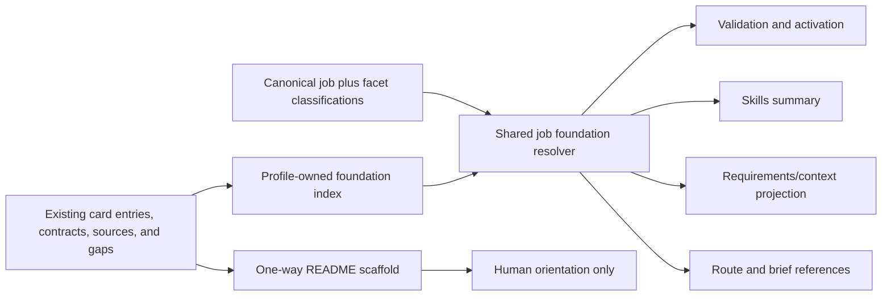
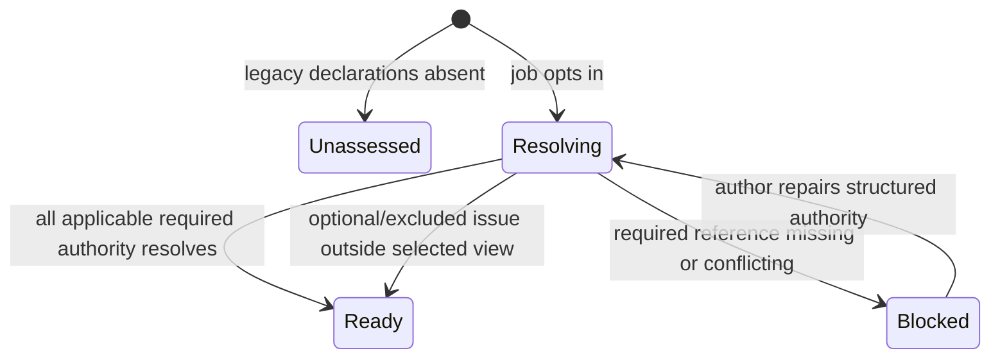

# Canonical Product Foundation and Pack README - Plan

## Goal Capsule

- **Objective:** Give every declared job an exact, inspectable product foundation resolved from existing structured pack authority, plus a concise human README that explains the pack without becoming a second source of truth.
- **Product authority:** The approved MDP-195 self-standing contract remains unchanged. Product facts stay in the ten existing primitives; exact card entries, contracts, sources, and gaps remain authoritative.
- **Implementation authority:** One deterministic resolver owns per-job product-foundation resolution. Validation and every CLI/agent projection consume that resolver instead of independently inferring product context.
- **Stop conditions:** An opted-in job with dangling, missing, or conflicting required authority is not ready. The CLI must never guess from unrelated entries, free-text jobs, README prose, or authoring-chat memory.
- **Execution profile:** Extend `mdp.v0` additively, repair the current false-ready activation seam, then add starter, README, docs, skills, and compatibility proof.
- **Tail ownership:** MDP-196 owns the contract, resolver, readiness, CLI projections, GTM/proposal templates, README scaffold, docs, skills, tests, and release/install proof. It does not own prompt upgrades or cold-model qualification.

## Product Contract

### Product Contract Preservation

Product Contract unchanged. This plan implements the MDP-195 product-understanding dependency and additive compatibility decisions without changing their meaning.

### Summary

A profile may declare named product-foundation facets that reference exact existing card entries and explicit gaps. Each canonical job classifies the facets it needs as required, conditional, optional, or excluded. MDP resolves only that job's declared subset and reports whether the foundation is ready, blocked, or unassessed.

The pack also carries `.mdp/README.md`, a concise human orientation artifact generated or scaffolded from structured authority. It travels with the pack release but never supplies machine authority or changes the resolver's result.

### Problem Frame

Product understanding is currently distributed across positioning, personas, pains, claims, boundaries, motions, calls to action, output rules, gaps, and sources. That distribution correctly follows the ten MDP primitives, but there is no canonical way for a job to name the exact subset it requires.

The gap produces two concrete failures. First, job activation checks only whether global primitive mappings are non-empty, so a targeted starter marked `needs-review` can still appear ready through `validate` and `skills`. Second, generated packs cite a repository README that may not exist in the released pack, while proposal initialization intentionally omits its template README. A cold consumer therefore lacks both exact machine-readable product dependencies and dependable human orientation.

### Key Decisions

- **Reference existing structured authority.** (session-settled: user-approved — chosen over inline product statements or a new product-foundation card: copied prose would create competing authority.) Governs R1-R5, R8-R9.
- **Keep the ten primitives complete.** Product foundation is a profile/job authoring and resolution contract, not an eleventh primitive or new `CardKind`. Governs R1-R3, R12.
- **Make README orientation only.** (session-settled: user-approved — chosen over README-as-authority: narrative prose cannot safely govern deterministic resolution.) Governs R7-R10.
- **Preserve legacy validity additively.** (session-settled: user-approved — chosen over a breaking migration: existing `mdp.v0` packs must not be silently failed or passed.) Governs R6, R11.
- **Treat `basic` as the generic GTM fixture path.** No neutral third profile will be created. Governs R9, R12.

### Actors

- A1. **Pack author** — declares reusable product facets, binds them to canonical jobs, and records unsupported knowledge as gaps.
- A2. **Operator** — inspects validation, readiness, and the concise README before using a job.
- A3. **Reviewing agent** — discovers the exact job foundation through CLI JSON and treats README as secondary orientation.
- A4. **Legacy pack maintainer** — adopts the optional contract without losing existing structural validity or authored files.

### Requirements

**Authority and authoring**

- R1. Add an optional profile-owned product-foundation registry whose facets use stable IDs and exact references to existing card entries and explicit gap entries.
- R2. Add an optional per-canonical-job binding that classifies foundation facet IDs as required, conditional, optional, or excluded; conditional facets must name a deterministic activation condition.
- R3. Keep referenced card entries, contracts, sources, and gaps authoritative. The registry and compiled foundation are indexes/projections and contain no duplicated inline product claims.
- R4. Validate closed facet vocabulary, exact card/entry/gap reference closure, duplicate ownership, conditional semantics, and deterministic ordering.
- R5. Resolve only the selected canonical job's applicable foundation. Unrelated job/profile facets and noncanonical free-text job guesses must not enter the resolved view.

**Readiness and compatibility**

- R6. Preserve base validity for packs without the new declarations and report their product-foundation state as `unassessed`; never auto-pass or auto-fail them for self-standing sufficiency.
- R7. Once a job opts in, missing, dangling, or conflicting applicable required authority blocks that job and makes agent-visible `pack_ready` false. Optional or excluded conflicts outside the selected view do not block it.
- R8. Roll exact per-job foundation readiness into profile activation without allowing `profile_eval.activation.status: needs-review` to appear ready.

**Human and agent discoverability**

- R9. Scaffold a concise `.mdp/README.md` for generic GTM, targeted GTM, and proposal packs with an authority notice, thesis, actors/ICP, supported jobs, decision flow, boundaries, sources, prompt inventory, commands, and gaps.
- R10. README presence, absence, staleness, or contradictory prose must never alter validation authority, resolved product context, job readiness, or governed decisions. README checks may report orientation drift separately.
- R11. Expose consistent foundation status and references through exact-job CLI discovery so plugin skills do not need to reimplement resolution or load full unrelated cards.
- R12. Keep docs, authored skills, schemas, starter/template assets, fixtures, and CLI behavior aligned without manufacturing a neutral basic profile or absorbing later self-standing issues.

### Key Flows

- F1. **Author and resolve a canonical job**
  - **Trigger:** A1 declares product facets and binds a known profile job.
  - **Steps:** Validation closes exact references; the shared resolver applies job classifications and conditions; CLI surfaces project the same result.
  - **Outcome:** A2 and A3 can identify exactly which product authority is active and why the job is ready or blocked.
  - **Covered by:** R1-R5, R7-R8, R11.
- F2. **Initialize a new pack**
  - **Trigger:** A1 initializes generic GTM, targeted GTM, or proposal.
  - **Steps:** Init writes self-contained structured foundation declarations and a concise `.mdp/README.md`; unsupported target facts remain explicit gaps.
  - **Outcome:** The generated pack contains no dangling repository-README dependency and does not invent target or proposal proof.
  - **Covered by:** R1-R4, R9-R10, R12.
- F3. **Inspect or adopt a legacy pack**
  - **Trigger:** A4 validates a pack without product-foundation declarations.
  - **Steps:** Existing structure validates; foundation status is reported as unassessed; documented additive authoring permits opt-in without destructive init behavior.
  - **Outcome:** Compatibility is honest and non-destructive.
  - **Covered by:** R6, R10-R12.

### Acceptance Examples

- AE1. **Different jobs resolve different foundations.** Given one profile with two opted-in canonical jobs, each bound to a different required subset, exact-job discovery returns only its selected facets in stable order and excludes the other's context.
- AE2. **Targeted starter is not falsely ready.** Given a targeted GTM pack whose activation is `needs-review` and whose unsupported product facts are gaps, validation and `skills --job` report the affected job as not ready rather than inheriting global primitive readiness.
- AE3. **Missing or conflicting authority fails closed.** Given an opted-in job with a dangling entry reference, missing required facet, or incompatible selected claims, validation identifies the exact reference or facet and the job exposes no ready foundation.
- AE4. **Legacy pack remains valid but unassessed.** Given a previously valid `mdp.v0` pack with no foundation fields, validation remains successful while exact-job discovery reports foundation sufficiency as unassessed.
- AE5. **README cannot change authority.** Given packs with identical structured authority whose README is absent, stale, or contradictory, resolver status, selected references, readiness, and governed decisions are identical; portable digest and orientation diagnostics may differ.
- AE6. **Generic GTM and proposal initialization are self-contained.** Given either shipped template, initialization writes structured product authority and `.mdp/README.md` without relying on the repository root README; proposal content remains synthetic and privacy-safe.
- AE7. **Irrelevant conflicts stay excluded.** Given a conflict in a facet classified as excluded for the selected job, that job resolves without loading or being blocked by the irrelevant facet.
- AE8. **Agents use structured authority first.** Given a skill request for an opted-in job, behavioral skill tests show the agent inspects exact-job CLI foundation output, treats README as orientation, and refuses to invent missing product facts.

### Scope Boundaries

#### Deferred to Follow-Up Work

- MDP-197 prompt and normalization upgrades.
- MDP-200 minimal-context budgets, governed generation, and full pack-plus-runtime context proof.
- MDP-201 cold-model behavioral qualification.
- A dedicated automated migration/scaffold command for existing packs; MDP-196 documents additive manual adoption and preserves existing authored files.

#### Outside This Product's Identity

- An eleventh primitive, a new universal product card, a company wiki, or narrative README authority.
- Model/provider invocation, retrieval, collection, hosted state, orchestration, CRM mutation, outreach, scheduling, or automatic learning.
- Treating structured presence, README completeness, or model prose as proof that external product claims are true.

## Planning Contract

### Assumptions

- `.mdp/README.md` is the released pack's human orientation artifact because `.mdp/` already participates in portable pack identity. The repository root README remains project documentation.
- The first release uses explicit stable condition identifiers or existing closed job/profile conditions; it does not add a general expression language.
- Existing free-text route/brief compatibility may continue, but it reports foundation as unbound/unassessed and cannot support a self-standing claim.

### Key Technical Decisions

- KTD1. **Add a profile-owned registry and job bindings to the manifest.** The optional registry defines closed foundation facets with `card_id`/`entry_id` references and gap references. Each `ProfileJob` classifies referenced facet IDs. This instantiates R1-R3 without changing primitive or card enums. (session-settled: user-approved — chosen over inline product statements: authority remains in existing entries.)
- KTD2. **Use one pure shared resolver.** A focused resolver receives a validated manifest/card index plus canonical job ID and returns status, selected facets, resolved references/content, gaps, excluded IDs, diagnostics, and stable ordering. Validation, readiness, and CLI projections call it rather than duplicating selection rules. Covers R4-R8, R11.
- KTD3. **Separate base validity from foundation sufficiency.** Absence of the optional registry is `unassessed`. Opt-in activates strict closure and job-level blocking, which then rolls up to profile activation and `skills.pack_ready`. Covers R6-R8.
- KTD4. **Expose summary and full views through existing job discovery surfaces.** `skills --job` exposes status, required facet IDs, and diagnostics; the requirements/context surface exposes the complete resolved structured view; route/brief outputs carry exact selected references where a canonical job is bound. No new general-purpose engine or workflow tool is added. Covers R5, R7-R8, R11.
- KTD5. **Scaffold README one way from structured authority.** Init creates `.mdp/README.md` with stable sections and an explicit non-authority notice. Validation may check section/reference integrity and drift, but parsing README never satisfies a foundation requirement. Covers R9-R10.
- KTD6. **Adopt via optional fields, not destructive migration.** Starter packs opt in; legacy packs remain valid/unassessed; authored READMEs are not silently overwritten by unrelated commands. Covers R6, R9-R10, R12.

### High-Level Technical Design

### Sequencing

1. Land the additive manifest shape, schema validation, and compatibility fixtures before consuming the contract elsewhere.
2. Implement and characterize one shared resolver, including the false-ready targeted-pack case.
3. Wire readiness and agent-visible projections to the resolver, proving cross-command parity and exclusion.
4. Update init, GTM/proposal templates, and the one-way README scaffold after runtime semantics settle.
5. Align docs and canonical skills, then run full validation, PR, patch release, installer, and installed-artifact proof.

### System-Wide Impact

- **Manifest/schema:** Optional fields expand `mdp.v0` authoring. Unknown fields and opted-in broken references remain strict; absent fields retain legacy validity.
- **Readiness:** Job and profile activation become sensitive to exact foundation resolution and existing `profile_eval.activation.status`, eliminating current false-ready results.
- **Routing/context:** Canonical jobs receive only declared foundation references. Free-text compatibility paths cannot guess self-standing product context.
- **Pack identity:** `.mdp/README.md` travels in the portable digest as orientation content, while machine decisions remain identical when the README changes.
- **Agent parity:** CLI JSON becomes the common authority for humans, plugin skills, and MCP wrappers. Skills do not infer foundation from filenames or prose.
- **Templates:** The path named `basic` remains the generic GTM reference fixture. Targeted GTM and proposal get equivalent contract coverage without a new neutral profile.

### Risks and Dependencies

| Risk | Mitigation |
| --- | --- |
| A foundation index becomes a duplicated product database. | Permit exact references and gaps only; reject inline product statements; document existing entries as authority. |
| Separate commands implement different resolution rules. | Centralize resolution in one pure module and add cross-command parity fixtures. |
| Opt-in fields silently break old packs. | Preserve absent-field base validity and report `unassessed`; add frozen legacy fixtures. |
| Global or token-based routing leaks irrelevant product context. | Require canonical job binding for foundation activation and test two jobs with disjoint subsets. |
| README prose becomes shadow authority. | Never parse it into resolution; compare machine outputs across absent/stale/contradictory README fixtures. |
| Targeted starters retain false-ready behavior. | Make computed readiness honor exact foundation results and explicit `needs-review`; cover `validate` and `skills`. |
| Proposal or public fixtures leak private claims. | Use only synthetic/sanitized content and run repository privacy scans. |
| Scope expands into MDP-197/200/201. | Limit this issue to foundation declaration/resolution/readiness/discovery and orientation; defer prompt and behavioral proof. |

## Implementation Units

### U1. Additive manifest and schema contract

- **Goal:** Define product-foundation facets and per-job bindings without adding a primitive, card kind, or breaking legacy packs.
- **Requirements:** R1-R4, R6, R12; F1, F3; AE3-AE4; KTD1, KTD3, KTD6.
- **Dependencies:** None.
- **Files:** `cli/src/models.rs`, `cli/src/commands/schemas.rs`, `cli/src/commands/health.rs`, focused schema/validation fixtures under existing test modules.
- **Approach:**
  1. Add optional serializable types for stable facet IDs, closed facet kinds, exact entry/gap references, and job classifications.
  2. Extend manifest/profile-job schema allowlists and reference validation.
  3. Treat absent declarations as unassessed; enforce strict closure only after a job opts in.
  4. Reject inline product prose, unknown facet kinds, dangling references, duplicate facet IDs, and invalid conditional declarations.
- **Execution note:** Write compatibility and broken-reference tests before enabling starter packs to opt in.
- **Patterns to follow:** Optional additive manifest fields in `cli/src/models.rs`; closed schemas and allowlists in `cli/src/commands/schemas.rs` and `health.rs`; exact reference checks used by current prompt/card/input-contract validation.
- **Test scenarios:**
  - A frozen legacy `mdp.v0` manifest without new fields remains structurally valid and foundation-unassessed.
  - A complete opted-in registry with exact existing entry and gap references validates.
  - Unknown facet kinds, duplicate facet IDs, dangling card/entry/gap refs, and inline statements fail with exact paths.
  - Conditional classification without a supported deterministic condition fails.
  - A job binding an unknown facet ID fails without affecting unrelated legacy parsing.
- **Verification:** Generated schemas accept only the additive closed contract, and old manifests deserialize and validate unchanged.

### U2. Shared per-job resolver and truthful activation

- **Goal:** Resolve the exact foundation for one canonical job and make readiness reflect that result.
- **Requirements:** R2-R8; F1; AE1-AE4, AE7; KTD2-KTD3.
- **Dependencies:** U1.
- **Files:** `cli/src/product_foundation.rs` (new), crate module registration, `cli/src/commands/health.rs`, resolver-focused tests.
- **Approach:**
  1. Build a deterministic card/entry/gap index from already validated pack data.
  2. Resolve required, triggered conditional, optional, and excluded facets for an exact canonical job.
  3. Return `ready`, `blocked`, or `unassessed` with selected refs, content, gaps, exclusions, and structured diagnostics in stable order.
  4. Roll job results into profile activation and honor explicit `profile_eval.activation.status` so `needs-review` cannot become ready.
  5. Leave noncanonical free-text jobs unbound/unassessed rather than guessing.
- **Execution note:** Characterize the current targeted-starter false-ready behavior first, then make that test pass through the shared resolver.
- **Patterns to follow:** Bounded job compilation in `cli/src/commands/requirements.rs`; deterministic `BTreeMap` ordering; activation reporting in `cli/src/commands/health.rs`.
- **Test scenarios:**
  - Covers AE1. Two jobs in one profile resolve disjoint required subsets and stable output order.
  - Covers AE2. A targeted starter marked `needs-review` produces not-ready job/profile activation.
  - Covers AE3. Missing or conflicting selected required authority blocks only the opted-in job with exact diagnostics.
  - Covers AE7. Conflicting excluded or untriggered conditional authority does not block or enter selected context.
  - A noncanonical free-text job returns unbound/unassessed and never falls back to token matching for foundation authority.
  - Explicit gap refs remain visible and produce the declared bounded missing-context state.
- **Verification:** One resolver result is sufficient to explain validation, job readiness, profile activation, and selected/excluded authority.

### U3. Agent-visible CLI parity and bounded context

- **Goal:** Make every exact-job discovery surface agree on foundation readiness and references.
- **Requirements:** R5, R7-R8, R10-R11; A2-A3; F1; AE1-AE5, AE7-AE8; KTD2-KTD4.
- **Dependencies:** U2.
- **Files:** `cli/src/commands/skills.rs`, `cli/src/commands/requirements.rs`, `cli/src/routing.rs`, brief/context command modules that expose selected card refs, relevant JSON schema and command tests.
- **Approach:**
  1. Add foundation status, required IDs, and diagnostics to exact-job `skills` output and derive `pack_ready` from the shared resolver.
  2. Add the full resolved structured foundation to the existing exact-job requirements/context projection as an additive field.
  3. Carry exact selected references/load order into canonical-job route and brief outputs without copying unrelated full cards.
  4. Preserve legacy free-text behavior while labeling its foundation as unbound/unassessed and ineligible for self-standing claims.
  5. Confirm MCP/plugin wrappers relay CLI JSON without a separate implementation.
- **Execution note:** Add parity assertions that compare resolver-derived IDs/status across all touched commands.
- **Patterns to follow:** `mdp.requirements.v1` compilation; current `skills --job` readiness payloads; bounded routing and `applies_to` filtering in `cli/src/routing.rs`.
- **Test scenarios:**
  - `skills`, requirements/context, route, and brief report the same status and selected facet/reference IDs for one canonical job.
  - `skills.pack_ready` is false for opted-in blocked and `needs-review` jobs, true only for resolved ready jobs, and unchanged except for an unassessed annotation on legacy packs.
  - An unrelated job's foundation never appears in requirements, route, or brief output.
  - README deletion or contradictory README text leaves resolver status, selected/excluded references, readiness, and governed routing decisions equal while portable digest and orientation diagnostics may differ.
  - Unsupported/free-text jobs never receive an inferred product foundation.
  - Schema validation covers ready, blocked, and unassessed additive payloads.
- **Verification:** Agents can discover readiness and exact authority from CLI JSON alone, and every command delegates selection to the shared resolver.

### U4. Starter contracts and pack-contained README

- **Goal:** Make new GTM and proposal packs self-contained, honestly gapped, and easy for humans to understand.
- **Requirements:** R1-R4, R8-R10, R12; F2; AE2, AE5-AE6; KTD1, KTD5-KTD6.
- **Dependencies:** U1-U3.
- **Files:** `cli/src/starter.rs`, `cli/src/target_starter.rs`, `cli/src/commands/init.rs`, a focused README renderer module if warranted, `plugin/assets/templates/basic/.mdp/`, `plugin/assets/templates/proposal/.mdp/`, mirrored `assets/` templates, init/golden tests.
- **Approach:**
  1. Add exact product-foundation declarations to the generated generic GTM reference and embedded proposal template.
  2. Generate target-aware declarations from supported identity only; preserve unknown product/ICP/proof facts as gaps and activation `needs-review`.
  3. Scaffold `.mdp/README.md` with stable concise sections and an explicit structured-authority notice.
  4. Include README creation in init dry-run/write plans and portable pack identity; avoid silently overwriting an authored README outside explicit init ownership.
  5. Remove or repair dangling source/evidence references to a nonexistent repository README.
- **Execution note:** Preserve generator-to-template byte parity and proposal privacy guardrails while changing the proposal test that currently removes README before comparison.
- **Patterns to follow:** Pure Markdown rendering in `cli/src/commands/human_brief.rs`; GTM generator/golden parity in `init.rs`; proposal embedded template copying; asset-sync validation.
- **Test scenarios:**
  - Generic GTM init produces the checked-in `basic` path fixture, a complete foundation, and `.mdp/README.md` with exact jobs/commands.
  - Targeted GTM init contains target identity plus explicit unsupported-product gaps and is not ready until reviewed authority is added.
  - Proposal init produces the equivalent contract and synthetic/private-safe README.
  - Dry-run lists every new artifact; normal init refuses unsafe collisions; repeated supported init behavior is deterministic.
  - Covers AE5. Removing or contradicting README does not change resolver status or selected refs.
  - No generated card or source ledger contains a dangling README evidence locator.
- **Verification:** Generic GTM, targeted GTM, and proposal outputs validate, match their canonical generated/embedded assets, and carry usable orientation without shadow authority.

### U5. Docs, skills, compatibility proof, and release closeout

- **Goal:** Ship one coherent contract across operators, agents, public docs, and installed artifacts.
- **Requirements:** R6-R12; A1-A4; F1-F3; AE1-AE8; KTD3-KTD6.
- **Dependencies:** U1-U4.
- **Files:** `CONCEPTS.md`, `README.md`, `docs/getting-started.md`, `docs/portfolio-scope.md`, a focused product-foundation contract doc, `cli/USAGE.md`, `plugin/skills/mdp*/SKILL.md`, relevant `plugin/skills/mdp*/references/`, skill contract/eval tests, compatibility fixtures.
- **Approach:**
  1. Define product foundation as a job-scoped index/projection over ten-primitive authority and document precedence, states, adoption, and README limits.
  2. Teach builder/review/operator skills to inspect exact-job CLI authority first, preserve gaps, and refuse invented product facts.
  3. Add behavioral skill fixtures for structured-authority-first behavior and machine/README disagreement.
  4. Run frozen legacy, generic GTM, targeted GTM, and proposal compatibility matrices plus full repository validation.
  5. After merge, complete the required patch release, installer smoke, and installed CLI/plugin proof.
- **Execution note:** Keep public examples synthetic and scan for customer names, transcripts, tokens, local paths, or private claims.
- **Patterns to follow:** Canonical authored skills under `plugin/skills/`; `scripts/test_skill_contracts.py`; `scripts/validate-skill-contracts.py`; release/install instructions in repository `AGENTS.md`.
- **Test scenarios:**
  - Builder and review skill tests select CLI-resolved foundation before README and stop on missing required authority.
  - A contradictory README never causes an agent fixture to override structured cards or gaps.
  - Frozen legacy packs remain structurally valid and report unassessed foundation status.
  - GTM/proposal docs, schema examples, CLI help, capabilities, and skill wording use the same states and precedence.
  - Full validation detects asset, schema, skill-packaging, or generated-template drift.
  - Installed artifacts expose the merged contract and reproduce the targeted false-ready regression proof.
- **Verification:** Focused tests, `cargo test --manifest-path cli/Cargo.toml`, template validation, `make validate`, PR checks, patch release, installer smoke, and installed behavior all pass with exact commit/tag provenance recorded.

## Verification Contract

| Gate | Applies to | Done signal |
| --- | --- | --- |
| Manifest/schema compatibility tests | U1 | Legacy absence is valid/unassessed; opted-in valid and invalid reference cases behave exactly as specified. |
| Resolver and activation tests | U2 | Per-job selection, gaps, conflict handling, exclusion, stable ordering, and targeted `needs-review` regression pass. |
| Cross-command parity tests | U3 | `skills`, requirements/context, route, and brief consume the same resolver status and references. |
| Init and template golden tests | U4 | Generic GTM, targeted GTM, and proposal produce self-contained contracts and safe `.mdp/README.md` artifacts. |
| README non-authority differential | U3-U4 | Absent, stale, and contradictory README fixtures do not change resolver output or readiness. |
| Skill behavior and packaging | U5 | Agents prefer CLI structured authority, preserve gaps, and authored skill sources match generated bundles. |
| `cargo test --manifest-path cli/Cargo.toml` | U1-U5 | All Rust tests pass without breaking existing pack behavior. |
| `cargo run --manifest-path cli/Cargo.toml -- --json validate --dir plugin/assets/templates/basic` | U4-U5 | The canonical generic GTM template validates with the new additive contract. |
| Proposal strict validation/evals | U4-U5 | The synthetic proposal template validates and preserves privacy/refusal behavior. |
| `make validate` | U1-U5 | Full CLI, schema, asset-sync, skill, fixture, and packaging validation passes. |
| PR and release/install closeout | U5 | MDP-196-linked PR is green and merged; next patch tag contains the merge; installed binary/plugin pass the changed-behavior smoke test. |

## Definition of Done

- Every new GTM and proposal canonical job declares and resolves only its required product-foundation subset from exact existing structured authority.
- A targeted pack marked `needs-review` can no longer appear ready through validation or `skills`.
- Missing, dangling, conflicting, optional, excluded, and irrelevant contexts have deterministic tested semantics.
- Legacy packs remain structurally valid and explicitly unassessed until they opt in.
- `.mdp/README.md` is concise, pack-contained, generated for shipped starters, and provably unable to override machine authority.
- Generic GTM (`basic` path), targeted GTM, and proposal fixtures cover present, missing, conflicting, and irrelevant product context without creating a neutral third profile.
- CLI JSON, docs, schemas, templates, and canonical plugin skills agree on authority, precedence, states, and compatibility.
- No MDP-197, MDP-200, or MDP-201 behavior is silently absorbed.
- Focused and full validation pass; the PR, patch release, installer, and installed-artifact proof are linked back to MDP-196 and its parent execution index.

## Documentation and Operational Notes

- Update MDP-196 before implementation with the plan link, confirmed decisions, exact repository, branch/worktree, validation contract, and current next action.
- Use one implementation branch/worktree and one PR for this independently shippable repo change. Include `MDP-196` in branch, PR title/body, and Linear closeout.
- Add `ai:autofix-enabled` to the PR unless Brandon explicitly opts out.
- Keep `.agent-artifacts/` for raw/private/temporary proof only; commit only synthetic or sanitized fixtures.
- After merge, perform the repository-mandated patch release and installed-artifact smoke because CLI, templates, and skills are release-affecting.

## Sources and Research

- `docs/orchid/requirements/2026-08-08-mdp-195-self-standing-pack-sufficiency-contract.md` — approved product and compatibility authority.
- Linear MDP-196 — requested scope, acceptance criteria, dependency, and execution state.
- `CONCEPTS.md` — ten-primitives, Job, Gap, and read-only projection vocabulary.
- `cli/src/models.rs` — current manifest, profile, job, primitive mapping, card, entry, and scope contracts.
- `cli/src/commands/health.rs` and `cli/src/commands/skills.rs` — current activation/readiness behavior and false-ready seam.
- `cli/src/commands/requirements.rs` and `cli/src/routing.rs` — current exact-job compilation and bounded routing patterns.
- `cli/src/starter.rs`, `cli/src/target_starter.rs`, and `cli/src/commands/init.rs` — GTM/proposal generation, target gaps, dry-run, and golden parity.
- `cli/src/artifact_hash.rs` and `cli/src/commands/pack.rs` — portable `.mdp/` identity and compilation boundaries.
- `plugin/assets/templates/basic` and `plugin/assets/templates/proposal` — shipped GTM/proposal fixtures and current README mismatch.
- Required repo-pattern, prior-learning, agent-native, and specification-flow planning reviews completed on 2026-08-08; no external research was load-bearing because the repository contained direct implementation patterns.
