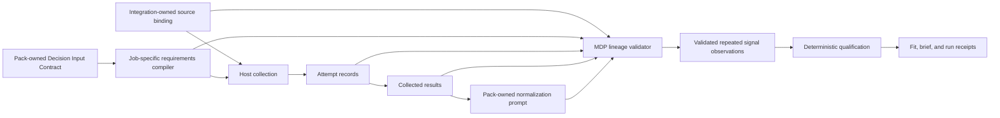
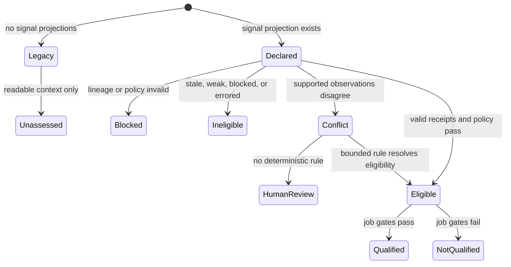
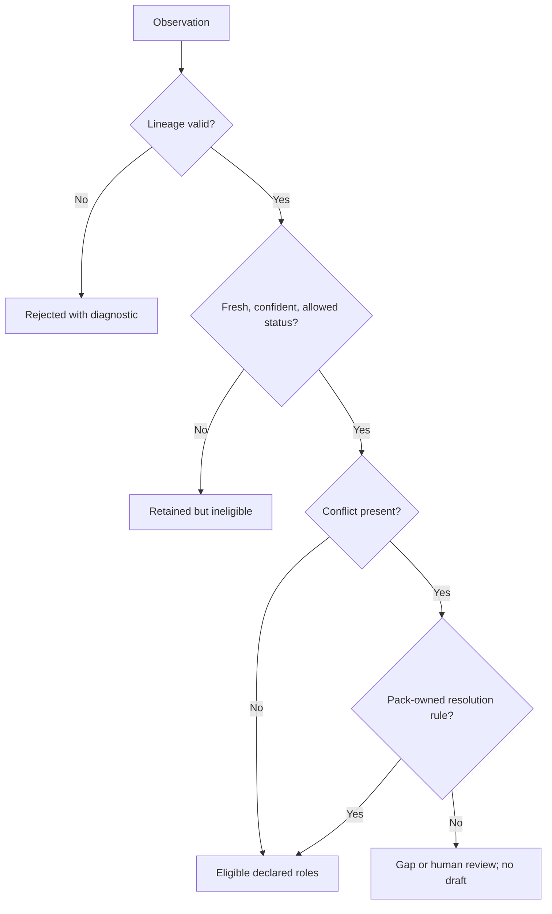

# First-Class Sourced Signals and Deterministic Qualification - Plan

## Goal Capsule

- **Objective:** Let a pack declare which sourced observations count as signals, preserve exact lineage and conflicts, and qualify from declared semantics instead of keyword guesses.
- **Product authority:** The profile's Decision Input Contracts own collection questions, source policy, signal projections, and decision effects. Host-produced attempt records and receipts own observed source facts. MDP validates the chain but does not collect data.
- **Implementation authority:** One compiled signal-projection contract and one shared validator govern requirements, normalized output, qualification, run receipts, CLI projections, and agent behavior.
- **Stop conditions:** A signal cannot count when its projection, source attempt, receipt hash, confidence, freshness, or semantic role is missing or inconsistent. Conflicting observations remain visible and cannot silently become a ready result.
- **Execution profile:** Add an opt-in v2 normalization path for signal-aware jobs. Preserve scalar-only v1 packs and legacy prospect files as readable but unassessed evidence.
- **Tail ownership:** MDP-198 owns authored signal semantics, compiled lineage contracts, deterministic eligibility, CLI and skill parity, synthetic fixtures, compatibility proof, and release/install validation. It does not own collection, enrichment, provider execution, outreach, or the later MDP-199 through MDP-201 gates.

## Product Contract

### Summary

MDP-198 turns signals from loosely named prospect strings into declared, traceable observations. A pack defines a stable signal kind, the closed qualification roles it may serve, the Decision Input source policy, and the conflict behavior. A host collects data through the existing source-attempt flow. MDP then validates that every accepted signal is internally linked through that submitted flow and applies deterministic eligibility rules.

This change preserves legacy inputs. Existing strings remain parseable context, but they cannot represent sourced proof for a job that opts into first-class signals. MDP reports qualifying v2 artifacts as `lineage-validated`, which means the host-submitted chain is internally consistent with declared policy. It does not attest that the host is authentic or that an observation is true.

### Problem Frame

The current runtime treats a non-empty `Signal.source` string as source-backed and infers fit, why-now, and person-resolution meaning by searching signal prose for built-in keywords. That makes qualification depend on wording rather than pack authority. It also allows a hypothesis or arbitrary source label to look stronger than its receipts justify.

The current Decision Input chain already validates attempts, confidence, freshness, normalized values, and request/result hashes. Its attributes are scalar, and validation intentionally rejects `signals` as an output path. It therefore cannot preserve repeated or conflicting observations without a distinct projection contract.

### Key Decisions

- **Pack-declared kinds with engine-owned roles.** (session-settled: user-approved — chosen over one universal signal taxonomy or keyword inference: profiles need their own vocabulary while deterministic qualification needs closed semantics.) Kinds are profile-extensible. Roles are closed CLI meanings such as fit, why-now, person-resolution, and disqualifier. Governs R1-R4 and R15-R17.
- **Receipt-backed evidence only.** (session-settled: user-approved — chosen over trusting free-text source labels: accepted signals must be auditable to host-produced attempts and hashes.) Governs R5-R10 and R18.
- **Preserve conflicts as observations.** (session-settled: user-approved — chosen over last-write-wins merging: disagreement is decision context and must remain inspectable.) Governs R11-R14 and R19.
- **Legacy compatibility without evidence laundering.** (session-settled: user-approved — chosen over breaking old packs or treating legacy strings as sourced proof: compatibility must not weaken provenance.) Governs R20-R22.
- **Keep collection outside MDP.** (session-settled: user-approved — chosen over provider or enrichment execution inside the CLI: MDP remains the local contract and validation layer.) Governs R23-R24.

### Actors

- A1. **Pack author** — declares signal kinds, roles, source policy, cardinality, conflict behavior, and decision effects.
- A2. **Integration owner** — maps external fields to qualified Decision Input identities without placing provider credentials or raw records in the pack.
- A3. **Host runtime** — collects declared attempts and submits immutable attempt, result, binding, and normalization receipts.
- A4. **Operator or reviewing agent** — inspects accepted, rejected, stale, conflicting, and missing signals before fit or drafting.
- A5. **Legacy pack maintainer** — keeps existing packs valid while choosing when to adopt the stronger contract.

### Flows

- F1. **Author and compile:** A pack author declares a signal projection. `mdp requirements --job` compiles the exact input, source-binding, attempt, result, normalization, and eligibility contract.
- F2. **Collect and normalize:** The host uses the compiled request, records attempts and collected results, and invokes the pack-owned normalization prompt. No collection occurs inside MDP.
- F3. **Validate lineage:** MDP verifies the source binding and every projected observation against the immutable request, collected results, prompt, and receipt hashes.
- F4. **Resolve conflicts:** MDP retains all observations in stable order and applies only the pack-owned conflict rule. An unresolved conflict becomes a gap or human-review state.
- F5. **Qualify and explain:** Fit, brief, and run surfaces consume validated roles and report why each signal was accepted or rejected. They do not reclassify wording.
- F6. **Read legacy input:** Legacy signals and attributes remain readable. They are marked legacy or unassessed and cannot satisfy an opted-in sourced-signal gate.

### Requirements

**Authored semantics**

- R1. A Decision Input Contract may declare repeated signal projections with stable IDs that are qualified by contract ID.
- R2. Each projection declares one profile-defined signal kind and zero or more closed qualification roles.
- R3. The pack, not the host, assigns the kind and roles that enter deterministic qualification.
- R4. Validation rejects unknown roles, undeclared kinds, duplicate qualified IDs, ambiguous contributor references, and invalid cardinality or conflict policies.

**Lineage and evidence**

- R5. Each projected observation binds to its Decision Input Contract, projection, contributing attribute results, and exact source-attempt identities.
- R6. Signal-aware normalization binds the exact source-binding artifact hash, source-attempt request hash, collected-results hash, prompt identity, and normalization output hash.
- R7. Source binding records adapter profile and version, logical source identity, source class, transformation identity, acquisition mode, and opaque or sanitized upstream references without storing provider credentials or raw private records.
- R8. MDP verifies value, source class, sanitized locator, observation time, numeric confidence, and derived freshness against the collected results rather than accepting model-authored provenance.
- R9. Confidence continues to measure anchoring strength, not truth probability.
- R10. Hashes prove artifact identity and linkage only; `lineage-validated` must not claim host authenticity, signer identity, authorization, source truth, or non-repudiation without a separately trusted attestation mechanism.

**Repeated observations and conflicts**

- R11. The normalized contract preserves every accepted observation as a separate stable record in deterministic order.
- R12. A projection declares bounded cardinality and whether compatible observations may coexist.
- R13. Differing supported observations remain visible and enter the declared conflict policy without implicit canonicalization or newest-value-wins behavior.
- R14. A conflict without a deterministic pack-owned resolution produces a bounded gap or human-review result and remains no-draft.

**Qualification semantics**

- R15. Signal-aware jobs qualify only from validated closed roles and never from signal titles, IDs, source prose, provider field names, or arbitrary attributes.
- R16. An explicit role works without keyword matches, and keyword-rich legacy content cannot acquire that role.
- R17. Stale, low-confidence, blocked, malformed, provider-error, hypothetical, or unresolved-conflict observations cannot silently satisfy a qualification gate.
- R18. Qualification and run receipts expose accepted and rejected signal IDs, roles, eligibility decisions, and bounded diagnostics with joinable lineage identities.
- R19. General message-card matching may continue to use ordinary context, but it must not present legacy context as sourced-signal proof.

**Compatibility and agent parity**

- R20. Scalar-only Decision Input Contracts, v1 source bindings, v1 normalized envelopes, and existing prospect JSON remain structurally valid.
- R21. Signal-aware jobs use a distinct compiled v2 normalization and lineage contract; v1 and v2 semantics are not mixed inside one job execution.
- R22. Legacy signals remain readable as context and report `legacy` or `unassessed`; they cannot satisfy an explicit sourced-signal role.
- R23. CLI JSON, human briefs, run receipts, schemas, capabilities, docs, templates, and canonical plugin skills expose the same signal status and lineage boundary.
- R24. MDP performs no browsing, scraping, enrichment, provider call, credential handling, CRM write, scheduling, drafting send, or outreach action as part of this feature.
- R25. Signal-aware fit, brief, and run paths consume the lineage-validated normalized envelope or an immutable projection receipt bound to it; editing a detached prospect cannot retain lineage-validated status.
- R26. Matching observations may form one logical signal only when their meaningful projected values match, while all sorted observation receipts remain visible and the logical signal counts once for cardinality.
- R27. This increment permits attribute-to-signal projection only; it rejects signal-to-signal derivation and requires explicit declaration before one observation may support multiple projections or roles.
- R28. Signal-aware artifacts use a public contract-version matrix that names every v2 discriminator, its unchanged legacy counterpart, and every rejected mixed-version combination.
- R29. MDP enforces engine-owned limits for input bytes, projections, observations, contributors, identifiers, locators, strings, and diagnostics before untrusted host data can amplify resource use.
- R30. MDP enforces a field-level egress allowlist, length and character rules, control-character rejection, renderer escaping, and locator non-dereference for every host-originated value exposed through JSON, human, agent, or diagnostic output.
- R31. Fit results label every decision contribution as lineage-validated, legacy, or unassessed and cannot describe an aggregate decision as sourced when a required condition depends only on legacy context.
- R32. The release includes one documented, validated manual legacy-to-v2 conversion workflow that uses the existing CLI and canonical template without generalized migration automation.

### Acceptance Examples

- AE1. **Valid sourced signal:** Given a declared why-now projection and matching binding, attempt, result, prompt, and normalization hashes, MDP marks the chain lineage-validated and qualification may use its why-now role. Covers R1-R10 and R15-R18.
- AE2. **Words are not roles:** A legacy signal titled “strong fit and urgent timing” has a non-empty source string but no compiled projection. It remains readable and cannot satisfy fit or why-now gates. Covers R15-R17 and R20-R22.
- AE3. **No invented provenance:** A model returns a signal whose value or attempt ID is absent from collected results. Validation rejects it with a stable diagnostic and drafting stays blocked. Covers R5-R8 and R17-R18.
- AE4. **Stale or weak evidence:** A correctly linked observation misses its freshness or confidence threshold. Its receipt remains inspectable, its role is ineligible, and the declared status behavior determines the bounded result. Covers R8-R9 and R17-R18.
- AE5. **Preserved conflict:** Two supported attempts produce different values for one projection. Both remain in the envelope. Without a declared deterministic resolution, the result is human review or a gap and no draft is allowed. Covers R11-R14 and R18.
- AE6. **Deterministic conflict rule:** Two observations conflict. `require-agreement` routes to human review, while `any-disqualifies` may produce disqualification when at least one lineage-validated observation carries the declared disqualifier role. No positive winner-selection policy is allowed. The receipt retains every observation. Covers R11-R14 and R18.
- AE7. **Lineage mismatch:** Each independent mismatch in binding hash, request hash, results hash, contract ID, projection ID, attempt ID, source class, locator, or observation time fails closed with a stable code. Covers R5-R10.
- AE8. **Legacy compatibility:** An existing scalar-only pack and prospect file validate as before. Their signals are unassessed for first-class provenance and cannot be advertised as self-standing sourced qualification. Covers R20-R23.
- AE9. **Privacy-safe explanation:** A human brief shows stable IDs, roles, eligibility, confidence/freshness state, and opaque source references. It does not print raw collected records or private excerpts. Covers R7, R18, and R23-R24.
- AE10. **Lineage-validated handoff:** A valid v2 envelope enters fit and retains its lineage receipt. Copying or editing its prospect projection cannot enter the sourced path without a new valid receipt. Covers R18, R23, and R25.
- AE11. **Duplicate agreement:** Two attempts produce the same meaningful projected value. One logical signal satisfies its declared roles and cardinality once, while both sorted observation receipts remain inspectable. Covers R11-R13 and R26-R27.
- AE12. **No implicit derivation:** A host derives one signal from another or reuses one observation across undeclared roles. Validation rejects the projection even when the values are plausible. Covers R3-R5 and R27.
- AE13. **Host trust boundary:** A host submits a self-consistent fabricated chain. MDP may mark the linkage lineage-validated but never reports the host or observation as authenticated or true. Covers R9-R10.
- AE14. **Malicious display input:** A host supplies oversized identifiers, control characters, embedded newlines, prompt-like text, and a dereferenceable locator. MDP rejects or safely bounds the fields before they reach JSON, terminal, human, or agent surfaces. Covers R29-R30.

### Scope Boundaries

**Now**

- Add first-class signal projections to Decision Input Contracts.
- Compile and validate repeated observations and exact lineage.
- Replace keyword qualification for opted-in jobs with explicit roles.
- Preserve legacy compatibility and prove the distinction.
- Update the synthetic Clay proof, CLI surfaces, docs, skills, templates, and release validation.

**Later**

- MDP-199 owns governance and evidence-system expansion beyond this signal contract.
- MDP-200 owns minimal-context and governed-generation proof.
- MDP-201 owns the final cold-model qualification suite.
- Migration convenience may automate authoring only after the contract is stable.

**Never in this feature**

- A universal cross-profile catalog of signal kinds.
- Provider SDKs, enrichment execution, autonomous research, CRM mutation, or outreach.
- Raw private records, credentials, cookies, or source excerpts in pack or public fixtures.
- Silent conflict merge, role inference from prose, or hashes presented as proof of truth.

### Success Criteria

- Every opted-in signal used for qualification is traceable through a validated, hashed lineage chain.
- Qualification results do not change when signal prose changes but declared roles and receipts do not.
- Conflicting observations remain separately inspectable and follow the declared bounded policy.
- Legacy packs remain valid while agent and operator surfaces state their evidence limitation honestly.
- The synthetic reference workflow, packaged templates, canonical skills, full validation, release, and installed smoke test agree.

## Planning Contract

### Key Technical Decisions

- KTD1. **Add a repeated projection registry beside scalar DIC attributes.** Do not permit `output_path: signals` or array-index output paths. The existing scalar projection remains intact, while signal projections compile a repeated observation contract. Governs R1-R4 and R11-R14.
- KTD2. **Separate profile-extensible `kind` from closed `roles`.** The compiler assigns roles from pack authority, and normalized output must echo rather than author them. This preserves profile vocabulary without moving qualification semantics into prose. Governs R2-R4 and R15-R17.
- KTD3. **Introduce an opt-in v2 normalized envelope for signal-aware jobs.** Keep `mdp.normalized-decision-input.v1` and scalar-only compiled schemas byte-semantically stable. Structured observations live in the v2 envelope, not in the legacy signal array. A public version matrix owns discriminators and rejected mixtures. Governs R20-R22 and R28.
- KTD4. **Bind source mapping into the runtime hash chain.** A signal-aware source binding is supplied to validation, hashed, and referenced by the request, collected results, normalized envelope, and decision receipt. This closes the current gap between integration mapping and runtime evidence. Governs R5-R8 and R21.
- KTD5. **Use qualified identities, typed equality, and a closed conflict algebra.** Contract ID, projection ID, observation ID, attempt ID, and contributing attribute IDs form the join surface. Each projection's typed value contract defines canonical equality and participates in the contract hash. Matching values count once with all sorted receipts. V2 permits only `require-agreement` and `any-disqualifies`; newest, highest-confidence, and other positive winner-selection policies are forbidden. Governs R5, R11-R14, R18, and R26-R27.
- KTD6. **Keep legacy signal fields additive and non-authoritative.** Do not change the existing string types for `source`, `confidence`, or `freshness`. Add a discriminated structured representation for first-class observations and label the old form legacy or unassessed. Governs R20-R22.
- KTD7. **Centralize eligibility and diagnostic projection.** One shared signal validator checks lineage, confidence, freshness, status, conflict state, and roles. Requirements, fit, briefs, run, schemas, and skills consume its result. Governs R15-R19 and R23.
- KTD8. **Expose bounded receipts through an enforced egress contract.** Machine outputs retain joinable identities and hashes. MDP validates host-originated display fields against engine-owned size and character limits, escapes each renderer, never dereferences locators, and exposes only the surface allowlist. Detailed host-owned artifacts remain external. Governs R7, R10, R18, R23-R24, and R29-R30.
- KTD9. **Carry lineage-validated authority into qualification.** Signal-aware fit and brief accept a v2 envelope or frozen projection receipt through an explicit input. The receipt binds the envelope, projected prospect, job ID, pack hash, requirements hash, validator version, and eligibility-policy hash. Detached prospect input remains the legacy path and cannot claim first-class provenance. Governs R18, R21-R23, R25, and R31.
- KTD10. **Provide a bounded manual adoption path.** The CLI and canonical template document how to declare projections, compile requirements, validate a v2 binding, validate normalization, and run lineage-aware fit without adding migration automation. Governs R20-R23 and R32.

### High-Level Technical Design

The diagrams show contract boundaries and state flow. They do not prescribe Rust type names or exact serialized field names.







### System-Wide Impact

- **Public contracts:** The manifest, exported schemas, requirements output, normalized output, source binding, fit output, brief output, and run receipts gain an opt-in signal-aware path.
- **Data lifecycle:** Exact binding, request, results, normalization, and decision identities must remain joinable. Validation failures propagate as bounded no-draft states.
- **Privacy and resource safety:** Detailed collected records stay host-owned. Public fixtures use synthetic values. Engine-owned parse and egress limits bound identifiers, hashes, eligibility, locators, collection size, and diagnostics before output.
- **Agent parity:** CLI JSON is primary. Human README or skill prose cannot invent roles, provenance, or readiness. Agents must stop on missing or blocked compiled authority.
- **Compatibility:** Existing v1 packs, source bindings, normalized responses, templates, and simple prospect files retain their old validation path.
- **Release identity:** Any changed schemas, CLI behavior, plugin skills, or template assets require the repository's patch release and installed-artifact closeout.

### Risks and Mitigations

- **Contract drift:** The same concept touches several closed JSON schemas. Mitigate with one shared compiler/validator, exported-schema tests, and live-output schema validation.
- **Evidence laundering:** Legacy attributes or prose may still influence general text matching. Mitigate by separating general context matching from sourced-role eligibility and testing misleading keyword-rich inputs.
- **False provenance claims:** Hashes can be mistaken for source truth. Mitigate with the `lineage-validated` status and explicit host-authenticity and truth disclaimers.
- **Conflict loss:** A scalar or last-write-wins implementation would erase disagreement. Mitigate with repeated records, stable identities, deterministic order, and conflict fixtures before qualification work lands.
- **Private-data leakage or injection:** Host-controlled receipts can carry secrets, control characters, or prompt-like text. Mitigate with engine-owned input limits, egress allowlists, renderer escaping, locator non-dereference, opaque references, synthetic fixtures, and sentinel-secret tests.
- **Migration ambiguity:** Silently widening v1 would break exact replay expectations. Mitigate with an opt-in v2 path and unchanged v1 fixtures/digests.
- **Cross-surface mismatch:** CLI, run, docs, and skills may interpret readiness differently. Mitigate with parity tests that feed one fixture through each surface.

### Dependencies and Sequencing

U1 establishes authored authority. U2 compiles and validates lineage. U3 validates repeated normalized observations. U4 cuts qualification over to declared roles. U5 demonstrates adoption and compatibility. U6 aligns agents and documentation. U7 runs system validation and release closeout.

MDP-199 through MDP-201 remain downstream. MDP-198 must not absorb their governance, minimal-context, generation, or cold-model proof.

### Sources and Repository Anchors

- `CONCEPTS.md` and `docs/decision-input-contracts.md` define the existing Decision Input chain, confidence meaning, and host/MDP boundary.
- `cli/src/models.rs`, `cli/src/commands/requirements.rs`, and `cli/src/commands/source_binding.rs` contain the current scalar contracts and receipt chain.
- `cli/src/commands/health.rs` intentionally rejects composite `signals` output paths.
- `cli/src/commands/routing.rs` contains the keyword-based qualification seam that this plan replaces for opted-in jobs.
- `docs/orchid/plans/2026-07-29-001-mdp-166-decision-input-contract-plan.md` and `docs/orchid/plans/2026-07-30-001-mdp-167-source-binding-validation-plan.md` record the existing additive and integration-owned boundaries.
- [W3C PROV-O](https://www.w3.org/TR/prov-o/) and [W3C PROV Constraints](https://www.w3.org/TR/prov-constraints/) support qualified derivation, usage/generation links, uniqueness, and consistency checks without requiring MDP to adopt RDF.
- [JSON Schema 2020-12 Validation](https://json-schema.org/draft/2020-12/json-schema-validation) supplies structural cardinality tools; qualified identity, lineage equality, and conflict semantics remain application-level validation.

## Implementation Units

### U1. Add authored signal projection and structured observation contracts

- **Goal:** Add the opt-in pack and prospect model shapes that distinguish first-class sourced observations from legacy signals.
- **Requirements:** R1-R4, R11-R13, R20-R22, and R28-R30.
- **Files:** `cli/src/models.rs`, `cli/src/commands/schemas.rs`, `cli/src/commands/health.rs`, `cli/src/prospect_validation.rs`, `cli/src/value_contracts.rs`, and focused tests in those modules.
- **Approach:** Add a repeated DIC projection declaration with qualified identity, profile-defined kind, closed roles, contributor references, cardinality, conflict policy, and decision effects. Add a discriminated structured observation shape while preserving legacy string fields.
- **Test scenarios:** Accept a valid structured observation. Preserve a legacy prospect. Reject unknown roles, undeclared kinds, duplicate qualified IDs, ambiguous contributors, invalid bounds, malformed structured receipts, mixed contract versions, over-limit artifacts, unsafe display fields, and a scalar attribute that targets composite signals.
- **Verification:** Focused schema/model tests pass, exported schemas validate representative legacy and v2 fixtures, and legacy serialized shapes remain accepted.

### U2. Compile signal lineage and source-binding contracts

- **Goal:** Extend job-specific requirements so hosts can collect and return exact signal-aware evidence without hidden conventions.
- **Requirements:** R5-R10, R20-R24.
- **Files:** `cli/src/commands/requirements.rs`, `cli/src/commands/source_binding.rs`, `cli/src/commands/health.rs`, `cli/src/commands/capabilities.rs`, `cli/src/cli.rs`, `cli/src/app.rs`, and their existing module tests.
- **Approach:** Compile v2 source-attempt, collected-results, normalization, and source-binding schemas from the selected job. Bind the exact source-binding hash into the immutable request and downstream receipts. Keep scalar-only v1 compilation unchanged.
- **Test scenarios:** Compile one and multiple projections. Accept a complete binding. Reject missing, duplicate, or unknown projection mappings; stale pack or requirements hashes; adapter or transformation drift; wrong source class; invalid sanitized locator; binding-hash mismatch; and mixed v1/v2 inputs.
- **Verification:** Requirements and source-binding tests prove exact coverage and hash linkage. Existing v1 fixture hashes and output behavior remain stable unless an intentional release fixture documents otherwise.

### U3. Validate repeated projection, provenance, and conflict states

- **Goal:** Prove that normalized first-class signals are exact, non-collapsed projections of collected attempt results.
- **Requirements:** R5-R14 and R17-R18.
- **Files:** `cli/src/commands/prompt_output.rs`, `cli/src/commands/requirements.rs`, `cli/src/prospect_validation.rs`, `cli/src/commands/health.rs`, and focused governed-output fixtures.
- **Approach:** Reuse the compiled contracts and one shared validator to check observation identity, value, contributors, attempt references, source policy, binding/request/results hashes, confidence, freshness, status, deterministic ordering, duplicate agreement, and conflict policy. Keep projection acyclic by accepting attribute contributors only.
- **Test scenarios:** Accept multiple compatible observations. Coalesce matching values into one logical signal while retaining all receipts. Preserve two conflicting observations. Reject invented values, missing attempts, wrong contract or projection IDs, each independent hash mismatch, source-class drift, timestamp drift, duplicate observation IDs, signal-to-signal derivation, undeclared evidence reuse, hidden merges, and ready output with an unresolved conflict.
- **Verification:** Positive and negative governed-output tests return stable statuses and diagnostic codes. Conflict output remains inspectable and no-draft unless the declared rule resolves eligibility.

### U4. Replace keyword qualification with explicit role eligibility

- **Goal:** Make fit, brief, and run decisions consume validated roles and retain decision receipts.
- **Requirements:** R15-R19, R23, R25-R27, and R31.
- **Files:** `cli/src/commands/routing.rs`, `cli/src/utils.rs`, `cli/src/run_runtime.rs`, `cli/src/commands/briefs.rs`, `cli/src/commands/human_brief.rs`, `cli/src/output.rs`, `cli/src/commands/schemas.rs`, and related module tests.
- **Approach:** Route signal-aware jobs through the shared eligibility result and the lineage-validated envelope handoff. Remove keyword fallback inside that path. Preserve detached prospect input on the documented legacy path without mixing its evidence status into explicit gates.
- **Test scenarios:** An explicit role passes without keywords. Keywords without a role fail. Legacy attributes and source prose cannot count. Stale, weak, hypothetical, errored, and conflicting signals stay ineligible. A dual-role logical signal satisfies both gates but counts once. An edited detached prospect loses lineage-validated status. Fit and run receipts agree on accepted/rejected IDs, authority classes, and reasons. Human output rejects or escapes malicious display values.
- **Verification:** Routing, brief, schema, output, and run tests agree for the same fixtures. A validated envelope remains linked after runtime prospect extraction.

### U5. Adopt the contract in synthetic fixtures and prove migration

- **Goal:** Provide one complete public signal-aware workflow and retain broad compatibility coverage.
- **Requirements:** R1-R24.
- **Files:** `examples/clay-audiences-self-serve-enterprise-expansion/.mdp/**`, its synthetic fixtures and README, `examples/ai-sdr-eve-vercel/**`, `examples/run-conformance/**`, `scripts/test-run-conformance.mjs`, `cli/src/starter.rs`, `cli/src/target_starter.rs`, `cli/src/commands/init.rs`, `plugin/assets/templates/basic/.mdp/**`, `assets/templates/basic/.mdp/**`, and affected proposal compatibility fixtures.
- **Approach:** Make the Clay example the complete lineage proof. Adopt explicit roles in the basic GTM starter where the product contract is supported. Keep proposal and legacy examples honest when they do not opt in.
- **Test scenarios:** Prove valid multi-observation qualification, stale and weak evidence, forged lineage, missing receipt, preserved conflict, deterministic rule, legacy string compatibility, target-starter gaps, proposal non-adoption, source/plugin asset parity, and synthetic/public-safe content.
- **Verification:** Basic, proposal, Clay, and run-conformance fixtures validate and evaluate with expected statuses. Generated starter assets match packaged mirrors byte for byte.

### U6. Align agent-native workflows and documentation

- **Goal:** Let agents and humans discover, validate, explain, and stop on the same compiled signal authority.
- **Requirements:** R9-R10, R18-R24, and R28-R32.
- **Files:** `CONCEPTS.md`, `README.md`, `cli/USAGE.md`, `docs/decision-input-contracts.md`, `docs/conceptual-decision-flow.md`, `docs/getting-started.md`, `plugin/skills/mdp/SKILL.md`, `plugin/skills/mdp-gtm-brief/SKILL.md`, `plugin/skills/mdp-gtm-brief/references/prospect-fit-or-brief.md`, `plugin/skills/mdp-pack-builder/SKILL.md`, `plugin/skills/mdp-pack-builder/references/decision-input-contracts.md`, `plugin/skills/mdp-pack-review/SKILL.md`, `plugin/skills/mdp-pack-review/references/structural-audit.md`, and skill contract tests.
- **Approach:** Make `capabilities` and `requirements --job` the discovery surface. Teach build, review, and GTM skills to distinguish legacy context from validated sourced evidence and to stop on missing receipts or conflicts.
- **Test scenarios:** An agent finds the compiled projection without reading all cards. It reports exact diagnostics for blocked evidence, never upgrades legacy strings, explains conflicts with bounded receipts, distinguishes lineage validation from authenticity, follows the manual adoption workflow, and avoids provider or outreach actions. Documentation states the limited meaning of hashes.
- **Verification:** Skill validators, behavioral contract tests, Pluxx packaging, and CLI/docs examples pass with no authored host-specific skill copies.

### U7. Run full validation, release, and installed-artifact proof

- **Goal:** Close MDP-198 with source, packaged, released, and installed behavior in agreement.
- **Requirements:** R20-R24.
- **Files:** `Makefile`, `scripts/release-install-smoke.sh`, release metadata only if existing validation requires fixture updates, and no unrelated product code.
- **Approach:** Run narrow checks first, then the full repository gate. After merge, cut the next routine patch release from current main and smoke-test the installed CLI/plugin behavior.
- **Test scenarios:** Fresh install exposes the signal-aware schemas and requirements output, validates the canonical v2 fixture, preserves a v1 fixture, and produces the same bounded qualification receipts as the source tree.
- **Verification:** The Verification Contract passes from the merge commit. The release tag contains that commit. The documented installer succeeds and the installed artifact passes focused smoke tests.

## Verification Contract

Run focused checks during each unit, then require all of these before closeout:

```bash
cargo test --manifest-path cli/Cargo.toml
cargo run --manifest-path cli/Cargo.toml -- --json validate --dir plugin/assets/templates/basic
cargo run --manifest-path cli/Cargo.toml -- --json validate --dir plugin/assets/templates/proposal
cargo run --manifest-path cli/Cargo.toml -- --json validate --dir examples/clay-audiences-self-serve-enterprise-expansion
node scripts/test-run-conformance.mjs
python3 scripts/validate-skill-contracts.py
python3 -m unittest scripts/test_skill_contracts.py
python3 scripts/validate-skill-packaging.py
diff -qr plugin/assets assets
make validate
```

The fixture matrix must include:

- a valid first-class signal with exact lineage and lineage-validated fit handoff;
- multiple compatible observations;
- duplicate agreeing observations that count once while preserving receipts;
- conflicting observations with and without a deterministic rule;
- unknown kind and role;
- invented value or contributor;
- missing and mismatched attempt, binding, request, results, and prompt receipts;
- wrong source class, locator, timestamp, confidence, freshness, and status;
- misleading keyword-only legacy signals and attributes;
- edited detached prospects and undeclared signal-to-signal derivation;
- scalar-only v1 packs, source bindings, normalized envelopes, and prospects;
- agent-visible parity across capabilities, requirements, fit, brief, run, schemas, and skills;
- privacy-safe summaries and public synthetic artifacts.
- boundary and over-limit artifacts for every engine-owned ceiling;
- malicious host-originated strings across JSON, terminal, human, and agent surfaces;
- the public v1/v2 version matrix and every rejected mixed-version combination;
- the documented manual legacy-to-v2 workflow.

After merge, follow the repository release contract:

```bash
bash <(curl -fsSL https://mdp.orchidlabs.dev/install.sh) --agents -y
```

Verify the installed `mdp`, not only the source binary. Record the merged commit, released patch tag, and installed smoke result.

## Definition of Done

- U1-U7 meet their goals, cited requirements, test scenarios, and verification outcomes.
- Every opted-in qualification signal is lineage-validated against source mapping, attempt, result, prompt, and normalization identities without implying host authenticity or source truth.
- Explicit roles replace keyword inference for signal-aware jobs, with no fallback through legacy attributes or prose.
- Conflicts remain visible and produce only the declared deterministic outcome or a bounded no-draft state.
- V1 and legacy fixtures remain valid and are described as unassessed rather than sourced.
- CLI, run, schemas, templates, docs, and canonical skills agree on readiness, lineage, and privacy boundaries.
- Public fixtures contain only synthetic or sanitized data.
- Host-originated inputs and outputs satisfy engine-owned resource and egress limits.
- The manual legacy-to-v2 conversion workflow passes from a clean canonical template.
- No provider, collection, CRM, outreach, or generalized execution capability is introduced.
- Full validation passes with no abandoned experiments, duplicate validators, dead compatibility branches, or unrelated changes in the final diff.
- Linear reflects the merged PR, release tag, installed smoke result, and downstream issue state.
