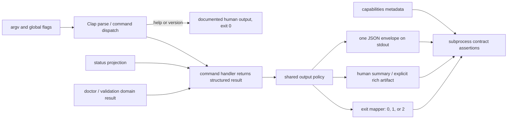

# MDP CLI Human-Readable and Contract-Consistent UX - Plan

## Goal Capsule

- **Objective:** Make the existing MDP CLI easy for a human operator to discover, follow, and diagnose while preserving deterministic, parseable behavior for agents and wrappers.
- **Product authority:** The MDP product boundary and the current command set remain unchanged. MDP remains a local/offline decision-context standard and bounded deterministic run/verify kernel; it does not become a hosted service, CRM, sequencer, enrichment provider, scraper, BI tool, or generic automation system.
- **Implementation authority:** One explicit output-and-exit policy owns human rendering, JSON envelopes, error classification, domain validity, and exit-code decisions. Command implementations continue to own domain work and return structured results to that boundary.
- **Stop conditions:** Do not add login, `whoami`, hosted state, network auth, silent update behavior, command renames, or a new command hierarchy. Do not silently reshape an existing machine-readable payload; additive fields and explicitly documented mode changes are required.
- **Execution profile:** Add a read-only `status` surface, a useful no-argument first-run path, complete help text, consistent human output, a tested machine/error contract, and synchronized docs/skills. Finish with CLI, repository, release, installer, and installed-artifact proof.
- **Tail ownership:** MDP-202 owns the CLI behavior, output contract, subprocess tests, README/USAGE/distribution docs, authored plugin skills, and release/install proof. MDP-3 owns version subcommand work; MDP-4 owns update/upgrade behavior; neither is reimplemented here.

## Product Contract

### Product Contract Preservation

Product Contract unchanged. This plan turns the approved MDP-202 scope into an implementation sequence. The CLI remains an offline, explicit, auditable operator surface over local packs and declared artifacts.

### Summary

MDP already exposes the core workflows needed to initialize, inspect, validate, route, produce, verify, and run against a pack. The remaining experience problem is semantic consistency at the boundary: a human often has to know the repository's internal command map before the CLI explains what is happening, while an agent can encounter output or exit behavior that varies by command and rendering flag.

The target state keeps the full existing capability surface but gives it one predictable contract:

- humans get concise summaries, useful next actions, and diagnostics they can act on;
- agents get one JSON envelope on stdout whenever `--json` is requested, including parse/runtime errors;
- `data.valid` describes domain validity while top-level `ok` describes command execution/envelope success;
- exit codes distinguish success, invalid domain state, runtime failure, and invalid arguments;
- rich Markdown or YAML is emitted only when explicitly requested and never leaks into `--json` stdout;
- help, capabilities, docs, and plugin skills describe the same command and option semantics.

### Problem Frame

The current Rust CLI has 28 flat commands and a strong command-level capability registry, but several boundary seams make the product feel less coherent than the underlying functionality:

- there is no read-only `status` command that answers version, local/offline/auth posture, pack/profile/target context, health, and next action in one place;
- no-argument invocation does not guide a first-time human through the product;
- many options have no help descriptions, including important `--dir`, `--job`, `--persona`, and `--file` inputs;
- the default human renderer falls back to pretty JSON for many commands, which is technically readable but not an intentional operator experience;
- summary mode can print meaningless `null` fields;
- `doctor` does not use the same invalid-result exit path as validation;
- `--json --readable` can currently emit Markdown from a branch that bypasses the shared JSON renderer;
- parse errors and runtime errors do not share the same machine-readable error envelope or stable classification path;
- `cli/USAGE.md` contains an invalid target-aware `init` example, while the broader docs and skills are not all guaranteed to stay aligned.

### Key Decisions

- **Keep the current flat command names.** Discoverability improves through descriptions, grouped help, `status`, examples, and a no-argument guide; a breaking taxonomy or alias migration is not required for this scope.
- **Make `status` local and read-only.** It reports the CLI version, offline/auth posture, resolved pack context, health, and next action without login, network access, or state mutation. The result is the versioned observational snapshot `mdp.status.v0`; missing local context is reported as a state to fix, not as a reason to invent auth behavior. Observational status exits 0 even when the pack is absent or unhealthy; `doctor` and `validate` remain the explicit health gates.
- **Use one versioned envelope policy for `--json`.** Preserve the current success distinction between `data` and `summary`, add the additive envelope marker `contract: "mdp.cli-envelope.v0"`, and define known command identity (or `null` for a parser failure). Command/argument failures return `{ok:false, contract, command, error:{code,message,...}}`. Every result is one JSON value on stdout, with no Markdown, headings, progress text, or pretty-JSON side channel.
- **Separate envelope success from domain validity.** `ok` means the command reached its declared response contract. A validation or doctor result may therefore be `{ok:true, data:{valid:false,...}}` and still exit nonzero because the local domain state is invalid. Observational status uses `data.contract: "mdp.status.v0"` and `data.health.state` rather than pretending that an absent pack is a validation result. Runtime/argument failures use `ok:false`.
- **Keep human diagnostics on stderr.** Human success and intentional artifacts use stdout or the requested output file; human errors use concise stderr diagnostics and a nonzero exit. JSON errors remain on stdout for compatibility with wrappers that parse the complete machine response.
- **Preserve explicit rich-artifact modes.** `--readable`, `--format`, and output-file flows remain available where they are meaningful. When `--json` is present, the machine contract wins and the result is enveloped as JSON rather than leaking a rich artifact to stdout.
- **Prove the contract at the executable and wrapper boundaries.** Existing unit tests remain useful for rendering details, but subprocess tests must exercise real argv, stdout, stderr, and exit codes. The MCP/conformance wrappers and the installed release binary must consume the same envelope without a second interpretation layer.

### Actors

- **A1. Human operator** — installs MDP, opens an unfamiliar pack, follows help and next actions, and diagnoses invalid local state without reading Rust source.
- **A2. Agent or wrapper** — discovers capabilities, invokes a command, parses JSON, distinguishes domain-invalid results from execution errors, and preserves receipts/artifacts.
- **A3. Pack author or maintainer** — initializes and validates packs, reads human output, and relies on stable options and documentation.
- **A4. Reviewer/release operator** — verifies that source, docs, plugin skills, release assets, and the installed binary present the same CLI contract.

### Requirements

**Discovery and first-run operation**

- **R1.** Add a read-only `mdp status` command that returns `data.contract: "mdp.status.v0"` with observed CLI version, local/offline/auth posture, resolved pack directory and identity, profile/target context when present, health state/diagnostics, and a concrete next action. It must distinguish observed local pack state from unobserved host/plugin state and never claim that auth, network, or a remote account was checked.
- **R2.** Make no-argument human invocation a useful first-run guide that explains what MDP is and points to the shortest relevant sequence (`status`, `init`, `doctor`, `validate`, and `capabilities`). With `--json`, no-argument invocation aliases the observational `status` result and uses the same machine envelope discipline rather than emitting prose.
- **R3.** Improve root and subcommand help so every public option has a meaningful description, value name where useful, required/optional semantics, and an example or next-step relationship where ambiguity is likely. Preserve existing command names and required arguments.

**Human output**

- **R4.** Default human mode emits concise intentional summaries for operator commands instead of accidental pretty JSON. Structured detail remains available through an explicit full/readable/artifact mode.
- **R5.** Summary output omits unavailable fields rather than printing meaningless `null` values and remains useful for `doctor`, `validate`, `capabilities`, and artifact-producing commands.
- **R6.** Human errors go to stderr, identify the failed operation, use stable plain-language wording, and point to a corrective next action when one is known. Human output must not contain machine-only envelope syntax unless the user explicitly requested it.

**Machine and exit contract**

- **R7.** `--json` produces exactly one valid JSON envelope on stdout for success, domain-invalid results, runtime failures, and Clap/argument failures. No Markdown, progress text, headings, or incidental logs may mix into that stream.
- **R8.** Define and test the distinction between top-level `ok` and `data.valid`: command/envelope success is represented by `ok`; pack or artifact validity remains in the command's declared data. Validation/doctor-style invalid results retain their existing diagnostic detail and exit nonzero. Observational `status` reports `data.health.state` and remains exit-0 even when state is missing, malformed, or unhealthy.
- **R9.** Standardize exit behavior: help/version success exits 0; observational `status` exits 0 while reporting local state; valid command execution exits 0; domain-invalid validation/doctor-style results exit 1; runtime errors exit 1; invalid arguments/unknown commands exit 2. JSON argument errors use the same envelope and stable `invalid_argument` code while retaining exit 2.
- **R10.** Route all error paths through a centralized public error table with explicit precedence, safe messages/details, and reachability for every advertised code. Cover argument parsing and declared command error codes without exposing paths, secrets, contact values, or raw private content. Capability metadata must not advertise codes the renderer cannot produce.
- **R11.** `--json` takes precedence over `--summary`, `--readable`, and rich human rendering for stdout. A rich artifact may still be written to an explicit `--out` path when the command contract supports it, but stdout remains the single JSON envelope and the saved/dry-run disposition is represented in the declared data.

**Contract synchronization and proof**

- **R12.** Align `README.md`, `docs/getting-started.md`, `cli/USAGE.md`, `docs/distribution.md`, and relevant `plugin/skills/` instructions with the actual command/options/output contract, including a corrected target-aware `init` example and the explicit no-auth/offline posture.
- **R13.** Add subprocess and wrapper-level contract coverage for representative human, JSON, argument-error, domain-invalid, readable/artifact, `status`, and no-argument flows; include parity checks between Clap syntax, `capabilities` semantic metadata, MCP/conformance consumers, and observable behavior.
- **R14.** Preserve compatibility for existing commands, flags, pack semantics, artifact schemas, and agent wrappers unless a behavior is an explicit correction covered by this contract. Keep MDP-3 version subcommand and MDP-4 upgrade/update behavior as coordinated follow-up boundaries.

### Key Flows

- **F1. First run and local context**
  - **Trigger:** A1 runs `mdp` or `mdp status` in an unfamiliar checkout.
  - **Steps:** The CLI explains the product and next commands, then `status` reports local/offline/auth posture, pack context, health, and the next action without network access.
  - **Outcome:** A human can follow the path without knowing internal command ordering or guessing whether login is required.
  - **Covered by:** R1-R3, R6, R12, R14.

- **F2. Agent discovery and invocation**
  - **Trigger:** A2 starts with `capabilities`, selects a command, and invokes it with `--json`.
  - **Steps:** The CLI returns one envelope; `ok`, `data.valid`, `error.code`, and the process exit code have their documented meanings.
  - **Outcome:** The wrapper can branch deterministically without scraping human prose or guessing whether a `null` means “not applicable.”
  - **Covered by:** R7-R10, R13-R14.

- **F3. Human command failure**
  - **Trigger:** A1 supplies an invalid argument, an invalid pack, a missing artifact, or a conflicting rich-output flag.
  - **Steps:** The CLI prints a concise stderr diagnostic, returns the correct nonzero code, and names the next corrective action where known. JSON mode returns the corresponding envelope on stdout.
  - **Outcome:** The failure is explainable to a human and branchable by an agent.
  - **Covered by:** R6-R11, R13.

- **F4. Rich artifact and machine mode coexistence**
  - **Trigger:** A1 requests a readable Markdown/YAML artifact or A2 requests `--json` on the same command.
  - **Steps:** Human mode emits the intentional rich artifact; JSON mode remains a single JSON envelope and never leaks Markdown to stdout.
  - **Outcome:** The two audiences get different representations without an accidental third contract.
  - **Covered by:** R4, R7, R11, R13-R14.

### Acceptance Examples

- **AE1. Status is a local operator cockpit.** In a valid local pack, `mdp status` reports version, offline/auth posture, pack identity, profile/target context, healthy state, and a useful next action without contacting a network or mutating files.
- **AE2. Missing pack state is actionable.** In an empty directory, `mdp status` returns an `mdp.status.v0` snapshot with a clear missing/uninitialized health state, suggests `mdp init`, and exits 0; it does not ask the operator to log in or claim that remote auth is required. `doctor`/`validate` remain the commands that fail a health gate.
- **AE3. No-argument invocation teaches the first path.** `mdp` renders a short human quickstart with the product boundary and the next commands. `mdp --json` behaves as the observational status probe and produces the documented single-envelope `mdp.status.v0` equivalent with no prose contamination.
- **AE4. Human default output is intentional.** Representative `doctor`, `validate`, `gaps`, `capabilities`, `route`, and artifact commands provide concise human summaries or explicitly named rich output; ordinary commands do not fall back to pretty JSON solely because no custom printer exists.
- **AE5. JSON purity survives rich flags.** A representative readable command invoked with `--json --readable` emits exactly one parseable JSON value on stdout, no Markdown, and the expected exit code.
- **AE6. Validity and execution are distinguishable.** An invalid pack returns `ok:true` with `data.valid:false` when the command completed its validation contract, exits 1, and retains structured issues. A missing argument returns `ok:false` with `error.code: invalid_argument` and exits 2.
- **AE7. Doctor and validation agree.** Invalid doctor/validation state uses the same domain-invalid exit path and human/JSON semantics; a healthy state exits 0. Summary mode does not include meaningless `null` fields.
- **AE8. Help is followable.** Every public option touched by the audit has a description, and the help output explains the required `--dir`, `--job`, `--persona`, `--file`, target-aware init, and readable/artifact relationships.
- **AE9. Capabilities are truthful.** `capabilities` describes the output, side effects, supported modes, and stable error codes that the executable actually demonstrates; no advertised code is unreachable through the shared classifier.
- **AE10. Docs and skills agree.** README, getting-started, USAGE, distribution docs, and relevant plugin skills show the same offline/no-auth posture, valid init examples, human path, JSON path, and command names.
- **AE11. Installed behavior matches source.** After the release/install closeout, the installed `mdp` binary passes the same status, no-argument, JSON-purity, error, and domain-invalid smoke cases as the release checkout.
- **AE12. Status remains observational for malformed local state.** In a directory with a malformed manifest, `mdp status` returns a parse/health diagnostic in `mdp.status.v0` and exits 0; `mdp doctor` or `mdp validate` remains the explicit failing gate with its domain-invalid/runtime semantics.

### Scope Boundaries

#### Deferred to Follow-Up Work

- MDP-3's dedicated `mdp version` command or version metadata work beyond preserving `mdp --version`.
- MDP-4's update/upgrade command, release discovery, silent-update policy, or network behavior.
- A new `login`, `logout`, `whoami`, account, hosted workspace, remote pack, or authentication flow.
- Command renames, removal of the flat command surface, a generalized alias migration, or a new workflow engine.
- Changes to MDP pack semantics, routing semantics, prompt contracts, receipt schemas, claim policy, enrichment, CRM, sending, sequencing, scraping, or BI.
- A new `mdp next` workflow command; the first version uses human next-action text/data in `status`.

#### Outside This Product's Identity

- Making agents invoke a browser, network service, or account system to operate a local pack.
- Treating human-readable output as machine authority, or making README prose a source of truth.
- Replacing the command contract with a generic TUI, hosted dashboard, or model-generated explanation layer.

## Planning Contract

### Assumptions

- The current Rust crate and `clap` parser remain the implementation boundary. The work should extend existing `Cli`, `Commands`, `app`, `output`, `health`, and `capabilities` patterns before introducing abstractions.
- Existing agent wrappers parse JSON from stdout, so JSON errors remain on stdout as one envelope. Human errors remain on stderr. This is a deliberate compatibility contract to be tested, not an incidental current behavior.
- `status` can reuse existing local directory, manifest, pack identity, profile, target, and doctor-health readers. It must not create a second health or pack-resolution implementation.
- `--json` and `--summary` remain global flags. Existing explicit rich modes remain command-owned but pass through the shared output policy.
- The current repository baseline includes a pre-existing `make validate` skill-contract failure unrelated to this CLI scope. The implementation must rerun it, isolate any new failure, and report the baseline honestly.

### Repo Evidence and References

- `cli/src/cli.rs` is the public parser and currently exposes the flat command set, global `--json`/`--summary`, and the sparse option-help surface this plan repairs.
- `cli/src/main.rs`, `cli/src/app.rs`, and `cli/src/output.rs` form the current parse/dispatch/render boundary. They contain the JSON-mode scan, direct readable-output branches, summary fallback, error classifier, and checked-result exit behavior that the implementation must reconcile.
- `cli/src/commands/health.rs` and `cli/src/commands/capabilities.rs` already provide local health facts and machine contract metadata. `status` should project these facts rather than introduce a parallel source of truth.
- `cli/src/output.rs` and command-module tests provide unit-level rendering patterns; `cli/tests/` currently has fixtures but no executable subprocess contract suite, which is why U4 adds one.
- `README.md`, `docs/getting-started.md`, `cli/USAGE.md`, `docs/distribution.md`, `plugin/skills/mdp/`, `llms.txt`, and `llms-full.txt` are the canonical documentation/agent surfaces named by the plan. The current init example drift is specifically in `cli/USAGE.md`.
- The current source baseline is `main` at `d005ad1` / `v0.1.62`: the Rust suite passes 430 tests, while `make validate` still fails only at the known canonical skill-contract test. Manual probes on this baseline confirm that `status` is not registered, no-argument `--json` is an argument error, and doctor summary output contains absent-value `null`s.
- The institutional learnings search found no applicable prior solution under `docs/solutions/`; no external research finding is load-bearing for this plan because the implementation patterns are local and the product boundary is already settled in MDP-202.

### Key Technical Decisions

- **KTD1. Keep a single result boundary.** Command handlers return one narrow internal outcome containing structured data, an explicit disposition, and an optional registered artifact projection. Only the output boundary writes stdout/stderr and maps the disposition to an exit code; command modules do not call `println!`, `eprintln!`, or `process::exit` for ordinary results. This closes the `VerifyOutput --readable`/Mermaid/YAML bypasses without introducing a second command framework.
- **KTD2. Use an explicit disposition matrix rather than inferring exits from JSON.** `ok` answers “did the command produce its declared response?”; `data.valid` answers “is the inspected pack/artifact/domain state valid?” The output layer receives the classification directly instead of inspecting arbitrary `Value` fields. Domain-gating commands, observational commands, runtime failures, and argument failures therefore have stable behavior even when a payload contains a `valid` field for another purpose.
- **KTD3. Normalize errors at the parser boundary through a public error table.** When `--json` is present, Clap parse failures are converted into the versioned JSON error envelope with `invalid_argument`; help/version remain their normal human output and exit 0. Human parser failures retain useful Clap wording on stderr. Runtime errors use safe public messages/details and do not expose raw `anyhow` chains or local paths; classifier precedence and advertised-code reachability are tested.
- **KTD4. Make status a versioned observational projection of existing local truth.** `status` composes `mdp.status.v0` from existing version, runtime posture, pack identity, profile/target context, health state, diagnostics, and next-action readers. Its `health.state` vocabulary distinguishes at least ready, missing, malformed, and unhealthy; it never claims host/plugin inspection. It does not add persistent config, auth state, network probes, or a second validation taxonomy. Because it is observational, it exits 0 for every reportable local state; `doctor` and `validate` own nonzero health-gate behavior.
- **KTD5. Represent no-command invocation at the parser boundary.** The parser must allow an absent command long enough for the root dispatcher to apply precedence: help/version retain Clap's display behavior; `--json` with no command aliases the observational status projection; human no-argument invocation renders the quickstart; `--summary` uses the concise status projection; missing required arguments and unknown commands remain `invalid_argument` with exit 2. This makes the no-argument contract testable instead of treating it as a special print buried in `main`.
- **KTD6. Characterize the executable before broad renderer changes.** Add the executable-level harness early and freeze representative compatibility expectations before changing `cli/src/cli.rs`, `cli/src/main.rs`, `cli/src/app.rs`, `cli/src/output.rs`, or health handling. The harness captures stdout, stderr, exit code, filesystem effects, and the existing `data`/`summary` success shape.
- **KTD7. Keep human and machine representations intentionally different.** Concise human summaries are the default; the versioned JSON envelope is the stable agent contract; Markdown/YAML/Mermaid are explicit artifact modes. Precedence is documented per command so no mode accidentally masquerades as another.
- **KTD8. Keep Clap as syntax authority and capabilities as semantic authority.** Clap owns command/argument names, requiredness, and value choices. `capabilities` retains semantic metadata such as contracts, side effects, supported output modes, and product boundaries; parity tests compare both surfaces rather than letting either registry silently redefine the other.
- **KTD9. Test the full consumer chain.** Direct CLI subprocess tests are necessary but not sufficient. MCP/conformance wrappers must prove they can still read the envelope, required `data.contract`/`data.valid` fields, and exit/status relationship from both source and installed binaries without reimplementing CLI semantics.

### High-Level Technical Design

The implementation should make the output policy visible in code rather than relying on every command to remember individual rules. The conceptual pipeline is:

1. Parse global mode flags and the command.
2. Convert parse failures into the selected human or JSON error representation.
3. Execute the command without incidental stdout/stderr writes.
4. Classify the returned result as command success, domain-invalid, runtime error, or argument error.
5. Render exactly one representation for the selected mode.
6. Map the classification to the documented exit code after output is flushed.

`status` and no-argument invocation are projections over existing local state, not alternative sources of truth. `capabilities` describes the public result of this pipeline, and subprocess tests enforce that the description remains true.

### Outcome Disposition Matrix

| Disposition | Examples | JSON envelope | Domain field | Exit |
| --- | --- | --- | --- | --- |
| Observational | `status`, including missing/malformed local context | `ok:true`, `data.contract: mdp.status.v0` | `data.health.state`; no validation gate | 0 |
| Domain gate, valid | healthy `doctor`/`validate`/validation-style result | `ok:true` | `data.valid:true` | 0 |
| Domain gate, invalid | invalid `doctor`/`validate`/validation-style result | `ok:true` | `data.valid:false` plus issues | 1 |
| Runtime failure | unreadable artifact, invalid manifest read, write/runtime failure | `ok:false`, public `error.code` | none required | 1 |
| Argument failure | unknown command, missing required option, invalid enum/value | `ok:false`, `error.code: invalid_argument` | none | 2 |

The matrix is the authority for output/exit behavior. A command may expose a `valid` field for domain data without becoming a domain gate; its disposition is declared by the command handler and tested independently.

### Rich Output Precedence Matrix

| Command/mode | Human stdout or file | `--summary` | `--json` stdout | Required proof |
| --- | --- | --- | --- | --- |
| `trace --format mermaid` | Mermaid stdout, or Mermaid at `--out` | concise trace summary and artifact disposition | one JSON envelope containing the trace projection/metadata; never raw Mermaid | stdout/file, JSON purity, `--out` behavior |
| `verify-output --readable` | readable Markdown | concise verification summary | one JSON envelope containing the structured verification result | no Markdown leakage |
| `brief --readable` | readable Markdown stdout or explicit artifact file | concise brief/artifact summary | one JSON envelope; explicit saved artifact remains represented in data | stdout/file, dry-run, JSON precedence |
| `render-brief --format markdown/yaml` | requested artifact stdout or `--out` | concise render/artifact summary | one JSON envelope with structured result and artifact disposition | Markdown/YAML and JSON modes |
| `sample-leads --format yaml` | requested YAML artifact in human mode | concise fixture summary | one JSON envelope with structured fixture data | YAML purity and deterministic output |

Precedence is `--json` for stdout contract, then `--summary` for human presentation, then an explicit rich format/readable flag, then the default human summary. `--out` is an independent file side effect and must be represented as saved, skipped, or dry-run in the declared result rather than inferred from stdout.

### Sequencing

1. Scaffold the executable and wrapper contract harness and characterize baseline stdout, stderr, exit, and artifact behavior before changing broad human rendering.
2. Add `status` and the no-argument first-run path using existing pack/health readers, with empty-directory, malformed-pack, and valid-pack fixtures.
3. Centralize the outcome/disposition boundary, JSON envelope/versioning, error normalization, validity semantics, and exit mapping; repair direct-print bypasses and doctor exit behavior.
4. Complete help text, summary behavior, capabilities/Clap parity, and representative command human printers while preserving explicit rich artifacts.
5. Expand direct CLI, MCP/conformance-wrapper, and installed-binary coverage across all mode/error combinations that can regress, then align docs and plugin skills.
6. Run repository validation. Resolve any in-scope failure before release; if the known baseline gate remains red, stop the release/install closeout and report it as blocked rather than claiming completion.

### System-Wide Impact

- **CLI parser:** Adds the read-only `status` command and root no-argument behavior; preserves all existing command names and required inputs.
- **Output contract:** Changes the default presentation and makes previously inconsistent error/exit paths explicit. Existing JSON consumers retain their `data`/`summary` success shapes inside a versioned single stdout envelope and receive documented additive/normalized error behavior.
- **Domain result semantics:** Validation and doctor results expose their domain validity without conflating it with transport/envelope success. Existing issue detail remains available.
- **Capabilities:** Clap remains syntax authority while capabilities remains semantic authority for supported modes, side effects, output shapes, contracts, and errors; tests compare both to observable behavior.
- **Docs and skills:** Human and agent instructions gain the same happy path, JSON path, no-auth/offline posture, and corrected examples. Canonical MDP guidance includes `plugin/skills/mdp/SKILL.md`, `plugin/skills/mdp/references/cli-operator.md`, `llms.txt`, and `llms-full.txt`; generated host bundles remain validation outputs rather than authored sources.
- **Wrapper boundary:** `scripts/mdp-run-mcp-server.mjs`, its tests, and conformance consumers require JSON stdout, command/data contracts, and an exit/status relationship. They must relay the CLI authority without reinterpreting domain decisions.
- **Distribution:** Release/install closeout is required because the installed binary is the actual operator surface, but it is gated on a green release validation contract. The smoke scripts must cover the new status/no-argument/error/rich-output cases against the published asset, not only a copied debug binary.

### Risks and Dependencies

| Risk or dependency | Mitigation |
| --- | --- |
| A command writes directly to stdout and bypasses JSON purity. | Search for direct prints, route ordinary results through the shared policy, and add subprocess tests for readable/JSON combinations. |
| The parser cannot represent no-command invocation or a lower layer exits before the policy runs. | Make the command optional at the parser boundary, define precedence explicitly, and return artifact/disposition outcomes to one output/exit owner. |
| Existing wrappers depend on JSON errors on stdout. | Preserve JSON error stdout, define one envelope, and add compatibility fixtures for runtime and parse errors. |
| `ok` and `data.valid` become contradictory or are changed inconsistently. | Pass an explicit disposition, document the split in capabilities/docs, and assert both fields plus exit code in validation/doctor/status tests. |
| Status creates a second health taxonomy or accidentally claims host/auth state. | Define `mdp.status.v0`, share a local context snapshot with doctor, keep `health.state` observational, and test missing/malformed/unhealthy states separately from health gates. |
| Public errors leak paths or advertised codes drift from reachable behavior. | Use a centralized safe error table with precedence, code reachability tests, and privacy fixtures; never serialize raw error chains. |
| Human output work becomes a rewrite of every command. | Start with shared fallback/summary policy and the highest-friction commands; keep explicit rich artifacts and only add custom printers where they improve operator decisions. |
| Rich modes disagree about stdout, files, dry-run, or JSON precedence. | Maintain the command-by-command rich-output matrix and test Mermaid, Markdown, YAML, readable, `--out`, and dry-run combinations independently. |
| `status` duplicates health or pack resolution. | Compose it from existing health/manifest/pack readers and test parity against `doctor`/capabilities. |
| Capabilities becomes a circular second parser. | Keep Clap authoritative for syntax, retain semantic metadata only in capabilities, and add parser-to-registry parity plus an independent subprocess matrix. |
| MCP/conformance consumers break while direct CLI tests pass. | Add wrapper-level fixtures that assert required envelope/data fields and exit/status behavior against source and installed binaries. |
| Help text drifts as options are added. | Add a help audit test or fixture over public options and include help in subprocess coverage. |
| MDP-3/4 changes overlap version/update semantics. | Preserve `--version`, document coordination seams, and leave dedicated subcommands/network behavior to their issues. |
| Baseline repository validation is already red. | Record the known skill-contract failure, rerun all gates after the change, and distinguish pre-existing failures from regressions; do not release while the release gate remains red without an explicit decision. |
| Source docs, plugin bundles, and installed artifacts diverge. | Update canonical docs/skills in the same change, run semantic skill checks, and extend release-install smoke tests against the released asset. |

## Implementation Units

### U1. Add status and first-run discovery

- **Goal:** Give a human a reliable entry point into the existing CLI without adding auth, network, or a new workflow engine.
- **Requirements:** R1-R3, R6, R14; F1; AE1-AE3; KTD4.
- **Dependencies:** None.
- **Files:** `cli/src/cli.rs`, `cli/src/app.rs`, `cli/src/commands/mod.rs`, new `cli/src/commands/status.rs`, `cli/src/commands/health.rs`, `cli/src/commands/capabilities.rs`, parser/health/status command tests.
- **Approach:**
  1. Register `status` with concise command help and a minimal local `--dir` input that follows existing directory resolution.
  2. Define the `mdp.status.v0` snapshot fields: observed CLI/runtime posture; pack directory, manifest, identity, profile, and target when discoverable; `health.state`/diagnostics; and `next_action`. Keep host/plugin/auth/network state explicitly unobserved.
  3. Compose status from a shared local context snapshot used by doctor, while keeping status observational. Report absent or malformed pack/manifest as actionable local state and exit 0; do not invoke network/auth logic or deep validation as a side effect.
  4. Represent an absent root command at the parser boundary. Human no-argument invocation renders the quickstart; `--json` aliases the status projection; `--summary` renders the concise status projection; help/version and invalid-argument precedence remain explicit.
  5. Reuse existing manifest/pack identity naming so status and doctor cannot disagree about what was inspected.
- **Patterns to follow:** `Cli`/`Commands` in `cli/src/cli.rs`; local health checks in `cli/src/commands/health.rs`; command dispatch in `cli/src/app.rs`; existing parser tests in `cli/src/cli.rs`.
- **Test scenarios:**
  - A valid pack reports version, offline/auth posture, identity, health, and next action.
  - An empty directory reports missing/uninitialized state, suggests initialization without login language, and exits 0.
  - A malformed manifest reports a useful status diagnostic and exits 0 without hiding the fact that doctor/validate will fail.
  - `status --dir <pack>` accepts the same path semantics as doctor/validate.
  - No arguments render a short human first-run path; no-argument JSON is one parseable status envelope.
  - Status performs no writes and no network calls.
  - Status and doctor agree on the pack directory and core health facts.
- **Verification:** Parser tests cover the new command and no-argument mode; unit tests cover valid/missing local context; subprocess tests assert output, stderr, exit code, and no writes.

### U2. Centralize human/JSON rendering and exit semantics

- **Goal:** Make every command obey one deliberate output, error, validity, and exit-code contract.
- **Requirements:** R4-R11, R14; F2-F4; AE4-AE7; KTD1-KTD3, KTD6.
- **Dependencies:** U1 for status/no-argument result shape; existing command result structures remain the input.
- **Files:** `cli/src/main.rs`, `cli/src/app.rs`, `cli/src/output.rs`, direct-print branches in relevant command modules, `cli/src/commands/health.rs`, `cli/src/commands/capabilities.rs`, output/app tests.
- **Approach:**
  1. Define one internal outcome containing structured result data, optional explicit artifact output, and a disposition from the outcome matrix. Make `output` the only ordinary writer of stdout/stderr and the only owner of final exit mapping; remove lower-layer `process::exit`/direct-print bypasses or convert them into explicit artifact outcomes.
  2. Normalize Clap failures when `--json` is requested into one JSON error envelope with `invalid_argument`; keep help/version behavior and exit 0.
  3. Add the additive `mdp.cli-envelope.v0` marker and preserve existing full `data` versus `summary` success shapes. Include known command identity or `null` for parser failures; never expose raw internal error chains.
  4. Make human errors stderr-only and concise; keep JSON success/error envelopes on stdout. Ensure no command prints a second JSON value, Markdown, heading, or progress message in JSON mode.
  5. Make `ok` represent completion of the declared response contract and `data.valid` represent domain validity. Pass the explicit disposition into the mapper so domain-invalid results exit 1, runtime errors exit 1, and invalid arguments exit 2.
  6. Route doctor through the same checked/domain-invalid path as validation. Repair `--json --readable` and equivalent direct-print branches so JSON precedence is enforced.
  7. Replace string-only public error inference with a centralized table that maps parser/error kinds to stable codes, sanitizes public messages/details, and proves every capability-advertised code is reachable.
  8. Improve fallback human rendering and summaries: use concise command-specific facts, omit unavailable fields, and reserve pretty/full JSON for explicit machine/full-detail requests.
  9. Preserve explicit `--out`, Markdown, YAML, Mermaid, dry-run, and artifact semantics according to the rich-output matrix; only the stdout representation changes when the global JSON mode requires it.
- **Patterns to follow:** `print_output`, `print_checked`, `print_error`, `summarize`, and `classify_error` in `cli/src/output.rs`; existing command-specific rich branches in `cli/src/app.rs`; global flag detection in `cli/src/main.rs`.
- **Test scenarios:**
  - Human success and human error use the intended stream and contain no accidental envelope/pretty-JSON noise.
  - JSON success has one envelope; JSON runtime error has one error envelope; JSON parse error has one `invalid_argument` envelope and exit 2.
  - Invalid validation and doctor results retain `data.valid:false`, structured issues, `ok:true`, and exit 1.
  - Healthy validation/doctor results exit 0.
  - `--json --readable` never emits Markdown to stdout.
  - Summary mode omits absent fields rather than printing `null` and remains concise.
  - Trace Mermaid, readable verification, readable briefs, rendered Markdown/YAML, `--out`, and dry-run each match the rich-output matrix in human and JSON modes.
  - Declared capability error codes are all reachable through the public error table or are removed/renamed in the metadata; path/private-content fixtures remain sanitized.
- **Verification:** Existing output/app unit tests pass with explicit assertions for stream and exit behavior; subprocess tests cover representative commands and all global mode combinations.

### U3. Complete the public command/help contract

- **Goal:** Make the full existing capability surface legible without changing its semantics.
- **Requirements:** R3-R5, R9-R10, R12-R14; F1-F3; AE4, AE8-AE10; KTD7.
- **Dependencies:** U2.
- **Files:** `cli/src/cli.rs`, `cli/src/commands/capabilities.rs`, `cli/src/output.rs`, relevant command modules whose options currently lack help, parser/capabilities tests.
- **Approach:**
  1. Audit every public `Commands` variant and option against the capability registry and add descriptions/value names for sparse fields such as `--dir`, `--job`, `--persona`, `--file`, `--prospect`, `--prompt`, and artifact/output selectors.
  2. Add grouped conceptual help text or a root help section that maps the flat command set to setup/discovery, pack inspection, validation, route/produce, proof/output, and deterministic run/verify workflows. Keep the actual flat commands parseable and visible.
  3. Add examples or cross-references for the first-run path, target-aware init, exact-job routing, validation, readable briefs, and machine capability discovery where the syntax is otherwise ambiguous.
  4. Keep Clap authoritative for syntax and requiredness, retain semantic contract/side-effect metadata in capabilities, and add parity tests over command names, options, modes, and stable errors. Add the CLI envelope and `mdp.status.v0` contract markers without confusing them with pack format or binary version. Keep `mdp --version` stable while documenting dedicated version/update follow-ups separately.
- **Patterns to follow:** Existing Clap `about`/`help` annotations in `cli/src/cli.rs`; command contract objects and stable schema IDs in `cli/src/commands/capabilities.rs`; existing parser tests near the command enum.
- **Test scenarios:**
  - Root help lists all commands with useful conceptual grouping or descriptions.
  - Each public option has non-empty help text and the required/optional relationship is understandable.
  - Capability metadata names the same commands, modes, side effects, and error codes shown by the parser and output policy.
  - A deliberately independent subprocess matrix catches a capabilities/parser mismatch instead of allowing the registry to validate itself.
  - Existing command parsing and required-option behavior remain compatible.
- **Verification:** Parser/help snapshots or focused assertions cover the public surface; capabilities tests and subprocess checks confirm metadata/behavior parity.

### U4. Add executable-level CLI contract tests

- **Goal:** Prevent future commands or branches from regressing stdout, stderr, JSON purity, or exit semantics.
- **Requirements:** R7-R11, R13-R14; F2-F4; AE5-AE9; KTD5.
- **Dependencies:** The harness/scaffolding can start before U1-U3; final status/output/capabilities assertions depend on U1-U3.
- **Files:** new `cli/tests/cli_contract.rs`, existing `cli/tests/fixtures/`, `scripts/mdp-run-mcp-server.mjs`, `scripts/test-run-mcp-server.mjs`, `scripts/test-run-conformance.mjs`, `cli/Cargo.toml` only if test support requires a narrowly scoped dev dependency, and nearby unit tests for fixture setup.
- **Approach:**
  1. Scaffold the real-binary harness early and capture baseline stdout, stderr, status code, and filesystem effects using isolated temporary fixtures. Keep the harness useful while U1-U3 are still landing rather than making every assertion depend on the final implementation.
  2. Cover a small representative matrix rather than every command: bare `mdp`, `mdp --json`, explicit status valid/missing/malformed, capabilities, doctor/validate valid/invalid, missing required argument, unknown command, `--help`, one default human structured command, one readable command, `trace --format mermaid`, and one artifact/output path.
  3. Parse JSON stdout as exactly one value and assert the envelope/exit relationship. Assert that human failures are stderr-only and that JSON mode contains no Markdown or extra lines outside the JSON value.
  4. Run selected MCP/conformance wrapper cases against the same binary and assert the fields they consume (`command`, `data.contract`, `data.valid`, terminal status, and child exit relationship) without duplicating CLI authority in the wrapper.
  5. Include a capabilities-driven smoke assertion plus an independent fixed matrix so the registry cannot silently drift from executable behavior or become its only validator.
  6. Keep fixtures synthetic and local; do not include customer data, tokens, or raw transcripts.
- **Patterns to follow:** Existing fixture conventions under `cli/tests/fixtures/`; current unit-test setup in `cli/src/output.rs` and command modules; Rust 2024 crate configuration in `cli/Cargo.toml`.
- **Test scenarios:**
  - Happy-path human, JSON, summary, readable, and `--out` flows.
  - Invalid argument, unknown command, missing pack, invalid pack, and readable/JSON combination failures.
  - `ok`, `data.valid`, `error.code`, the `mdp.status.v0` marker where applicable, and process exit status are asserted together.
  - Wrapper-level valid/invalid and no-draft cases preserve the CLI's declared data and terminal relationship.
  - stdout/stderr contain no secret-looking fixture content or accidental diagnostics.
  - Repeated runs are deterministic and isolated.
- **Verification:** The executable-level suite passes against the source binary and is included in the normal Rust test gate; a failing contract assertion names the command/mode/stream that drifted.

### U5. Align docs, skills, and release/install proof

- **Goal:** Make the human and agent instructions tell the same story as the shipped binary.
- **Requirements:** R2-R6, R12-R14; F1-F4; AE3, AE8, AE10-AE11; KTD6-KTD7.
- **Dependencies:** U1-U4.
- **Files:** `README.md`, `docs/getting-started.md`, `cli/USAGE.md`, `docs/distribution.md`, `plugin/skills/mdp/SKILL.md`, `plugin/skills/mdp/references/cli-operator.md`, `llms.txt`, `llms-full.txt`, `scripts/validate-skill-packaging.py`, `scripts/test_skill_contracts.py`, `scripts/release-install-smoke.sh`, `scripts/test-release-install-smoke.sh`, `.github/workflows/release.yml`, and any focused documentation/skill tests.
- **Approach:**
  1. Add the canonical human happy path: no-argument guide, `status`, target-aware init, doctor/validate, capabilities, and the route/produce handoff.
  2. Add the canonical agent path: capabilities first, `--json`, one envelope, `mdp.status.v0` for observational discovery, `ok` versus `data.valid`, stable error codes, and exit-code handling.
  3. State the explicit offline/no-auth posture and explain that login/`whoami` are intentionally not part of this local CLI contract.
  4. Correct the stale `cli/USAGE.md` init example and audit all command examples for current required options and target semantics.
  5. Update plugin skill instructions only from the canonical `plugin/skills/` source tree; designate the MDP skill and `cli-operator.md` as the CLI-contract authority, audit command-specific skills for contradictory examples, and add semantic checks for status/no-argument discovery, JSON errors, `ok` versus `data.valid`, and installed-bundle parity. Do not add host-specific or vendored copies.
  6. Extend release-install smoke coverage beyond version/schema/init/run checks to status, no-argument behavior, parser JSON errors, JSON/rich-output purity, and doctor domain-invalid exits. Verify the published asset and installed plugin bundle, not only a copied debug binary.
  7. Run repository validation. Complete the routine release/install closeout only after the release gate is green; if the known skill-contract baseline remains red, stop before release and report the closeout as blocked rather than claiming completion.
- **Patterns to follow:** Current happy-path examples in `README.md` and `docs/getting-started.md`; distribution/version-alignment guidance in `docs/distribution.md`; canonical skill packaging rules in `AGENTS.md` and `plugin/skills/`.
- **Test scenarios:**
  - Every documented happy-path command parses and reflects current output.
  - Agent examples show parseable JSON and correct branch semantics without private values.
  - The stale init invocation is replaced with the target-aware form.
  - Skill packaging remains canonical; semantic CLI-contract checks do not find contradictory authored guidance or bundle drift.
  - The published release asset, installed binary, and installed plugin bundle match the source checkout on the representative contract matrix.
- **Verification:** Run the focused Rust suite, the CLI/template validation, the repository validation gate, plugin/skill packaging validation where available, and the documented installer smoke test. Record any pre-existing validation failure separately from regressions.

## Verification Contract

The implementation is ready to hand off only when all of the following are true:

| Gate | Required evidence |
| --- | --- |
| Rust behavior | `cargo test --manifest-path cli/Cargo.toml` passes, including unit and executable-level contract tests. |
| CLI/template behavior | The JSON validate path for the basic template succeeds, and representative human/JSON/status/error flows match the acceptance examples. |
| Repository validation | `make validate` is rerun and green. The known baseline skill-contract failure must be resolved or separately coordinated before release; no new CLI/doc/skill failure is hidden behind it. |
| Contract parity | Clap syntax, `capabilities`, help output, output envelopes, stable error codes, direct CLI consumers, and observed exit/stream behavior agree. |
| Safety | No auth/network behavior, secrets, private customer data, raw transcripts, or local auth files are introduced. |
| Distribution | Only after validation is green: a patch release contains the change, the documented installer installs that published asset, the plugin bundle is present, and the installed binary passes the representative smoke matrix. A red release gate blocks this row. |

Required manual smoke coverage includes:

- no-argument human quickstart and no-argument JSON behavior;
- status in a valid pack and an empty directory;
- human and JSON `doctor`/`validate` for healthy and invalid state;
- missing/invalid arguments in human and JSON modes;
- `--json --readable` purity;
- one route/produce command, one readable brief/artifact command, and `capabilities`;
- corrected init example and the documented offline/no-auth posture.

## Definition of Done

- [ ] R1-R14 are implemented or explicitly recorded as a follow-up with a reason; no deferred MDP-3/4/auth work is silently pulled into the change.
- [ ] `status` and no-argument discovery are read-only, local, actionable, and human-readable.
- [ ] Human output, versioned JSON envelopes, error streams, `ok`/`data.valid`, explicit dispositions, and exit codes are documented and covered at the executable and wrapper boundaries.
- [ ] No readable/rich branch can bypass JSON purity; doctor and validation use consistent domain-invalid behavior.
- [ ] Public help, Clap/capabilities metadata, README, getting-started, USAGE, distribution docs, authored plugin skills, and installed bundle guidance are synchronized.
- [ ] Focused Rust tests, executable/wrapper contract tests, template validation, semantic skill checks, and repository validation have been run with baseline failures honestly separated.
- [ ] Once validation is green, the merged published release asset has been installed and the installed binary/plugin bundle has passed the relevant smoke tests; a red baseline explicitly blocks release closeout.
- [ ] Linear MDP-202 points to this plan and routes execution to `ce-work`; the parent MDP-2 execution index remains accurate.
