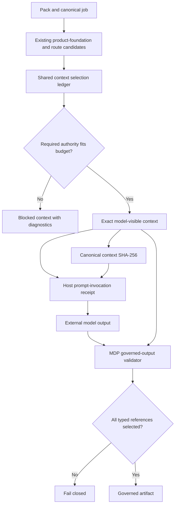

# Minimal Context Routing and Governed Generation - Plan

## Goal Capsule

- **Objective:** Make every model-visible MDP context selection minimal, explainable, hash-bound, and enforceable for one canonical job.
- **Product authority:** The released pack owns job requirements, product-foundation bindings, cards, evidence, guardrails, prompts, and output contracts. MDP compiles the smallest sufficient projection from that authority.
- **Implementation authority:** One shared context compiler owns selected and excluded references, reason codes, budgets, the model-visible context digest, and downstream output eligibility.
- **Stop conditions:** Canonical generation blocks when required authority is missing, the selected context exceeds its declared budget, a full-card fallback would be needed, the invocation receipt does not bind the exact context, or output references authority outside the selected projection.
- **Execution profile:** Extend existing `mdp.context.v0`, product-foundation resolution, prompt invocation receipts, and governed-output validation. Preserve legacy free-text routes as readable and unassessed rather than silently qualifying them as minimal.
- **Tail ownership:** MDP-200 owns deterministic minimal-context proof and governed-generation binding. It does not own model execution, semantic retrieval, provider economics, or final cold-model behavioral qualification.

---

## Product Contract

### Summary

MDP already returns bounded entry bodies with `matched` or `guardrail` selection labels and human-readable reasons. It also resolves exact product-foundation references and validates host prompt-invocation receipts. MDP-200 joins those shipped seams into one enforceable contract: every selected authority reference has a closed reason code, excluded candidates remain inspectable without entering model context, canonical generation receives the exact compiled context as a declared input, and governed output may cite only authority selected for that invocation.

### Problem Frame

The current router selects base guardrail cards plus persona and job matches, then includes entry bodies that match persona/job text or qualify as guardrails. The output explains selections informally, but it does not expose a complete candidate ledger, enforce a job-owned entry/byte budget, or produce one canonical digest of the exact model-visible projection. Canonical generation prompts receive product foundation directly, while the host receipt can bind arbitrary declared inputs. This leaves no single assertion proving that the writer saw the smallest sufficient context or that every output reference came from it.

### Requirements

**Selection authority**

- R1. Every model-visible card entry must carry a stable authority reference, one closed selection class, and one or more deterministic reason codes.
- R2. Selection classes must distinguish job/product-foundation requirements, persona or job matches, evidence dependencies, output requirements, universal guardrails, and explicit bounded fallbacks.
- R3. Relevant candidates excluded by scope, job applicability, policy, duplication, or budget must remain inspectable as metadata without their bodies entering model context.
- R4. Canonical generation and review jobs must fail closed when routing would require a whole-card fallback or undeclared pack access.
- R5. Universal safety, boundary, and output guardrails must never be removed merely to satisfy a context budget.

**Budgets and compatibility**

- R6. A canonical job may declare deterministic maximum selected entries and maximum canonical context bytes; new starter generation/review jobs must declare both.
- R7. Budget evaluation must occur after required guardrails and evidence dependencies are selected and must block rather than truncate authority when a limit is exceeded.
- R8. Legacy packs and free-text routes without the new declaration remain readable and report minimality as `unassessed`; they cannot claim MDP-200 conformance.
- R9. Existing `max_cards_per_route` behavior remains compatible, but canonical job budgets take precedence for model-visible context.

**Hash and output binding**

- R10. MDP must compute a stable SHA-256 over one canonical JSON projection containing exactly the model-visible authority, content, order, gaps, and applicable policy for the selected job.
- R11. Canonical generation/review prompts must declare the compiled routed-context envelope as a required host-supplied input, and `mdp.prompt-invocation.v1` must bind its exact file bytes.
- R12. Ready governed output must echo the context digest and may cite only selected authority references present in the bound context.
- R13. Claim, evidence, angle, and CTA identifiers must resolve to the correct selected card kind; an identifier selected elsewhere in the pack is insufficient.
- R14. A changed context file, digest, invocation receipt, selected-authority list, or governed output reference must fail verification without a model call.

**Surfaces and proof**

- R15. `route`, `brief --context`, requirements/model-task output, run receipts, schemas, human summaries, and canonical skills must agree on readiness, digest, selected counts, excluded counts, and failure reasons.
- R16. Detailed excluded bodies must not appear in model, human-summary, or trace projections; exact excluded IDs and bounded reason metadata are sufficient.
- R17. A synthetic public fixture must prove materially smaller context for fit and outbound generation without losing required guardrails, evidence, or output validity.
- R18. Private or customer-specific evidence may be inspected locally when supplied, but it must not be committed; the public proof uses existing synthetic/basic and Clay authorities.

### Acceptance Examples

- AE1. **Minimal ready context:** Given a canonical outbound job with relevant and irrelevant entries, when MDP compiles context, then every included entry has a closed reason code, irrelevant bodies are absent, budgets pass, and the digest is stable. Covers R1-R3, R6-R10, and R17.
- AE2. **Guardrail preservation:** Given required guardrails that make the context exceed its limit, when MDP evaluates the budget, then it returns a blocked result rather than dropping a guardrail or truncating content. Covers R5-R7.
- AE3. **No full-card escape:** Given a canonical job whose routed card has no bounded entry, when context compilation runs, then generation is blocked with an explicit full-card-fallback diagnostic. Covers R4.
- AE4. **Legacy compatibility:** Given an old pack or free-text job with no context budget, when route or brief runs, then existing context remains readable and minimality is `unassessed`. Covers R8-R9.
- AE5. **Exact invocation binding:** Given a ready compiled context and matching invocation receipt, when governed output validation runs, then the echoed context digest and receipt hashes pass. Editing the context file or digest fails. Covers R10-R12 and R14.
- AE6. **Out-of-context reference:** Given an approved claim that exists in the pack but was excluded from this job, when output cites it, then validation fails with an out-of-context authority diagnostic. Covers R12-R14.
- AE7. **Kind mismatch:** Given a selected pain ID used as `claim_id` or a selected claim ID used as `cta_id`, when validation runs, then it fails even though the identifier exists in selected context. Covers R13.
- AE8. **Safe exclusion inspection:** Given excluded private or lengthy entries, when machine and human summaries render, then they expose bounded IDs/reasons/counts without bodies or raw evidence. Covers R3 and R16.

### Scope Boundaries

**Now**

- Compile one deterministic selected/excluded context authority for canonical jobs.
- Add per-job entry and byte budgets with fail-closed enforcement.
- Bind governed generation/review to exact context bytes and selected typed authority.
- Align CLI, schemas, starter/template assets, docs, skills, fixtures, and trace inputs.

**Deferred**

- MDP-201 owns behavioral cold-model scoring and any final customer-pack qualification claim.
- Richer optimization metrics may be considered only after deterministic minimality is proven.

**Outside MDP**

- Model calls, provider selection, token pricing, observability hosting, vector search, graph databases, autonomous retrieval, CRM mutation, and outreach.
- Removing policy or safety context solely to reduce prompt size.

---

## Planning Contract

### Key Technical Decisions

- KTD1. **Extend the existing route compiler.** Add one typed selection ledger behind `entry_context_with_runtime_scoped`; do not create a second router. Existing `product_foundation` resolution and scope matching remain authorities for their domains. Governs R1-R5 and R15.
- KTD2. **Use closed codes plus optional human text.** Stable codes drive schemas, tests, and trace projection. Human-readable reasons remain additive orientation and cannot determine readiness. Governs R1-R3 and R15-R16.
- KTD3. **Declare budgets on canonical profile jobs.** Add an optional job-owned context-budget contract for compatibility. New starter generation/review jobs opt in, while missing declarations remain `unassessed`. Governs R6-R9.
- KTD4. **Block instead of trimming required context.** The compiler selects requirements first, measures the canonical projection, and blocks on excess. It never drops guardrails, evidence dependencies, or required output rules to meet a number. Governs R5-R7.
- KTD5. **Hash the actual model-visible projection.** Canonical JSON serialization of the final selected projection owns `context_sha256`. Diagnostic-only exclusions and human explanations stay outside the digest; model-visible gaps and policy stay inside it. Governs R10 and R14.
- KTD6. **Bind context through the shipped invocation receipt.** Add one required `routed_context` prompt input. Its envelope carries the digest of its model-visible projection, while `mdp.prompt-invocation.v1` binds the complete envelope bytes. Ready output echoes the projection digest. This avoids a redundant detached-hash input and a second receipt family. Governs R11-R12 and R14.
- KTD7. **Validate typed selected authority.** Build one index from the bound context and require output claim/evidence/angle/CTA references to resolve through their allowed card kinds. Pack-global existence never satisfies governed output. Governs R12-R14.
- KTD8. **Keep public proof synthetic.** Use generated basic/targeted GTM and Clay fixtures for committed evidence. Treat customer packs as private/manual input and defer any public cold-model claim to MDP-201. Governs R17-R18.

### High-Level Technical Design

### System-Wide Impact

- **Public contracts:** Manifest job schema, route/context JSON, brief schemas, compiled model tasks, prompt inputs, governed outputs, and trace references gain additive minimal-context fields.
- **Compatibility:** Legacy jobs preserve current routing output with an explicit unassessed status. New starter jobs qualify only when their budget and binding contract pass.
- **Agent behavior:** CLI JSON remains primary. Skills must use the compiled context and may not open arbitrary cards for a canonical writing job.
- **Privacy:** Exclusion diagnostics contain bounded identifiers and reason codes, never excluded bodies or raw evidence.
- **Release:** CLI, templates, and skills change, so completion requires a patch release and installed-artifact smoke after merge.

### Risks and Mitigations

- **False minimality:** Counting entries without binding bytes could hide oversized content. Mitigate with both entry and canonical-byte limits.
- **Safety loss:** Optimization could remove guardrails. Mitigate with required-first selection and block-on-excess semantics.
- **Digest drift:** Different surfaces could hash different projections. Mitigate with one canonical projection and shared digest helper.
- **Compatibility drift:** New fields could invalidate v0 packs. Mitigate with optional authored declarations and explicit unassessed output.
- **Authority confusion:** Pack-global IDs could still pass existing validators. Mitigate with a typed index built only from the bound context.
- **Diagnostic leakage:** Exclusion explanations could expose content. Mitigate with IDs, codes, counts, and bounded metadata only.

### Sequencing

U1 defines the authored budget and selection vocabulary. U2 centralizes compilation and digest authority. U3 binds model tasks and output validation to that authority. U4 projects the contract across CLI surfaces. U5 adopts and proves it in synthetic assets. U6 aligns docs/skills and runs the full shipping gates.

---

## Implementation Units

### U1. Add the job-owned minimal-context contract

- **Goal:** Define additive budget and selection-reason types plus closed schema validation.
- **Requirements:** R1-R2 and R6-R9.
- **Dependencies:** None.
- **Files:** `cli/src/models.rs`, `cli/src/commands/schemas.rs`, `cli/src/commands/health.rs`, and focused tests in those modules.
- **Approach:** Add an optional `context_budget` to canonical profile jobs with positive `max_entries` and `max_bytes`. Define the closed minimality status and reason-code vocabulary in shared model/schema authority. Validate unknown fields, zero limits, and job/prompt combinations that claim governed minimality without a budget.
- **Execution note:** Capture legacy schema behavior first, then add failing opted-in contract tests before production changes.
- **Patterns to follow:** `ProfileJob.product_foundation`, `JobModelTask`, manifest schema allowlists, and health activation diagnostics.
- **Test scenarios:** Legacy manifest remains valid and unassessed; opted-in job validates; unknown budget field fails; zero entry/byte limit fails; governed-minimal job without both limits blocks; exported schema matches runtime validation.
- **Verification:** Model, schema, and health tests agree on the additive contract and legacy behavior.

### U2. Centralize selection diagnostics, exclusions, budgets, and digest

- **Goal:** Produce one canonical context selection result consumed by route and brief surfaces.
- **Requirements:** R1-R10, R15-R16, AE1-AE4, and AE8.
- **Dependencies:** U1.
- **Files:** `cli/src/routing.rs`, `cli/src/artifact_hash.rs` or a focused new context-digest module, `cli/src/commands/routing.rs`, and tests in the owning modules.
- **Approach:** Refactor `route_entry_details` into a typed result that records selected refs, closed reason codes, safe excluded diagnostics, full-card fallback state, counts, and canonical bytes. Preserve existing scope and foundation decisions. Compute one digest after final selection. Apply job budgets after required selections and block without truncation.
- **Execution note:** Characterize current bounded-context fixtures before the refactor. Add failing tests for stable ordering, budget excess, guardrail preservation, excluded-body absence, and digest sensitivity.
- **Patterns to follow:** `EntryRouteDetails`, `foundation_load_order`, `ProductFoundationResolution`, `artifact_hash` canonical hashing, and portfolio-scope blocked projections.
- **Test scenarios:** Same input produces the same ordering/digest; relevant excluded entry reports ID/code but no body; unrelated entries never appear in selected or detailed exclusions; byte-only overflow blocks; entry-only overflow blocks; guardrail overflow blocks without removal; canonical full-card fallback blocks; legacy free-text context stays readable/unassessed; one selected body change changes the digest while diagnostic text changes do not.
- **Verification:** Route/context outputs expose one internally consistent minimality object, and existing scope/foundation regressions remain green.

### U3. Bind governed model tasks and outputs to routed context

- **Goal:** Make exact routed context a required, receipt-bound generation/review input and reject out-of-context typed references.
- **Requirements:** R11-R14 and AE5-AE7.
- **Dependencies:** U2.
- **Files:** `cli/src/commands/requirements.rs`, `cli/src/commands/prompt_output.rs`, `cli/src/starter.rs`, `assets/templates/basic/.mdp/prompts/generate-outbound-copy.yaml`, `assets/templates/basic/.mdp/prompts/review-outbound-copy.yaml`, plugin mirrors, proposal prompt assets where canonical review uses governed context, and focused tests.
- **Approach:** Compile one required `routed_context` envelope into canonical model tasks. Reuse `mdp.prompt-invocation.v1` to hash its exact file bytes. Require ready output to echo the envelope's model-visible projection digest. Validate `selected_authority` and artifact identifiers against a typed index derived from that bound context, not the whole pack.
- **Execution note:** Start with negative governed-output fixtures proving that pack-global but unselected IDs currently pass or lack a deterministic failure.
- **Patterns to follow:** `validate_governed_invocation_receipt`, prompt input producer validation, existing invocation-receipt SHA checks, and governed artifact substance checks.
- **Test scenarios:** Exact context/receipt/output passes; changed context bytes fail; an incorrect projection digest fails; pack-global unselected claim fails; kind-mismatched claim/CTA/angle fails; duplicate or ambiguous selected refs fail; gap/refusal output may omit drafting refs but still binds the context; legacy non-governed output remains compatible.
- **Verification:** A ready governed artifact can be replayed only with the exact compiled context and selected typed authority.

### U4. Align route, brief, run, schema, trace, and human projections

- **Goal:** Ensure every operator and agent surface reports the same minimal-context authority without leaking excluded content.
- **Requirements:** R15-R16 and AE8.
- **Dependencies:** U2-U3.
- **Files:** `cli/src/commands/briefs.rs`, `cli/src/run_runtime.rs`, `cli/src/commands/schemas.rs`, `cli/src/output.rs`, `cli/src/commands/human_brief.rs`, relevant trace projection code, and tests in those modules.
- **Approach:** Project status, digest, budgets, selected/excluded counts, reason codes, and failure diagnostics from the shared result. Keep full entry bodies only on the bounded machine context surface. Summary, human, and trace views expose safe identifiers and counts.
- **Patterns to follow:** Existing product-foundation parity tests, run `compiled_context`, brief schema live-output tests, and safe signal-authority human projections.
- **Test scenarios:** All machine surfaces agree on digest/status/counts; blocked context carries no draftable bodies except already-approved scoped guardrail behavior; human summary omits excluded bodies; trace references authoritative context without duplicating it; old fixtures without minimality fields still validate where compatibility permits.
- **Verification:** Cross-surface fixtures prove no readiness or digest drift and no excluded-content leakage.

### U5. Adopt the contract in synthetic starters and prove material reduction

- **Goal:** Demonstrate bounded fit and outbound generation with public-safe, job-specific context.
- **Requirements:** R6-R7 and R17-R18.
- **Dependencies:** U1-U4.
- **Files:** `cli/src/starter.rs`, `cli/src/target_starter.rs`, `assets/templates/basic/.mdp/manifest.yaml`, plugin mirrors, `examples/clay-table-pack/.mdp/manifest.yaml`, synthetic fixtures/evals, `scripts/test-run-conformance.mjs`, and init/template tests.
- **Approach:** Add budgets to new canonical jobs, then tune declarations or entry applicability rather than weakening guardrails. Record before/after selected card, entry, and byte counts for the synthetic proof. Keep customer/private inputs outside Git and treat any local comparison as supplemental evidence.
- **Execution note:** Capture the current basic/Clay counts before modifying selection, then require a material reduction with unchanged expected fit/no-fit/insufficient-context and governed-output outcomes.
- **Patterns to follow:** Starter/template byte-parity tests, Clay v2 lineage fixtures, and run conformance cases.
- **Test scenarios:** Fit job excludes generation-only authority; outbound job includes its exact claims/angle/CTA/guardrails; unrelated personas and proposal rules do not leak; all existing decision outcomes remain unchanged; generated assets byte-match plugin mirrors; public fixtures contain no private paths or raw customer data.
- **Verification:** The synthetic proof shows smaller context with all deterministic and governed-generation checks green.

### U6. Align skills/docs, review, release, and installed proof

- **Goal:** Ship one discoverable operator contract and verify the installed artifact.
- **Requirements:** R15-R18.
- **Dependencies:** U1-U5.
- **Files:** `README.md`, `CONCEPTS.md`, `cli/USAGE.md`, focused docs under `docs/`, canonical `plugin/skills/mdp*` instructions/references, and skill contract tests.
- **Approach:** Document minimality status, reason codes, budget semantics, exact context binding, safe exclusions, and the external-model boundary. Instruct agents to use compiled context only and stop on blocked/unassessed canonical generation. Run code/doc review, full validation, PR packaging, and the repository's release/install closeout after merge.
- **Patterns to follow:** `docs/job-prompt-contracts.md`, `docs/product-foundations.md`, `plugin/skills/mdp/references/cli-operator.md`, and existing skill validators.
- **Test scenarios:** Skill validation enforces compiled-context-first behavior; docs commands match live CLI help/schema; asset and packaging parity pass; installed CLI reports and enforces the new contract after the patch release.
- **Verification:** Documentation, skills, source CLI, packaged assets, release artifact, and installed smoke agree.

---

## Verification Contract

| Gate | Applies to | Done signal |
| --- | --- | --- |
| Focused Rust tests | U1-U4 | New contract, routing, digest, receipt, reference, schema, and projection tests pass. |
| Starter/template validation | U3 and U5 | Basic, targeted GTM, proposal, and Clay packs validate with zero unexpected issues. |
| Runtime conformance | U4-U5 | `scripts/test-run-conformance.mjs` passes all cases, including exact context replay and tamper failures. |
| Skill/package checks | U6 | Skill contract, quick validation, Pluxx packaging, and source/plugin asset parity pass. |
| Full repository validation | U1-U6 | `cargo test --manifest-path cli/Cargo.toml` and `make validate` pass from the final branch. |
| Review | U1-U6 | `ce-code-review` data-correctness findings are fixed or explicitly resolved; contract docs complete headless review. |
| Release/install | U6 after merge | Patch release includes the merge commit; documented installer succeeds; installed CLI passes minimal-context and tamper smoke tests. |

---

## Definition of Done

- Every canonical model-visible entry has stable typed inclusion authority.
- Safe exclusion metadata is inspectable without exposing excluded bodies.
- Job budgets block excess context without dropping guardrails or evidence dependencies.
- Exact model-visible context bytes have one stable digest used across route, brief, run, receipt, output validation, and trace projection.
- Ready generation/review output cannot cite pack authority outside the exact selected context or use an ID under the wrong card kind.
- Legacy packs remain readable and are labeled unassessed rather than falsely minimal.
- Synthetic basic/Clay proof demonstrates materially smaller job context with unchanged governed outcomes.
- CLI, schemas, templates, docs, skills, fixtures, and packaged assets agree.
- Focused tests, full Rust tests, run conformance, and `make validate` pass.
- The diff contains no private customer data, dead experimental code, duplicate routing engine, or abandoned compatibility path.
- The PR is linked to MDP-200 and MDP-194, carries the repository autofix label when safe, and completes release/install closeout after merge.
