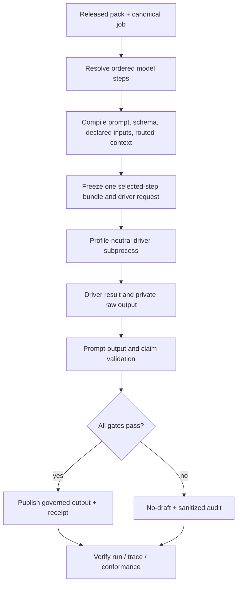

# Universal Native Model Driver - Plan

## Goal Capsule

- **Objective:** Make one native BYOK driver execute every job-declared MDP model step across GTM and proposal packs: normalization plus job-owned generation and review.
- **Product authority:** The released pack declares the prompt, allowed inputs, output schema, product foundation, routing budget, and validation rules. The Rust CLI compiles and verifies those authorities. The driver performs only the declared model call.
- **Implementation authority:** `mdp run` and the v1 run contracts remain canonical. The stdio MCP server is a path-only transport over the CLI. Existing proposal and normalization scripts become compatibility adapters rather than alternate runtimes.
- **Stop conditions:** No real provider call or real API key during implementation or validation. Stop on ambiguous model-step resolution, undeclared input, mutated authority, unavailable credential, unsafe endpoint, malformed output, failed claims validation, or incomplete receipt.
- **Execution profile:** One branch and PR for MDP-188. Implement contracts before transport, preserve deterministic-run behavior, prove both templates with mock transport, then run full review and release gates.
- **Tail ownership:** This plan owns implementation, public synthetic fixtures, documentation, skills, PR review, and the routine patch-release/install closeout after merge. Provider billing, production secrets, batching, retries, scheduling, CRM actions, outreach, and hosted execution stay outside MDP.

---

## Product Contract

### Summary

MDP already gives both templates the same ten messaging primitives, job-scoped product foundations, prompt contracts, routed context, governed output validation, claim checks, receipts, and cold-model conformance records. The missing link is execution parity: the canonical run kernel currently permits deterministic runs only, while one separate JavaScript OpenAI runner handles proposal-style normalization.

MDP-188 closes that seam. A caller supplies one exact `mdp.run-request.v1` plus local declared-input files for one selected model step. The CLI freezes the pack/prompt/context/input authority, invokes the selected native driver through a bounded BYOK channel, validates the returned artifact, and emits one run bundle, audit, receipt, and verification result. The customer host explicitly sequences separate normalization, deterministic fit/routing, and generation or review runs; MDP-188 does not introduce automatic multi-step orchestration.

### Problem Frame

Today a customer using Claude Code or Codex can manually execute every declared prompt, and MDP can verify the resulting artifacts. That proves the contracts but leaves the user to assemble the model call. The proposal template also has a narrow OpenAI normalization script, which creates the false impression that one universal native runner already exists.

The product should have one understandable story: the pack says what the model may see and must return; the driver calls the customer's chosen model; MDP validates the result and grants or withholds output authority. Profile-specific scripts must not invent a second execution contract.

### Key Decisions

- **Every job-declared model step uses one resolver and driver contract.** (session-settled: user-directed — chosen over generation/review-only execution: leaving normalization on the proposal-era path would preserve the cross-template drift this issue exists to remove.) Governs R1-R5, R13-R16.
- **“Declared model step” is job-bound authority, not every prompt file.** It includes a selected job's normalization prompt bound through the current `InputContract.prompt` authority and its explicit `model_task`; pack-authoring and extraction prompts that are not bound to a job remain outside runtime execution. A future Decision Input normalization binding may replace the legacy form only through an explicit contract migration. Governs R1, R2, R15.
- **The Rust CLI remains the canonical runtime.** The existing JavaScript native runner and proposal flow become compatibility adapters over CLI contracts. This preserves one hashing, failure, receipt, and assurance implementation. Governs R6-R12, R17-R20.
- **OpenAI Responses is the first native transport, not the product contract.** A versioned subprocess boundary keeps provider networking outside the Rust kernel. The first bundled reference driver uses an operator-supplied `OPENAI_API_KEY`, a hash-bound provider-compatible schema, `store: false`, no tools, and only the official OpenAI HTTPS endpoint. Custom origins are deferred. Governs R7-R10, R18.
- **One run executes one selected model step.** The run `operation` must equal the resolver's stable model-step ID; one invocation produces one driver result and one receipt. The customer host sequences steps and supplies a governed prior output as a later declared input. Governs R1-R7, R13-R17.
- **Model execution never replaces deterministic authority.** Fit, routing, minimal-context selection, product-foundation resolution, claims checks, output validation, and run verification remain MDP computations. Governs R3, R4, R11-R14.
- **No live calls in repository validation.** Mock responses and a local fake transport prove requests, parsing, failure behavior, and template parity. A live BYOK call is an operator action requiring separate approval. Governs R18-R20.

### Actors

- A1. **Operator or customer host** — selects the pack, job, model, declared input files, credential channel, and output directory.
- A2. **MDP CLI** — resolves model steps, freezes authorities, invokes the driver, validates results, and creates receipts.
- A3. **Native driver** — turns one bounded driver request into one provider call and returns one raw result plus observed metadata.
- A4. **Provider** — performs the model inference selected and paid for by the operator.
- A5. **stdio MCP adapter** — transports path-only `mdp run` and `mdp verify-run` calls without adding authority.

### Requirements

**Model-step resolution**

- R1. For one released pack and canonical job ID, the CLI must enumerate the exact job-declared model steps in stable phase order: the job-bound `InputContract.prompt` normalization step first when declared, then the job-owned generation or review `model_task` when declared. One run selects exactly one emitted step ID.
- R2. Each resolved step must contain one canonical phase, prompt ID/path/version/hash, output contract/schema, ordered declared inputs and producers, and job/release identity. Missing, duplicate, ambiguous, incompatible, or unready authority fails closed.
- R3. Generation and review steps that require routed context must consume the exact canonical `mdp.routed-context.v1` bytes and digest produced for that job. Normalization must consume only its Decision Input-declared source artifacts.
- R4. The driver must not silently load the whole pack, ambient conversation, undeclared files, neighboring records, prior outputs, tools, or repository context.
- R5. A job with no declared model step remains valid but explicitly unassessed for native inference; the driver must not guess a prompt from skill prose or filenames.

**Canonical execution and security**

- R6. Generative `mdp.run-request.v1` must be accepted by the shared Rust run state machine without changing deterministic-run behavior or replay. Its `operation` selects one resolver-emitted step ID and cannot select a prompt by path or free text.
- R7. The driver request/result boundary must be closed, versioned, schema-exported, bounded, canonical-hashable, and tied to the exact run, job, phase, prompt, ordered inputs, exact model-visible bytes, canonical validation schema, provider-adherence schema, provider, requested model, official endpoint policy, and timeout. Because the current closed v1 driver types cannot carry this authority, the change must introduce an explicitly versioned wire contract rather than silently broadening v1.
- R8. The Rust kernel must launch one bundled profile-neutral driver subprocess with `clear_env`, a fixed executable identity, a private staged working directory, bounded stdin/stdout, and an exact environment allowlist. Only `OPENAI_API_KEY` plus the minimum non-secret runtime/TLS variables may cross; unrelated ambient canaries must not. Credentials never enter request files, prompts, logs, stdout, receipts, fixtures, or retained artifacts.
- R9. Native network execution must be default-deny through an out-of-band `MDP_ALLOW_NATIVE_MODEL_CALLS=1` server/process permission that request or MCP arguments cannot enable. The first OpenAI driver must use Responses with `store: false`, no tools, no conversation or previous response, redirects disabled, proxy variables excluded, TLS hostname verification, and the fixed official `https://api.openai.com/v1/responses` endpoint. Custom origins are out of scope.
- R10. Driver spawn, connect, first-byte, idle-read, total-timeout, cancellation, network, provider, refusal, incomplete response, header/body-size, decoded-size, JSON-depth, schema, or model-identity failures must map to existing bounded no-draft terminal states. Provider request/response envelopes and failed model output remain memory-only and are discarded by default; only governed output is published.

**Validation, receipts, and parity**

- R11. The returned model artifact must pass the pack-owned prompt-output validator, invocation receipt binding, and routed-context attachment rules before output authority can exist.
- R12. Generation and review artifacts must also pass the applicable deterministic claim and boundary checks; unsupported claims or an invalid review artifact stop no-draft.
- R13. Bundle, runner audit, receipt, verification, trace, and conformance surfaces must bind the exact driver request/result and preserve honest declared/observed/enforced/verified/unknown assurance semantics. Post-staging failures must still commit a sanitized terminal audit and receipt with no usable output; failures before authority exists return preflight refusal without inventing a receipt.
- R14. Editing any prompt, input, routed context, driver request/result, model output, validation, or receipt after staging must invalidate the run or verification.
- R15. The shipped basic GTM template and proposal template must prove all seven canonical jobs and all thirteen job-by-step bindings, which resolve to eight unique prompt definitions: `normalize-prospect-row`, `generate-outbound-copy-v1`, `review-outbound-copy-v1`, `normalize-opportunity`, and the four proposal review prompts.
- R16. The same compiler, driver contract, run state machine, terminal vocabulary, and receipt verifier must handle every step in R15; no profile switch may contain separate execution semantics.
- R17. `mdp_run` over stdio MCP must execute both deterministic and generative run requests through the same CLI and return the CLI result unchanged. The MCP server may forward `OPENAI_API_KEY` and the native-call permission only when they were present at server start; tool arguments cannot supply or enable either. `mdp_run_tools` and capabilities must accurately disclose the expanded support.

**Compatibility and product boundary**

- R18. `scripts/mdp-native-normalize-openai.mjs` becomes the profile-neutral bundled driver or delegates to its replacement. `scripts/mdp-proposal-runner.mjs` keeps source intake and workdir behavior unchanged but delegates only its native model-invocation, validation, hashing, and receipt seam to canonical per-step CLI authority. Neither may retain independent execution authority.
- R19. Public docs and canonical plugin skills must give Claude Code, Codex, shell, and MCP operators one runnable local workflow while stating that MDP does not collect source data, schedule jobs, retry providers, send outreach, mutate CRM, or price inference.
- R20. All committed examples and tests must be synthetic, key-free, provider-call-free, and safe for the public repository.

### Key Flows

- F1. Job discovery and compilation
  - **Trigger:** A1 selects a released pack and canonical job.
  - **Actors:** A1, A2.
  - **Steps:** A2 validates the pack, resolves the job's ordered model steps, compiles exact prompt/input/schema/context authority, and returns a dry-run plan without reading a key or calling a provider.
  - **Outcome:** A1 can inspect exactly what will be sent and what will validate the response.
  - **Covers:** R1-R7, R15, R16.
- F2. Native BYOK execution of one model step
  - **Trigger:** A1 explicitly launches a compiled generative run with an allowed provider/model and credential channel.
  - **Actors:** A1, A2, A3, A4.
  - **Steps:** A2 confirms the out-of-band native-call permission, freezes artifacts, and launches A3 with a cleared environment. A3 receives one compiled step plus credential; A4 returns structured output; A2 validates and records the result. A later step is a separate run whose declared input binds the earlier governed output.
  - **Outcome:** A valid output gets bounded authority; every failure returns no-draft with sanitized diagnostics.
  - **Covers:** R3-R14.
- F3. MCP parity
  - **Trigger:** A5 receives a path-only `mdp_run` call.
  - **Actors:** A1, A2, A5.
  - **Steps:** A5 validates paths and starts the CLI with a bounded environment; A2 performs the same run and verification used by shell operators.
  - **Outcome:** MCP adds transport convenience but no alternate execution semantics or assurance.
  - **Covers:** R6-R17.
- F4. Compatibility and operator handoff
  - **Trigger:** An existing proposal or native-normalization caller uses its established entry point.
  - **Actors:** A1, A2, A3.
  - **Steps:** The compatibility surface preserves source intake and workdir behavior, builds the canonical selected-step request, and delegates provider execution, validation, hashing, and receipts to A2/A3. Canonical skills and docs show the same handoff.
  - **Outcome:** Existing callers retain a migration path without a second execution authority.
  - **Covers:** R18-R20.

### Acceptance Examples

- AE1. **Covers R1, R15, R16.** Given each released basic and proposal job, when model steps are resolved, then the exact expected normalization/generation/review prompts appear in stable phase order and no unbound extraction prompt appears.
- AE2. **Covers R3, R4, R11.** Given an outbound generation job, when the routed-context bytes differ by one byte after compilation, then the run stops before output authority and records a context-binding failure.
- AE3. **Covers R6, R17.** Given the same deterministic request used before MDP-188, when it runs through CLI and MCP, then its terminal result and authoritative artifact digests remain unchanged.
- AE4. **Covers R8-R10.** Given a missing native-call permission, missing key, non-official origin, redirect, timeout, refusal, malformed provider response, or oversized output, when the native driver runs, then no key or output body appears in public diagnostics and the run terminates no-draft.
- AE5. **Covers R11-R14.** Given a schema-valid model response that cites an undeclared claim or mismatched prompt receipt, when validation runs, then the result is rejected and no usable output is published.
- AE6. **Covers R15-R18.** Given all thirteen job-by-step bindings and mock responses for their eight unique prompt definitions, when they run through canonical CLI and stdio MCP, then each uses the same driver contracts and verifier. `scripts/mdp-native-normalize-openai.mjs` and the proposal runner's model-call seam produce the same canonical handoff.
- AE7. **Covers R19-R20.** Given a public fixture or log scan, when validation completes, then it contains no real key, person, company, real or unrestricted provider payload, unrestricted source prose, or downstream action. Sanitized synthetic request snapshots and mock provider bodies are allowed.
- AE8. **Covers R1-R20.** Given one synthetic GTM record and one synthetic proposal opportunity, when a cold operator follows only the installed docs, then separate normalization, deterministic routing, and generation/review runs finish with a verified governed result or correct no-draft state and one receipt per model step.

### Success Criteria

- One `mdp run` kernel executes deterministic operations and one selected declared model step per generative run across both shipped templates.
- The supported template matrix is mechanically tested rather than documented by claim.
- MCP shell parity is behavioral and byte-bound, not merely a matching tool list.
- No alternate proposal-only execution authority remains.
- Installed release smoke proves the shipped CLI/plugin bundle, not just source-tree code.

### Scope Boundaries

**Included**

- Job-bound normalization, generation, and review prompts.
- One provider-neutral subprocess driver contract and one bundled OpenAI Responses reference driver for the official endpoint.
- CLI, schemas, capabilities, stdio MCP, compatibility adapters, skills, docs, fixtures, and release smoke.

**Deferred**

- Additional native providers, custom endpoints, automatic multi-step orchestration, streaming UX, concurrency, batching, retries, rate limiting, price estimation, and hosted execution.
- Live behavioral qualification calls; MDP-201 continues to validate recorded trials independently.

**Outside MDP's identity**

- Source collection, enrichment, CRM, sequencing, outreach, proposal submission, generic orchestration, or credential custody.

---

## Planning Contract

### Key Technical Decisions

- KTD1. **Use one phase-aware model-step compiler.** It projects the current job-bound `InputContract.prompt` normalization authority and `model_task` generation/review authority into one closed compiled shape. A job declaring both legacy and future Decision Input normalization bindings for the same phase is ambiguous and fails closed until an explicit migration contract exists.
- KTD2. **Extend v1 run authority instead of creating a second runner.** `RunMode::Generative`, `DriverRequestV1`, `DriverResultV1`, and existing verification semantics are the starting seams. The deterministic path must remain byte-compatible.
- KTD3. **Use one profile-neutral subprocess driver protocol.** Rust freezes and validates authority, then launches the bundled driver with bounded stdin/stdout, a private working directory, `clear_env`, and exact executable/configuration hashes. The OpenAI JavaScript driver and mock driver implement the same versioned protocol; no test requires network or a provider key.
- KTD4. **Separate MDP validation from provider adherence.** The pack-owned schema remains canonical. A deterministic compiler derives a hash-bound OpenAI-supported structured-output schema, rejects schemas it cannot project during preflight, and binds both hashes. Provider-side adherence never replaces validation against the original pack schema.
- KTD5. **Treat credentials and provider response bodies as private runtime material.** Retained public authority contains hashes, safe IDs, observed model metadata, timings, and sanitized failure codes. It never includes the bearer token or unrestricted response body.
- KTD6. **Preserve one MCP tool family.** `mdp_run` remains the operation; request mode determines deterministic or generative execution. Adding profile- or provider-named MCP tools would recreate drift.
- KTD7. **Compatibility shims delegate inward.** The v0 normalization script may remain temporarily for proposal callers, but it must build/consume canonical driver/run artifacts or clearly route to the CLI. It cannot own a separate provider contract after this change.

### High-Level Technical Design

### Sequencing

1. Establish the resolver and closed contracts before enabling network transport.
2. Add mock-subprocess-backed generative execution while deterministic regression tests remain green.
3. Generalize the bundled OpenAI driver only after request bytes, environment, fixed endpoint, retention, and failure mappings are testable without a live call.
4. Prove every declared template step through CLI, then prove MCP and compatibility parity.
5. Align skills/docs/capabilities and finish full validation, review, PR, and release closeout.

### System-Wide Impact

- **Security:** expands the run kernel from no-network deterministic execution to an explicitly authorized provider subprocess. Default-deny call permission, credential/environment custody, fixed endpoint, redirects/proxies, network deadlines, response bounds, memory-only raw envelopes, filesystem containment, and publication controls are release blockers.
- **Contracts:** activates generative portions of existing v1 run types and may add a compiled-model-step contract/schema. Compatibility must be additive within v1 or receive an explicit new version.
- **Agent parity:** shell and MCP must expose the same path-only action. Skills must discover capabilities instead of assuming a host can execute model tasks.
- **Public artifacts:** only synthetic fixtures and mock provider bodies may land.

### Sources and Research

- `cli/src/run_contracts.rs` already defines deterministic/generative modes plus driver request/result authorities.
- `cli/src/run_runtime.rs` currently rejects generative requests and is the canonical state-machine seam.
- `scripts/mdp-native-normalize-openai.mjs` proves the current narrow OpenAI request, endpoint, and redaction policies but is not universal authority.
- `scripts/mdp-run-mcp-server.mjs` already provides bounded path-only transport over `mdp run` and `mdp verify-run`.
- `docs/orchid/plans/2026-08-03-001-feat-unified-clean-context-runtime-plan.md` established the one-kernel architecture and native-driver boundary.
- `docs/orchid/qa/2026-08-03-mdp-184-clean-run-proof.md` records that native generative execution remained unshipped.
- OpenAI's official Responses documentation supports strict JSON Schema output, no-tool requests, and `store: false`; the data-control documentation notes that Responses otherwise retains application state by default, which is why the transport must set `store: false` and document provider-side limitations.

---

## Implementation Units

### U1. Compile every job-declared model step

- **Goal:** Add one deterministic resolver that projects job-bound normalization and `model_task` authority into an ordered compiled model-step contract.
- **Requirements:** R1-R5, R15, R16.
- **Files:** `cli/src/models.rs`, `cli/src/model_steps.rs`, `cli/src/main.rs`, `cli/src/commands/requirements.rs`, `cli/src/commands/schemas.rs`, `cli/src/commands/capabilities.rs`, `plugin/assets/templates/basic/.mdp/manifest.yaml`, and `plugin/assets/templates/proposal/.mdp/manifest.yaml` plus their `assets/` mirrors when generation changes them.
- **Approach:** Reuse prompt loading, `InputContract.prompt`, requirements, product-foundation, and routed-context authorities. Emit a stable `step_id` for each job/phase and exact hashes. Reject conflicting legacy/future normalization bindings and never infer from filenames or skill prose. One run `operation` must select exactly one step ID.
- **Test scenarios:** All seven jobs and thirteen job-by-step bindings resolve to eight unique prompts; unbound v0 prompts do not; jobs with no task are unassessed; conflicting/missing/duplicate/wrong-phase prompts fail closed; output is deterministic.
- **Verification:** Focused Rust resolver/schema/capability tests and strict validation of both templates.

### U2. Activate generative run contracts without regressing deterministic runs

- **Goal:** Accept bounded generative requests in the shared state machine and stage exact compiled step authority.
- **Requirements:** R6, R7, R10-R14.
- **Files:** `cli/src/run_contracts.rs`, `cli/src/run_runtime.rs`, `cli/src/commands/run_receipt.rs`, `cli/src/commands/run_verification.rs`, `cli/src/commands/schemas.rs`.
- **Approach:** Introduce an explicit new driver wire-contract version carrying selected step/job identity, canonical prompt rendering, ordered model-visible bytes and hashes, both schema hashes, provider/model/endpoint/timeout policy, observed provider metadata, output authority, and result hash. Implement mode-specific preflight, snapshot, subprocess, terminal, audit, sanitized receipt, and verification logic. Reuse the descriptor-relative contained-file reader; open/read/hash each input once and send those retained bytes without reopening paths. Keep deterministic behavior unchanged.
- **Test scenarios:** Valid mock subprocess run; deterministic golden replay; step-selector mismatch; mutation/rename/symlink swap at every authority seam; post-staging timeout/refusal/malformed output persists sanitized no-draft audit/receipt but no output; preflight failure emits no invented receipt; verification rejects cross-job/profile substitution.
- **Verification:** Run-contract/runtime/verifier test modules plus existing deterministic run conformance.

### U3. Add the bounded native OpenAI transport

- **Goal:** Execute one compiled driver request through OpenAI Responses while preserving provider-neutral run authority.
- **Requirements:** R7-R10, R18, R20.
- **Files:** `scripts/mdp-native-model-openai.mjs`, `scripts/mdp-native-normalize-openai.mjs`, `scripts/lib/process-supervisor.mjs`, `scripts/test-native-model-driver.mjs`, `scripts/test-native-runner.sh`, `cli/src/run_runtime.rs`, `cli/src/commands/capabilities.rs`, and `scripts/release-install-smoke.sh`.
- **Approach:** Make `mdp-native-model-openai.mjs` the profile-neutral driver protocol implementation and convert the old normalization script to a delegating compatibility shim. Rust resolves and hashes the bundled executable, starts it with `clear_env`, and passes one private staged request over bounded stdin/path authority. The driver uses `store: false`, `tool_choice: none`, no prior response/conversation, redirects disabled, proxy variables absent, official fixed endpoint, bounded connect/first-byte/idle/total time and header/compressed/decoded body sizes, and a closed safe diagnostic vocabulary. Request/response provider envelopes and failed outputs are memory-only and discarded.
- **Test scenarios:** Exact synthetic request-body snapshot; native-call permission absent; key absent; unrelated environment canary absent; key never serialized; non-official origin blocked; redirect/proxy/private destination impossible; connect/read/total timeout; cancellation; refusal; incomplete/malformed/deeply nested/oversized response; provider error canary absent from every public surface; requested model declared and returned model observed; mock success.
- **Verification:** Key-free focused transport tests and static secret/log scans; no live provider invocation.

### U4. Bind prompt-output, routing, claims, and trace authority

- **Goal:** Grant output authority only after the existing job-specific deterministic gates validate the driver result.
- **Requirements:** R3, R4, R11-R14.
- **Files:** `cli/src/commands/prompt_output.rs`, `cli/src/commands/routing.rs`, `cli/src/commands/decision_trace.rs`, `cli/src/commands/run_verification.rs`, and run integration tests colocated in those modules.
- **Approach:** Feed the exact compiled invocation receipt and routed-context bytes into existing validators. For normalization, bind Decision Input lineage. For generation/review, bind selected authority and run applicable claims checks. Quarantine failed raw output.
- **Test scenarios:** Valid normalization/generation/review; wrong context hash; undeclared input/claim; prompt mismatch; schema-valid but governed-invalid output; trace/receipt mutation; no-draft leak checks.
- **Verification:** Prompt-output, routing, claims, trace, and end-to-end run tests.

### U5. Prove GTM, proposal, MCP, and compatibility parity

- **Goal:** Make parity a black-box executable matrix across all declared model steps and entry points.
- **Requirements:** R15-R18, R20.
- **Files:** `scripts/test-native-model-driver.mjs`, `scripts/test-run-conformance.mjs`, `scripts/test-run-mcp-server.mjs`, `scripts/mdp-run-mcp-server.mjs`, `scripts/mdp-native-normalize-openai.mjs`, `scripts/mdp-proposal-runner.mjs`, `scripts/test-proposal-runner.sh`, `scripts/test-native-runner.sh`, `Makefile`, and `scripts/release-install-smoke.sh`.
- **Approach:** Generate temporary canonical requests for every job/phase binding from the checked-in basic GTM and proposal templates, feed synthetic mock results through the same subprocess seam, compare CLI/MCP authority, and prove both compatibility entry points delegate only model execution inward. Preserve proposal source-intake/workdir behavior unchanged. Add one complete synthetic GTM chain and one proposal chain that a cold operator can reproduce from the installed bundle.
- **Test scenarios:** Seven jobs and thirteen bindings across eight unique prompts; deterministic request regression; CLI/MCP parity; native-normalization and proposal model-call adapter parity; complete GTM and proposal chains; every bounded failure class; no provider command or key use.
- **Verification:** Black-box harness, MCP tests, proposal tests, `make validate`, and installed-release smoke target.

### U6. Align operator discovery, skills, and documentation

- **Goal:** Give a cold shell/Codex/Claude/MCP operator one accurate workflow and boundary description.
- **Requirements:** R17-R20.
- **Files:** `README.md`, `CONCEPTS.md`, `cli/USAGE.md`, `docs/host-conformance.md`, `docs/headless-normalization-runners.md`, `docs/native-api-normalization-runner.md`, `docs/run-receipts.md`, `plugin/skills/mdp/SKILL.md`, `plugin/skills/mdp/references/cli-operator.md`, `plugin/skills/mdp-gtm-brief/SKILL.md`, `plugin/skills/mdp-proposal-review/SKILL.md`, `plugin/skills/mdp-pack-review/SKILL.md`, `scripts/test_skill_contracts.py`, and `scripts/validate-skill-contracts.py`.
- **Approach:** Document discovery, dry-run inspection, BYOK execution, verification, MCP parity, retention, and no-action boundaries. Explain that MDP executes only declared model steps and never collects sources or performs downstream actions.
- **Test scenarios:** Capabilities advertise correct contracts/flags; skills stop when model steps are missing/blocked; no legacy proposal-only or “host must manually execute everything” wording remains; packaging mirrors are exact.
- **Verification:** Skill validators/evals/packaging, docs link checks where available, asset sync, and public-artifact lint.

### U7. Review, ship, and prove the installed release

- **Goal:** Land MDP-188 through the repository's full quality and release process.
- **Requirements:** R1-R20.
- **Files:** Only files required by review fixes and routine version/release metadata; PR description and Linear closeout are delivery actions, not repository files.
- **Approach:** Run simplification and conditional security/reliability/API reviews, resolve material findings, commit, push, open one PR labeled `ai:autofix-enabled`, babysit checks/review, and after merge cut the routine patch release and run the documented installer smoke.
- **Test scenarios:** Clean full suite; source/plugin parity; PR checks; installed binary reports the new release and passes both-template driver/MCP smoke.
- **Verification:** `make validate`, PR checks, release workflow, installer, installed `mdp --version`, and installed behavioral smoke.

---

## Verification Contract

| Gate | Command or proof | Applies to | Done signal |
|---|---|---|---|
| Rust unit/integration | `cargo test --manifest-path cli/Cargo.toml` | U1-U4 | All tests pass, including unchanged deterministic coverage. |
| Template validity | `cargo run --manifest-path cli/Cargo.toml -- --json validate --strict --dir plugin/assets/templates/basic` and proposal equivalent | U1, U4-U6 | Both packs valid with zero errors/warnings. |
| Native driver matrix | `node scripts/test-native-model-driver.mjs` | U2-U5 | Seven jobs and thirteen bindings pass across eight unique prompts; provider calls and real keys remain zero. |
| MCP parity | `node scripts/test-run-mcp-server.mjs` | U5 | Deterministic and generative CLI/MCP results preserve exact authority. |
| Compatibility | `bash scripts/test-native-runner.sh` and `bash scripts/test-proposal-runner.sh` | U3, U5 | The native-normalization shim and proposal model-call seam delegate to canonical artifacts without changing proposal source intake/workdir behavior. |
| Skill parity | `make validate-skills validate-skill-contracts validate-skill-packaging` | U6 | Canonical skills, behavioral assertions, and packaged bundles pass. |
| Full repository | `make validate` | U5-U7 | Entire release gate exits zero without live provider calls. |
| Public safety | Public-artifact lint plus canary scans over stdout, stderr, MCP messages, bundles, traces, receipts, and temp/output trees | U3-U7 | No keys, private data, real/unrestricted provider content, failed raw output, or unsafe claims. |
| PR/release/install | GitHub checks, routine patch release, documented installer, installed smoke | U7 | Merge commit, release tag, and installed binary are all explicitly verified. |

---

## Definition of Done

### Global

- One canonical CLI path executes deterministic work and one selected job-declared normalization/generation/review step per generative run across both shipped templates.
- The driver sees only compiled declared inputs and model-visible context; every authority is hash-bound and independently verifiable.
- All failure paths stop no-draft and disclose only sanitized diagnostics.
- CLI, stdio MCP, compatibility adapters, capabilities, schemas, docs, and canonical skills agree.
- No live provider call, real key, private customer artifact, generic orchestration, or downstream action is introduced.
- Experimental or abandoned implementation paths are removed from the final diff.
- MDP-188 has one merged PR, a routine patch release containing the merge commit, and an installed-artifact smoke receipt.

### Per Unit

| Unit | Completion evidence |
|---|---|
| U1 | Resolver/schema tests prove seven jobs and thirteen job-by-step bindings collapse to eight unique prompts and reject ambiguity/unbound prompts. |
| U2 | Generative mock run succeeds, deterministic goldens remain identical, and mutation/no-draft tests pass. |
| U3 | Subprocess protocol, provider request snapshot, permission, credential/environment, fixed-endpoint, timeout/refusal/size/redaction tests pass without network. |
| U4 | Normalization, generation, and review validation chains grant authority only after all deterministic gates pass. |
| U5 | Cross-template CLI/MCP/compatibility black-box matrix plus cold-operator GTM/proposal chains pass with zero real provider calls. |
| U6 | Capabilities, docs, skills, evals, packaging, and asset-sync checks pass. |
| U7 | Review findings are resolved or explicitly documented, PR checks pass, release is published, and installed smoke passes. |
