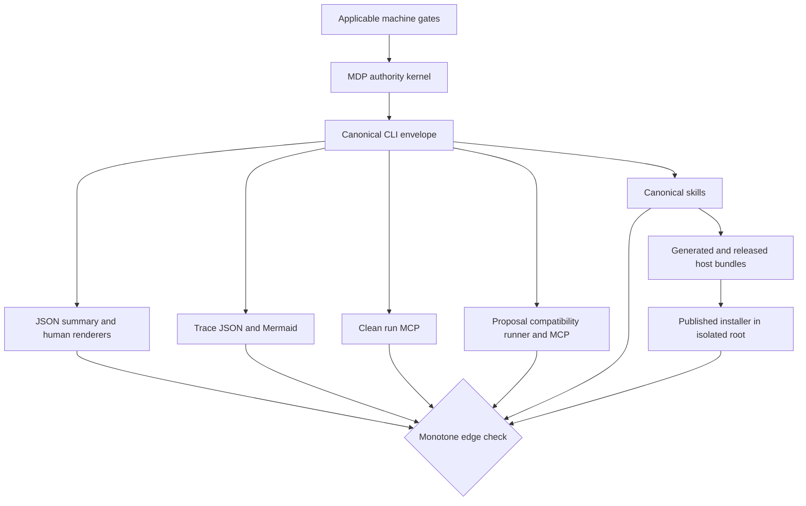
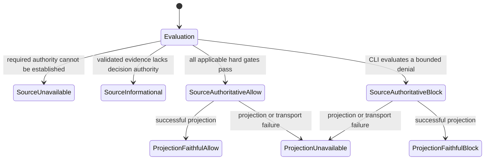
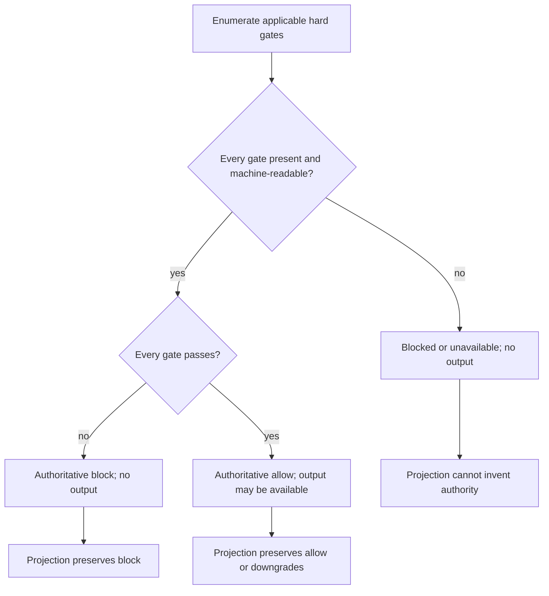

# Authority Monotonicity and Fail-Closed Conformance - Plan

## Goal Capsule

- **Objective:** Make MDP-210 enforce one MDP-specific authority model across every supported CLI, projection, compatibility, MCP, skill, wrapper, generated package, release, and published-installed artifact surface.
- **Invariant:** A downstream surface may preserve or reduce upstream authority. It may never increase authority, change an authoritative block into an allow or reviewable state, or expose usable output after an applicable gate fails.
- **Authority owner:** The Rust CLI is the only component that can originate authoritative allow or block decisions. Renderers, JavaScript adapters, MCP servers, skills, and host bundles are projections or transports.
- **Prerequisites:** MDP-205, MDP-208, and MDP-209 are shipped in v0.1.71. Their fixes remain regression contracts. MDP-207 supplies the cross-surface audit that MDP-210 turns into conformance enforcement.
- **Execution profile:** One MDP-210 branch and PR. Build the typed kernel first, migrate projections and adapters, add bounded conformance proof, then align packaging and docs.
- **Deployment boundary:** Repository implementation lands one release-ready MDP-210 feature PR. Publishing an immutable release remains a separate authorized action. Release CI proves source-built versus published-installed MDP CLI/plugin parity in isolated roots; this plan does not configure a developer's hosts.
- **Stop conditions:** Stop if a change creates a generic policy framework, changes an existing public status without a compatibility decision, treats process exit or MCP transport success as decision success, hand-edits generated bundles, deletes canonical skills, or adds cross-repository host-stack work.

---

## Product Contract

### Summary

MDP currently computes authority across several status vocabularies: validation booleans, profile activation blockers, fit and route states, run terminal states, receipt assurance, output authority, trace authority, process exits, and JavaScript compatibility fields. MDP-205, MDP-208, and MDP-209 closed three concrete laundering paths, but the repository has no shared model or executable cross-surface proof that prevents the next adapter from reintroducing the same class of defect.

MDP-210 adds an MDP-specific authority kernel, explicit boundary mappings, and a conformance suite. Every successful governed result must prove all applicable machine-readable gates. Every successful projection of an authoritative block must retain that block. A renderer or transport failure may make the result unavailable, but it cannot invent a different decision.

### Problem Frame

The current system is locally defensive but globally implicit. Separate commands and adapters infer authority from fields such as `valid`, `status`, `draft_status`, `decision`, `terminal_state`, `completed`, and process exit. These fields describe different concepts. Treating one as a proxy for another caused detached legacy ingress to succeed, invalid raw output to self-certify a trace, computed activation blockers to be ignored, blocked briefs to appear reviewable, and canonical denials to be inconsistently represented as MCP transport errors.

The missing product capability is conformance, not another isolated fix. Contributors need a closed rule, a complete supported-surface inventory, and tests that fail whenever a new projection can report a stronger result than its authoritative input.

### Key Decisions

- **The authority model is MDP-specific.** (session-settled: user-approved — chosen over a general policy or workflow framework: the defect class concerns MDP decision, gate, and output contracts.) Governs R1-R4, R17.
- **All supported surfaces are in scope.** (session-settled: user-approved — chosen over fixing only the three known regressions: an incomplete matrix would leave untested laundering paths.) Governs R5-R14.
- **Published artifacts, not local host state, prove installation parity.** (session-settled: user-directed — chosen over installing from the feature checkout: MDP-210 must compare source-built behavior with the release installer's isolated CLI/plugin result.) Governs R20-R22.
- **Canonical skills and wrappers remain MDP-owned projections.** (session-settled: user-directed — chosen over host-specific configuration work: `plugin/skills/` and repository wrappers must preserve CLI authority without expanding this issue into another repository.) Governs R17-R19.

### Actors

- A1. **Pack operator or host agent** invokes MDP and must receive an honest allow, block, or unavailable result.
- A2. **MDP CLI** validates pack authority, computes applicable gates, originates the decision, and controls governed-generation capability.
- A3. **Projection or compatibility adapter** renders, summarizes, transports, or translates the CLI result without adding authority.
- A4. **Contributor and reviewer** extend MDP and rely on deterministic conformance checks, mutation probes, Cubic review, and CI budgets.
- A5. **Release operator** publishes one version-aligned MDP release and relies on isolated installer smoke to prove source-to-release-to-installed parity.

### Requirements

**Canonical authority and terminal semantics**

- R1. Define one typed, MDP-specific source authority state that separates authority level, decision disposition, terminal class, governed-generation capability, applicable gate results, and canonical reason codes; represent projection fidelity and layer-local diagnostics separately.
- R2. Permit effective authority to move only from `authoritative` toward `informational` or `unavailable`; no downstream edge or edge composition may increase it.
- R3. Require every successful projection of an authoritative decision to retain the source `allow` or `block` disposition and canonical source reason codes; projection failure yields an unavailable projection that still identifies the source state.
- R4. Grant usable governed generation only to an authoritative allow whose exhaustive machine-checkable obligation profile includes and passes every required gate; an omitted, unresolved, or unevaluable obligation is unavailable, while an evaluated denial is an authoritative block, and both prevent governed success.

**CLI and runtime enforcement**

- R5. Route pack validation, requirements, skill eligibility, profile activation, source binding, fit, routing, context, briefs, demo copy, prompt-output validation, runs, receipts, replay, verification, trace, and conformance commands through explicit authority mappings.
- R6. Preserve the shipped MDP-205 detached-input refusal, MDP-208 validated prompt-output receipt requirement, and MDP-209 shared computed activation veto as named regression cases.
- R7. Make late runtime failures monotone: generated bytes remain quarantined, public output and output authority are cleared, and the canonical terminal and reasons cannot improve after a failure.
- R8. Distinguish decision success from command completion, rendering success, integrity verification, process exit, and lifecycle labels such as `completed`.

**Projections, transports, and compatibility**

- R9. Make JSON, summary, human output, human brief, decision-trace JSON, and Mermaid render from the same canonical state or an explicit permitted downgrade.
- R10. Treat a well-formed CLI allow or block envelope as successful MCP transport; reserve MCP `isError` for spawn, timeout, overflow, malformed output, unsupported contract, invalid argument, or transport failure.
- R11. Make clean-run MCP, proposal runner, and proposal MCP preserve canonical CLI authority and keep legacy fields subordinate to the embedded canonical result.
- R12. Prevent trace, summary, renderer, compatibility, exit-code, or receipt fields from self-certifying authority when their authoritative source is absent or invalid.

**Executable conformance and CI**

- R13. Maintain one closed table-driven surface registry and packaged corpus that covers every canonical authority state, obligation profile, gate family, terminal subtype, projection, transport, persistence edge, compatibility adapter, and authority-derived behavior; no shipped authority-consuming path may remain unregistered.
- R14. Add bounded property and metamorphic tests plus targeted mutation probes that prove monotonicity, block preservation, gate conjunction, no-output failure, and projection composition.
- R15. Keep the fast pull-request authority gate reproducible and under a three-minute target timeout; keep the focused mutation job within a twelve-minute whole-job timeout and twenty-four mutation candidates.
- R16. Add a root Cubic rule for authority laundering and require a manual Ultrareview of the MDP-210 PR because new `cubic.yaml` instructions do not govern the branch that first introduces them.

**Skills, wrappers, packaging, and installed parity**

- R17. Keep `plugin/skills/` as the only authored skill source; all five canonical MDP skills must direct agents to preserve CLI authority and must pass generated-host parity.
- R18. Make the clean-run MCP server, proposal runner, proposal MCP server, activation hook, and post-edit hook consume canonical CLI authority without creating alternate success semantics.
- R19. Generate Claude Code, Cursor, Codex, and OpenCode bundles only through Pluxx, and verify every generated skill, wrapper, script, reference, and executable bit against canonical MDP source.
- R20. Keep the release manifest, CLI binary, plugin bundles, installers, and version metadata on one immutable MDP release identity.
- R21. Extend published-installer smoke in an isolated home to prove the installed MDP CLI and plugin bundle, including canonical skills and wrappers, rather than testing source-tree paths.
- R22. Validate representative allow, block, unavailable, renderer, MCP, native-adapter, proposal compatibility, and receipt results against hand-authored expected semantics, then compare the exact staged release-build MDP artifact with the exact published-installed artifact; any semantic, version, inventory, or digest drift fails parity.

### Key Flows

- F1. **Canonical decision and output**
  - **Trigger:** A1 invokes an authority-bearing CLI operation.
  - **Actors:** A1, A2.
  - **Steps:** A2 computes applicable gates, folds them into one canonical state, and grants governed-generation capability only when R4 holds.
  - **Outcome:** The structured result contains one authoritative allow or block, or an unavailable result with no invented authority.
  - **Covers:** R1-R8.
- F2. **Projection and transport**
  - **Trigger:** A3 receives a canonical CLI result.
  - **Actors:** A2, A3.
  - **Steps:** A3 uses a registered mapping, preserves an authoritative disposition on success, and separates projection or transport failure from decision state.
  - **Outcome:** No rendering, summary, MCP, or compatibility field is stronger than the source.
  - **Covers:** R2-R3, R8-R12.
- F3. **Contributor conformance**
  - **Trigger:** A4 changes an authority-bearing command or adapter.
  - **Actors:** A4.
  - **Steps:** The surface corpus, bounded properties, mutation probes, CI budget, and Cubic review exercise the new edge.
  - **Outcome:** An unregistered or authority-increasing edge cannot merge unnoticed.
  - **Covers:** R13-R16.
- F4. **Release and installed parity**
  - **Trigger:** The MDP-210 PR is merged and its patch release is authorized.
  - **Actors:** A5.
  - **Steps:** Release CI builds the source artifact, publishes one version-aligned release, installs it into an isolated home through `scripts/install.sh --agents -y`, and compares CLI/plugin inventories, digests, wrappers, and authority outcomes.
  - **Outcome:** Source-built and published-installed MDP artifacts preserve the same canonical authority without touching a developer's host configuration.
  - **Covers:** R17-R22.

### Acceptance Examples

- AE1. **Known-regression closure.** Given detached governed input, raw prompt output without validated receipt authority, or a computed profile blocker, the canonical result is blocked and every supported projection remains blocked with no usable output. Covers R3-R7.
- AE2. **Human brief preservation.** Given a blocked brief whose fit status is not `disqualified`, the human brief reports blocked rather than falling through to `needs-review`. Covers R3, R9.
- AE3. **Late failure.** Given generated bytes followed by audit, source-reread, publication, cleanup, deadline, or verification failure, public output is absent and no success terminal survives. Covers R4, R7.
- AE4. **MCP canonical denial.** Given a well-formed CLI no-draft envelope and nonzero CLI exit, clean and proposal MCP return a successful transport carrying the unchanged block. Given malformed CLI output, they return a transport error. Covers R8, R10-R11.
- AE5. **Legacy lifecycle.** Given a proposal compatibility manifest with lifecycle `completed` and canonical authority blocked, no legacy field projects an allow or authoritative output. Covers R8, R11-R12.
- AE6. **Metamorphic blocker.** Given any passing fixture, adding one applicable failed or unknown hard gate can only preserve or reduce authority and must remove governed-generation capability. Covers R2, R4, R14.
- AE7. **Projection composition.** Given any canonical state, applying summary then MCP wrapping or trace then Mermaid rendering never produces a stronger state than applying either projection alone. Covers R2-R3, R9-R14.
- AE8. **Bounded mutation.** Given a mutation that reverses the authority comparison, swaps allow and block, omits a no-draft variant, restores renderer fallback-to-success, converts canonical denial to MCP error, or stops clearing output authority, the focused mutation job kills it within the declared budget. Covers R14-R15.
- AE9. **Canonical package parity.** Given the five authored MDP skills and repository wrappers, generated host bundles contain matching files, bytes, executable bits, and authority-preservation guidance. Covers R17-R19.
- AE10. **Published installer parity.** Given a released version, isolated `--agents` installation yields the matching CLI and plugin release identity, complete skill/wrapper inventory, and release-manifest digests. Covers R20-R22.
- AE11. **Behavioral installed parity.** Given the same conformance corpus, source-built and published-installed CLI/plugin entry points return equivalent authority, transport, terminal, reason, and governed-generation results. Covers R18, R21-R22.
- AE12. **Release boundary.** Given a source checkout ahead of the latest release, installed parity does not pass against source bytes and smoke waits for a release containing MDP-210. Covers R20-R22.

### Success Criteria

- Every authority-bearing surface appears in the checked-in conformance registry and has at least one allow, block, unavailable, and malformed-source case where applicable.
- The MDP-205, MDP-208, and MDP-209 regression families fail closed across CLI, renderer, trace, MCP, compatibility, and installed-host projections.
- Pull-request authority checks add no more than three minutes to CI. Focused mutation proof has a twelve-minute hard cap and no more than twenty-four listed candidates.
- Cubic reports no unresolved P0/P1 authority-laundering finding at merge.
- When release is separately authorized, one released MDP version produces matching source-built and published-installed CLI versions, five-skill/plugin inventories, wrapper inventories, content digests, and authority outcomes.

### Scope Boundaries

**Included**

- An MDP-specific authority kernel and exhaustive mappings from existing public status families.
- CLI runtime, output, renderer, trace, MCP, proposal compatibility, skills, packaging, release, and installed-host conformance.
- Bounded Rust properties, metamorphic cases, hand-authored probes, focused `cargo-mutants`, reproducible CI inputs with hard timeouts, and Cubic review.
- Existing MDP release installers and isolated source-built versus published-installed CLI/plugin parity proof.

**Deferred to follow-up work**

- New agent-host targets beyond the existing Pluxx-generated Claude Code, Cursor, Codex, and OpenCode bundles.
- Developer-machine host discovery or end-user environment migration beyond isolated release-installer smoke.

**Outside MDP's identity**

- A generic authorization, policy, workflow, or orchestration framework.
- Model-provider execution, CRM, enrichment, sending, proposal submission, or hosted automation.
- Cross-repository agent-stack adapters, host bootstraps, application setup, third-party skill filtering, or developer-machine configuration.
- Editing Pluxx-generated bundles by hand or installing the feature checkout into a developer's host.

### Dependencies

- MDP v0.1.71 is the shipped baseline for MDP-205, MDP-208, and MDP-209.
- `cargo-mutants` 27.1.0 and the selected `proptest` release must be pinned for reproducible CI before their lockfile changes land.
- Cubic reads repository configuration from the default branch. The MDP-210 PR therefore needs an explicit manual Ultrareview using the new rule text.
- Published-installed parity requires a later release tag that contains the MDP-210 merge commit and passes the existing release workflow.

### Sources

- Linear MDP-205, MDP-207, MDP-208, MDP-209, and MDP-210.
- `cli/src/commands/health.rs`
- `cli/src/commands/skills.rs`
- `cli/src/commands/requirements.rs`
- `cli/src/commands/routing.rs`
- `cli/src/commands/briefs.rs`
- `cli/src/commands/human_brief.rs`
- `cli/src/run_contracts.rs`
- `cli/src/run_runtime.rs`
- `cli/src/commands/run_verification.rs`
- `cli/src/commands/decision_trace.rs`
- `cli/src/commands/decision_trace/render.rs`
- `cli/src/output.rs`
- `cli/src/app.rs`
- `scripts/mdp-run-mcp-server.mjs`
- `scripts/mdp-proposal-runner.mjs`
- `scripts/mdp-proposal-mcp-server.mjs`
- `scripts/validate-skill-packaging.py`
- `scripts/release-install-smoke.sh`
- `scripts/install.sh`
- `pluxx.config.ts`
- `.github/workflows/ci.yml`
- `.github/workflows/release.yml`
- `docs/distribution.md`

---

## Planning Contract

### Key Technical Decisions

- KTD1. **Represent source authority and projection state separately.** (session-settled: user-approved — chosen over one ordinal status enum: block versus allow is a disposition, while authority strength and governed-generation capability are independently monotone.) The source state owns `authority_level`, `disposition`, `terminal_class`, `governed_generation`, `applicable_gates`, and canonical `reason_codes`. A projection owns fidelity, source identity, and layer-local diagnostics; it does not become a second source state. Governs R1-R4.
- KTD2. **Validate edges with a constrained relation.** `unavailable < informational < authoritative` orders effective authority. A successful projection of authoritative source state retains disposition and canonical reasons. Governed-generation capability may move only from available to absent. A failed projection is unavailable, retains source identity, and carries diagnostics in a separate projection or transport namespace. Terminal subtypes are not authority-ordered. Governs R2-R4, R9-R12.
- KTD3. **Map existing contracts at boundaries instead of replacing them.** Public wire vocabularies remain stable unless a mapped value is proven unsafe. Each existing status family gets one exhaustive conversion into source authority and one explicit projection relation. Governs R5-R12.
- KTD4. **Compute one exhaustive gate conjunction with closed classification.** Each authority-bearing operation binds a machine-checkable obligation profile listing every required hard gate; callers cannot omit obligations. The kernel folds `pass`, `fail`, `missing`, `malformed`, `unknown`, and `not-applicable`. An evaluated policy, fit, validation, or activation denial is an authoritative block. A missing obligation or missing, malformed, unknown, unsupported, or unverifiable required authority is unavailable unless an existing public contract explicitly owns a stricter authoritative denial mapping. Informational diagnostics can complete, but only a complete obligation profile with every applicable hard gate passed can produce governed success. Governs R4-R8.
- KTD5. **Keep transport and lifecycle orthogonal.** Exit status, MCP `isError`, renderer completion, verifier integrity, and proposal `completed` report their own layer. Consumers read the embedded canonical authority for the decision. Governs R8, R10-R12.
- KTD6. **Use one closed surface registry and independent fixture corpus.** Any shipped MDP path that receives, transforms, renders, transports, persists, or derives behavior from authority must register its role and applicable projections before it can pass conformance. Rust surfaces use typed table cases. JavaScript wrappers, canonical skills, generated packages, and published-installed smoke consume identical serialized fixture bytes. Hand-authored expected authority, disposition, terminal, reason, transport, and governed-generation outcomes form an oracle independent of production mappings so parity cannot reproduce one shared bug. Governs R13-R14, R17-R22.
- KTD7. **Bound randomized proof.** Run 256 reproducible `proptest` cases per property with a checked-in seed, stable fixture ordering, and sequences of at most 64 registered transformations. Persist a minimized regression fixture when shrinking finds a failure. Governs R14-R15.
- KTD8. **Bound mutation by listed candidate set.** Install `cargo-mutants` 27.1.0 with `--locked` from the checksum-verified Cargo registry and cache it by exact version. Select only the authority module and named direct-mapping functions. Fail when listing produces more than twenty-four candidates. Use at most two workers and 40 seconds per mutant, reserve two minutes for setup and reporting, cap mutation execution at ten minutes, and cap the entire job at twelve minutes. Any missed or timed-out selected mutant fails the gate. Governs R14-R15.
- KTD9. **Use a two-tier CI contract.** The normal PR gate runs reproducible units, properties, metamorphic cases, adapter corpus, and hand-authored probes under a three-minute timeout for the added authority target. The focused mutation job runs on authority-bearing changes and before release under KTD8. Wall-clock limits are CI SLOs, not semantic determinism claims; logs record runner image, Rust version, seed, case count, and elapsed time. Governs R13-R16.
- KTD10. **Make Cubic review authority-specific.** Add an officially validated root `cubic.yaml` rule that rejects authority synthesis outside the Rust kernel, block-to-review/allow translations, success inferred from exit or transport, governed generation after failed gates, and unregistered surfaces. Because branch-local configuration cannot govern its introducing PR, record a manual Ultrareview requested with the same checklist. Treat that review as manual evidence rather than CI, and do not claim synthetic-diff automation unless Cubic's supported interface proves it. Governs R16.
- KTD11. **Generate packages; never hand-copy.** Canonical skills stay under `plugin/skills/`. Pluxx generates the existing Claude Code, Cursor, Codex, and OpenCode bundles. Release validation compares every generated file to canonical MDP source. Governs R17-R19.
- KTD12. **Prove parity from the exact staged release build.** Release CI records the checksum of the CLI artifact built from the exact tagged commit before publication. `scripts/release-install-smoke.sh` then installs the published `--agents` release into an isolated home, proves the installed binary matches that staged checksum, invokes only installed plugin paths, and compares normalized corpus results with the staged release-build baseline. No developer host setup is part of parity. Governs R20-R22.
- KTD13. **Separate feature and release completion.** The feature PR may modify repository contracts, tests, workflows, release assets, docs, and version metadata. A separately authorized release action creates the immutable tag and owns published-installer smoke. Merge completes the coding task when release is not authorized. Governs R20-R22.
- KTD14. **Digest complete plugin trees and executable identity.** The release manifest sorts every plugin-relative file, records byte digest and executable bit, and hashes that canonical manifest as the tree digest. Installed proof records the resolved installed `mdp` binary checksum plus plugin tree digest so version strings alone cannot pass parity. Governs R19-R22.
- KTD15. **Keep failed publications ineligible.** The existing release workflow may publish before smoke. If published-installer smoke fails, that tag is not an accepted MDP-210 release; remediation follows `docs/distribution.md` with a new immutable patch release rather than rewriting the tag. Governs R20-R22.

### High-Level Technical Design

#### Authority topology

The Rust kernel is the only node that originates `authoritative`. Every outgoing edge names an input mapping, an output mapping, and a monotonicity assertion. A missing edge registration is a conformance failure.

#### Canonical state and transition rules

The evaluation branch constructs one source state; the outgoing edges then relate that completed source state to a projection state. It is not a lifecycle that lets a source decision mutate after issuance. A faithful informational trace can report an authoritative source allow or block while remaining non-authoritative itself. There is no valid edge from authoritative block to reviewable or allowed disposition. Downstream composition preserves the source decision or becomes unavailable.

#### Gate fold and terminal classification

A command can exit zero after producing an informational diagnostic or canonical block when zero means command or transport completion. It must not label that state as governed success. The structured source authority is canonical.

Terminal subtypes are closed, incomparable reason categories rather than an authority ranking. The first terminal state that removes governed success is absorbing. Later cleanup, publication, or transport failures append namespaced diagnostics without replacing that terminal or restoring output. When no authoritative decision was established, failure to establish or inspect required authority produces unavailable.

### Run Terminal Compatibility

| Existing run outcome | Canonical mapping | Lifecycle compatibility | Governed generation |
|---|---|---|---|
| `Success` with canonical allow | Authoritative allow | Preserve `success`; existing success exit and MCP transport remain unchanged | Available only when the operation emits governed generation |
| `Success` with canonical no-draft or blocked decision | Authoritative block | Preserve shipped `success` as non-governing execution lifecycle metadata; decision-oriented exit behavior remains characterized | Absent |
| `NoDraftPreflightRefused` | Authoritative block for an evaluated refusal; unavailable when required authority could not be established | Preserve exact subtype and reason-driven distinction | Absent |
| `NoDraftRunnerFailed` | Unavailable | Preserve exact subtype; append runner diagnostic | Absent |
| `NoDraftOutputInvalid` | Authoritative block | Preserve exact subtype and output-validation reason | Absent |
| `NoDraftDecisionInvalid` | Authoritative block | Preserve exact subtype and decision-validation reason | Absent |
| `NoDraftAuditIncomplete` | Unavailable | Preserve exact subtype and audit diagnostic | Absent |
| `NoDraftPolicyBlocked` | Authoritative block | Preserve exact subtype and policy reason | Absent |
| Projection or wrapper failure after any source result | Preserve source mapping; projection becomes unavailable | Preserve source lifecycle and append namespaced local diagnostic | Never restored |

CLI exits remain characterized per existing command and are not authority inputs. A well-formed allow, block, or unavailable CLI envelope remains successful MCP transport; only MCP-owned spawn, timeout, overflow, malformed-envelope, unsupported-contract, or argument failure sets transport error. Proposal `completed` and native-adapter completion remain non-governing lifecycle metadata.

### Supported Surface Registry

| Surface family | Owning paths | Required authority behavior |
|---|---|---|
| Pack and profile gates | `cli/src/commands/health.rs`, `skills.rs`, `requirements.rs`, `source_binding.rs` | Validation and computed activation blockers feed the same gate fold. |
| Decisions and context | `cli/src/commands/routing.rs`, `cli/src/commands/briefs.rs`, `cli/src/routing.rs`, `cli/src/runtime_context.rs` | Fit, route, context, brief, and demo output cannot outrank activation or source authority. |
| Governed model output | `cli/src/commands/prompt_output.rs`, `proof_output.rs`, `conformance.rs` | Raw or schema-valid bytes do not gain decision or output authority without validated receipt and all applicable gates. |
| Run authority | `cli/src/run_contracts.rs`, `run_runtime.rs`, `run_replay.rs`, `commands/run.rs`, `run_receipt.rs`, `run_verification.rs` | Every late failure clears usable output and preserves the strongest applicable block. |
| CLI projections | `cli/src/output.rs`, `cli/src/app.rs`, `cli/src/commands/human_brief.rs` | JSON, summaries, human output, and exit behavior expose but do not recompute authority. |
| Trace projections | `cli/src/commands/decision_trace.rs`, `decision_trace/schema.rs`, `decision_trace/render.rs`, `decision_trace/tests.rs` | Trace and Mermaid remain non-authoritative projections and retain source allow/block. |
| Clean MCP | `scripts/mdp-run-mcp-server.mjs`, `scripts/test-run-mcp-server.mjs` | Canonical decisions are data; only transport failures set MCP error. |
| Proposal compatibility | `scripts/mdp-proposal-runner.mjs`, `scripts/mdp-proposal-mcp-server.mjs`, proposal tests | Legacy lifecycle and advisory fields remain subordinate to embedded canonical authority. |
| Native model adapters | `scripts/mdp-native-model-openai.mjs`, `scripts/mdp-native-normalize-openai.mjs`, native-driver/parity tests | Native lifecycle and transport metadata remain subordinate to CLI run authority; driver or normalization success cannot create governed success. |
| CLI command inventory | `cli/src/cli.rs`, `cli/src/app.rs`, every `cli/src/commands/` variant | Every Clap command and subcommand is classified as authority origin, projection, verifier, lifecycle, diagnostic, artifact writer, or not applicable; a new unclassified variant fails completeness tests. |
| Schemas and discovery | `cli/src/commands/schemas.rs`, `capabilities.rs`, `models.rs` | Public schema and capabilities disclose canonical semantics and supported mappings. |
| Canonical skills | `plugin/skills/mdp/`, `mdp-pack-builder/`, `mdp-pack-review/`, `mdp-gtm-brief/`, `mdp-proposal-review/` | Skills invoke CLI authority and never override, repair, or manually infer it. |
| Hooks and assets | `scripts/mdp-activate.sh`, `scripts/mdp-post-edit-validate.sh`, `plugin/assets/`, `assets/` | Hooks and mirrors preserve gate failures; generated assets remain exact. |
| Generated hosts | `pluxx.config.ts`, generated Pluxx bundles, `scripts/validate-skill-packaging.py` | Claude Code, Cursor, Codex, and OpenCode bundles match canonical MDP skill, reference, wrapper, script, and executable-bit content. |
| Release and installed parity | `.github/workflows/release.yml`, `scripts/install.sh`, `scripts/finalize-release-manifest.mjs`, `scripts/release-install-smoke.sh` | Release version, manifest, CLI, bundles, installer, tree digests, and isolated installed authority outcomes form one identity. |

### Canonical Source-State Validity

| Authority level | Disposition | Terminal class | Governed generation | Gate and reason shape | Constructor result |
|---|---|---|---|---|---|
| `unavailable` | `undetermined` | `authority-unavailable` | `absent` or `not-applicable` | At least one required authority is missing, malformed, unknown, unsupported, or unverifiable; canonical availability reason required | Valid |
| `informational` | `undetermined` | `diagnostic-complete` | `absent` or `not-applicable` | Evidence is valid for inspection but no decision authority applies; diagnostic reason optional | Valid |
| `authoritative` | `allow` | `success` | `available` when this command emits governed generation; otherwise `not-applicable` | Every applicable hard gate is present and passes; no deny or availability reason | Valid |
| `authoritative` | `block` | One closed `no-draft-*` subtype | `absent` | At least one evaluated hard gate owns the denial; canonical denial reason required | Valid |
| Any other combination | Any | Any | Any | Contradicts one or more dimensions | Reject construction; the calling boundary emits unavailable with an internal-contract diagnostic and no governed generation |

Safe decision artifacts, fit evidence, receipts, and diagnostics are not governed generation and may accompany block or unavailable states when their owning public contract permits them. The first `no-draft-*` terminal is absorbing. Later failures append namespaced diagnostics without replacing the canonical terminal.

### Command and Projection Applicability

U1 generates the command axis from the closed Clap command tree and keeps an explicit checked-in classification for every variant. The projection axis covers JSON, summary, readable output, human brief, decision trace, Mermaid, clean MCP, proposal runner, proposal MCP, receipt, verification, and replay. Each cell is one of `supported-authority`, `supported-informational`, `supported-lifecycle`, or `not-applicable` with a bounded reason.

A supported cell names its source mapping and edge relation. A `not-applicable` trace cell does not expand trace support; attempting that unsupported source returns a bounded unavailable or unsupported-source result and cannot synthesize a trace decision. Completeness tests fail when a new command, output mode, renderer, MCP tool, or compatibility version has no cell.

### Canonical Reasons and Diagnostics

Canonical source reasons use gate-owned closed families and remain attached to source authority. Projection, verifier, lifecycle, and transport diagnostics use separate namespaces and carriers. A downstream surface may append its local diagnostic with a source reference, but it cannot delete, rewrite, or replace canonical source reasons. Ordering is deterministic: canonical reasons follow gate registration order, and local diagnostics follow the projection edge order.

### Implementation Constraints

- Keep public enums and JSON stable unless an existing value is unsafe. Add fields additively where possible.
- Reject unknown canonical authority and gate variants in closed contracts.
- Preserve canonical reason codes from the owning CLI gate in their source namespace. Adapters add only namespaced local diagnostics and never replace source reasons.
- A user can supply new evidence and request a new CLI evaluation. User intent cannot override an existing authoritative block in place.
- Keep generated or quarantined bytes private after every no-draft terminal.
- Do not use exit status alone as authority input.
- Keep all repository tests key-free, offline, deterministic, and synthetic.
- Do not broaden MDP into provider execution or generic policy evaluation.
- Keep `.agent-artifacts/`, installer scratch, and generated parity reports out of commits.
- Use the repository's supported generation, release, and installer commands. Do not copy files directly into generated or installed locations.

### CI and Review Budget

| Tier | Contents | Determinism | Hard budget | Failure rule |
|---|---|---|---|---|
| Focused developer | Authority kernel units, one surface-family test, named regressions | Fixed fixtures | 60-second timeout | Any failed mapping or monotonicity assertion blocks progress. |
| Pull request fast gate | 256 seeded property cases per property, max sequence length 64, full metamorphic corpus, JS adapter corpus, skill wording assertions | Checked-in seed and fixture ordering; logged Rust and runner versions | 3-minute timeout for the added target | Timeout, flake, unregistered surface, or mismatch fails CI. |
| Focused mutation | Named kernel/direct-mapping selectors only; max 24, 2 workers, 40 seconds each | Registry-checksummed `cargo-mutants` 27.1.0 installed `--locked` and cached by version | 10-minute mutation cap; 12-minute whole-job timeout | Missed, timed-out, or excess candidate fails the job. |
| Full repository | Existing `make validate` plus authority targets | Offline and key-free | Existing baseline plus fast-gate budget | Any existing or new target failure blocks merge. |
| Cubic | Manual Ultrareview on MDP-210, then root rule for later PRs | Saved rule text and PR review record | Review before merge | Any unresolved P0/P1 authority-laundering finding blocks merge. |
| Release/install | Source-built release artifact versus published-installed MDP CLI/plugin parity | Exact release tag, staged CLI checksum, plugin tree digests, and normalized corpus | Release workflow budget | Source-only or version-mismatched proof cannot satisfy authorized release completion. |

### Sequencing

1. Add the typed kernel, complete command/projection registry, shared corpus schema, and characterization fixtures.
2. Migrate Rust authority origins and projections against that corpus while preserving public contracts.
3. Align JavaScript MCP and compatibility adapters against the same corpus.
4. Add properties, mutation probes, CI budget, and the officially validated Cubic rule.
5. Align canonical skills, wrappers, generated bundles, release manifest, docs, and isolated installer smoke.
6. Review and merge the feature PR. If release authorization is present, create and validate one immutable patch release containing MDP-210.

### System-Wide Impact

- **CLI contract:** gains a typed internal authority model and machine-readable conformance metadata while preserving existing command vocabularies where safe.
- **Runtime:** all late failures use one no-output rule.
- **MCP:** canonical denials become successful transports with blocked structured content; true transport faults remain errors.
- **Compatibility:** proposal lifecycle labels stop functioning as implicit decision authority.
- **Agent behavior:** five canonical skills share one preserve-or-downgrade rule and never override CLI blocks.
- **CI:** PRs gain deterministic properties and a bounded focused mutation job.
- **Release:** The existing four Pluxx host bundles and published installers gain exact source-built versus installed authority parity proof.
- **Host boundary:** All installation proof runs in isolated CI roots; no developer host configuration changes.

### Risks and Mitigations

- **Risk: a single ordinal model treats block as weaker or stronger than allow.** Mitigation: KTD1 separates authority level from disposition and governed-generation capability.
- **Risk: migration changes public JSON or exit behavior accidentally.** Mitigation: characterize every existing family first and require explicit compatibility fixtures under KTD3 and KTD5.
- **Risk: a renderer hides an authoritative block by downgrading to review.** Mitigation: successful authoritative projections preserve disposition; only projection failure may become unavailable.
- **Risk: property tests generate meaningless arbitrary JSON.** Mitigation: generate only real canonical states, terminal families, gates, and registered transformations.
- **Risk: mutation testing becomes slow or flaky.** Mitigation: cap listed candidates, workers, per-mutant timeout, and total wall clock; reject repository-wide mutation runs.
- **Risk: the first Cubic config is not active on its own PR.** Mitigation: require a manual Ultrareview with the same rule text before merge.
- **Risk: generated bundles drift from canonical skills or wrappers.** Mitigation: compare complete plugin trees, executable bits, and deterministic tree digests from `plugin/skills/` and repository scripts.
- **Risk: source tests pass while the published installer is stale.** Mitigation: rerun the same authority corpus using only installed CLI/plugin paths and require matching release identity and checksums.
- **Risk: isolated smoke accidentally resolves source-tree tools.** Mitigation: scrub source paths from the smoke environment and assert the resolved binary and wrapper roots are under the isolated install home.

### Documentation and Operational Notes

- Update `docs/distribution.md` as the release and installation authority. Keep command detail there rather than duplicating it in agent instructions.
- Document canonical authority, gate conjunction, terminal-versus-transport semantics, and stable failure reasons in a focused conformance document.
- Document the existing `--agents` installer, four generated host bundles, isolated install root, source-versus-installed comparison, and stable failure semantics in `docs/distribution.md`.
- Release smoke records the release tag, source and installed CLI checksums, five MDP skill IDs, wrapper inventory, plugin tree digests, and corpus result digests. It must not resolve source-tree executables after installation.

---

## Implementation Units

### U1. Add the canonical authority kernel

**Goal:** Define the typed MDP-specific authority state, gate fold, constrained product order, and exhaustive mappings from existing Rust status families.

**Requirements:** R1-R8; KTD1-KTD4.

**Dependencies:** None.

**Files:**

- Create `cli/src/authority/mod.rs` and `cli/src/authority/tests.rs`.
- Modify `cli/src/main.rs` or the crate module registry.
- Modify `cli/src/cli.rs` to expose the complete command axis to classification tests.
- Modify `cli/src/run_contracts.rs`.
- Modify `cli/src/models.rs` where shared public projections need additive fields.
- Modify `cli/src/commands/schemas.rs` and `cli/src/commands/capabilities.rs`.
- Create canonical registry, independent expected outcomes, and characterization fixtures under `plugin/assets/authority-conformance/` with exact mirrors under `assets/authority-conformance/`.

**Approach:** Characterize current statuses before changing behavior. Implement the source/projection dimensions and edge predicates in KTD1-KTD2. Generate the command axis from the Clap command tree and require an explicit classification and projection-applicability row for every command. Map each current status family exhaustively. Establish the shared corpus schema and snapshots before caller migration. Keep public wire values stable and expose additive conformance metadata only where consumers need it. Centralize the applicable-gate fold and enforce R4 in constructors rather than relying on renderer checks.

**Execution note:** Start with table-driven characterization tests for MDP-205, MDP-208, MDP-209, human-brief blocked fallback, and run terminal states before migrating callers.

**Patterns to follow:** Closed serde contracts in `cli/src/run_contracts.rs`, bounded reason vocabularies in run verification, and schema/capability exports in `cli/src/commands/schemas.rs` and `capabilities.rs`.

**Test scenarios:**

1. Construct each valid source authority, disposition, terminal class, and governed-generation combination; reject authoritative block with governed generation available while permitting safe decision and diagnostic artifacts.
2. Fold all-pass applicable gates into authoritative allow and permit governed generation.
3. Map an evaluated denial to authoritative block and a missing, malformed, unknown, unsupported, or unverifiable authority to unavailable unless a named compatibility mapping says otherwise.
4. Ignore an explicit `not-applicable` gate without treating an absent required gate as not applicable.
5. Preserve disposition and canonical source reasons on a faithful authoritative projection while keeping projection authority informational.
6. Allow effective authority and governed-generation capability to decrease, but reject every authority increase and block-to-allow or block-to-review edge.
7. Keep the first no-draft terminal absorbing and append later namespaced diagnostics without changing authority or restoring governed generation.
8. Exhaustively map every shipped run terminal, fit, route, activation, validation, receipt, and trace authority variant; fail compilation or tests when a new variant lacks a mapping.
9. Classify every CLI command and command-by-projection cell; a new unclassified variant fails completeness tests.
10. Each authority-bearing operation has an exhaustive obligation profile; removing or leaving unresolved any required obligation yields unavailable with no governed generation.
11. Covers AE1 and AE6. Reproduce all three shipped regression families through the kernel and shared characterization corpus.

**Verification:** The kernel has exhaustive unit coverage, exported schema/capability metadata is valid, and no caller outside the kernel can construct an impossible governed-success state.

### U2. Enforce monotonicity through Rust CLI and runtime surfaces

**Goal:** Route every Rust authority origin, runtime transition, receipt, verifier, and output projection through U1 without changing unrelated command behavior.

**Requirements:** R3-R9, R12; KTD2-KTD5.

**Dependencies:** U1.

**Files:**

- Modify `cli/src/commands/health.rs`.
- Modify `cli/src/commands/skills.rs`.
- Modify `cli/src/commands/requirements.rs`.
- Modify `cli/src/commands/source_binding.rs`.
- Modify `cli/src/commands/routing.rs` and `cli/src/routing.rs`.
- Modify `cli/src/commands/briefs.rs` and `cli/src/commands/human_brief.rs`.
- Modify `cli/src/commands/prompt_output.rs` and `cli/src/commands/proof_output.rs`.
- Modify `cli/src/commands/run.rs`, `cli/src/run_runtime.rs`, `cli/src/run_replay.rs`, `cli/src/commands/run_receipt.rs`, and `cli/src/commands/run_verification.rs`.
- Modify `cli/src/commands/conformance.rs` and `cli/src/conformance.rs` where they project governed status.
- Modify `cli/src/output.rs` and `cli/src/app.rs`.
- Add focused tests in each owning module and integration cases to `scripts/test-run-conformance.mjs` and `scripts/test-cold-model-conformance.mjs`.

**Approach:** Replace local authority inference with explicit U1 mappings. Remove brief guidance that allows an in-place user override of an authoritative block; new evidence requires a new CLI evaluation. Make human brief render canonical disposition before fit fallback. Route every late run transition through the no-output invariant. Keep process exit as a command-layer signal and test it separately from the structured decision.

**Patterns to follow:** Shared profile activation in `commands/health.rs`, validated receipt authority from MDP-208, detached-input refusal from MDP-205, and sanitized terminal envelopes in `commands/run.rs`.

**Test scenarios:**

1. Covers AE1. Detached governed input, invalid raw prompt output, and computed activation blockers remain blocked on every Rust command and output mode.
2. Covers AE2. A blocked brief with non-disqualified fit renders blocked in JSON, summary, and human output.
3. A user-override request does not change an existing authoritative block; a new evidence artifact can trigger a new evaluation.
4. Covers AE3. Audit, source-reread, publication, cleanup, deadline, and verification failures after generation clear output, compiled context, and output authority as required by their contract.
5. Structural validation success with activation blocked reports command completion separately from governed decision failure.
6. Run verification reports integrity without upgrading the receipt's blocked business result.
7. Replay of a blocked or unavailable run cannot produce allow or usable output.
8. Unknown or malformed status input fails closed instead of falling through to ready or success.
9. Existing valid allow flows preserve their exact authoritative disposition, output digest, and stable public vocabulary.

**Verification:** All Rust command families in the surface registry use explicit mappings, the named regressions pass, and source CLI JSON, summary, human, exit, receipt, replay, and verification results satisfy the same corpus.

### U3. Make trace and renderer projections monotone

**Goal:** Ensure human brief, trace JSON, Mermaid, summaries, and readable output preserve source authority and cannot self-certify.

**Requirements:** R3, R8-R9, R12-R14; KTD2-KTD6.

**Dependencies:** U1-U2.

**Files:**

- Modify `cli/src/commands/decision_trace.rs`.
- Modify `cli/src/commands/decision_trace/schema.rs`.
- Modify `cli/src/commands/decision_trace/render.rs`.
- Modify `cli/src/commands/decision_trace/tests.rs`.
- Modify `cli/src/commands/human_brief.rs`.
- Modify `cli/src/output.rs`.
- Update `docs/decision-traces.md`.

**Approach:** Separate source decision authority, projection authority, and output authority in trace-compatible data. A trace remains informational even when it faithfully reports an authoritative source allow or block. Renderers consume canonical state and cannot infer from fit, draft, receipt presence, or their own validity. Projection failure returns unavailable while retaining the source reference and bounded failure reason.

**Patterns to follow:** Existing projection-only trace contract and canonical JSON/Mermaid parity tests.

**Test scenarios:**

1. Valid authoritative allow renders as an informational trace of allow without making the trace authoritative.
2. Authoritative block renders block with no output authority in trace JSON, Mermaid, human brief, summary, and readable output.
3. Missing or invalid source authority prevents a raw output or trace from declaring decision authority available.
4. Edited trace or Mermaid bytes are ignored as authority; deterministic re-render uses the source.
5. Projection failure yields unavailable and never changes block to needs-review or allow.
6. Covers AE7. Composed trace-to-Mermaid and JSON-to-summary projections remain monotone.
7. Legacy trace fixtures retain compatible fields while new authority fields expose the distinction accurately.

**Verification:** Renderer snapshots, schema tests, and projection-composition cases agree on source disposition, projection fidelity, governed-generation capability, canonical reasons, and local diagnostics.

### U4. Align JavaScript transport and compatibility adapters

**Goal:** Make clean-run MCP, proposal, and native model adapters transport or execute beneath canonical CLI authority without translating lifecycle success into governed success.

**Requirements:** R8, R10-R13, R18; KTD3, KTD5-KTD6.

**Dependencies:** U1-U3.

**Files:**

- Modify `scripts/mdp-run-mcp-server.mjs`.
- Modify `scripts/test-run-mcp-server.mjs`.
- Modify `scripts/mdp-proposal-runner.mjs`.
- Modify `scripts/mdp-proposal-mcp-server.mjs`.
- Modify `scripts/test-proposal-runner.sh` and `scripts/test-proposal-runner-modules.mjs`.
- Modify `scripts/test-proposal-mcp-server.sh`.
- Modify `scripts/mdp-native-model-openai.mjs` and `scripts/mdp-native-normalize-openai.mjs` only where they project lifecycle, transport, or output success.
- Modify `scripts/test-native-model-driver.mjs`, `scripts/test-native-runner.sh`, and `scripts/test-universal-native-parity.mjs`.
- Consume packaged serialized corpus fixtures under `plugin/assets/authority-conformance/`.

**Approach:** Parse and validate the canonical envelope before classifying transport. Return a well-formed allow or block as structured MCP data regardless of the CLI's decision-oriented exit status. Set MCP error only for the transport failures in R10. Preserve proposal v1 `completed`, advisory, and audit-grade fields as non-governing lifecycle or compatibility metadata and ensure embedded canonical authority wins every conflict. A legacy v0 result without embedded canonical authority is unavailable for governed decisions; it cannot infer authority from legacy status. Native driver and normalizer completion remains execution lifecycle evidence only; canonical run validation and receipt authority decide governed success.

**Patterns to follow:** Clean-run MCP's current canonical no-draft handling and bounded process supervision in `scripts/lib/process-supervisor.mjs`.

**Test scenarios:**

1. Covers AE4. A canonical block with nonzero CLI exit is non-error MCP transport with unchanged structured authority in both servers.
2. Spawn failure, timeout, overflow, malformed JSON, unsupported contract, and invalid path are MCP errors with no invented decision.
3. Covers AE5. Proposal `completed` plus canonical block remains block with no usable output.
4. Legacy `advisory` or `audit-grade` cannot upgrade informational or unavailable canonical authority.
5. A canonical allow remains allow through CLI, clean MCP, proposal runner, and proposal MCP.
6. Unknown canonical variant and conflicting compatibility fields fail closed.
7. Process stderr and exit code cannot replace a valid structured decision or leak quarantined bytes.
8. Native driver success with blocked, unavailable, malformed, or unvalidated CLI output cannot create governed generation.
9. Native driver spawn, provider, timeout, and normalization lifecycle failures remain namespaced diagnostics beneath the canonical run terminal.

**Verification:** Black-box CLI/MCP/proposal/native-adapter parity consumes the same packaged fixture corpus and asserts transport or lifecycle status, canonical authority, governed-generation capability, canonical reasons, and local diagnostics separately.

### U5. Add bounded conformance, mutation, CI, and Cubic enforcement

**Goal:** Make authority laundering a deterministic merge-blocking class rather than a reviewer convention.

**Requirements:** R13-R16; KTD6-KTD10.

**Dependencies:** U1-U4. U1 already owns the corpus schema and characterization fixtures.

**Files:**

- Modify `cli/Cargo.toml` and `cli/Cargo.lock` for a pinned `proptest` development dependency.
- Add property and metamorphic tests under `cli/src/authority/` or the final U1 module layout.
- Create `scripts/test-authority-conformance.mjs`.
- Create `scripts/test-authority-mutations.sh` or a focused equivalent.
- Modify `Makefile`.
- Modify `.github/workflows/ci.yml`.
- Modify `.github/workflows/release.yml` when the focused mutation proof is a release prerequisite.
- Create `cubic.yaml`.
- Extend fixtures and hand-authored expected outcomes under `plugin/assets/authority-conformance/` and mirrored `assets/authority-conformance/`.

**Approach:** Build one checked-in corpus keyed by source state, transformation, expected target state, allowed downgrade, and reason preservation. Use typed generators for real states and registered edge sequences only. Add metamorphic transformations for blockers, authority removal, independent diagnostic ordering, legacy-field conflicts, and projection composition. Add hand-authored probes for the six mutation classes in AE8. Pin and constrain `cargo-mutants` under KTD8. Add CI telemetry that prints elapsed time, case count, seed, candidate count, tool version, and timeout classification.

**Execution note:** Establish deterministic failing probes before introducing randomized coverage. Do not run repository-wide mutation testing.

**Patterns to follow:** Existing Make targets, `scripts/test-run-conformance.mjs`, CI's Rust/Node split, and release workflow's exact-artifact smoke.

**Test scenarios:**

1. Reflexivity, antisymmetry, and transitivity of authority-level ordering across all typed states.
2. Every registered adapter edge satisfies U1 transition predicates for all corpus states; any new authority-consuming or projecting path fails until registered.
3. Covers AE6. Adding a failed, missing, malformed, unknown, omitted, or unresolved applicable hard-gate obligation cannot improve authority and always removes governed-generation capability.
4. Removing source authority cannot improve a projection.
5. Reordering independent diagnostics leaves disposition, terminal class, and governed-generation capability unchanged.
6. Covers AE7. Any sequence of up to 64 registered transformations remains monotone.
7. Reason codes survive preserving transitions and retain source reasons on projection failure.
8. Every no-draft terminal has no usable output, including late runtime states.
9. Every corpus case is checked against hand-authored expected semantics independent of production mapping code before source-built versus installed equivalence is evaluated.
10. Covers AE8. Each hand-authored mutation class fails at least one deterministic test.
11. Candidate listing over the focused files is at most twenty-four; an excess fails before mutation execution.
12. A missed or timed-out selected mutant fails CI; killed and unviable mutants are reported distinctly.
13. Fast and mutation jobs terminate within R15 budgets on the repository's standard GitHub runner class.
14. The MDP-210 PR prepares the manual Ultrareview checklist from the validated rule text; U7 requests the review after U6 and resolves all P0/P1 findings. Later PRs load the validated root rule from the default branch.
15. If Cubic officially supports local synthetic-diff evaluation, a fixture proves each rule family; otherwise the plan does not claim that automation.

**Verification:** New Make targets pass twice with identical seed/candidate inventory, CI enforces both budgets, `make validate` remains green, and the validated Cubic rule and manual-review checklist are ready for U7.

### U6. Align canonical skills, wrappers, packaging, and installer proof

**Goal:** Make the authority contract release-identical across all five canonical skills, repository wrappers, four Pluxx bundles, and the published `--agents` installation.

**Requirements:** R17-R22; KTD6, KTD11-KTD15.

**Dependencies:** U1-U5.

**Files:**

- Modify `plugin/skills/mdp/SKILL.md`.
- Modify affected files under `plugin/skills/mdp-pack-builder/`, `plugin/skills/mdp-pack-review/`, `plugin/skills/mdp-gtm-brief/`, and `plugin/skills/mdp-proposal-review/`.
- Modify `scripts/test_skill_contracts.py` and `scripts/validate-skill-contracts.py`.
- Modify `scripts/validate-skill-packaging.py`.
- Modify `scripts/test-run-mcp-server.mjs`, `scripts/test-proposal-runner.sh`, `scripts/test-proposal-runner-modules.mjs`, and `scripts/test-proposal-mcp-server.sh` for wrapper authority fixtures.
- Modify `scripts/test-pluxx-hooks.sh` and `scripts/test-opencode-wrapper.mjs` for activation, post-edit, and generated-wrapper parity.
- Modify `pluxx.config.ts` only for metadata or generated-host behavior supported by Pluxx.
- Modify `scripts/install.sh`, `scripts/test-install.sh`, `scripts/finalize-release-assets.sh`, and `scripts/finalize-release-manifest.mjs`.
- Modify `scripts/release-install-smoke.sh` and `scripts/test-release-install-smoke.sh`.
- Modify `.github/workflows/release.yml`.
- Update `README.md`, `cli/USAGE.md`, `docs/distribution.md`, `docs/host-conformance.md`, and affected authority/trace/run docs.
- Create `docs/authority-conformance.md`.

**Approach:** State the preserve-or-downgrade rule once in canonical skill guidance and keep job-local skills focused on their workflows. Test required authority language and prohibited override language across all five authored skills and wrappers. Continue to generate Claude Code, Cursor, Codex, and OpenCode through Pluxx. Record version, complete file inventory, per-file byte digests, executable bits, and deterministic plugin tree digest in the release manifest. Preserve the exact staged release-build CLI checksum before publication. Extend published-installer smoke to install `--agents` into an isolated home, clear source paths, verify installed inventories and tree digests for all four host roots, prove the installed CLI matches the staged checksum, and compare normalized authority results through representative installed plugin entry points. Supply an isolated Claude CLI test double that implements only the installer-required prerequisite contract and routes the Claude Code install root into the synthetic home, so `--agents` cannot silently skip that host or touch a real installation.

**Patterns to follow:** `plugin/skills/` source ownership, `scripts/validate-skill-packaging.py`, current Pluxx target generation, installer dispatch in `scripts/install.sh`, and release smoke's isolated home.

**Test scenarios:**

1. Covers AE9. All five authored skills and authority-sensitive wrappers preserve CLI-owned allow, block, unavailable, reason, and transport semantics.
2. Generated Claude Code, Cursor, Codex, and OpenCode bundles match canonical skill, reference, wrapper, script, and executable-bit content.
3. Release manifest contains the exact staged CLI checksum, each host plugin inventory, per-file digests, executable bits, and deterministic tree digest.
4. Covers AE10. Published `--agents` installation succeeds in an isolated home, resolves only installed CLI/plugin paths, and proves installed inventories and digests for all four generated host roots; the synthetic Claude prerequisite prevents a skip and no real Claude installation is touched.
5. Covers AE11. The same allow, block, unavailable, renderer, MCP, proposal, receipt, and MDP-205/208/209 fixtures produce equivalent normalized staged-release-build and published-installed results through representative installed entry points.
6. Missing asset, checksum mismatch, incomplete plugin tree, wrong executable bit, version drift, stale wrapper, source-path resolution, or semantic mismatch fails installer parity.
7. A smoke-failed release remains ineligible and requires a new immutable patch tag.
8. Docs contain no private path, token, credential, machine-specific value, or local host configuration procedure.

**Verification:** Skill contracts, wrapper tests, Pluxx bundle validation, installer tests, public-artifact lint, and `make validate` prove staged-artifact parity readiness; actual published-installer smoke and accepted-release proof remain conditional U7 release-completion evidence.

### U7. Review, release, and prove published artifacts

**Goal:** Land one reviewed MDP-210 PR, then publish the patch release required for published-installed parity only when the release action is separately authorized.

**Requirements:** R13-R22; KTD9-KTD15.

**Dependencies:** U1-U6.

**Files:** Only review fixes, routine version synchronization, release metadata, and documentation required by the repository release contract.

**Approach:** Run simplification and code review after implementation. Request the manual Cubic Ultrareview with the MDP-210 rule because branch-local Cubic configuration is not yet authoritative. Resolve every P0/P1 authority finding. Include the patch version bump in the feature PR when release intent remains authorized. Merge completes the coding task. A human release operator separately authorizes and creates the immutable tag; release CI then builds and publishes the CLI, four Pluxx bundles, installers, manifest, and source-versus-installed smoke. A smoke-failed tag is remediated by a new patch release. Do not create a separate release-only PR by default.

**Test scenarios:**

1. Exact implementation commit passes focused tests, mutation budget, `make validate`, code review, and Cubic Ultrareview.
2. When release is authorized, the release tag, `cli/Cargo.toml`, plugin metadata, Pluxx config, manifest, CLI binary, and plugin assets use one version.
3. When release is authorized, published-installer smoke downloads release assets, scrubs source paths, resolves only isolated installed paths, and matches the staged release-build CLI checksum.
4. When release is authorized, staged-release-build and installed smoke reproduce equivalent allow, authoritative block, unavailable, renderer, MCP, proposal, and receipt results; all four installed host roots match five-skill, wrapper, executable-bit, and tree-digest inventories.
5. A missing artifact, digest mismatch, stale manifest, source-path leak, or semantic drift blocks release closeout without reopening feature-PR completion.

**Verification:** Feature completion requires the merged commit and green required checks. If release is separately authorized, release completion additionally requires one accepted immutable patch tag whose published installer proves source-built versus installed MDP CLI/plugin parity.

---

## Verification Contract

| Gate | Command or proof | Applies to | Done signal |
|---|---|---|---|
| Rust unit and integration | `cargo test --manifest-path cli/Cargo.toml` | U1-U3 | Kernel, mappings, terminals, renderers, receipts, replay, and verification pass. |
| Authority fast gate | `make validate-authority-conformance` | U1-U5 | Fixed corpus, 256 seeded property cases per property, metamorphic sequences, and hand-authored probes pass within three added minutes. |
| Adapter parity | `make validate-run-conformance validate-run-mcp validate-proposal-runner validate-proposal-mcp` | U2-U5 | CLI, clean MCP, proposal runner, and proposal MCP agree on authority while transport remains distinct. |
| Cold-model regression | `make validate-cold-model-conformance` | U2-U5 | Existing conformance records do not gain authority and no-output states stay closed. |
| Focused mutation | `make validate-authority-mutations` | U1-U5 | Pinned tool lists at most 24 focused candidates; every selected mutant is killed or validly unviable within twelve minutes, with no missed/timeouts. |
| Skill, wrapper, and packaging | `make validate-skills validate-skill-contracts validate-skill-evals validate-skill-packaging validate-asset-sync validate-run-mcp validate-proposal-runner validate-proposal-mcp validate-pluxx-hooks` | U4, U6 | Five authored skills, authority-sensitive wrappers, and four Pluxx bundles preserve the same authority contract and canonical bytes. |
| Installer contract | `make validate-installers` | U6-U7 | Installer fixtures are version-aligned, digest-verified, source-path-isolated, and fail closed on each declared artifact or wrapper fault. |
| Full repository | `make validate` | U1-U7 | All existing and new offline, key-free repository checks pass for the exact commit. |
| Cubic review | Manual Ultrareview using the MDP-210 authority rule; later PRs use root `cubic.yaml` | U5-U7 | No unresolved P0/P1 laundering, unregistered-surface, or fail-open finding. |
| Release and installed parity | `.github/workflows/release.yml` plus `scripts/release-install-smoke.sh` | U6-U7 | One authorized post-merge release publishes matching CLI, four Pluxx bundles, manifest, and installers; isolated installed entry points match source-built authority corpus and digests. |
| Public safety | `make validate-public-artifacts` | U1-U7 | Fixtures, docs, logs, and release assets contain no secrets, customer data, private paths, local host state, or unsafe proof claims. |

### Deterministic Property and Metamorphic Inventory

- Authority level is reflexive, antisymmetric, and transitive.
- Successful authoritative projections preserve allow or block disposition.
- Effective authority and governed-generation capability never increase along a registered edge.
- Adding or worsening one applicable hard gate cannot improve source authority or governed-generation capability.
- Removing authoritative evidence cannot improve a downstream state.
- Reordering independent diagnostics does not change decision semantics.
- A failed renderer or transport becomes unavailable without synthesizing another decision.
- Legacy lifecycle or advisory metadata cannot outrank embedded canonical authority.
- Projection composition across two or more surfaces remains monotone.
- Every no-draft family removes usable output, including late failures.
- Preserving transitions retain bounded source reasons; failure transitions add rather than replace reasons.
- New surface registration is required before a mapping can enter the supported matrix.

### Mutation Probe Inventory

- Reverse an authority-level comparison.
- Swap authoritative allow and block mappings.
- Omit one no-draft or gate-failure variant.
- Change unknown or malformed fallback to allow or reviewable success.
- Let a renderer infer readiness from fit or draft status.
- Convert canonical MCP denial into transport error or transport failure into canonical denial.
- Treat proposal `completed` as authoritative success.
- Stop clearing output authority after a late runtime failure.
- Let trace or raw output self-certify authority.
- Bypass computed profile activation in one consumer.

---

## Definition of Done

### Feature PR completion

- One typed Rust authority kernel owns all authority construction and edge validation.
- Every supported surface in the registry has an explicit mapping, applicability classification, and corpus coverage.
- Governed success is impossible unless every applicable machine-readable gate passes.
- Authoritative blocks remain blocks through every faithful projection and transport.
- No-output terminal states expose no usable governed generation.
- MDP-205, MDP-208, and MDP-209 regressions remain closed across all supported projections.
- Fast and mutation CI use reproducible inputs, meet their hard timeouts, and fail on timeout or missing coverage.
- Manual Cubic Ultrareview has no unresolved P0/P1 authority finding.
- Canonical skills, generated bundles, release assets, and docs remain source-owned and version-aligned.
- No secrets, customer data, private documents, transcripts, tokens, cookies, local-only absolute paths, or unsupported claims enter committed artifacts.
- Dead-end experiments, duplicate mappings, temporary probes, and abandoned code are removed before completion.

### Authorized release completion

- A human release operator authorizes and creates one immutable patch tag containing the merged MDP-210 commit.
- Published-installer smoke passes; a smoke-failed tag remains ineligible and is not rewritten.
- The accepted release publishes matching CLI, four Pluxx bundles, manifest, installers, checksums, and complete plugin tree digests.
- Isolated installed CLI/plugin entry points resolve no source-tree paths and reproduce the normalized source-built authority corpus, including MDP-205/208/209 regressions.

### Per Unit

- **U1:** Impossible authority combinations are unconstructable or rejected, every current status maps exhaustively, and schemas disclose the canonical dimensions.
- **U2:** All Rust origins and runtime transitions use U1; late failures clear output; existing successful flows remain compatible.
- **U3:** Human, summary, trace, and Mermaid projections preserve source disposition and cannot self-certify.
- **U4:** MCP transport and proposal compatibility preserve canonical data and classify only true transport faults as errors.
- **U5:** Corpus, properties, metamorphic cases, mutation probes, CI timeouts, and Cubic review are merge-blocking and reproducible.
- **U6:** Five canonical skills, authority-sensitive wrappers, four Pluxx bundles, installers, manifest, release smoke, and docs agree on one authority contract and version.
- **U7:** One reviewed PR merges; when separately authorized, one immutable release containing MDP-210 passes source-built versus published-installed CLI/plugin parity.
