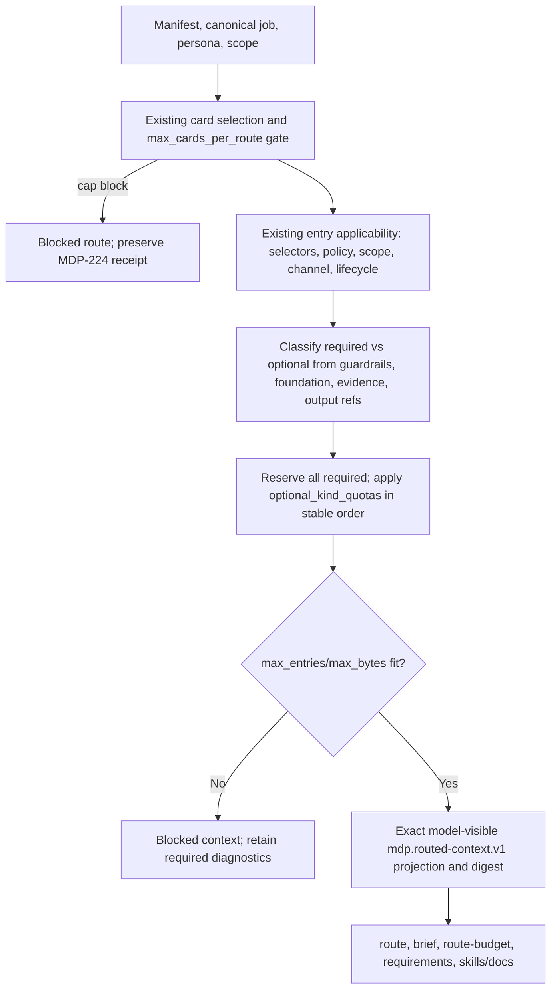

# Required-First Context Allocation and Optional Per-Kind Quotas

## Goal Capsule

- **Objective:** Extend the existing deterministic routed-context compiler so it reserves required authority first, optionally bounds high-volume supporting card kinds per canonical job, and still enforces the job's global entry and byte ceilings.
- **Product authority:** The selected job, its product-foundation resolution, applicable guardrails, evidence dependencies, output requirements, scope, channel, and lifecycle rules remain authoritative. A quota is an optional bound on supporting context, never permission to remove required authority.
- **Implementation authority:** `cli/src/routing.rs` remains the only context allocator. This work extends `entry_route_details`, `entry_context_with_runtime_scoped`, `context_minimality`, and `route_budget_preflight`; it does not create a second router or a retrieval/ranking service.
- **Baseline:** MDP-200 already emits `mdp.context.v0` minimality receipts and canonical `mdp.routed-context.v1` projections. MDP-224 already makes applicable card displacement by `policy.max_cards_per_route` fail closed. MDP-233 must land first so empty `applies_to` selectors cannot be misclassified as optional or absent.
- **Stop conditions:** Stop if requiredness can only be inferred from prose, if a quota can make a cap-displaced route report ready, if the implementation would drop a guardrail/evidence dependency/output requirement, or if the change requires a card-selection redesign beyond this issue's entry allocator.

## Product Contract

### Problem frame

The current compiler selects every applicable bounded entry from cards that survive `max_cards_per_route`, annotates selection authority, and then measures the complete projection against `context_budget.max_entries` and `max_bytes`. That protects required content by blocking on overflow, but it cannot bound a deliberately high-volume optional kind without either raising a global limit or changing applicability. A single per-kind maximum would be unsafe because card kinds such as claims, gaps, avoid rules, output rules, and evidence-backed requirements may be required for a particular job.

MDP-228 adds a job-owned, opt-in allocation policy. The allocator first classifies candidates from existing machine-readable routing and foundation decisions, reserves required authority, applies optional kind quotas only to candidates proven supporting, and finally checks the existing global ceilings. Every omission is deterministic and inspectable by reference and reason code, never by entry body.

### Chosen contract

```yaml
jobs:
  - id: outbound-copy-brief
    context_budget:
      max_entries: 64
      max_bytes: 65536
      optional_kind_quotas:
        hooks: 6
        pains: 8
        ctas: 4
```

- `optional_kind_quotas` is an optional map from the closed `CardKind` vocabulary to a positive maximum number of **optional** entries for that kind. It is not a universal quota and does not count required reservations.
- Requiredness is source-aware, not a blind card-kind maximum. A candidate is reserved when it is a universal safety/fit/output guardrail, a selected product-foundation entry or gap reference, an explicit evidence dependency, or an output requirement required by the selected job. Unreferenced supporting candidates may be quota-bound even when their card kind also contains required entries.
- The allocator applies applicability gates before quotas: empty-selector semantics, persona/job matching, policy, scope, channel, and lifecycle. MDP-233's empty-selector fix is therefore a hard prerequisite.
- Quotas are the only explicit optional omission mechanism in this slice. After required and quota-bounded optional candidates are selected, the existing `max_entries` and `max_bytes` limits remain final. Any global overflow blocks; the allocator never trims required context to make a number fit.
- `policy.max_cards_per_route` remains a separate structural cap. MDP-224's `route_card_cap_excluded_applicable` block is evaluated before entry allocation and cannot be bypassed or downgraded by a successful optional quota pass.

### Stable allocation result

Extend the existing `minimality` receipt additively with an allocation section. The exact field names can follow the repository's existing schema naming, but the result must carry the following information without bodies:

```json
{
  "allocation": {
    "strategy": "required-first",
    "required_count": 12,
    "optional_selected_count": 18,
    "optional_excluded_count": 3,
    "required_by_kind": {"avoid-rules": 2, "claims": 4},
    "quotas": {
      "hooks": {
        "max_optional_entries": 6,
        "reserved_count": 0,
        "optional_selected_count": 6,
        "optional_excluded_count": 2
      }
    }
  }
}
```

The receipt is a projection of the allocator, not new authority. `minimality.excluded` retains stable `card_id`, `card_kind`, `entry_id`, and `reason_code`; add an `optional_kind_quota_exceeded` reason (plus bounded quota metadata where useful). Never include excluded bodies, raw evidence, or prose-derived ranking explanations. Keep `context_sha256` over the exact selected model-visible projection, so changing a quota that changes selected entries changes the digest while changing diagnostic counts alone does not.

## Requirements and Acceptance Mapping

| MDP-228 acceptance criterion | Design / implementation unit | Proof required |
| --- | --- | --- |
| Required guardrails, gaps, evidence dependencies, and output requirements are never silently displaced | U2 source-aware reservation and U3 cross-surface projection | Required-only pressure fixtures; selected required refs remain present or the route is blocked; no required quota exclusion reason appears. |
| Optional high-volume kinds can be bounded per job/card kind | U1 manifest contract and U2 deterministic optional pass | Positive quota fixture for hooks/pains/CTAs (and optional claims where the classifier proves they are supporting) with stable selected/excluded counts. |
| Global `max_entries` and `max_bytes` remain authoritative | U2 final budget gate | Entry-only and byte-only overflow remain blocked after allocation; no ready result exceeds either limit. |
| Overflow blocks rather than truncating required authority | U2 required reservation and fail-closed budget path | Required entries alone over each global limit; context is blocked/null and required refs are not removed. |
| Receipts report reservations, quotas, selected counts, and deterministic exclusions without bodies | U2-U4 receipt/schema/projection work | Route, context, brief, route-budget, JSON summary, and requirements fixtures agree; excluded JSON has no `body` or raw evidence. |
| Existing packs retain an explicit compatibility path | U1/U5 additive opt-in and legacy receipt behavior | Packs without `optional_kind_quotas` retain prior routing; packs without `context_budget` remain readable/unassessed; strict validation does not require the new field. |
| Sanity-like generation/review behavior is stable at 13/14/15-card pressure | U5 synthetic route-budget/eval fixtures | Exact-cap route remains ready; cap displacement remains blocked; cap-sized route with sufficient allowance remains ready, with allocation receipts stable. |
| MDP-224 fail-closed semantics remain intact | U2/U5 structural-cap regression | Existing `route_card_cap` receipt, `route_card_cap_excluded_applicable` diagnostic, strict preflight, and no-body guarantees remain unchanged. |

## Key Technical Decisions

- **KTD1. Extend `JobContextBudget` additively.** Add `optional_kind_quotas` to the existing job-owned context budget rather than adding a manifest-wide policy or a second quota declaration. The map is absent by default, preserving existing packs and keeping quotas job-specific.
- **KTD2. Derive reservations from existing authority.** Introduce a typed internal reservation class/ledger rather than using a raw card-kind maximum. Derive it from guardrail classification, selected foundation entry/gap refs, explicit output/evidence requirements, and existing routing decisions. Keep public `status`, `selection_class`, and reason-code fields compatible while making their source precedence explicit.
- **KTD3. Use a deterministic two-pass allocator.** Preserve current candidate order (card priority, manifest order, then entry order). First retain every applicable required candidate. Then walk optional candidates in the same stable order, enforcing only the declared kind quota. Do not add semantic ranking, vector retrieval, or a global “best N” heuristic.
- **KTD4. Keep global budgets fail closed.** Measure the final selected projection against `max_entries` and `max_bytes` after reservations and optional quotas. If required content or the complete allocated projection exceeds either ceiling, return the existing blocked/null model-context behavior with stable diagnostics. Never remove required authority or silently truncate bodies.
- **KTD5. Keep the card cap independent.** `max_cards_per_route` remains the pre-entry structural bound owned by `select_cards_with_diagnostics`. An applicable card excluded by that cap continues to block under MDP-224, even if its entries would have been optional under U2.
- **KTD6. Make receipts additive and privacy-safe.** Add allocation counts and quota summaries to the existing minimality/route-budget projections. Exclusion records contain bounded IDs, kinds, reason codes, and quota values only. The model-visible digest covers selected content, not diagnostic-only receipt text.
- **KTD7. Fail invalid quota declarations early.** Health/schema validation rejects unknown quota kinds, zero/non-integer values, duplicate/ambiguous keys, or quotas targeting safety-only authority where the contract cannot safely classify optional candidates. A quota never becomes an instruction to override a required reservation.

## High-Level Technical Design



### Allocation ordering and requiredness

1. Resolve the job and existing `select_cards_with_diagnostics`; if the card cap displaced an applicable card, preserve the current blocked route and stop allocation.
2. Run all current entry-level applicability decisions. Empty selector lists are universal only after MDP-233's fix; non-empty selectors remain case-insensitive; scope, channel, lifecycle, and policy exclusions occur before quota accounting.
3. Build one candidate ledger from `route_entry_details`. For each candidate, retain its stable entry identity, card kind, existing reason codes, applicability source, scope, and whether it is a guardrail, foundation entry/gap, evidence dependency, or output requirement.
4. Reserve all required candidates and required foundation gaps before considering optional quotas. A quota for a kind containing required candidates applies only to the optional subset; the receipt records the bypass/reservation count.
5. Apply `optional_kind_quotas` only to optional candidates. An omitted quota means all optional candidates continue through the existing behavior. A quota hit emits `optional_kind_quota_exceeded` and a body-free exclusion record; it does not block by itself.
6. Compute the final projection and apply the existing global entry/byte checks and full-card fallback checks. Required overflow, byte overflow, fallback, scope failure, validation failure, and card-cap displacement remain blocking.

This ordering deliberately does not add authored per-kind minima. Minima would create a second source of requiredness that could contradict product-foundation and output contracts. Existing job/foundation declarations and guardrail classification own reservations; the new field supplies only optional maxima.

## Implementation Units

### U1. Add the opt-in job allocation contract

- **Goal:** Define and validate `context_budget.optional_kind_quotas` without changing legacy manifests.
- **Likely files and symbols:**
  - `cli/src/models.rs`: `ProfileJob`, `JobContextBudget`, and the closed `CardKind` serialization used by the map.
  - `cli/src/commands/schemas.rs`: `profile_jobs_schema`, manifest schema, and requirements/context receipt schemas.
  - `cli/src/commands/health.rs`: profile-job key validation, nested quota shape/positive integer checks, and safe-kind validation.
  - `cli/src/commands/requirements.rs`: `compile_model_task` / requirements projection so the host sees the complete budget contract.
- **Design:** Use a deterministic map keyed by the existing kebab-case `CardKind` values. The value is the maximum optional entry count for that kind. Keep `max_entries` and `max_bytes` required whenever `context_budget` is present. Reject unknown/invalid values and document that required candidates bypass the optional quota.
- **Tests:** Legacy manifest parses and validates unchanged; a valid quota map round-trips; unknown kind, zero, negative/non-integer, and protected-kind declarations fail with stable issue paths; compiled requirements expose the quota map and retain `routed_context_required`; schema and runtime health agree.
- **Dependencies:** MDP-233 must define universal empty selector behavior before allocator validation can claim complete applicability semantics.

### U2. Implement the required-first entry allocator

- **Goal:** Replace the current all-or-nothing context-entry accumulation with one source-aware reservation ledger and deterministic optional quota pass.
- **Likely files and symbols:**
  - `cli/src/routing.rs`: `EntryRouteDetails`, `route_entry_details`, `entry_context_value`, `apply_selection_authority`, `context_minimality`, `selected_authority_count`, `route_budget_preflight`, `route_excluded_reason_distribution`, and focused routing tests.
  - `cli/src/product_foundation.rs`: read-only integration with `ProductFoundationResolution`, `selected_facets`, `entry_refs`, and `gap_refs`; change only if a small helper is required to classify selected authority.
  - `cli/src/scope.rs`: preserve existing `match_entry_scope` decisions; no new scope policy.
- **Design:** Collect candidates before finalizing `context_entries`; classify them once; reserve required candidates; then apply quotas to optional candidates in stable order. Keep selected order deterministic and keep excluded body-free. Extend `minimality` with allocation totals, per-kind quota receipts, and required/optional counts. Keep full-card fallback and MDP-224 cap state as independent blockers.
- **Tests:** Required guardrail/foundation gap/evidence/output candidate survives every quota; optional hook/pain/CTA candidate is excluded exactly at its quota; optional claims are quota-bound only when the classifier proves they are not required; quota exclusion order and digest are stable; applicability/scope/channel/lifecycle exclusions happen before quota counts; required-only entry and byte overflow block without dropping required entries; no-body exclusion and full-card fallback regressions remain green.
- **Dependencies:** U1 contract; MDP-233 selector semantics; MDP-224 cap regression; MDP-200 minimality/digest behavior.

### U3. Project allocation authority across CLI contracts

- **Goal:** Make route, context, brief, requirements, and route-budget consumers expose one allocation receipt and no contradictory readiness.
- **Likely files and symbols:**
  - `cli/src/commands/routing.rs`: `route_scoped` and `route_budget_preflight_command` projections.
  - `cli/src/commands/briefs.rs`: `emit_brief_scoped` and `prospect_brief_from_fit_with_context` pass through the shared `minimality`/allocation data.
  - `cli/src/commands/schemas.rs`: context, minimality, exclusion, route-card-cap, and route-budget-related schemas.
  - `cli/src/output.rs`: route-budget and human/summary projections; retain safe body-free output.
  - `cli/src/app.rs`: `merge_route_budget_preflight` and strict-validation diagnostics if new blockers need aggregation.
  - `cli/src/commands/evals.rs`: expected route/eval fixture projections and reason-code assertions.
- **Design:** Keep `mdp.context.v0`, `mdp.entry-route.v0`, and `mdp.route-budget.v0` identifiers unless a non-additive change proves a version bump necessary. Add fields rather than changing existing meanings. Route and brief must reuse the same compiled allocation/digest; `requirements` reports authored quota policy, while `route-budget` reports per-persona/job application and utilization.
- **Tests:** Route/context/brief digest and allocation parity; strict preflight blocks global overflow and cap displacement; JSON and human summaries report counts and quota reasons without entry bodies; schema rejects malformed receipts and unknown reason codes; existing legacy output remains accepted where the new field is absent.
- **Dependencies:** U2; MDP-235's planned route-budget summary/filter work must consume this receipt rather than invent another quota summary.

### U4. Update starter assets, docs, and agent guidance

- **Goal:** Make the safe opt-in path discoverable and ensure pack authors do not use quotas to hide required authority.
- **Likely files and symbols:**
  - `docs/minimal-context-routing.md` and the relevant `docs/` routing/contract references.
  - `plugin/skills/mdp-pack-builder/SKILL.md`, `plugin/skills/mdp-pack-review/SKILL.md`, `plugin/skills/mdp-pack-review/references/routing-evals.md`, `plugin/skills/mdp-gtm-brief/references/outbound-copy-brief.md`, and `outbound-copy-review.md`.
  - `cli/src/starter.rs`, `cli/src/target_starter.rs`, and mirrored `plugin/assets/templates/*/.mdp/manifest.yaml` only where a synthetic opt-in fixture is needed; do not impose a universal quota on every starter.
- **Design:** Document required-first semantics, the optional-only nature of quotas, supported safe kinds, body-free exclusion receipts, global overflow behavior, and the MDP-224 cap boundary. Tell builders to narrow structured applicability before raising limits and to run strict route-budget preflight. Keep generated/plugin mirrors sourced from canonical assets.
- **Tests:** Skill and instruction validators pass; docs commands match live schemas/help; template byte parity remains green; a fresh starter without quotas retains compatibility; the explicit synthetic quota example remains strict-ready.
- **Dependencies:** U1-U3; no private/customer content or source-local artifacts.

### U5. Add Sanity-like pressure and compatibility proof

- **Goal:** Prove the allocator at the exact 13/14/15-card pressure that motivated MDP-224 and across old/new pack modes.
- **Likely files and symbols:**
  - `scripts/build-route-budget-fixtures.mjs` and route-budget examples under `examples/route-budget/`.
  - `cli/src/routing.rs` tests around `route_card_cap_blocks_applicable_authority_displaced_by_supplemental_base_card`, minimality overflow, and route-budget preflight.
  - `cli/src/app.rs`, `cli/src/commands/routing.rs`, `cli/src/commands/briefs.rs`, `cli/src/commands/schemas.rs`, and `cli/src/output.rs` cross-surface fixtures.
  - `Makefile` route-budget assertions and `scripts/test-cold-model-conformance.mjs` only if the requirements receipt shape changes.
- **Design:** Keep fixtures synthetic and public-safe. Cover: exact cap with all applicable cards; cap + 1 applicable card remains blocked with the existing cap diagnostic; raised cap that restores the required card remains ready subject to global budgets; optional high-volume entries are bounded only by an explicit job quota; required cards/entries remain present under pressure; no-budget legacy pack remains readable/unassessed.
- **Tests:** Run route, brief, route-budget, strict validation/eval, requirements, schema, summary, and digest checks from one fixture family. Assert status, selected/excluded counts, reservations, quota reasons, cap receipt, and absence of bodies. Compare repeated runs byte-for-byte for stable ordering/digests.
- **Dependencies:** U1-U4; MDP-224 merged behavior and MDP-233 merged selector behavior.

### U6. Review, release, and installed-artifact handoff

- **Goal:** Complete the CE evidence for a public runtime/schema contract change.
- **Likely files and artifacts:** `Makefile`, `cli/Cargo.toml` test targets, repository validation scripts, release/install smoke documentation, and the eventual PR/release receipts; no implementation in this planning branch.
- **Design:** Run focused Rust tests first, then full repository validation and installed-artifact smoke because CLI schemas, templates, and skills change. Use `ce-code-review`/data-correctness review before publishing the implementation PR. Keep the MDP-228 plan and source commit linked from Linear; do not delegate or add `Blocks`/`delegate:blocks` metadata in this research-plan phase.
- **Done signal:** All focused and full checks pass, the implementation PR preserves MDP-224/MDP-233 behavior, and the released/installed CLI exposes the same allocation receipt and strict blockers.

## Risks, Dependencies, and Mitigations

| Risk / dependency | Impact | Mitigation / boundary |
| --- | --- | --- |
| MDP-233 is currently a blocker | Empty universal entries could be misclassified as optional, causing unsafe omissions | Keep MDP-228 in research/backlog until MDP-233's runtime, docs, and installed-skill contract is green; add universal-selector regression to U2/U5. |
| Requiredness inferred from card kind alone | A per-kind quota could drop evidence, gaps, or output authority | Use a source-aware reservation ledger from foundation refs, guardrails, evidence/output bindings, and applicability; quota only supporting candidates. |
| `max_cards_per_route` weakened by allocator | A route could report ready while an applicable card is absent | Treat card-cap state as an independent precondition and preserve `route_card_cap_excluded_applicable` exactly; add MDP-224 regression tests. |
| Global byte/entry overflow | Prompt context can exceed the host contract even when per-kind quotas pass | Check both global limits after allocation and block; never truncate required bodies or raise limits automatically. |
| Quota map drift across schemas, health, and requirements | Pack validates differently in CLI versus host/skill tooling | Add closed schema/health/requirements parity tests and keep one `JobContextBudget` source. |
| Receipt leakage | Exclusion diagnostics could disclose private/customer authority | Emit only stable IDs, card kinds, counts, quota values, and reason codes; assert no body/evidence/prose in JSON, human, or trace projections. |
| MDP-235 changes route-budget output concurrently | Two summaries could diverge or overwrite each other's contracts | Make allocation receipt a shared source; coordinate MDP-235 to consume it and keep summary filtering orthogonal. |
| Existing pack behavior changes unexpectedly | Older packs may depend on broad context or silent overflows | Quotas are opt-in; no new default quota; missing budgets remain unassessed; provide removal-of-quota rollback and preserve old contract IDs/fields. |

## Compatibility and Rollback

- **Legacy packs:** A job with `context_budget` but no `optional_kind_quotas` follows the prior selection behavior and receives additive allocation metadata showing no quota policy. A job without `context_budget` remains readable and `unassessed`; it is not silently upgraded to minimality.
- **Existing public contracts:** Preserve `mdp.context.v0`, `mdp.routed-context.v1`, `mdp.entry-route.v0`, and `mdp.route-budget.v0` unless a non-additive schema change forces a new version. Existing `route_card_cap`, `minimality.status`, global budget diagnostics, and digest semantics retain their meanings.
- **Safe configuration rollback:** Remove `optional_kind_quotas` from the affected job to restore the prior allocator behavior. Do not roll back by deleting guardrails, widening card caps, or increasing global budgets.
- **Code rollback:** Revert the single implementation PR if the allocation receipt or readiness semantics regress. No data migration is required; manifests with the additive field remain forward-invalid only when their declared quota shape fails validation.
- **Release rollback:** If installed smoke exposes schema or bundle drift, keep the release ineligible and publish a corrected immutable patch release according to `docs/distribution.md`; do not rewrite a tag.

## Ordered Implementation and Validation

1. Confirm MDP-233 is complete and read its final selector contract; freeze the MDP-224 merged baseline and capture current route-budget counts/digests for the 13/14/15 pressure fixture.
2. Add the typed optional quota contract, schema, health diagnostics, and requirements projection (U1). Validate positive/negative shapes before touching selection.
3. Implement the source-aware candidate ledger and two-pass allocator in the existing routing module (U2). Add required-first, quota-hit, global-overflow, scope/channel/lifecycle, privacy, and deterministic replay tests.
4. Project the allocation receipt through route, brief, route-budget, output, eval, and schemas (U3). Assert cross-command parity and preserve MDP-224 cap blocking.
5. Update docs, canonical skills, synthetic starter/route-budget assets, and examples (U4-U5). Keep plugin mirrors generated from canonical sources.
6. Run focused checks, then the complete repository validation and installed-artifact smoke. Perform data-correctness code review and record PR/release evidence before closing MDP-228.

### Validation commands for the implementation PR

```bash
cargo test --manifest-path cli/Cargo.toml routing
cargo test --manifest-path cli/Cargo.toml health
cargo test --manifest-path cli/Cargo.toml schemas
cargo test --manifest-path cli/Cargo.toml requirements
node scripts/build-route-budget-fixtures.mjs
make validate
```

Also run the repository's skill/package checks and installed-CLI smoke when the implementation changes public schemas, templates, or plugin instructions. Do not claim provider/model execution; all committed evidence remains synthetic and offline.

## Definition of Done

- `optional_kind_quotas` is an additive, validated, job-owned contract with explicit optional-only semantics.
- Required guardrails, foundation gaps, evidence dependencies, and output requirements are reserved before quotas and can only produce ready context when global budgets fit.
- Optional quota exclusions are deterministic, body-free, and included in a shared allocation/minimality receipt.
- Global entry/byte ceilings remain authoritative; card-cap displacement remains the MDP-224 fail-closed block.
- Route, brief, route-budget, requirements, schemas, human output, docs, skills, and synthetic fixtures agree on allocation status, counts, reasons, and digest.
- Legacy packs remain readable with an explicit compatibility/unassessed path and no forced default quota.
- Sanity-like 13/14/15-card pressure and MDP-233 universal-selector regressions pass in focused and full validation.
- The implementation PR receives data-correctness review, release/install proof, and a Linear closeout linked to the exact source commit and plan.

## Sources and Repository Evidence

- Linear MDP-228: required-first context allocation and optional per-kind quotas.
- Linear MDP-239: execution index and queue ordering; MDP-228 remains in its research queue.
- Linear MDP-233: empty `applies_to` selectors; current blocker and prerequisite.
- Linear MDP-224: merged fail-closed card-cap behavior and public `route_card_cap` contract.
- Linear MDP-200: shipped minimal-context routing, budgets, digest, and governed context binding.
- `cli/src/routing.rs`: `select_cards_with_diagnostics`, `route_entry_details`, `context_minimality`, `route_budget_preflight`, and routing regressions.
- `cli/src/models.rs`, `cli/src/commands/health.rs`, `cli/src/commands/schemas.rs`, `cli/src/commands/requirements.rs`: job budget model, validation, schema, and compiled requirements.
- `cli/src/commands/routing.rs`, `cli/src/commands/briefs.rs`, `cli/src/output.rs`, `cli/src/app.rs`, `cli/src/commands/evals.rs`: cross-surface route, brief, summary, strict preflight, and eval projections.
- `docs/minimal-context-routing.md` and `docs/plans/2026-08-10-002-feat-minimal-context-routing-plan.md`: existing minimality contract.
- `plugin/skills/mdp-pack-builder/SKILL.md`, `plugin/skills/mdp-pack-review/SKILL.md`, and `plugin/skills/mdp-gtm-brief/references/*`: agent-facing route-budget and bounded-context guidance.
