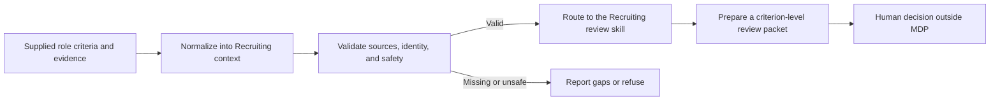

# Recruiting Reference Profile: Recruiter User Story

## The user story

> As a recruiter preparing a structured human review, I want supplied role criteria and candidate evidence converted into a source-backed, privacy-minimized review packet, so I can spend less time reconciling notes and more time making accountable, job-related judgments without delegating the employment decision to software.

This document describes the MVP experience of the MDP Recruiting reference profile. MDP provides validated local decision context for agent-assisted recruiting work. It does not replace an applicant tracking system, recruiter, hiring manager, legal reviewer, or compliance program.

## The recruiter's situation

A recruiter may have an approved role brief, a work sample, structured interview notes, and a scorecard, but the evidence is often scattered across formats. It can be difficult to tell:

- which job-related criterion a source actually supports;
- which expected sources are present, empty, or missing;
- whether a statement is observed evidence or an unsupported inference;
- what still needs human follow-up; and
- who owns the next review step.

MDP turns the supplied material into a consistent review context. It keeps gaps visible and blocks the workflow from silently turning evidence preparation into candidate scoring or an employment outcome.

## When to use the MVP

Use the Recruiting profile when a human reviewer wants help with one of these bounded jobs:

- review role requirements for clarity, job relevance, ambiguity, or proxy risk;
- map supplied candidate evidence to individual role criteria;
- prepare job-related interview questions from explicit evidence gaps;
- surface scorecard gaps without calculating an overall score; or
- validate that a local Recruiting pack still follows its source, privacy, and safety contracts.

Inputs should be supplied by the user and stored in an appropriate local environment. Public examples, tests, documentation, and pull requests must remain synthetic or explicitly sanitized.

Do not use MDP to source or enrich candidates, scrape profiles, run background checks, schedule interviews, send candidate messages, update an ATS, compare or rank people, recommend advancement, reject applicants, make hiring decisions, or certify legal compliance.

## A synthetic example

Jordan is a fictional recruiter working on a fictional customer-support role. The hiring team has approved three job-related criteria: written problem solving, handling ambiguous customer reports, and documenting a resolution. Jordan has a synthetic work sample and synthetic interview notes for Candidate A.

Jordan wants a review packet that shows what each source supports and what remains unknown. Jordan does not want a fit score, candidate ranking, or hire/reject recommendation.

The workflow is:



### 1. Create the local pack

```bash
mdp --json init --template recruiting --dir ./recruiting-review
mdp --json validate --strict --dir ./recruiting-review
mdp --json agent-surface --dir ./recruiting-review
```

The template supplies the Recruiting vocabulary, routing contracts, safety boundaries, normalization prompt, synthetic examples, and eval fixtures. Jordan replaces template context only inside the approved local workflow, not in public fixtures.

### 2. Supply and classify the evidence

Jordan records only the minimum context needed for the review. Real local subjects default to opaque identifiers rather than names. Each source is classified so the workflow can distinguish permitted evidence from an unverified, restricted, missing, or empty source.

The Recruiting normalization contract produces `normalized_context`, not a prospect record. Its trace reports:

- the expected sources that are present, empty, or missing;
- whether the context is ready for the requested review;
- unresolved gaps and prohibited-inference risks; and
- a `review_handoff` naming the accountable human owner and safe next action.

`ready_for_review` means only that enough permitted context exists to prepare the requested artifact. It never means that the candidate fits the role or should advance.

### 3. Route the requested job

```bash
mdp --json route --entries \
  --dir ./recruiting-review \
  --persona "Recruiter" \
  --job "candidate evidence review"
```

The agent uses the matching Recruiting skill to prepare a criterion-level matrix. Every criterion is reported separately with a bounded status such as source-backed, partial, gap, not assessed, or needs human review. The output must not contain a composite score, rank, fit verdict, advancement recommendation, or rejection decision.

### 4. Validate before relying on the packet

```bash
mdp --json validate-prompt-output \
  --dir ./recruiting-review \
  --prompt-id normalize-recruiting-context \
  --file ./normalized-context.json

mdp --json verify-output \
  --dir ./recruiting-review \
  --file ./review-output.json

mdp --json gaps --dir ./recruiting-review
mdp --json eval --strict --dir ./recruiting-review
```

Validation checks structure, declared sources, privacy mode, value contracts, readiness, and the human handoff. Proof verification confirms that evidence-carrying text is bound to real source or card IDs in the pack. If required evidence is absent or the requested action crosses the product boundary, the safe result is a gap report or refusal.

### 5. Make the human decision

Jordan reviews the packet, checks the underlying evidence, follows up on gaps, and records any real employment decision in the team's approved system and process. MDP does not write that decision or convert its review-readiness state into an outcome.

## What the recruiter gains

The MVP gives a recruiter:

- **A repeatable review structure.** The same criterion-level vocabulary is used across role, evidence, interview, and scorecard work.
- **Clear evidence provenance.** Claims can be traced to declared sources and proof bindings instead of being accepted because an agent wrote them confidently.
- **Visible gaps.** Missing, empty, unverified, or restricted sources remain explicit rather than being filled with invented credentials or assumptions.
- **Privacy minimization.** The workflow can operate on opaque subject identifiers and rejects protected-class or proxy inference.
- **Safer agent handoffs.** Every review packet retains an accountable human owner, source snapshot, unresolved gaps, and safe next action.
- **Local, testable decision context.** The pack can be reviewed in version control and checked deterministically with CLI validation and evals.
- **More attention for judgment.** The recruiter can spend less effort rebuilding instructions and reconciling formats while preserving human responsibility for interpretation and decisions.

These are workflow benefits, not a promise of faster hiring, better candidates, bias-free decisions, or legal compliance. Those outcomes depend on the organization's people, policies, evidence quality, and review process.

## Definition of success

The MVP has done its job when the recruiter receives a source-backed, criterion-level review packet with visible gaps and a named human owner, while no protected characteristic, invented credential, candidate rank, fit verdict, advancement recommendation, rejection, or hiring decision has been produced.
