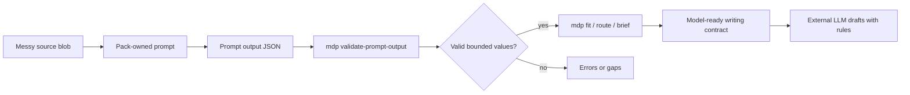

# MDP Mental Model

Use this when the user is turned around by MDP architecture, profile vocabulary, templates, or release state.

## One Sentence

MDP is a local decision-context pack: prompts normalize messy input into bounded values, the CLI validates those values and deterministic gates, and a later writing model receives only the accepted rules, context, gaps, and avoid boundaries.

## The Flow

For a confused operator, start here:

```text
messy row -> normalize -> validate prompt output -> fit/readiness -> route/brief -> draft/check-claims
```

Normalization prepares runtime JSON and keeps `card_patches` empty. It does not mutate cards, decide final fit, or create final copy. A brief is a model-ready context contract; it is not saved unless `--out` is used, and it is draftable only when `draft_status` is `ready`.



The boring parts are deterministic: validation, routing, fit decisions, required fields, disqualifiers, allowed values, no-draft behavior, and claim checks. The dynamic writing model should only draft after those constraints are assembled.

## Core Objects

The core system stays small. Domain-specific words map onto universal primitives instead of creating a new engine each time:

| Universal primitive | GTM vocabulary | Proposal vocabulary |
| --- | --- | --- |
| `actors` | personas, buying committee, users | proposal roles, evaluators, reviewers |
| `decision-criteria` | fit rules, segment rules | bid/no-bid rules, evaluation criteria |
| `source-signals` | account signals, triggers, row fields | opportunity context, requirement signals |
| `needs-requirements` | pains, jobs, needs | requirements matrix |
| `evidence-proof` | claims, proof points | proof library, differentiators |
| `boundaries` | avoid rules, disqualifiers | compliance and proposal boundaries |
| `output-contracts` | output rules, copy patterns | review outputs, proposal output rules |
| `routing-jobs` | motions, channels, tasks | review gates |
| `gaps` | unknowns, missing proof | missing RFP/proof/compliance context |
| `evals` | route/fit/prompt-output fixtures | review route and safety fixtures |

## Layer Ownership

| Layer | Owns |
| --- | --- |
| Manifest | Pack index, supported channels, input readiness policy via `lead_input_requirements`, prompt value contracts, profile metadata, required primitives, eval categories |
| Cards | Reviewed decisions, claims, proof, gaps, output boundaries, profile-owned vocabulary |
| Prompts | Translation from supplied messy context into strict prompt-output JSON |
| Prompt-output validation | Schema, prompt id, provenance, value-contract, attribute, enum, type, and date checks |
| Fit | Deterministic fit, insufficient-context, or disqualified decision |
| Route/brief | Selected context and `draft_status` for the next model step |
| Check-claims | Post-draft claim and output-guardrail approval |

## What To Look Out For

- A profile term like account context or opportunity context is usually vocabulary over `source-signals`, `decision-criteria`, `actors`, and `gaps`; it is not automatically a new core object.
- `activation_ready` is structural profile/template readiness, not market, customer, commercial, compliance, or contact readiness.
- Use `signals` for evidence, prospect `attributes` for bounded reviewed row metadata, source fields such as `source_kind` for provenance, and entry `metadata` for card annotations.
- Clay is one possible source marker, not the default MDP model.
- Prompt outputs are untrusted until `mdp validate-prompt-output` accepts them.
- `source_summary.inputs_used` should name declared prompt inputs such as `raw_row` or `raw_opportunity`, not arbitrary file paths.
- Account-only context can be valid for analysis but should remain no-draft until person/persona readiness is present.
- Proposal packs must surface missing proof and unsafe claims. They must not invent certifications, compliance status, past performance, pricing, or approval state.
