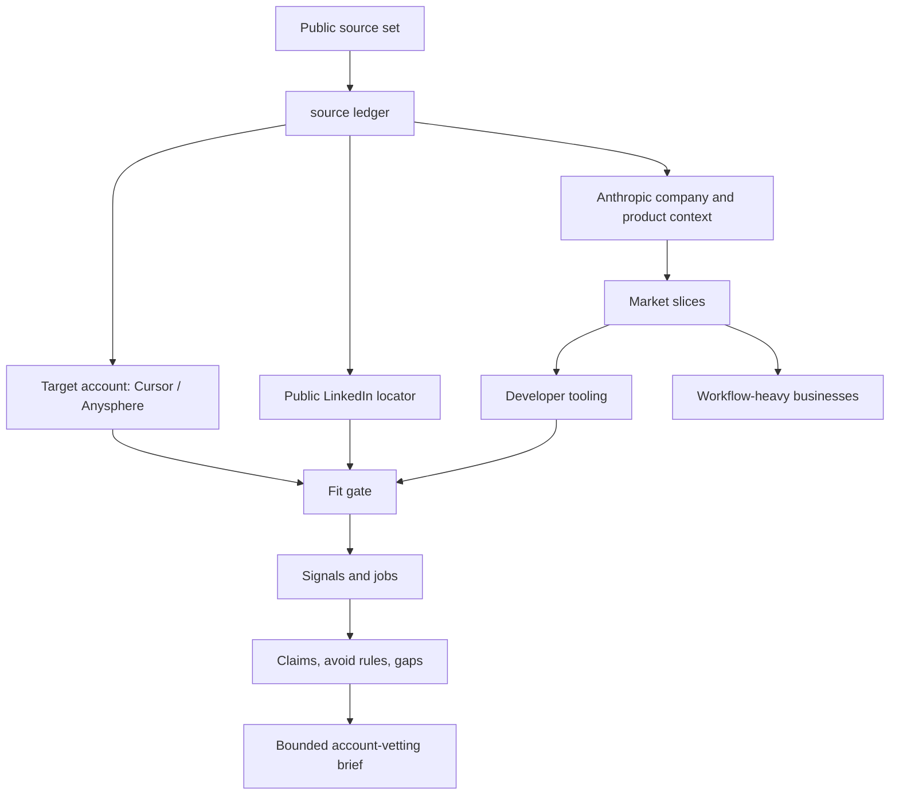

# Canonical MDP Example: Anthropic Market Vetting

This example shows a net-new Message Decision Pack for how Anthropic could define a target market slice, find promising companies, and vet whether a company belongs in that slice before any outbound work.

The example uses public source material only:

- Seller/operator context: Anthropic public company, Claude Code, and Claude for business sources.
- Target company fixture: Cursor / Anysphere, a public AI developer-tooling company.
- Public person locator: a LinkedIn search result for Michael T. at Cursor.

The pack tells a specific story: Anthropic's broad market is too big to hand to an agent as "go find AI companies." The useful work is to encode the slice and vetting rules:

- Developer-tooling companies building AI coding workflows.
- Small or mid-market businesses with repeatable tool-connected workflows.
- AI-native companies where reliability, model behavior, and developer experience are part of the product surface.

## Source Boundary

The user asked to use Apify MCP for LinkedIn. Apify was not available here and was not listed as installable, so this example uses public Firecrawl search metadata for the LinkedIn profile locator and records that limitation in the source ledger and gaps card.

This example stores only minimal public profile metadata and does not claim that the person or company has buying intent.

## What To Inspect

```bash
mdp --json validate --dir examples/anthropic-market-vetting
mdp --json fit --dir examples/anthropic-market-vetting --prospect examples/anthropic-market-vetting/examples/cursor-anysphere.json
mdp --json --summary route --entries --eval-fixture --dir examples/anthropic-market-vetting --persona "Anthropic Account Strategy" --job "target account vetting for developer tooling"
mdp --json --summary brief --context --dir examples/anthropic-market-vetting --prospect examples/anthropic-market-vetting/examples/cursor-anysphere.json --channel linkedin
mdp --json check-claims --dir examples/anthropic-market-vetting --text "Anthropic positions Claude Code as an agentic coding system, and MDP can store source-backed account-vetting context before a brief."
mdp --json gaps --dir examples/anthropic-market-vetting
mdp --json eval --dir examples/anthropic-market-vetting
```

## How The Vetting Story Routes



## The Lift

Without MDP, the agent sees "find AI companies for Anthropic" and can drift into vague lists, unsupported intent claims, or contact scraping. This pack makes the work explicit:

- Source ledger separates Anthropic facts, target-account facts, interpretations, and gaps.
- Fit rules define the market slice and disqualifiers.
- Signals say what public company/person data can and cannot prove.
- Claims constrain what can be said about Anthropic and the target account.
- Gaps prevent the agent from inventing use case, buying center, budget, or intent.
- Evals test route, fit, brief, and claim-check behavior.

## Boundary

This pack can produce a target-account brief or draft direction. It is not a sender, CRM, sequencer, enrichment tool, scraper, AI SDR, BI tool, or generic automation system.
