# Clay Audiences: Self-Serve Enterprise Expansion

This is a synthetic, public-safe Message Decision Pack for one Clay Audiences
motion. It demonstrates how a pack can say exactly what data a source collector
must attempt before a normalization model or deterministic decision run.

It does not contain real Clay, customer, employer, contact, support, or
conversation data. It does not call Clay, browse, enrich, draft, send, sequence,
or update a CRM.

## Decision flow

```mermaid
flowchart LR
    A["Clay Audiences segment"] --> B["Retrieve mdp.requirements.v1"]
    B --> C["Attempt every declared attribute through customer-controlled sources"]
    C --> D["Source-attempt ledger"]
    B --> E["Retrieve versioned normalization prompt"]
    D --> F["Customer-funded normalization"]
    E --> F
    F --> G["mdp.normalized-decision-input.v1"]
    G --> V["validate-prompt-output: exact schema, source request, prompt, time, and projection binding"]
    V --> H["Deterministic fit, routing, brief, and gaps"]
    H --> I{"Decision outcome"}
    I -->|"ready"| J["Compiled context column"]
    I -->|"all other outcomes"| K["No draft"]
    J --> L["Customer-funded copy generation or Clay Sequencer"]
    L --> M["Optional MDP output check"]
```



MDP owns requirements, contract validation, fit, routing, brief compilation,
gaps, and the optional output check. The customer or host owns data access,
source attempts, paid normalization, copy generation, and sequencing.

## What the collector must find

The contract declares fifteen questions in `.mdp/manifest.yaml`. They are not a
generic research wish list:

| Requirement | Attributes |
|---|---|
| Required | company name, company domain, person name, person title, expansion trigger, account-owner state, last meaningful touch |
| Hard gate | customer motion, enterprise eligibility, contact suppression, open support escalation |
| Conditional | current working country when a person is resolved; bounded support context when an escalation is open |
| Optional | employee band, executive-sponsor state |

Run the compiler to retrieve the exact questions, value domains, allowed source
classes, applicability rules, provenance fields, freshness policy, confidence
thresholds, and status behavior:

```bash
mdp --json requirements \
  --dir examples/clay-audiences-self-serve-enterprise-expansion \
  --job prospect-fit-or-brief
```
The prompt does not decide what to search for. The versioned decision-input
contract does. The prompt only normalizes the attempted-complete ledger supplied
by the host.

## Exact interfaces

[`fixtures/source-attempt-request.json`](fixtures/source-attempt-request.json)
is an exact synthetic collector request. It contains one initial attempt for
each declared attribute. A host may make additional attempts, but it must not
omit an attribute. Its trusted `as_of` timestamp anchors freshness calculations.
Every attempt has a unique ID, attribute ID, allowed source class, non-blank
source locator, and request timestamp.

[`fixtures/normalized-response-ready.json`](fixtures/normalized-response-ready.json)
is an exact synthetic normalization envelope. Each attribute preserves one of
five statuses:

- `observed`: a source supplied a contract-valid value.
- `not_found`: the permitted source attempt completed but found no value.
- `not_applicable`: the declared applicability rule did not apply.
- `blocked`: policy or access prevented the attempt.
- `error`: the provider or host failed while attempting it.

Observed attribute results retain the contract-required attempt provenance,
observation timestamp, confidence, and freshness. Non-observed statuses do not
fabricate observation metadata; an `error` result instead requires its
non-blank error detail. `blocked` and `error` are never collapsed into
`not_found`; hard-gate absence is never inferred as safe.

The normalized envelope includes the SHA-256 of the exact source-attempt request.
Validation binds every provenance receipt back to a matching request attempt,
requires the exact job-bound normalization prompt, verifies UTC timestamps, and
derives `age_days` from `freshness.observed_at` and the trusted request `as_of`.
It rejects meaningful normalized prospect values for non-observed attributes.

The normalization envelope always sets `draft_allowed` to `false`.
`outcome: ready` means only that the normalized data may proceed to
deterministic MDP validation and fit. Copy remains blocked until that later
decision returns ready and emits compiled context.

The proposed hosted equivalents are:

```text
GET  /normalization-contract?pack=<pack>&job=prospect-fit-or-brief
POST /evaluations
POST /output-checks
```

They are interface sketches only. This example does not implement an API,
authentication, billing, Cloudflare infrastructure, or a production data path.

## Expected outcomes

[`fixtures/expected-outcomes.json`](fixtures/expected-outcomes.json) defines the
six synthetic acceptance cases:

| Outcome | Trigger | Draft behavior |
|---|---|---|
| `ready` | all applicable required and hard-gate attributes are observed and safe | normalization still emits no draft; deterministic evaluation may compile context |
| `insufficient-context` | a required value is `not_found` | no draft; surface exact gaps |
| `disqualified` | an observed hard gate has a disqualifying value | no draft; stop the motion |
| `human-review` | a hard gate is `blocked`, ambiguous, or unavailable | no draft; require a person to resolve it |
| `malformed` | the request or response violates the compiled JSON Schema or prompt identity/version | no draft; reject the payload |
| `provider-error` | the normalization provider fails or returns an error result | no draft; preserve the error and retry or escalate outside MDP |

Pack eval fixtures exercise deterministic `ready`, `insufficient-context`, and
`disqualified` behavior. The contract matrix covers the pre-evaluation
`human-review`, `malformed`, and `provider-error` host outcomes.

## Local proof

```bash
mdp --json validate --strict \
  --dir examples/clay-audiences-self-serve-enterprise-expansion
mdp --json eval --strict \
  --dir examples/clay-audiences-self-serve-enterprise-expansion
mdp --json requirements \
  --dir examples/clay-audiences-self-serve-enterprise-expansion \
  --job prospect-fit-or-brief
mdp --json validate-prompt-output --strict \
  --dir examples/clay-audiences-self-serve-enterprise-expansion \
  --prompt normalize-prospect.yaml \
  --source-attempt-request examples/clay-audiences-self-serve-enterprise-expansion/fixtures/source-attempt-request.json \
  --file examples/clay-audiences-self-serve-enterprise-expansion/fixtures/normalized-response-ready.json
```
