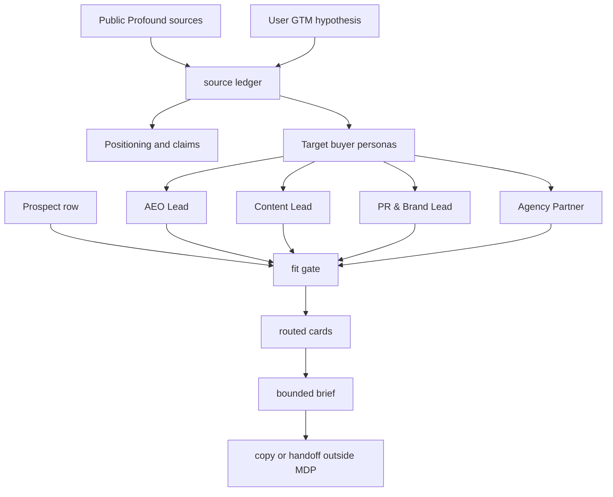

# Canonical MDP Example: Profound GTM Vetting

This example shows a seller-side Message Decision Pack for `tryprofound.com`.

The story is the one you described: a company creates an MDP so any agent can understand who the company wants to reach, what makes a company/person a fit, how the product helps each persona, what hooks and CTAs are allowed, what claims need proof, and where to stop.

For Profound, the target slice is not "every marketer." The pack narrows the market to teams that already show signals around AI search visibility:

- AEO and SEO owners who need answer-engine visibility, citations, prompt tracking, and share of voice.
- Content and demand teams that need to turn prompt and citation gaps into briefs, refreshes, and net-new content.
- PR and brand teams that need to understand AI sentiment, citation domains, and brand narrative in answer engines.
- Agencies or multi-brand teams that need repeatable AI visibility reporting across clients, brands, markets, or engines.

## Source Boundary

This example uses public Profound pages and the user-provided MDP hypothesis from this thread. The committed prospect row is synthetic on purpose. It demonstrates the flow without implying real buyer intent, real contact enrichment, or a real outreach target.

## What To Inspect

```bash
mdp --json validate --dir examples/profound-gtm-vetting
mdp --json fit --dir examples/profound-gtm-vetting --prospect examples/profound-gtm-vetting/examples/sample-aeo-target.json
mdp --json --summary route --entries --eval-fixture --dir examples/profound-gtm-vetting --persona "AEO Lead" --job "linkedin outbound copy"
mdp --json --summary brief --context --dir examples/profound-gtm-vetting --prospect examples/profound-gtm-vetting/examples/sample-aeo-target.json --channel linkedin
mdp --json check-claims --dir examples/profound-gtm-vetting --text "Profound AI answer engine optimization helps brands understand visibility in AI-generated answers, while MDP stores source-backed fit and messaging context before drafting."
mdp --json gaps --dir examples/profound-gtm-vetting
mdp --json eval --dir examples/profound-gtm-vetting
```

## Flue Webhook Agent Example

`flue-webhook-agent/` shows how a webhook-style prospect row can be turned into an MDP fit decision, routed brief, and optional response draft through Flue while preserving the MDP boundary. It uses local scratch plus the `mdp` CLI; it does not send, enrich, scrape, update a CRM, or write to a sequencer.

## How The Story Routes



## The Lift

Without MDP, an agent sees "find customers for Profound" and can drift into vague lists, generic AI SEO copy, unsupported visibility claims, or execution tasks. This pack makes the work explicit:

- `sources.yaml` separates public facts, interpretation, and gaps.
- `personas.yaml` defines target buyer personas.
- `fit-rules.yaml` gates whether the account is worth drafting for.
- `signals.yaml` tells the agent what observable fields matter.
- `claims.yaml` limits what can be said about Profound.
- `hooks.yaml`, `ctas.yaml`, and `copy-patterns.yaml` give reusable messaging decisions.
- `avoid-rules.yaml` blocks overclaiming, scraping, fake urgency, and unsupported outcome claims.
- `output-rules.yaml` keeps generated text inside global style and structure constraints.
- `gaps.yaml` preserves unknowns like current visibility, owner, tech stack, and timing.
- `evals/` proves that fit, routing, brief, and claim checks keep working.

## Boundary

This pack can produce a fit decision, routed context, and a target-account brief. It is not a sender, CRM, sequencer, enrichment tool, scraper, AI SDR, BI tool, or generic automation system.
