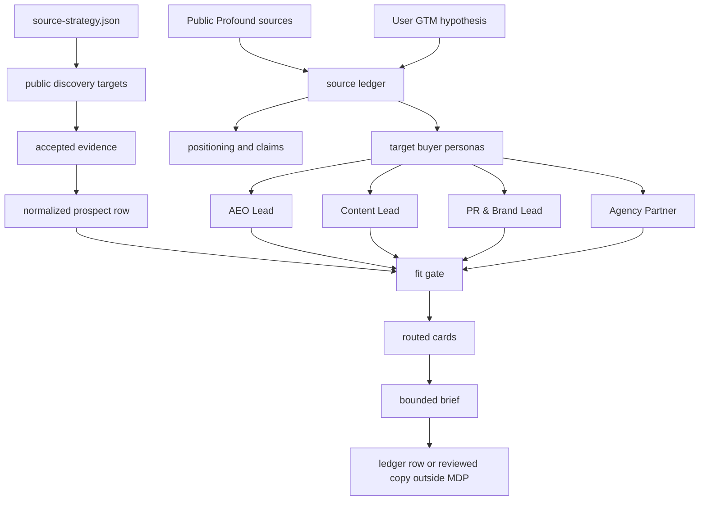

# Canonical MDP Example: Profound GTM Vetting

This example shows a seller-side Message Decision Pack for `tryprofound.com` and the deployable BDR Scout demo.

The story is: a company creates an MDP so any agent can understand who the company wants to reach, what makes a company/person a fit, how the product helps each persona, what hooks and CTAs are allowed, what claims need proof, where to find public evidence, and where to stop.

For Profound, the target slice is not "every marketer." The pack narrows the market to teams that already show signals around AI search visibility:

- AEO and SEO owners who need answer-engine visibility, citations, prompt tracking, and share of voice.
- Content and demand teams that need to turn prompt and citation gaps into briefs, refreshes, and net-new content.
- PR and brand teams that need to understand AI sentiment, citation domains, and brand narrative in answer engines.
- Agencies or multi-brand teams that need repeatable AI visibility reporting across clients, brands, markets, or engines.

## Source Boundary

This example uses public Profound pages plus the user-provided MDP hypothesis from this thread. The committed prospect rows are synthetic on purpose. They demonstrate the flow without implying real buyer intent, real contact enrichment, or a real outreach target.

`examples/profound-gtm-vetting/.mdp/source-strategy.json` is the LFG source-strategy artifact. It tells the scout where to look and where not to look:

- Exa-first public discovery across company pages, blogs, resource centers, jobs, agency service pages, news, docs, podcasts, and events.
- Firecrawl only for accepted public URLs that need clean markdown/structured extraction.
- Apify only for reviewed public actors/datasets with explicit source policy and budget approval.
- No private LinkedIn, gated pages, contact databases, personal contact enrichment, CRM mutation, or autonomous outreach.

## What To Inspect

```bash
mdp --json doctor --dir examples/profound-gtm-vetting
mdp --json validate --dir examples/profound-gtm-vetting
mdp --json eval --dir examples/profound-gtm-vetting
mdp --json gaps --dir examples/profound-gtm-vetting
```

Run the Profound scout-row fit and create-brief path:

```bash
mdp --json fit   --dir examples/profound-gtm-vetting   --prospect examples/profound-gtm-vetting/examples/profound-aeo-scout-row.json

mdp --json brief   --dir examples/profound-gtm-vetting   --prospect examples/profound-gtm-vetting/examples/profound-aeo-scout-row.json   --channel linkedin   --job "linkedin outbound copy"   --context   --out examples/profound-gtm-vetting/.mdp/briefs/profound-aeo-scout-linkedin.json

mdp brief --readable   --dir examples/profound-gtm-vetting   --prospect examples/profound-gtm-vetting/examples/profound-aeo-scout-row.json   --channel linkedin   --job "linkedin outbound copy"   --context   --out examples/profound-gtm-vetting/.mdp/briefs/profound-aeo-scout-linkedin.md
```

Claim and route checks:

```bash
mdp --json --summary route --entries --eval-fixture --dir examples/profound-gtm-vetting --persona "AEO Lead" --job "linkedin outbound copy"
mdp --json check-claims --dir examples/profound-gtm-vetting --text "Profound helps teams understand AI answer visibility, prompt demand, citations, and crawler attribution, but this MDP pack does not send outreach or update CRM records."
```

## Generated Artifacts

- `.mdp/source-strategy.json`: where to find public candidates and evidence, including Exa/Firecrawl/Apify handoffs.
- `.mdp/prompts/normalize-prospect.yaml`: turns raw scout rows into pack-owned prospect JSON before fit/brief.
- `.mdp/briefs/profound-aeo-scout-linkedin.json`: machine-readable brief created by `mdp --json brief --context`.
- `.mdp/briefs/profound-aeo-scout-linkedin.md`: readable operator brief.
- `.mdp/evals/prompt-output-validation-profound.yaml`: eval for the normalize-prospect prompt output contract.

## Deployable Scout Tie-In

The Vercel demo in `examples/mdp-bdr-scout-vercel` should point at this pack and source strategy when demoing Profound:

```bash
export MDP_PACK_DIR=../profound-gtm-vetting
export SCOUT_SOURCE_STRATEGY_PATH=../profound-gtm-vetting/.mdp/source-strategy.json
export SCOUT_FIXTURE_PATH=../profound-gtm-vetting/examples/profound-public-source-fixture.json
npm run scout:sample:native
```

The scout should still append reviewed ledger rows only. Outreach, CRM sync, and connector writes remain disabled until an operator explicitly enables those paths.

## Legacy Flue Webhook Agent Example

`flue-webhook-agent/` remains as a legacy webhook-style comparison. The active turnkey path for this brainstorm is the Vercel demo plus the Profound MDP source strategy, not Flue execution.

## How The Story Routes



## The Lift

Without MDP, an agent sees "find customers for Profound" and can drift into vague lists, generic AI SEO copy, unsupported visibility claims, or execution tasks. This pack makes the work explicit:

- `sources.yaml` separates public facts, interpretation, and gaps.
- `source-strategy.json` defines public source targets, queries, exclusions, evidence requirements, and provider handoffs.
- `personas.yaml` defines target buyer personas.
- `fit-rules.yaml` gates whether the account is worth drafting for.
- `signals.yaml` tells the agent what observable fields matter.
- `claims.yaml` limits what can be said about Profound.
- `hooks.yaml`, `ctas.yaml`, and `copy-patterns.yaml` give reusable messaging decisions.
- `avoid-rules.yaml` blocks overclaiming, scraping, fake urgency, and unsupported outcome claims.
- `output-rules.yaml` keeps generated text inside global style and structure constraints.
- `gaps.yaml` preserves unknowns like current visibility, owner, tech stack, provider approval, and timing.
- `prompts/normalize-prospect.yaml` standardizes raw rows before fit and brief.
- `evals/` proves that fit, routing, brief, claim checks, and prompt-output validation keep working.

## Boundary

This pack can produce a source strategy, fit decision, routed context, and target-account brief. It is not a sender, CRM, sequencer, enrichment tool, scraper, AI SDR, BI tool, or generic automation system.
