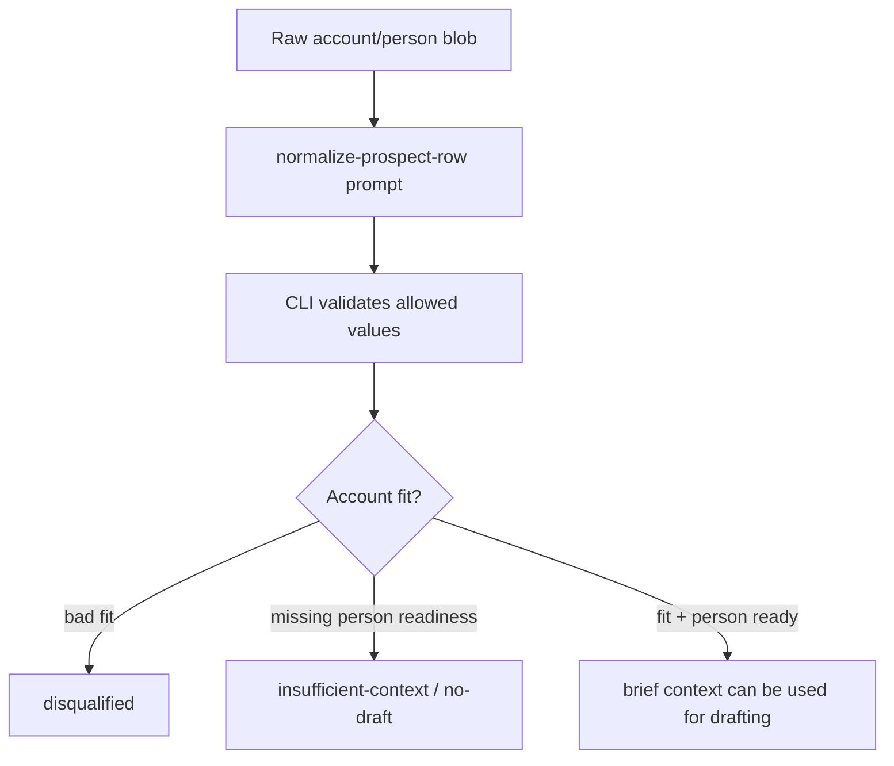

# GTM Account Context

Use this for company-level ICP, account qualification, and account-only no-draft behavior.

## Mental Model

Company context answers: should this account be considered?

Person context answers: can we draft to this human yet?



## Where Company ICP Lives

Use these pack surfaces:

- `.mdp/cards/fit-rules.yaml` for account qualification, disqualifiers, and no-message gates.
- `.mdp/cards/signals.yaml` for observable company signals such as headcount band, hiring, stack, category, or operations trigger.
- `.mdp/cards/personas.yaml` for role/persona readiness once a person or role exists.
- `.mdp/cards/gaps.yaml` for missing account/person evidence.
- `.mdp/manifest.yaml` `lead_input_requirements.value_contracts` and `attribute_definitions` for bounded prompt-output values.
- `.mdp/evals/*` for account-context-present, account-context-missing, account-only-no-draft, and prompt-output-validation cases.

## What Not To Do

- Do not bury company ICP only in copy examples.
- Do not invent a person to make account-only context draftable.
- Do not treat `N/A` as a magic required value. It is a compatibility marker; missing person context should be represented as structured `normalization_trace.missing_required` entries, gaps, and readiness false.
- Do not add a new core card kind just because a GTM user says "account context." Use profile vocabulary over universal primitives.

## Acceptance Shape

An account-only input can be useful and valid, but it should end in no-draft:

```text
company known: yes
account signals: yes
person name/title/persona: missing
fit decision: insufficient-context
brief draft_status: no-draft
brief no_draft_reason: no person name/title was available in the supplied row
next step: ask for reviewed person/persona context
```
