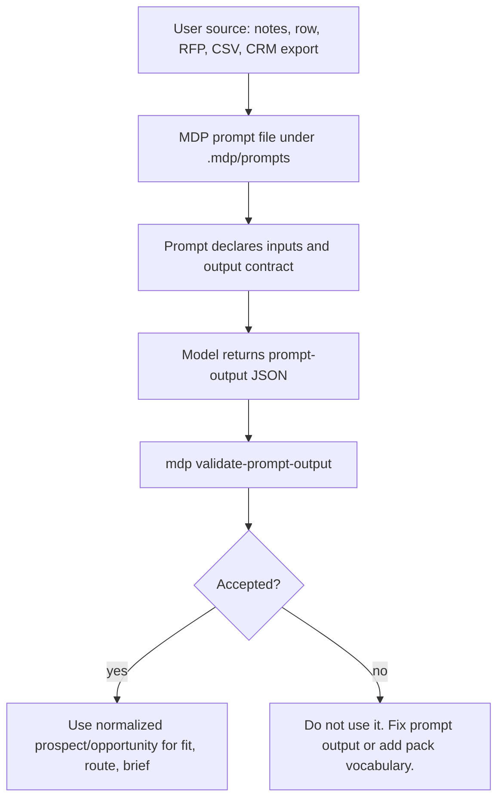

# Prompt Output To CLI Validation

Use this when explaining or testing the deterministic prompt-output lifecycle.

## Plain-English Version

The prompt is the translator. It receives messy input and returns strict JSON. The CLI is the gatekeeper. It checks that the JSON only uses values the pack declared ahead of time.



## What The Prompt Owns

- The input names it can use, such as `raw_row`, `raw_opportunity`, `existing_pack_context`, `runtime_context`, and `source_kind`.
- The output shape, including required top-level fields.
- The instruction to emit only pack-owned enum values from manifest value contracts and attribute definitions.
- The instruction to put missing or unsafe information into `gaps` instead of smoothing it into accepted values.

## What The CLI Owns

- JSON parsing and markdown-fence rejection.
- Required top-level field checks.
- `contract` and `prompt_id` checks.
- `source_summary.inputs_used` checks against declared prompt inputs.
- Runtime-context validation when present.
- Pack-owned enum, type, date, date-time, source-kind, persona, segment, and attribute checks.
- Collision checks against existing card vocabulary.

## Canonical Command

```bash
mdp --json validate-prompt-output --dir <pack-root> --prompt-id <prompt-id> --file <prompt-output.json>
```

Examples:

```bash
mdp --json validate-prompt-output --dir ./gtm-pack --prompt-id normalize-prospect-row --file ./prompt-output.json
mdp --json validate-prompt-output --dir ./proposal-pack --prompt-id normalize-opportunity --file ./prompt-output.json
```

## Mental Check

If the model emits `value 1`, `value 2`, and `value 3`, those values are safe only when they match the prompt output contract and the pack's declared value contracts. If a later segment, fit rule, route, or brief depends on those values, use the CLI-validated values, not the raw prompt text.

## Common Failures

- The output is wrapped in markdown instead of raw JSON.
- The prompt ID does not match the selected prompt.
- `inputs_used` lists file names instead of declared input names.
- The output invents a persona, segment, source kind, attribute, certification, proof point, or opportunity stage.
- The output fills account-only person fields with fake names or titles instead of gaps/no-draft readiness.
