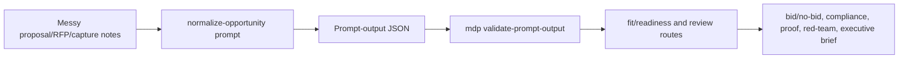

# Proposal Opportunity Context

Use this when messy RFP, capture, bid/no-bid, requirement, proof, or review notes need to become bounded proposal profile vocabulary.

## Flow

## Proposal Vocabulary Mapping

| Proposal vocabulary | Universal primitive | Typical file |
| --- | --- | --- |
| Proposal roles, reviewers, evaluator roles | `actors` | `.mdp/cards/proposal-roles.yaml` |
| Opportunity/RFP facts, due dates, vehicle, incumbent clues | `source-signals` | `.mdp/cards/opportunity-context.yaml` |
| Requirement snippets and submission instructions | `source-signals` | `.mdp/cards/requirement-signals.yaml` |
| Requirements and must-answer sections | `needs-requirements` | `.mdp/cards/requirements-matrix.yaml` |
| Bid/no-bid gates | `decision-criteria` | `.mdp/cards/bid-no-bid-rules.yaml` |
| Evaluation factors | `decision-criteria` | `.mdp/cards/evaluation-criteria.yaml` |
| Proof, references, differentiators | `evidence-proof` | `.mdp/cards/proof-library.yaml` |
| Compliance/no-invention/confidentiality boundaries | `boundaries` | `.mdp/cards/compliance-boundaries.yaml`, `.mdp/cards/proposal-boundaries.yaml` |
| Review jobs | `routing-jobs` | `.mdp/cards/review-gates.yaml` |
| Output shapes | `output-contracts` | `.mdp/cards/review-outputs.yaml`, `.mdp/cards/proposal-output-rules.yaml` |
| Missing proof/context | `gaps` | `.mdp/cards/gaps.yaml` |

## Compatibility Bridge

The current prompt output uses `normalized_prospect` as the validated runtime object even for proposal opportunity context. Treat this as a compatibility bridge, not a product concept. For proposal work, read it as "normalized opportunity context." Do not invent name/title fields; use supplied owner/contact context only, otherwise preserve `N/A` and gaps.

## Readiness

If customer/agency, due date, requirement signal, proof, source safety, or review mode is missing, keep the output structurally valid but set readiness false and add gaps. Do not turn missing context into a proceed decision.
